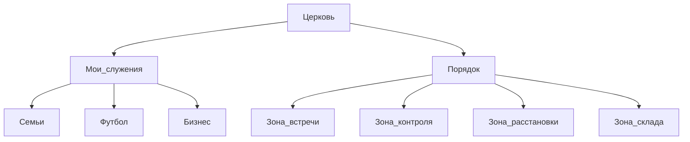

# Расширение профиля: жизненные зоны + «Цели_и_регламент»

## Принципы (согласовано)

- Детальные **цели и регламенты** живут в `**[Личное/1. Профиль](file:///Users/max/Desktop/CURSOR/Личное/1. Профиль)`**; **один** файл на зону имени `**Цели_и_регламент.md`** (не плодить «Цели» и «Регламент» отдельно).
- В `**[РАСШИРЕННЫЙ_КОНТЕКСТ.md](file:///Users/max/Desktop/CURSOR/РАСШИРЕННЫЙ_КОНТЕКСТ.md)**` — только **короткий указатель** на профиль и индекс регламентов (без переноса личного содержания).
- Лёгкие ветки (`**Кино/`**, `**Рестораны/**`, `**Музыка/**`) без отдельного `Цели_и_регламент.md` на первом шаге — достаточно при необходимости абзаца в `[3. Разум/Цели_и_регламент.md](file:///Users/max/Desktop/CURSOR/Личное/1. Профиль/Разум)` или пропуска.
- **Карта «что где»** — в [`1. Профиль/README.md`](file:///Users/max/Desktop/CURSOR/Личное/1. Профиль/README.md); **почему так и как добавлять новое** — в отдельном файле ниже (не дублировать длинные списки папок в `РАСШИРЕННЫЙ_КОНТЕКСТ`).

## Мета: `СТРУКТУРА_И_ПРИНЦИПЫ.md`

Создать в корне профиля **[`Личное/1. Профиль/СТРУКТУРА_И_ПРИНЦИПЫ.md`](file:///Users/max/Desktop/CURSOR/Личное/1. Профиль/СТРУКТУРА_И_ПРИНЦИПЫ.md)** — главный регламент «подхода», чтобы новые ветки появлялись **по той же логике**.

**Содержание (заготовка секций, без выдумки твоих личных целей):**

1. **Четыре опоры + официальное + инбоксы** — зачем отдельно `1. Отчёты/`, `2. Дух/`, `3. Разум/`, `4. Тело/`; что в `5. Документы/` всегда «бумага и официальное», а смыслы рядом с зоной жизни.
2. **`Распределение/` vs `6. Прочее/`** — временный вход vs редкое без класса + правило периодического разбора; не плодить второй инбокс по смыслу.
3. **`Разум`** — кругозор (путешествия, кино, музыка, рестораны) отдельно от `Документы`; **обучение по темам**, не по YouTube/книгам.
4. **`Семья/` vs `Люди/`** — дом/жена/ценности/дети vs друзья и вклад в отношения.
5. **`Дух` и церковь** — духовное изучение только здесь; `Церковь`: **мои служения** vs **порядок/зоны зала**; коллизия имён `Бизнес` (служение vs изучение).
6. **`Тело`** — здоровье/спорт; выписки в `Документы`, рабочие заметки в `4. Тело/4.1. Здоровье`.
7. **Правило новой папки** — ориентир: отдельная подпапка, если уже есть несколько заметок одного типа и ожидается поток; иначе файл или тег + при необходимости правка этого документа.
8. **Связь с целями** — где лежат `Цели_и_регламент.md` и [`РЕЕСТР_ЦЕЛЕЙ_И_РЕГЛАМЕНТОВ.md`](file:///Users/max/Desktop/CURSOR/Личное/1. Профиль/РЕЕСТР_ЦЕЛЕЙ_И_РЕГЛАМЕНТОВ.md); при смене «философии» дерева обновлять **сначала** этот файл, потом README веток.

В [`1. Профиль/README.md`](file:///Users/max/Desktop/CURSOR/Личное/1. Профиль/README.md) в начале или в конце — **одна строка**: «логика структуры — `СТРУКТУРА_И_ПРИНЦИПЫ.md`».

В **§7 `РАСШИРЕННЫЙ_КОНТЕКСТ`** — упомянуть этот файл как место, куда смотреть **перед** тем как предлагать новую крупную ветку (вместе с реестром регламентов).

## 1. Новые папки под `3. Разум/`

| Папка            | Назначение                                                                       |
| ---------------- | -------------------------------------------------------------------------------- |
| `3. Разум/3.2. Инсайты/` | Светские инсайты; духовные — в `2. Дух/` (см. README и `Цели_и_регламент` в `2. Дух/`) |
| `3. Разум/3.8. Хотелки/` | Хотелки и желания (не аналитика; связь с покупками — ссылка в `Финансы/`)        |
| `3. Разум/3.3. Люди/`    | Друзья: ДР, встречи, вклад времени, заметки по людям (семья остаётся в `Семья/`) |

В каждой — `**README.md**` (1–3 строки) по образцу существующих.

## 2. `3. Разум/3.1. Изучение/` — обзор просадки

- Добавить `**[3. Разум/3.1. Изучение/Обзор.md](file:///Users/max/Desktop/CURSOR/Личное/1. Профиль/3. Разум/3.1. Изучение/Обзор.md)**` — заготовка: темы обучения, статус, что требует внимания; синк с горизонтами в `1. Отчёты/1.3. Планирование/`.
- В `[3. Разум/3.1. Изучение/README.md](file:///Users/max/Desktop/CURSOR/Личное/1. Профиль/3. Разум/3.1. Изучение/README.md)` — **короткое правило**: основная классификация **по темам** (`Бизнес/`, `Нейросети/` …), источник (YouTube, книга…) — в теле заметки или тегах, не дублировать дерево по носителям.

## 3. `4. Тело/4.1. Здоровье/` — лёд и смежное

- Создать подпапки с README:
  - `**Ледяные_ванны/`** (или `Холодовые_практики/` — в плане зафиксировать одно имя: разумный дефолт `**Ледяные_ванны/**` под твой формулировку)
  - `**Сон/**`
  - `**Добавки_и_витамины/**`
- Обновить `[4. Тело/4.1. Здоровье/README.md](file:///Users/max/Desktop/CURSOR/Личное/1. Профиль/4. Тело/4.1. Здоровье/README.md)` — перечислить новые ветки.

## 4. `2. Дух/2.3. Служение/2.3.2. Церковь/` — служения и порядок

Текущее: только `[Церковь/README.md](file:///Users/max/Desktop/CURSOR/Личное/1. Профиль/2. Дух/2.3. Служение/2.3.2. Церковь/README.md)`.

Целевая схема:

- `**Мои_служения/**` → `**Семьи/**`, `**Футбол/**`, `**Бизнес/**` (в README папки `Бизнес` явно: *церковное служение*, не путать с `[3. Разум/3.1. Изучение/3.1.1. Бизнес/](file:///Users/max/Desktop/CURSOR/Личное/1. Профиль/3. Разум/3.1. Изучение/3.1.1. Бизнес)`).
- `**Порядок/**` → `**Зона_встречи/**`, `**Зона_контроля/**`, `**Зона_расстановки/**`, `**Зона_склада/**` — каждая с кратким README.
- Корневой `[Церковь/README.md](file:///Users/Desktop/CURSOR/Личное/1. Профиль/2. Дух/2.3. Служение/2.3.2. Церковь/README.md)`: навигация «служения vs порядок/зоны».

## 5. Файлы `Цели_и_регламент.md` и индекс

**Чтобы не раздувать число файлов**, оптимальный первый слой:

| Путь                                                                                                             | Содержание заготовки                                                                              |
| ---------------------------------------------------------------------------------------------------------------- | ------------------------------------------------------------------------------------------------- |
| `[2. Дух/Цели_и_регламент.md](file:///Users/max/Desktop/CURSOR/Личное/1. Профиль/2. Дух/Цели_и_регламент.md)`       | Цели и ритуалы духовной жизни; со ссылкой на ветки Изучение/Служение                              |
| `[3. Разум/Цели_и_регламент.md](file:///Users/max/Desktop/CURSOR/Личное/1. Профиль/3. Разум/Цели_и_регламент.md)`   | Общие принципы разума; кратко Люди/Финансы/Семья/обучение (детали можно вынести позже в подпапки) |
| `[4. Тело/Цели_и_регламент.md](file:///Users/max/Desktop/CURSOR/Личное/1. Профиль/4. Тело/Цели_и_регламент.md)`     | Цели по телу, чекапы, сон, спорт, лёд                                                             |
| `[1. Отчёты/Цели_и_регламент.md](file:///Users/max/Desktop/CURSOR/Личное/1. Профиль/1. Отчёты/Цели_и_регламент.md)` | Как ведёшь открывашку/закрывашку и как стыкуешь с планированием                                   |

Внутри каждого файла — **заголовки-заготовки** (Цели / Регламент / Частота / Метрики по желанию) с пустыми местами под заполнение — **без выдуманного твоего контента**.

Дополнительно один индекс:

- `**[1. Профиль/РЕЕСТР_ЦЕЛЕЙ_И_РЕГЛАМЕНТОВ.md](file:///Users/max/Desktop/CURSOR/Личное/1. Профиль/РЕЕСТР_ЦЕЛЕЙ_И_РЕГЛАМЕНТОВ.md)`** — таблица или список ссылок на все `Цели_и_регламент.md` + примечание про зоны без отдельного файла.

**Позже** (не обязательно в этом же PR): если секция «Люди» или «Церковь» раздуется — вынести `**3. Разум/3.3. Люди/Цели_и_регламент.md`** и/или `**2. Дух/2.3. Служение/2.3.2. Церковь/Цели_и_регламент.md**` и добавить строку в реестр.

## 6. Документация верхнего уровня

- Обновить `[1. Профиль/README.md](file:///Users/max/Desktop/CURSOR/Личное/1. Профиль/README.md)`: новые ветки `3. Разум/`, блок про **реестр** и **цели/регламент**.
- Обновить `[3. Разум/README.md](file:///Users/max/Desktop/CURSOR/Личное/1. Профиль/3. Разум/README.md)`: Инсайты, Хотелки, Люди, `Цели_и_регламент.md`, `Изучение/Обзор.md`.
- Обновить `[2. Дух/README.md](file:///Users/max/Desktop/CURSOR/Личное/1. Профиль/2. Дух/README.md)`: указать `Цели_и_регламент.md` и усложнённую `Служение/Церковь/`.

## 7. `РАСШИРЕННЫЙ_КОНТЕКСТ.md`

- Добавить компактный раздел (например **§7**): личные цели и регламенты — в `Личное/1. Профиль`, навигация через `РЕЕСТР_ЦЕЛЕЙ_И_РЕГЛАМЕНТОВ.md`; при задачах про жизнь/дух/тело — при необходимости открывать соответствующий `Цели_и_регламент.md`.

`**.cursorrules`** не обязательно менять; при желании — одна строка-напоминание про `@РАСШИРЕННЫЙ_КОНТЕКСТ` и профиль (по согласованию после плана).

## 8. Синхронизация модуля 2 (по желанию)

- Обновить дерево в `[Личное/00_Distribution/ШАБЛОН_СТРУКТУРЫ_ЖИЗНЬ.md](file:///Users/max/Desktop/CURSOR/Личное/00_Distribution/ШАБЛОН_СТРУКТУРЫ_ЖИЗНЬ.md)` — ключевые новые ветки и упоминание `РЕЕСТР_ЦЕЛЕЙ_И_РЕГЛАМЕНТОВ.md` (кратко, без полного клона всего дерева).

## Риски

- **Коллизия имён** `Мои_служения/Бизнес` vs `Изучение/Бизнес` — снимается README в церковной ветке.
- **Рост `3. Разум/Цели_и_регламент.md`** — когда станет длинным, вынести подфайлы и обновить реестр.

