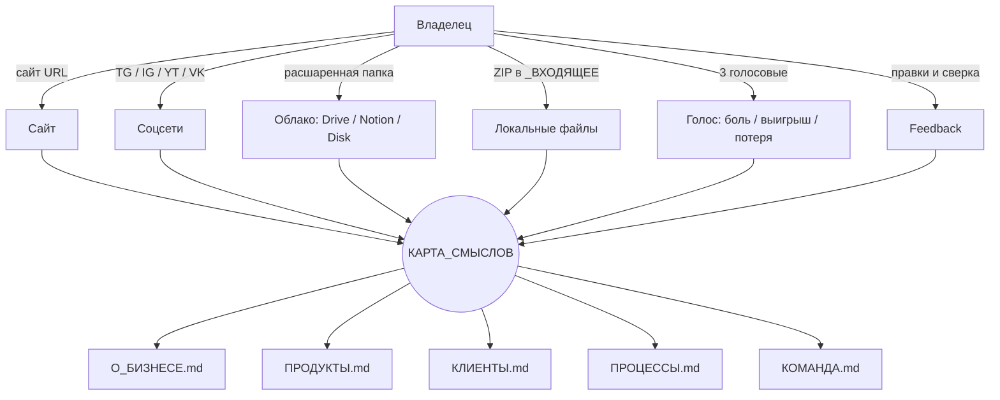

# 🎱 Карта смыслов бизнеса

> © 2026 Денис Леушин · Курс «Внедрение ИИ в бизнес»
>
> **Что это.** Единая точка правды о бизнесе. Сюда CEO + Архивариус сводят всё, что вытащили из сайта, соцсетей, облака и голосовых заметок владельца. Открыл — увидел весь бизнес одним документом. Это и индекс, и дашборд, и граф связей, и чек-лист пробелов.
>
> **Главное правило.** Каждое утверждение в карте — со ссылкой `(→ _ИСХОДНИКИ/...)` на конкретный файл. Никаких догадок. Если данных нет — `*пробел*` и пункт в `ОТКРЫТЫЕ_ВОПРОСЫ.md`.
>
> **Как читать.** Слева — что зафиксировано. Справа — статус подтверждения владельцем (✓ проверено / ⚠ требует уточнения / ❌ устарело).
>
> **Цель домашки.** Довести карту до **«зелёного» состояния**: ≥80% полей заполнено, ≥80% подтверждено владельцем, в `ОТКРЫТЫЕ_ВОПРОСЫ.md` нет критичных пробелов. Прогресс оценивает агент `Аудитор_Контекста` (см. `_АГЕНТЫ/Аудитор_Контекста/`).

---

## 📊 Сводка-дашборд

| Параметр | Значение |
|---|---|
| **Бизнес** | *<заполнит CEO>* |
| **Версия карты** | `0.1` (после первой сверки → `1.0`) |
| **Последнее обновление** | *<ГГГГ-ММ-ДД, кто (CEO / Архивариус / владелец)>* |
| **Подтверждено владельцем** | *<ГГГГ-ММ-ДД или «ещё не сверено»>* |
| **Источников загружено** | *<число файлов в `_ИСХОДНИКИ/`>* |
| **Полнота карты** | *<%, считает Аудитор>* |
| **Статус** | 🔴 каркас / 🟡 в работе / 🟢 готово к работе агентов |

---

## 1. Идентичность бизнеса

| Поле | Значение | Источник | Статус |
|---|---|---|---|
| Название (юр. + бренд) | *<пусто>* | *—* | *—* |
| Юр. форма + ИНН/ОГРН | *<пусто>* | *—* | *—* |
| Сайт | *<пусто>* | *—* | *—* |
| Год основания | *<пусто>* | *—* | *—* |
| Стадия зрелости | *<запуск / рост / масштаб / переупаковка>* | *—* | *—* |
| География клиентов | *<пусто>* | *—* | *—* |
| География операций | *<пусто>* | *—* | *—* |
| Часовой пояс работы | *<пусто>* | *—* | *—* |
| Языки коммуникации | *<пусто>* | *—* | *—* |

**Одной фразой — что делает бизнес (для незнакомого человека за 5 секунд):**
> *<пусто>*
> *(→ источник)*

**Одной фразой — что бизнес НЕ делает (важные границы):**
> *<пусто>*

---

## 2. Миссия, видение, ценности

| Поле | Значение | Источник | Статус |
|---|---|---|---|
| Миссия (зачем мы существуем) | *<пусто>* | *—* | *—* |
| Видение (где мы через 3 года) | *<пусто>* | *—* | *—* |
| Ценности (3–5) | *<пусто>* | *—* | *—* |
| Девиз / манифест | *<пусто>* | *—* | *—* |

> Если у бизнеса этого ещё нет в формализованном виде — пометить `*не сформулировано*` и вынести в `ОТКРЫТЫЕ_ВОПРОСЫ.md` как стратегическую задачу.

---

## 3. Целевая аудитория

| Сегмент | Кто это (5 признаков) | Какая боль (JTBD) | Что покупают | Источник | Статус |
|---|---|---|---|---|---|
| ЦА-1 | *<пусто>* | *<пусто>* | *<пусто>* | *—* | *—* |
| ЦА-2 | *<пусто>* | *<пусто>* | *<пусто>* | *—* | *—* |
| ЦА-3 | *<пусто>* | *<пусто>* | *<пусто>* | *—* | *—* |

**Главная боль клиента (дословно из отзывов / звонков):**
> *<цитата>* (→ источник)

**Топ-3 типовых возражения** (дословные формулировки):
1. *<пусто>* (→ источник)
2. *<пусто>* (→ источник)
3. *<пусто>* (→ источник)

**Кому НЕ продаём** (антипортреты, токсичные сегменты):
- *<пусто>*

**Триггер покупки** — что именно толкает клиента к решению (событие, фраза, состояние):
- *<пусто>*

---

## 4. Продукты и линейка

| Продукт | Кому (сегмент) | Цена | Срок поставки | Чем отличается | Маржа | Источник | Статус |
|---|---|---|---|---|---|---|---|
| *<пусто>* | *<пусто>* | *<пусто>* | *<пусто>* | *<пусто>* | *<пусто>* | *—* | *—* |

**Флагман** (что приносит ≥40% выручки): *<пусто>*
**Lead-magnet / точка входа:** *<пусто>*
**Upsell-лестница:** *<пусто>*
**Текущие промо / акции / промокоды:** *<пусто>*

---

## 5. Конкуренты

| Конкурент | URL | Чем сильнее нас | Чем мы сильнее | Их цена | Источник | Статус |
|---|---|---|---|---|---|---|
| *<пусто>* | *—* | *—* | *—* | *—* | *—* | *—* |

**Категория, в которой соревнуемся одной фразой:**
> *<пусто>*

**Главное отличие от рынка (УТП):**
> *<пусто>* (→ источник)

---

## 6. Каналы продаж и трафика

| Канал | URL / @ник | Активность | Аудитория | Что приносит | % в выручке | Источник | Статус |
|---|---|---|---|---|---|---|---|
| Сайт | *<пусто>* | *<регулярно / редко>* | *<подписчики/трафик>* | *<лиды/продажи/охват>* | *<%>* | *—* | *—* |
| Telegram | *<пусто>* | *—* | *—* | *—* | *—* | *—* | *—* |
| Instagram | *<пусто>* | *—* | *—* | *—* | *—* | *—* | *—* |
| YouTube | *<пусто>* | *—* | *—* | *—* | *—* | *—* | *—* |
| VK | *<пусто>* | *—* | *—* | *—* | *—* | *—* | *—* |
| Реклама (Я.Директ / VK / TG Ads) | *<пусто>* | *—* | *—* | *—* | *—* | *—* | *—* |
| Сарафан / реферальный | *<пусто>* | *—* | *—* | *—* | *—* | *—* | *—* |
| B2B-партнёры | *<пусто>* | *—* | *—* | *—* | *—* | *—* | *—* |
| Маркетплейсы / агрегаторы | *<пусто>* | *—* | *—* | *—* | *—* | *—* | *—* |
| Прочее (мероприятия, нетворк) | *<пусто>* | *—* | *—* | *—* | *—* | *—* | *—* |

**Главный канал (где деньги сейчас):** *<пусто>*
**Рискованный канал** (если выключится — что с выручкой): *<пусто>*

---

## 7. Воронка и путь клиента

| Этап | Откуда приходят | Что происходит | Конверсия | Кто отвечает | Источник |
|---|---|---|---|---|---|
| Узнавание | *—* | *—* | *—* | *—* | *—* |
| Лид | *—* | *—* | *—* | *—* | *—* |
| Квалификация | *—* | *—* | *—* | *—* | *—* |
| Презентация / КП | *—* | *—* | *—* | *—* | *—* |
| Сделка | *—* | *—* | *—* | *—* | *—* |
| Поставка | *—* | *—* | *—* | *—* | *—* |
| Возврат / повторная | *—* | *—* | *—* | *—* | *—* |

**Цикл сделки (lead → деньги):** *<среднее, в днях>*
**Главное узкое место в воронке:** *<пусто>*

---

## 8. Голос бренда (tone of voice)

| Параметр | Значение | Пример из материалов | Источник |
|---|---|---|---|
| Tone (3 эпитета) | *<пусто>* | *—* | *—* |
| Обращение | *<«ты» / «вы» / смешано>* | *—* | *—* |
| Эмодзи | *<есть / нет / по ситуации>* | *—* | *—* |
| Длина типового поста / письма | *<пусто>* | *—* | *—* |
| Что НЕ говорим (стоп-слова, темы) | *<пусто>* | *—* | *—* |
| Любимая формулировка / фразы-маркеры | *<дословно>* | *—* | *—* |
| Аналог / референс по стилю | *<«как @канал X»>* | *—* | *—* |

---

## 9. Команда и роли

| Роль | Имя / контакт | Зона ответственности | % загрузки на бизнесе | Источник |
|---|---|---|---|---|
| Собственник | *—* | *—* | *—* | *—* |
| *<роль>* | *—* | *—* | *—* | *—* |

**Размер команды:** *<штатных / подрядчиков / фрилансеров>*
**Формат работы:** *<офис / удалёнка / гибрид>*
**Часы работы команды:** *<пусто>*

**Кто незаменимый** (single point of failure): *<пусто>*

---

## 10. Финансовая модель

> Чувствительная информация. Заполняется владельцем явно, не из открытых источников.

| Поле | Значение | Источник | Статус |
|---|---|---|---|
| Выручка / месяц (вилка) | *<пусто>* | *—* | *—* |
| Структура выручки (% по продуктам) | *<пусто>* | *—* | *—* |
| Валовая маржа (среднее) | *<пусто>* | *—* | *—* |
| Средний чек | *<пусто>* | *—* | *—* |
| Стоимость лида (CPL) | *<пусто>* | *—* | *—* |
| Стоимость привлечения клиента (CAC) | *<пусто>* | *—* | *—* |
| LTV клиента | *<пусто>* | *—* | *—* |
| % повторных продаж | *<пусто>* | *—* | *—* |
| Главный фикс. расход (≥20% бюджета) | *<пусто>* | *—* | *—* |
| Точка безубыточности (выручка / мес) | *<пусто>* | *—* | *—* |

---

## 11. Процессы и регламенты

| Процесс | Описан где | Кто исполняет | Автоматизация | Кандидат на ИИ-сотрудника |
|---|---|---|---|---|
| Обработка лида | *—* | *—* | *—* | *—* |
| Квалификация | *—* | *—* | *—* | *—* |
| Подготовка КП | *—* | *—* | *—* | *—* |
| Контроль качества (ОКК) | *—* | *—* | *—* | *—* |
| Поставка / производство | *—* | *—* | *—* | *—* |
| Поддержка клиентов | *—* | *—* | *—* | *—* |
| Найм сотрудников | *—* | *—* | *—* | *—* |
| Отчётность / аналитика | *—* | *—* | *—* | *—* |

**Топ-3 процесса, которые отнимают больше всего времени собственника:**
1. *<пусто>*
2. *<пусто>*
3. *<пусто>*

---

## 12. Стек инструментов

| Категория | Инструмент | Кто использует | Лицензия / тариф |
|---|---|---|---|
| CRM | *—* | *—* | *—* |
| Мессенджеры с клиентами | *—* | *—* | *—* |
| Бухгалтерия / документооборот | *—* | *—* | *—* |
| Реклама | *—* | *—* | *—* |
| Аналитика | *—* | *—* | *—* |
| Облачное хранилище | *—* | *—* | *—* |
| База знаний / wiki | *—* | *—* | *—* |
| Колтрекинг / IP-телефония | *—* | *—* | *—* |
| Платежи / эквайринг | *—* | *—* | *—* |
| Прочее | *—* | *—* | *—* |

---

## 13. Контент-машина

| Канал | Формат | Частота | Кто делает | Источник |
|---|---|---|---|---|
| *—* | *<посты / Reels / статьи / рассылки>* | *<сколько в неделю>* | *—* | *—* |

**Контент-стратегия одной фразой:** *<пусто>*
**Топ-3 темы, на которые клюёт аудитория:** *<пусто>*

---

## 14. Партнёры и зависимости

| Партнёр / поставщик | Что даёт | Критичность | Альтернатива | Источник |
|---|---|---|---|---|
| *—* | *—* | *<низкая / средняя / критичная>* | *—* | *—* |

**Главная зависимость от внешнего фактора:** *<один поставщик / одна площадка / один клиент >40% выручки>*

---

## 15. Юридическая база

| Документ | Где лежит | Актуальность | Источник |
|---|---|---|---|
| Договор оферты / шаблон договора | *—* | *—* | *—* |
| Политика обработки ПД (152-ФЗ) | *—* | *—* | *—* |
| Согласие на ПД для сайта | *—* | *—* | *—* |
| Лицензии / разрешения / СРО | *—* | *—* | *—* |
| Товарные знаки / патенты | *—* | *—* | *—* |

---

## 16. Метрики и KPI

| Метрика | Текущее значение | Целевое (квартал) | Где смотрим | Источник |
|---|---|---|---|---|
| *—* | *—* | *—* | *—* | *—* |

**3 KPI квартала** (главные цифры, по которым меряем успех):
1. *<пусто>*
2. *<пусто>*
3. *<пусто>*

---

## 17. Цели и боли на 90 дней

**Главная боль (дословно из голосовой владельца):**
> *<цитата>*
> *(→ источник)*

**Что уже пробовали** для решения:
- *<пусто>*

**Главная цель на 90 дней (1 фраза, измеримая):**
> *<пусто>*

**Кейс-победа за последний месяц** (что и почему получилось):
> *<пусто>*

**Кейс-провал за последний месяц** (что не получилось и какой урок):
> *<пусто>*

---

## 18. Риски и ограничения

| Риск | Вероятность | Импакт | Что делаем сейчас | Источник |
|---|---|---|---|---|
| *—* | *<низкая / средняя / высокая>* | *—* | *—* | *—* |

**Что НЕ хотим делегировать ИИ ни при каких условиях:**
- *<пусто>* (например: «общение с ключевыми клиентами голосом»)

---

## 19. Открытые вопросы и противоречия

> Полный список — [`../_ПРОФИЛЬ/ОТКРЫТЫЕ_ВОПРОСЫ.md`](../_ПРОФИЛЬ/ОТКРЫТЫЕ_ВОПРОСЫ.md). Здесь — топ-5 критичных.

| # | Вопрос / противоречие | Где увидели | Кто отвечает | Срок |
|---|---|---|---|---|
| 1 | *—* | *—* | *—* | *—* |

---

## 20. Граф источников — что откуда

> Cursor рендерит mermaid в превью (`⌘⇧V` / `Ctrl+Shift+V`). Граф — живой: Архивариус дополняет его новыми источниками.

---

## 21. Журнал изменений карты

| Дата | Что изменилось | Кто | Триггер |
|---|---|---|---|
| *<ГГГГ-ММ-ДД>* | первая сборка карты | CEO | onboarding + auto-pull |

---

## Что делать с этой картой

**Владельцу — еженедельный ритуал на 5 минут:**
1. Открой карту, пробеги глазами.
2. Где `❌ устарело` — кинь свежий источник (URL / файл / голосовую) → команда обновит.
3. Где `⚠ требует уточнения` — ответь одной строкой / голосовой.
4. После сверки скажи CEO «карта подтверждена» — он проставит дату и поднимет версию.
5. Раз в месяц — попроси Аудитора `проверь карту` → получишь отчёт по полноте.

**Агентам (через CEO):**
- Перед любой задачей сначала перечитываешь карту (минимум разделы 1, 3, 4, 8), потом — детали в `_ЗНАНИЯ/<файл>.md`.
- Карта — короткий чек-лист. Детали — для глубины.
- Если в карте `*пробел*` — НЕ выдумываешь. Идёшь к CEO, CEO решает: спросить владельца или пропустить блок.

---

## ДЗ к Модулю 1 — критерии выполнения

> **Главное правило:** ДЗ к Модулю 1 = довести карту смыслов до полноты ≥50% по Аудитору. Никаких скринов рабочего стола. Никаких готовых отчётов «на 30 страниц». Карта в зелёном — значит команда знает твой бизнес и готова работать.

### Минимум для зачёта

- **Полнота карты ≥50%** (Аудитор Контекста показывает в шапке отчёта).
- **5 критичных разделов** заполнены минимум на 60%:
  - Раздел 1 (Идентичность) — название бизнеса, ниша, география.
  - Раздел 3 (ЦА) — минимум 1 портрет с болью (JTBD).
  - Раздел 4 (Продукты) — минимум 1 продукт с ценой и упаковкой.
  - Раздел 8 (Голос бренда) — 3 эпитета tone of voice.
  - Раздел 17 (Цели и боли на 90 дней) — главная боль + измеримая цель.
- В каждом заполненном поле — ссылка `(→ _ИСХОДНИКИ/...)` на источник.

### Что прислать в ЛК (форма «Сдать ДЗ» на странице Модуля 1)

1. **Отчёт Аудитора Контекста.** В Cursor: скажи CEO «дай отчёт для ДЗ» → Аудитор сгенерирует короткий текст со светофором по 21 разделу и общей полнотой. Скопируй и вставь в форму.
2. **Анкета-портрет** (4 поля, ничего конфиденциального — это нужно куратору, чтобы говорить с тобой по делу):
   - **Ниша одной фразой.** Например: «интернет-магазин здорового питания», «студия интерьерного дизайна», «франшиза кофеен», «B2B-консалтинг по налогам». Без названия компании.
   - **Город / регион.** «СПб», «Москва», «Казань».
   - **Размер команды.** Один из вариантов: 1 / 2-5 / 6-15 / 16-50 / 50+.
   - **Главная боль на 90 дней.** Одной фразой. «Не успеваю обрабатывать заявки», «упёрлись в потолок выручки», «ушёл ключевой сотрудник, не справляемся».
3. **(Опционально) один вопрос куратору** — «что не получилось / непонятно».

### Что НЕ присылать (конфиденциальное)

Чтобы случайно не слить данные клиентов или внутренней кухни:

- ❌ Содержимое самой карты смыслов (там есть имена клиентов, конкретные цены, ИНН, реквизиты).
- ❌ Скрины StartPack-папки или `_ИСХОДНИКИ/`.
- ❌ Выгрузки CRM, договоры, прайсы.
- ❌ Точная выручка / средний чек / конверсии.
- ❌ Контакты команды, имена сотрудников.

Карта остаётся у тебя. Куратор видит только структурный отчёт + 4 поля анкеты.

### Автозачёт

Сервер парсит строку «Полнота: NN%» из вставленного отчёта Аудитора:

- **≥50%** → автоматически `✓ Принято`. Открывается Модуль 2.
- **<50%** → `Нужны правки` с подсказкой «добей критичные разделы до 60% и пересдай». Куратор Лина не задействуется.

Спорные случаи (например, ученик прислал что-то странное) — Лина ставит фидбек руками.

### Зачем ДЗ именно через карту, а не «отчёт о просмотре видео»

Отчёт о просмотре видео — пустая формальность. Карта смыслов — реальный артефакт, которым команда будет пользоваться все 10 модулей. Если ученик не наполнил карту — модули 2–10 пройдут впустую, потому что собранные ИИ-сотрудники будут отвечать «общими словами», не зная бизнес.

Карта 50% = команда знает базу. Карта 80% = команда работает как сотрудник с трёхлетним стажем. Цель курса — последнее.

---

## Связанные файлы

- [`О_БИЗНЕСЕ.md`](О_БИЗНЕСЕ.md) — детали по идентичности.
- [`КЛИЕНТЫ.md`](КЛИЕНТЫ.md) — расширенные портреты ЦА, кейсы, отзывы.
- [`ПРОДУКТЫ.md`](ПРОДУКТЫ.md) — полная линейка с описаниями.
- [`ПРОЦЕССЫ.md`](ПРОЦЕССЫ.md) — внутренние регламенты, воронка, инструменты.
- [`КОМАНДА.md`](КОМАНДА.md) — расширенная команда и зоны.
- [`_ИСХОДНИКИ/`](_ИСХОДНИКИ/) — все собранные сырые файлы.
- [`../_ПРОФИЛЬ/ОТКРЫТЫЕ_ВОПРОСЫ.md`](../_ПРОФИЛЬ/ОТКРЫТЫЕ_ВОПРОСЫ.md) — что ещё не закрыто.
- [`../_АГЕНТЫ/Аудитор_Контекста/SKILL.md`](../_АГЕНТЫ/Аудитор_Контекста/SKILL.md) — кто оценивает полноту карты.
