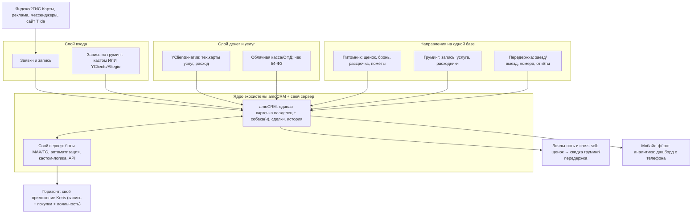

# Keris Club — архитектура экосистемы и фундамент масштабирования

> Внутренний документ MS Product. Дата: 2026-06-23.
> Главный вопрос: какой фундамент заложить **сейчас**, чтобы экосистема (питомник → груминг → передержка) масштабировалась оптимально и дёшево в долгую, без переделок. Текущие 3 модуля и цена 220 000 ₽ не меняются — это горизонт.

---

## Принцип №1 — слои, а не одна «коробка»

Не пытаемся уместить весь бизнес в одну систему. Разносим ответственность по слоям, связанным через amoCRM как ядро. Это даёт и гибкость (наш кастом), и зрелость готовых сервисов в узких местах.



---

## Принцип №2 — единая модель данных (это фундамент)

Главное, что закладываем **с первого дня**, чтобы потом не переделывать:

- **Контакт = владелец.** Один человек — одна карточка, без дублей (объединение дублей включено).
- **Связанная сущность = собака(и).** У владельца может быть несколько собак; у каждой — порода, вес/размер, дата рождения, ветпаспорт/прививки, особенности. Это нужно и грумингу (тариф по весу/породе), и передержке (правила заезда), и питомнику (если щенок куплен у нас — связь с помётом/родителями).
- **Сквозная история по всем направлениям** на одной карточке: купил щенка → водит на груминг → оставляет на передержку. Видно LTV и весь путь.
- **Теги направлений** (питомник/груминг/передержка) + **источник по каждой сделке** — основа сегментации, рассылок и лояльности.

> Почему это критично: именно единая карточка владелец+собака+сквозная история — то, чего **не дают** ProfSalon/1С/YClients (там модель «клиент салона → визит к мастеру»). Заложив её сейчас, мы делаем экосистему и cross-sell возможными в принципе.

### Реализация в amoCRM: владелец / собака / щенок в продаже

«Связанная сущность = собака» — это **не отдельная сделка на каждую собаку**. Сделка = событие (заявка, бронь, визит, заезд). Собака = отдельная карточка в CRM.

#### Две разные «собаки» (не смешивать)

| Тип | Что это | Где живёт | Пример |
|-----|---------|-----------|--------|
| **Щенок в продаже** | Товар питомника до продажи | **Сделка** в воронке питомника | «Малыш F1, помёт март, свободен / в брони» |
| **Собака клиента** | Питомец владельца после покупки или для груминга/передержки | **Компания** в amoCRM (переиспользуем сущность) | «Боня, мальтипу, 2 кг, стрижка каждые 6 нед» |

**Живые собаки — не складской остаток** и не товарная позиция. Расходники/себестоимость услуг — см. Принцип №5 (без МойСклад, через натив YClients).

#### Сущности amoCRM под Keris

```
Контакт   = владелец (человек)
Компания  = собака клиента (переиспользуем штатную сущность «Компания»)
Сделка    = событие: заявка / бронь щенка / груминг / передержка
```

На каждой сделке, где известна собака: **контакт (владелец) + компания (собака)**.

#### Ограничения amoCRM (официально)

По [документации amoCRM](https://www.amocrm.ru/support/leads/add_contact_company):

| Связь | Лимит |
|-------|-------|
| Сделка → контакты | несколько (в UI до 40) |
| Сделка → компания | **только одна** |
| Контакт → компания в UI | **одна** основная в карточке |

**Что это значит для нас:**

- **1 компания на сделку — норма и удобно:** один визит груминга / одна передержка = одна собака = одна компания на сделке.
- **Несколько собак у одного владельца — можно:** несколько карточек «Компания» (собак), каждая привязана к владельцу через поле «Владелец» и через сделки.
- **Несколько компаний в одной сделке — нельзя** (и не нужно).

#### Поля на «Компании» (= собака)

| Поле | Зачем |
|------|-------|
| **Владелец** | связь с контактом (обязательное) — основа списка «все собаки Марии» |
| Кличка | имя в интерфейсе (название компании = кличка) |
| Порода | тариф груминга, особенности |
| Дата рождения / возраст | напоминания, скидки щенкам |
| Вес / размер | тариф груминга |
| Особенности / аллергии | для мастера |
| Ветпаспорт / прививки | передержка, правила заезда |
| Куплен у Keris | да/нет + ссылка на сделку щенка |

> В UI amoCRM сущность называется «Компания» — для менеджера фиксируем регламент: **«Компания = собака клиента»**. При необходимости — виджет с понятной подписью «Собаки владельца».

#### Щенки в продаже (реестр доступных малышей)

**Не** заводим в товароучётную систему и **не** делаем «собаку = сделка навсегда».

**Старт (модули 1–3):** каждый щенок = **сделка** в воронке питомника:

```
Свободен → Бронь 30% → Ожидание прививки → Продан
```

Поля на сделке щенка: метка/кличка, пол, окрас, помёт, цена, фото (ссылка).

**Горизонт (если нужен каталог с фото/помётами):** реестр на сервере + **виджет в amoCRM** «Доступные щенки» с кнопкой «Забронировать» → создаёт сделку и меняет статус.

**При продаже щенка:**

1. Сделка щенка → этап «Продан».
2. Создаётся **Компания** (собака) у покупателя; поля переносятся из сделки щенка.
3. На **Контакте** покупателя — тег «покупатель щенка» (основа cross-sell).

#### Как смотреть историю

| Вопрос | Где смотреть |
|--------|--------------|
| Все визиты **конкретной собаки** | Карточка компании (собака) → все связанные сделки |
| Все визиты **владельца** (все собаки) | Карточка контакта → все сделки (на каждой видна компания-собака) |
| Какие **собаки у владельца** | Фильтр компаний по полю «Владелец» **или** виджет «Собаки владельца» на карточке контакта |

#### Виджет (когда нужен)

| Задача | Виджет |
|--------|--------|
| Привязать собаку к сделке | **Не обязателен** — штатная связка контакт + компания |
| Список всех собак владельца на карточке контакта | **Желателен** (sidebar, данные через API amoCRM) |
| Выбор собаки при записи на груминг | **Желателен** — dropdown «какая собака?» из компаний владельца |
| Каталог щенков с фото | **По запросу** — если воронки недостаточно |

Сервер хранит расширенные данные (фото, ветдокументы) **и дублирует ключевое в amoCRM через API**. База собак **не живёт только на сервере** — иначе менеджер уходит из CRM.

#### Сквозной сценарий (эталон)

```
1. Щенок «Малыш #3» — сделка в воронке «Питомник», статус «Свободен»
2. Мария бронирует → сделка «Бронь 30%» + контакт «Мария»
3. Продан → сделка «Продан» + компания «Малыш» у Марии + тег «покупатель щенка»
4. Груминг → новая сделка: контакт Мария + компания Малыш + дата/мастер/услуга
5. Передержка → ещё одна сделка: те же контакт + компания
   → вся история видна на карточке «Малыш» и в сделках «Мария»
```

#### Чего не делаем

- ❌ Собак в товароучётной системе (МойСклад не используем вовсе)
- ❌ «Собака = сделка» как постоянная карточка питомца
- ❌ Дублирование данных собаки только в полях контакта (ломается при 2+ собаках)
- ❌ Платный виджет «Мультикомпании» — избыточен, если делаем свой sidebar или хватает фильтра по полю «Владелец»

---

## Принцип №3 — мобайл-фёрст (владелец только с телефона)

Зафиксировано: Карина не воспринимает компьютер, всё смотрит с телефона. Следствия для всего, что проектируем:

- **Аналитика и дашборды — в первую очередь под телефон** (как уже сделана телефонная версия презентации). Крупные цифры, вертикальная лента, ничего не теряется на узком экране.
- Рабочее место владельца — **мобильное приложение amoCRM** + наш дашборд, открываемый с телефона.
- Уведомления о ключевом (новая заявка, бронь, оплата рассрочки, no-show) — в мессенджер/пуш, а не «зайди в отчёт на ПК».
- Любой будущий интерфейс (своё приложение) проектируем mobile-first.

---

## Принцип №4 — максимум автоматизации, минимум ручного труда

Зафиксировано: клиент за то, чтобы ручного труда было мало; где можно заменить сотрудника — заменяем. Что автоматизируем:

- **Приём и распределение заявок:** заявка с сайта/рекламы/мессенджера → авто в нужную воронку, авто-назначение, авто-первый ответ ботом.
- **Запись на груминг:** авто-подтверждения и напоминания (SMS/бот), авто-перенос/отмена, снижение no-show.
- **Рассрочка питомника:** авто-напоминания о платежах, статус остатка — без ручного контроля.
- **Расходники/себестоимость:** авто-списание по тех.карте при продаже услуги (натив YClients, без МойСклад).
- **Отчётность:** дашборд собирается сам — без ручных табличек.
- **Забота:** фото/видео-отчёты владельцу собаки через бота (идея от Doggo), авто-поздравления/триггеры.

Цель — чтобы поток тянул **1 менеджер**, а рост не требовал линейного найма.

---

## Принцип №5 — учёт расходников и себестоимость (без МойСклад)

Боль клиента: сколько шампуня/расходников ушло на конкретного клиента/собаку, и как это попадает в себестоимость.

> **Решение клиента (2026-06-23): МойСклад не интегрируем** ни сейчас, ни в перспективе — это противоречит принципу «одна система, меньше переключений», а услуговый учёт расходников в товароучётке неудобен.

- **Инструмент:** **нативные модули YClients** (если берём его для записи). Тех.карты услуг и расход по ним там «из коробки» — то же, что у 1С:Салон/ProfSalon, но без отдельной товароучётной системы.
- **Как работает:** у услуги груминга — **тех.карта** (норма расхода шампуня/косметики на услугу/размер собаки) → при оказании услуги расход **списывается в YClients** → формируется себестоимость → ключевое о продаже подтягивается в карточку клиента/собаки в amoCRM (LTV, что покупал, средний чек).
- **Касса/фискализация:** облачная касса/ОФД (напрямую или через YClients), 54-ФЗ — без товароучётной прослойки.
- **Этапность без перегруза** (как в `КОНТЕКСТ.md`, «Модуль 4»): сначала касса фискализирует чек за услугу; учёт расходников — натив YClients или ручной при 1 мастере; затем выручка по услугам выходит в дашборд.

**На старте груминга** при 1 мастере допустим **ручной учёт** расходников до подключения автоматики YClients. Финальная связка «касса ↔ расходники» решается при Модуле 4.

---

## Принцип №6 — cross-sell и лояльность (фиксация на будущее)

Вектор клиента: щенок → груминг → передержка как единая экосистема, где покупатель щенка получает привилегии.

- **Механика (будущее, не текущий проект):** при продаже щенка контакту проставляется статус/тег **«покупатель щенка»** → автоматически даёт **пожизненную привилегию** (скидка на груминг/передержку). Реализуемо в amoCRM+сервере, потому что база и карточка — общие.
- **Конструктор лояльности** (идеи от конкурентов, см. [АНАЛИЗ_КОНКУРЕНТОВ.md](АНАЛИЗ_КОНКУРЕНТОВ.md)): кэшбэк-копилка, скидка щенкам до 6 мес, подарок на ДР питомца, «приведи друга», сертификаты, клуб.
- **Почему у салонных коробок так не выйдет:** скидка «за покупку щенка» — это связь между **разными направлениями на общей базе**. В системе «клиент салона → визит» такой связи нет by design.

---

## Принцип №7 — путь к своему приложению (масштабирование)

Утверждение клиента (своё приложение для записи/покупок) — **верное и реализуемое** именно на нашей архитектуре:

- Серверный слой с API делает amoCRM-ядро доступным для **собственного приложения Keris** (запись, покупки, лояльность, отчёты по собаке). Закрытые коробки своё брендовое приложение не дают (только их фирменное).
- Порядок без переплат: сначала ядро + запись (готовый сервис/кастом) + дашборд; когда поток оправдает — собственное приложение поверх готового API. Не переделываем фундамент, а надстраиваем.

---

## Принцип №8 — РКН / ПДн (соответствие)

Запрос: «отправить данные для РКН из amoCRM». По существу это требования к оператору персональных данных (ИП Keris):

- **Сервер в РФ:** amoCRM хранит данные в РФ — ок. Рассылки — через российский сервис (уже в стеке).
- **Уведомление в Роскомнадзор:** оператор ПДн (ИП) подаёт уведомление о намерении обрабатывать ПДн (через сайт РКН). Это организационный шаг клиента — мы готовим тех. описание обработки.
- **Согласия на ПДн:** на всех точках сбора (формы сайта/Tilda, форма записи, бот) — галочка согласия + ссылка на политику конфиденциальности (как у всех проанализированных конкурентов).
- **Реестр согласий из amoCRM:** фиксируем факт/дату согласия в карточке; при необходимости — **выгрузка реестра согласий** (кто, когда, на что согласился) для отчётности перед РКН.
- **Отзыв согласия и сроки хранения** — предусмотреть процесс (удаление/обезличивание по запросу).

> Это закладываем как требование на этапе настройки форм и воронок, чтобы потом не доделывать.

---

## Что делаем сейчас vs горизонт

| Сейчас (в рамках 220 000 ₽, 3 модуля) | Горизонт (отдельные проекты) |
|----------------------------------------|------------------------------|
| Единая карточка владелец+собака+история | Своё приложение Keris (запись/покупки/лояльность) |
| Источник по каждой сделке, теги направлений | Программа лояльности и cross-sell (щенок→скидки) |
| Воронки питомник/груминг + дашборд (мобайл-фёрст) | Модуль 4 — продажи/касса (YClients-натив + облачная касса/ОФД) |
| Боты MAX/TG, авто-напоминания, приём заявок | Передержка (номера/выгулы/отчёты) |
| Модель: контакт=владелец, компания=собака, сделка=событие; щенки — сделки в воронке питомника | Виджет «Собаки владельца» / каталог щенков (по запросу) |
| Согласия ПДн в формах, основа под РКН | Онлайн-наблюдение за грумингом, сертификаты, клуб |

> Главное: фундамент (единая модель данных + слоистый стек + источник сделки + согласия ПДн) закладываем **сейчас**, чтобы всё из правой колонки надстраивалось без переделок.

---

## Связанные документы

- Фиксации рассуждений (синхрон команды): [ФИКСАЦИИ_АРХИТЕКТУРЫ.md](ФИКСАЦИИ_АРХИТЕКТУРЫ.md)
- Сравнение платформ: [АНАЛИЗ_ПЛАТФОРМ.md](АНАЛИЗ_ПЛАТФОРМ.md)
- Запись и карты: [ЗАПИСЬ_И_КАРТЫ.md](ЗАПИСЬ_И_КАРТЫ.md)
- Идеи от конкурентов: [АНАЛИЗ_КОНКУРЕНТОВ.md](АНАЛИЗ_КОНКУРЕНТОВ.md)
- Контекст и Модуль 4 (продажи/касса, без МойСклад): [КОНТЕКСТ.md](КОНТЕКСТ.md)
- Клиентский блок: [ПОЧЕМУ_НАШЕ_РЕШЕНИЕ.md](ПОЧЕМУ_НАШЕ_РЕШЕНИЕ.md)
