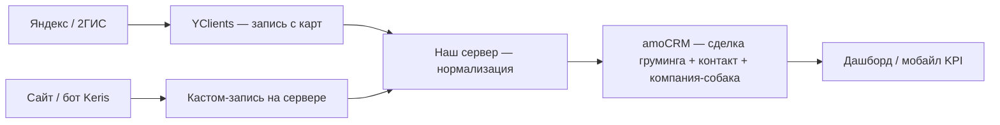

# Keris Club — фиксации архитектуры (синхрон рассуждений)

> Внутренний документ MS Product. Дата: 2026-06-23.
> Здесь — **зафиксированные рассуждения** команды/архитектора: к чему приходим и что будем делать. Не клиентское предложение; текущие 3 модуля и 220 000 ₽ не меняются.
> Связано: [АРХИТЕКТУРА_ЭКОСИСТЕМЫ.md](АРХИТЕКТУРА_ЭКОСИСТЕМЫ.md) · [ЗАПИСЬ_И_КАРТЫ.md](ЗАПИСЬ_И_КАРТЫ.md) · [КОНТЕКСТ.md](КОНТЕКСТ.md)

---

## Статус фиксаций

| Блок | Статус | Комментарий |
|------|--------|-------------|
| amoCRM = фундамент | ✅ принято | без изменений |
| Две воронки питомника + сервер | ✅ принято | детализируем при внедрении |
| UX: поля собаки в сделке → компания | ✅ принято | виджет/сервер, см. §4 |
| МойСклад НЕ интегрируем | ❌ нет | решение клиента 2026-06-23, см. §5 |
| YClients как слой карт | 🟡 предпочтение | финальный выбор — по тарифам на старте груминга |
| Две системы записи, мастер — наша | ✅ принято | см. §6 |
| Анализ ProfSalon/YClients для UX записи | 📋 задача | до проектирования формы/виджета |

---

## §1. amoCRM — база и фундамент

**Рассуждение:** amoCRM — основа, на которой строится всё. Воронка отражает статус сделки. У каждой сделки — **наименование** (имя сделки). По **этапам воронки** видно, в каком состоянии процесс: забронирован, свободен, на прививке, продан и т.д.

**Вердикт:** ✅ **Да, так и есть.** Это совпадает с [АРХИТЕКТУРА_ЭКОСИСТЕМЫ.md](АРХИТЕКТУРА_ЭКОСИСТЕМЫ.md): amoCRM = ядро; сделка = событие; этап = статус процесса.

---

## §2. Питомник: две воронки и синхронизация через сервер

**Рассуждение:**

- Заявки клиентов — **отдельная воронка** (продажи / входящие).
- Щенки в продаже — **другая воронка** (витрина): статусы «свободен», «бронь», «ожидание прививки», «продан».
- Внутри сделки **заявки** — выбор щенка: умный список только **актуальных** сделок из воронки щенков (этап «свободен» / доступные к продаже). Выбор вручную менеджером или автоматически по тому, что пишет клиент (бот/форма) — **продумать при внедрении**.
- После выбора часть данных **подтягивается из сделки щенка в заявку** — два процесса синхронизированы.
- Статус щенка ведём в воронке щенков; в заявке отражается связь и ключевые поля (не дублируем всё вручную).

**Вердикт:** ✅ **Да, так и задумано.**

Уточнения:

| Момент | Как фиксируем |
|--------|----------------|
| Воронки сами не «общаются» | Связь через **наш сервер** (API amoCRM) + при необходимости виджет в карточке заявки |
| Список щенков в заявке | Не склад внутри заявки — **ссылка + подтягивание полей** с сделки щенка (ID, кличка, помёт, цена, фото) |
| Автовыбор щенка | Гипотеза на Phase 2: парсинг текста заявки / выбор в боте; на старте — менеджер или dropdown «свободные щенки» |
| Щенки ≠ компании | Витрина = **сделки**; **компания** создаётся только после «продан» (собака клиента) |

**Этапы воронки «Щенки» (рабочие названия):**

```
Свободен → Бронь 30% → Ожидание прививки → Продан
```

**Этапы воронки «Заявки» (рабочие названия):**

```
Новая заявка → В работе → Щенок выбран / бронь → Закрыта (продано / отказ)
```

---

## §3. Принцип UX: максимально просто для менеджера

**Рассуждение:** Система должна быть простой в использовании. Менеджер не обязан глубоко понимать внутреннюю модель amoCRM («компания = собака»). Техническая модель остаётся, но **интерфейс работы** — через привычные сделки и поля.

**Вердикт:** ✅ **Принято как принцип проектирования.**

---

## §4. Груминг: поля собаки в сделке → автоматически в «компанию»

**Рассуждение:**

- Собаки клиентов технически ведутся в **компании** (доп. поля: порода, вес, особенности…).
- Для простоты менеджер заполняет **блок полей о собаке прямо в сделке** (груминг / заявка на запись).
- Виджет **группирует** поля («Информация о собаке»), чтобы не искать по карточке.
- После сохранения **сервер (или виджет)** сам:
  - создаёт компанию-собаку, если её ещё нет;
  - или обновляет существующую;
  - привязывает компанию к сделке и контакту-владельцу.

**Вердикт:** ✅ **Да, так и делаем.** Это лучший компромисс: модель данных чистая, UX — без «иди в компании».

**DoD (когда реализуем):**

- [ ] Группа полей на сделке груминга (или виджет-sidebar).
- [ ] Маппинг полей сделка ↔ компания (один раз в конфиге сервера).
- [ ] Триггер: сохранение / переход этапа «Запись подтверждена» → sync в компанию.
- [ ] Если у владельца несколько собак — dropdown «какая собака» перед автозаполнением.

---

## §5. Расходники и касса — без МойСклад

**Решение (клиент, 2026-06-23):** МойСклад **не интегрируем** — ни сейчас, ни в перспективе. Система заточена под товарный бизнес; учёт расходников на услугу через производственные костыли не оправдан, а тащить отдельную систему противоречит принципу «одна система, меньше переключений».

**Вердикт:** ❌ **МойСклад исключён.** Будущий учёт расходников/себестоимости/кассы закрываем так:

| Потребность | Чем закрываем (без МойСклад) |
|-------------|------------------------------|
| Тех.карты услуг, норма расхода (шампунь на услугу/размер) | **Нативные модули YClients** (если берём для записи) — там это «из коробки» |
| Себестоимость и расход на клиента/собаку | YClients-отчёты → проброс ключевого в amoCRM; на старте при 1 мастере допустим **ручной учёт** |
| Онлайн-касса / фискализация (54-ФЗ) | **Облачная касса/ОФД** (напрямую или через YClients), без товароучётной системы |
| Розничные товары (амуниция, косметика) | По мере появления ассортимента — модуль товаров YClients или отдельное решение; **не МойСклад** |

**Открыто (Модуль 4, не сейчас):** финальная связка «касса ↔ учёт расходников» — после выбора слоя записи (YClients/Altegio). Принцип: минимум систем, ядро остаётся amoCRM + свой сервер.

---

## §6. Запись на груминг: две системы, мастер — наша

**Рассуждение:**

1. **Своя кастомная запись** — основная система, которой **управляем мы** (сервер + amoCRM): сайт, бот, гибкая логика, единая картина в CRM и дашборде.
2. **YClients** — **не** основа, а **канал с карт** (Яндекс / 2ГИС): кнопка «Записаться» в карточке компании. Записи из YClients **подтягиваем в нашу систему** (amoCRM + сервер), нормализуем данные.

YClients не заменяет ядро — даёт **трафик с карт** и готовый журнал слотов; **источник правды по клиенту и собаке** — amoCRM.

**Вердикт:** ✅ **Да.** Совпадает с гибридом (Вариант C) в [ЗАПИСЬ_И_КАРТЫ.md](ЗАПИСЬ_И_КАРТЫ.md), с акцентом: **мастер-система = amoCRM + наш сервер + кастом-запись**, YClients = тонкий слой intake.

**Схема:**



**Почему YClients (предпочтение):** партнёр Яндекс.Бизнес, интеграция с amoCRM, используют конкуренты по грумингу. Altegio — запасной вариант при сравнении тарифов.

**Не делаем:** две параллельные CRM; работа менеджера «наполовину в YClients» без проброса в amoCRM.

---

## §7. Задача на проработку: UX записи (референсы)

**Рассуждение:** Перед финальным дизайном кастом-записи и виджетов — разобрать **ProfSalon** и **YClients**: какие поля, слоты, напоминания, no-show, карточка клиента/питомца; подводные камни; что перенести в контекст Keris (премиум, собака в карточке, мобайл).

**Вердикт:** 📋 **Задача.** Результат — чеклист полей и сценариев для Модуля 2 (груминг), без копирования «салонной» модели целиком.

---

## §8. Сводная модель (как всё стыкуется)

| Что | Где живёт | Как видит менеджер |
|-----|-----------|-------------------|
| Владелец | Контакт | Имя, телефон, теги |
| Щенок в продаже | Сделка, воронка «Щенки» | Канбан витрины |
| Заявка покупателя | Сделка, воронка «Заявки» | + выбор щенка (виджет/список) |
| Собака клиента | Компания (технически) | **Поля в сделке** → автосync |
| Запись груминг | Сделка, воронка «Груминг» | Кастом-форма или sync из YClients |
| Синхронизация воронок / YClients | **Наш сервер** | Прозрачно, без ручного копирования |

---

## §9. Что уточнить у клиента / на внедрении

1. Автовыбор щенка по тексту заявки — нужен на старте или достаточно dropdown?
2. YClients vs Altegio — после сравнения тарифов (~за 2 мес до груминга).
3. Расходники на старте — ручной учёт OK или сразу из YClients?
4. Касса/чеки за услуги груминга — в scope Модуля 4 или раньше?

---

*Документ дополняется по мере новых фиксаций. Не дублировать в клиентскую презентацию без согласования.*
