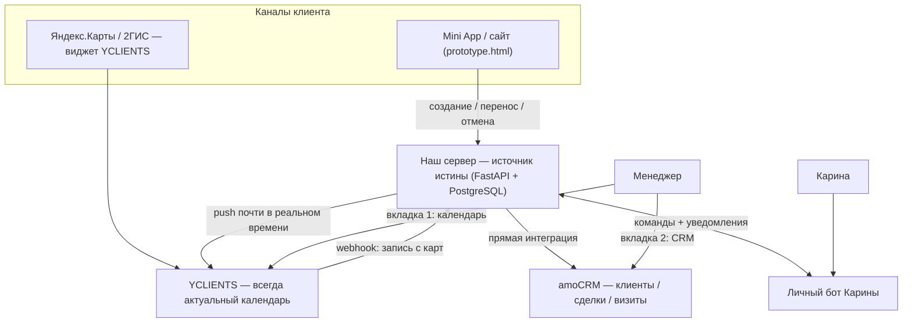

# ТЗ на сборку — Keris Club: Этап 2 «Груминг»

**Клиент:** Keris Club (Карина) · **Исполнитель:** MS Product (Максим) · **Версия:** 1.0 · **Дата:** 2026-07-28
**Бюджет блока:** 80 000 ₽ (из общих 220 000 ₽) · **Срок:** ~7–9 рабочих дней (README `08_Системное/_код/keris-online-zapis/`)
**Связано:** [КОНТЕКСТ.md](../../02_Знание/КОНТЕКСТ.md) · [ЗАПИСЬ_И_КАРТЫ.md](../../02_Знание/ЗАПИСЬ_И_КАРТЫ.md) · [ПРАЙС_ГРУМИНГ.md](../../02_Знание/ПРАЙС_ГРУМИНГ.md) · [ВОПРОСЫ_ОНЛАЙН_ЗАПИСЬ.md](../../02_Знание/ВОПРОСЫ_ОНЛАЙН_ЗАПИСЬ.md) · [ТЗ_ЭТАП0_ПИТОМНИК.md](../Питомник/ТЗ_ЭТАП0_ПИТОМНИК.md) · план `.cursor/plans/keris_club_этап_2_груминг_7b7ce08b.plan.md`

> Исполнительское ТЗ: архитектура согласована с клиентом в трёх итерациях (см. историю плана). Точные лимиты и эндпоинты YCLIENTS — по факту `developer.yclients.com`.

---

## 1. Контекст и границы

**Бизнес-контекст:** готовый premium-прототип онлайн-записи (`08_Системное/_код/keris-online-zapis/prototype.html`) полностью описывает UX на тестовых данных, но не создаёт реальных записей и не подключён ни к одной системе. Клиент параллельно регистрируется в YCLIENTS — сервисе-партнёре Яндекс.Карт/2ГИС (единственный практический путь получить кнопку «Записаться онлайн» на картах, см. `ЗАПИСЬ_И_КАРТЫ.md`).

**Цель блока:** довести прототип до продакшена без потери качества UX, подключить карты через YCLIENTS, сохранить полный контроль бизнес-логики (абонементы, коэффициенты списания) на своей стороне, интегрировать с amoCRM.

**В скоупе:** доменная модель груминга на своём сервере, двусторонний sync с YCLIENTS, прямая интеграция с amoCRM, личный Telegram-бот Карины (админ-интерфейс), перевод прототипа на реальный API, юридические тексты, деплой, тесты.

**Вне скоупа этого блока:** штатный коннектор YCLIENTS↔amoCRM, любая UI-связка (ссылка/embed/виджет) между amoCRM и YCLIENTS, фотосессия/бронь щенка как платные позиции в этом модуле, передержка, полное редактирование каталога услуг и финансовая аналитика через бот Карины (см. §8.4), Дашборд KPI (отдельный блок 30 000 ₽).

---

## 2. Архитектура (версия 3, согласована с клиентом)

**Ключевые принципы:**

1. **Источник истины и бизнес-логика — наш сервер.** Абонементы, коэффициенты списания, комплименты, размерные сетки — своя модель, не ограничена возможностями YCLIENTS.
2. **YCLIENTS — синхронное зеркало записей + канал карт.** Любая запись у нас пушится в YCLIENTS; запись с карт (виджет YCLIENTS) приходит к нам вебхуком.
3. **Низкая задержка sync — обязательное требование** против двойной записи на один слот: push сразу после создания у нас, webhook сразу после записи с карт, повторная проверка слота в момент подтверждения с обеих сторон.
4. **amoCRM — прямая интеграция с сервера**, без штатного коннектора YCLIENTS↔amoCRM (никакого ETL-цикла между ними).
5. **UI-связки amoCRM↔YCLIENTS нет.** Менеджер держит две вкладки; поле-ссылка/embed — вне скоупа.
6. **Карина в CRM не заходит.** Её интерфейс — личный Telegram-бот (уведомления + ограниченный набор команд), поверх того же API сервера.

---

## 3. Стек

| Слой | Решение | Примечание |
|------|---------|------------|
| Сервер | **Python (FastAPI) + PostgreSQL**, VPS `213.165.44.164` | единый стиль с фундаментом Этапа 0; на этом же VPS уже работают `keris-bot` и `keris-booking-bot` |
| Запись/карты | **YCLIENTS API** (`developer.yclients.com`), Application ID `48693` | push + webhook, авторизация `Bearer <partner_token>, User <user_token>` |
| CRM | **amoCRM API v4**, account `33117150` | прямая интеграция, тот же долгосрочный токен, что в Этапе 0 |
| Клиентский UI | `08_Системное/_код/keris-online-zapis/prototype.html` (Mini App + сайт) | существующий premium-прототип, переключается с `const DATA` на реальный API |
| Админ-бот | новый Telegram-бот Карины (stdlib, как `keris-bot`) | уведомления + команды, вызывает тот же API сервера |

---

## 4. Доменная модель сервера

Таблицы (PostgreSQL, см. `keris-server/app/models.py`):

- `services` — услуги/цены по размеру (из `price_grooming.yaml`), длительность.
- `addons` — допуслуги, длительность, цена.
- `masters` — мастера, статус, фото.
- `master_schedule` — рабочие часы/выходные/отпуска по датам.
- `bookings` — записи: питомец, услуга, допуслуги, мастер, время начала/конца, цена, статус, `yclients_record_id`, `amocrm_lead_id`, источник, ПДн-согласие.
- `subscriptions` / `subscription_visits` — абонементы, списание по коэффициентам, безлимиты, комплименты.
- `sync_log` — идемпотентность вебхуков/пушей (`event_id`, `direction`, `payload_hash`, `processed_at`).

---

## 5. Синхронизация с YCLIENTS

- **push:** при создании/переносе/отмене записи на сервере → `POST/PUT` в YCLIENTS (`book_record`), сохраняем `yclients_record_id`.
- **webhook:** приёмник от YCLIENTS (запись создана/изменена/отменена через виджет карт) → апдейт нашей записи/слотов → релей в amoCRM.
- Идемпотентность и ретраи на 5xx/429 по паттерну §9 `ТЗ_ЭТАП0_ПИТОМНИК.md`.
- Обработка гонки слотов: повторная проверка доступности в момент подтверждения с обеих сторон; UI уже поддерживает состояние «слот только что занят».

## 6. Интеграция с amoCRM

Прямая, без штатного коннектора YCLIENTS↔amoCRM. Собрано 2026-08-22, ID воронки, этапов и полей — в `ДОСТУПЫ.md`.

**Модель данных** (`АРХИТЕКТУРА_ЭКОСИСТЕМЫ.md`, Принцип №2): контакт = владелец, Компания = питомец, сделка = один визит в воронке **«Груминг»** (`11225138`). Питомец привязан и к сделке, и к контакту — у владельца двух собак история не смешивается.

**Триггер — один: появление `Booking` у нас.** Все каналы записи (Mini App, сайт, карты через виджет YCLIENTS, журнал администратора) сходятся в нашей БД, поэтому привязываемся к записи, а не к каналу.

**Гарантия «без пропусков» двухслойная:** мгновенный push после события (создание, перенос, отмена, вебхук YCLIENTS, подтверждение, фото-отчёт) плюс подметающий проход каждые 5 минут, который добирает записи с пустым `amocrm_lead_id`. Недоступность CRM или просроченный токен перестают быть потерей сделки: событие ложится в `sync_log` как `retry` и уезжает следующим проходом.

**Этапы ведёт сервер, а не автоматизация amoCRM** — у неё нет условия «дата визита наступит завтра», а время визита всё равно наше: `Запись создана` → `Ожидает визита` → `Завтра запись` → `Сегодня запись` → `Клиент пришёл` → Успех, плюс `Отменена` и `Не пришёл` обычными этапами (сейлсбот отрабатывает их разными сценариями). В сутки оформления сделка стоит на «Запись создана» и по датам не двигается — иначе клиент получил бы в WhatsApp «записали вас» и «завтра визит» подряд.

**Полная история клиента** в карточке: все визиты сделками, метрики на контакте (визитов всего, сумма, средний чек, первый / последний / следующий визит, статус клиента, абонемент, отмены и неявки), примечания в ленте по каждому событию визита. Метрики считаются по нашей БД — режим «Покупатели» в аккаунте выключен, встроенного LTV нет.

**Автоматизации, сейлсбот и сценарии WhatsApp внутри amoCRM — за владельцем.** Наша часть заканчивается на честном и своевременном этапе. Реализация и точки вызова — `08_Системное/_код/keris-server/README.md`, раздел «Воронка „Груминг“ в amoCRM».

## 7. Личный Telegram-бот Карины

**A. Уведомления:** новая запись/отмена/перенос груминга; истекает бронь щенка (7/3/1 день); заявка на щенка (опционально).

**B. Команды (MVP):**
1. Щенки — добавить (кличка → помёт → дата рождения → пол → окрас → цена → фото), изменить статус.
2. Мастера/график — выходной/отпуск, добавить мастера.
3. Цены — изменить цену услуги.
4. Форс-мажор — закрыть день для записи.
5. Просмотр записей на сегодня/завтра.

**C. Вне MVP:** полное редактирование каталога услуг/сеток, финансовая аналитика, массовые правки, управление правами.

Доступ — whitelist по Telegram ID Карины, лог действий.

### 7.1. Бот фото администратора (`@kerisclubphotobot`)

Отдельный сервис `keris-staff-bot`, бот Карины не трогаем: у неё уведомления и управление, у администратора — только фото.

- Флоу: меню «Фото-отчёт» → записи на сегодня (`GET /admin/bookings`) → выбор записи → фото «до» → фото «после» → «Отправить клиенту».
- Приём фото: `POST /admin/bookings/{id}/photos`, файл скачивается из Telegram через `getFile` и сохраняется в `PHOTOS_DIR` (`/var/lib/keris/photos/<booking_id>/`). Ссылка на Telegram не хранится — `file_path` живёт около часа.
- Отдача: nginx `location /media/`, в `GET /api/client` каждый визит получает `photos: [{kind, url}]`. Фото остаются в кабинете по любой прошлой записи.
- Клиент ещё не в боте — фото сохранены, отчёт уходит автоматически после привязки номера (`send_pending_reports`).
- Доступ — whitelist `STAFF_TELEGRAM_IDS`, лог действий.

### 7.2. Каналы уведомлений и вход в кабинет

- Порядок доставки кода входа и уведомлений: Telegram → MAX → SMS. SMS остаётся резервом, включается только по решению Карины (`P1SMS_ENABLED`).
- Привязки нет — `POST /api/auth/request-code` отвечает `need_bind` со ссылками на боты, код живёт 600 секунд и выдаётся сразу после привязки номера.
- Подпись кода — отдельный `OTP_SECRET`, не `p1sms_api_key`.

### 7.3. Автоматические касания без человека

- День рождения питомца по `pet_birth_date` — в сам день, один раз в год.
- «Давно не виделись» — визита нет дольше `REACTIVATION_DAYS` (по умолчанию 60) и нет будущей записи.
- Защита от повторов — таблица `client_outreach` (`phone`, `kind`, `tag`).

## 8. Рабочие допущения (временные, до ответов Карины)

> Ответы по [`ВОПРОСЫ_ОНЛАЙН_ЗАПИСЬ.md`](../../02_Знание/ВОПРОСЫ_ОНЛАЙН_ЗАПИСЬ.md) — не блокер. Ниже наши best-practice допущения; после реальных ответов — точечная корректировка, без переделки архитектуры.

| № | Тема | Допущение |
|---|---|---|
| 3–4 | Мастера, график | Анна, Мария, София (как в прототипе), 10:00–20:00, без выходных на старте |
| 5–6 | Кто берёт каких питомцев; выбор мастера | Любой мастер берёт любой размер; выбор — конкретный мастер или «любой свободный» |
| 1 | Дата открытия груминга | Заглушка «уже открыто» |
| 8–9 | Скидки, привилегия покупателям щенка | Нет на старте |
| 10 | Подтверждение записи | Автоматическое сразу |
| 11–12 | Лид-тайм / горизонт записи | ≥2 часа; горизонт 30 дней |
| 13–14 | Перенос/отмена/опоздание | Бесплатно за 24 часа; опоздание >15 мин — по согласованию с мастером |
| 15 | Предоплата | Без предоплаты на старте |
| 16 | Сетка размеров | Базовая (не абонементная) |
| 18 | Фотосессия | Не продаём на старте |
| 20 | Напоминания | Telegram |

---

## 9. Тест-план (чек-лист приёмки)

| # | Тест | Ожидаемый результат | Статус |
|---|------|---------------------|--------|
| T1 | Запись через прототип | Создаётся у нас, видна в YCLIENTS в течение секунд | ☐ |
| T2 | Запись через виджет YCLIENTS (карты) | Прилетает к нам вебхуком, слот занят и в прототипе | ☐ |
| T3 | Гонка слотов | Почти одновременная запись в двух каналах на один слот — проходит только одна | ☐ |
| T4 | Перенос/отмена через прототип | Синхронно отражается в YCLIENTS | ☐ |
| T5 | amoCRM | По каждой записи — сделка в воронке «Груминг» на верном этапе, привязка к контакту-владельцу и к карточке питомца, метрики клиента пересчитаны | ☐ (блокер: подписка, см. §11.5) |
| T6 | Идемпотентность | Повтор вебхука не дублирует действие | ☐ |
| T7 | Абонементы | Списание по коэффициентам, безлимиты и комплименты считаются верно | ☐ |
| T8 | Бот Карины: уведомления | Новая запись/отмена/перенос приходят в бот | ☐ |
| T9 | Бот Карины: добавить щенка | Создаётся сделка-щенок в amoCRM с нужными полями | ☐ |
| T10 | Бот Карины: выходной мастера | Слоты мастера скрываются в прототипе и YCLIENTS | ☐ |
| T11 | Юридические тексты | Реальные ПДн/оферта из `ПРАЙС_ГРУМИНГ.md` отображаются в форме согласия | ☐ |
| T12 | Мобильные вьюпорты | 360/390/430/1440 px без горизонтального скролла (см. `test_prototype.py`) | ☐ |
| T13 | Вход в кабинет через бота | Код приходит в Telegram или MAX; без привязки страница показывает ссылки на боты, после привязки код приходит сам | ☐ |
| T14 | Код живёт после закрытия страницы | Закрыть браузер, открыть заново — поле кода с таймером, код, выданный до закрытия, подходит | ☐ |
| T15 | Фото до/после | Администратор загрузил через `@kerisclubphotobot` — клиент получил отчёт, фото видно в этой записи кабинета | ☐ |
| T16 | Фото не пропадают | После следующего визита прошлая запись со своими фото остаётся на месте, картинки открываются | ☐ |
| T17 | ДР питомца и «давно не виделись» | Подстановкой даты: поздравление уходит один раз, реактивация не уходит тем, у кого есть будущая запись | ☐ |

**T15 на 2026-08-20:** серверная часть прогнана на проде живым файлом Telegram
(`KERIS-1043`: `getFile` → диск → отчёт в Telegram → фото в кабинете → nginx `/media/`
отдал `200 image/jpeg`). Не прогнаны только кнопки бота глазами администратора —
это шаг Карины или администратора салона на первом реальном визите.

---

## 10. DoD приёмки блока (80 000 ₽)

- [ ] Сервер (FastAPI + PostgreSQL) развёрнут на `213.165.44.164`, доменная модель груминга работает.
- [ ] Партнёрское приложение YCLIENTS (`47925`) настроено, push/webhook работают, слоты синхронны с низкой задержкой.
- [ ] Сервис-партнёрство Яндекс.Карты/2ГИС подключено — кнопка «Записаться онлайн» на картах работает.
- [ ] amoCRM получает сделку/визит по каждой записи напрямую с сервера.
- [ ] Личный бот Карины: уведомления и команды §7 работают, доступ ограничен её Telegram ID.
- [ ] `prototype.html` переключён с `const DATA` на реальный API, юридические тексты подставлены.
- [ ] Бот фото администратора (§7.1) работает: загрузка до/после, отчёт клиенту, фото в кабинете.
- [ ] Тест-план §9 пройден (T1–T17).
- [ ] `README.md` (`08_Системное/_код/keris-online-zapis/`) и `06_Доступы/ДОСТУПЫ.md` обновлены.

---

## 11. Открытые внешние зависимости

1. **YCLIENTS API credentials — аккаунт сменён 2026-08-07.** Старый (Partner `20148`/App `47925`/Company `2101965`) архивирован — см. `ДОСТУПЫ.md`. Новый: Application `48693`, Partner ID `20622`, Company ID `2125383`. Прописан в `.env` на `194.87.118.214` 2026-08-07, `keris-server` перезапущен. **Права на `/staff` и `/service_categories` открыты** (был 403, снят переподключением приложения к филиалу после выставления прав). **Автонаполнение по API выполнено:** адрес/сайт/описание, категория «Груминг», 3 услуги-зеркала («Гигиена», «Комплекс со стрижкой», «Купание + сушка» — все `active:1`), сотрудники Светлана (`5824353`) и Алла (`5824356`) созданы и привязаны к услугам. **Филиал добит по API 2026-08-07 09:45:** адрес «Центральная улица, 82А, д. Покровское, о. Истра, МО, 143582», координаты `55.808457/37.024289`, телефон `+7 993 368-98-71`, график **4/3 10:00–22:00 до 2026-12-31** (Светлана Пн–Чт, Алла Чт–Вс, дней без мастера нет), обе `is_bookable:true`. Webhook URL сохранён. **Ручных действий в панели не осталось.** Осталось по коду: маппинг ID в БД (staff `5824353`/`5824356`, services `30786306`/`30798738`/`30798741`), smoke push+webhook, партнёрство карт. Практические нюансы API — [`СПРАВОЧНИК_YCLIENTS_API.md`](../../../../../08_Системное/СПРАВОЧНИК_YCLIENTS_API.md).
2. ~~**Токен Telegram-бота Карины**~~ — закрыто 2026-07-28: `@kerisclubadminbot`, токен в `.env` на сервере (`keris-server` и `keris-admin-bot`), сервис `keris-admin-bot` активен. **Осталось:** Карина должна написать `/start` боту — бот покажет её Telegram ID, его нужно внести в `KARINA_TELEGRAM_IDS` в обоих `.env` и перезапустить сервисы (сейчас whitelist пуст → доступ временно открыт всем, кто знает `@kerisclubadminbot`).
3. **Ответы Карины** по `ВОПРОСЫ_ОНЛАЙН_ЗАПИСЬ.md` — корректировка допущений §8 по факту (не блокер).
4. **VPS `194.87.118.214`** — по уточнению 2026-07-28 (вечер) жив, но пароль/доступ не зафиксирован в `ДОСТУПЫ.md` — миграция не выполнена, рабочий деплой остаётся на `213.165.44.164`. `176.124.222.46` — не проверялся повторно.
5. **amoCRM — ждём оплату подписки, всё остальное готово (2026-08-22).** Прошлая запись («подписка не оплачена, интеграцию не настраиваем», 2026-07-28) опиралась на `401 Account not found`, а он приходил из-за базового URL: проверка и `config.py` бились в `api-b.amocrm.ru`, тогда как обращаться нужно на домен аккаунта `https://kerisclub.amocrm.ru`. Токен живой, исправлен и прописан в `.env` на `194.87.118.214`, `amoCRM настроен: True`.

   **Сделано:** воронка «Груминг» (`11225138`) с 7 этапами, 12 полей визита, 7 полей питомца на Компании, 12 полей метрик на контакте; интеграция в коде (`amocrm_client`, `amocrm_stages`, `amocrm_metrics`, точки вызова, проход каждые 5 минут); 189 тестов зелёные; отчёт бэкфилла по живой базе сходится (14 живых записей, 10 клиентов, 5 питомцев, 3 контакта найдутся по телефону).

   **Блокер:** аккаунт не принимает создание сущностей — `POST /leads` → `Payment Required`, `POST /contacts` и `/companies` → «Код ошибки 205». Сервер это распознаёт (`AmoCrmBlocked`), ставит паузу 30 минут и не долбит аккаунт; записи ждут в `sync_log` со `reason=amocrm_blocked`. **После оплаты:** сделки доберёт первый пятиминутный проход, историю перенести `keris-server/amocrm_backfill.py --skip-cancelled`.
