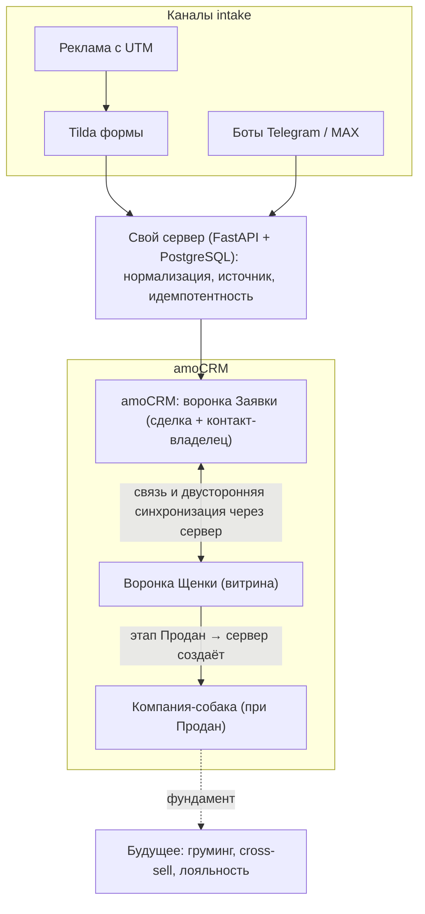

# ТЗ на сборку — Keris Club: Этап 0 + Модуль 1 «Питомник»

**Клиент:** Keris Club (Карина) · **Исполнитель:** MS Product (Максим) · **Версия:** 1.0 · **Дата:** 2026-06-23
**Бюджет блока:** 110 000 ₽ (Этап 0 + Питомник из общих 220 000 ₽) · **Срок:** ~12–14 рабочих дней
**Связано:** [КОНТЕКСТ.md](КОНТЕКСТ.md) · [ПРЕДЛОЖЕНИЕ.md](ПРЕДЛОЖЕНИЕ.md) · [ФИКСАЦИИ_АРХИТЕКТУРЫ.md](ФИКСАЦИИ_АРХИТЕКТУРЫ.md) · [АРХИТЕКТУРА_ЭКОСИСТЕМЫ.md](АРХИТЕКТУРА_ЭКОСИСТЕМЫ.md)

> Исполнительское ТЗ: по нему сборку ведут «руками без додумывания» и объективно сдают этап. Точные имена полей и возможности API — **проверять по факту аккаунта и актуальной доке** amoCRM; эндпоинты в ТЗ не выдумываются.

---

## 1. Контекст и границы

**Бизнес-контекст:** Keris Club — премиум-питомник мальтипу F1, растёт в экосистему (питомник → груминг → передержка). Сейчас заявки с Tilda теряются, единой базы нет, источник заявок не виден. Команда на старте — 1 менеджер.

**Цель блока:** создать аккаунт amoCRM с нуля + серверный фундамент, поднять процесс питомника на двух воронках («Щенки»-витрина и «Продажи»-сделки), чтобы заявки не терялись, база копилась, был виден источник каждой сделки, а бронь/рассрочка контролировались.

**В скоупе:** Этап 0 (аккаунт + сервер + каналы intake + РКН-контур) и Модуль 1 «Питомник».

**Вне скоупа этого блока:**
- Груминг и Дашборд — отдельные ТЗ.
- **Телефония — не нужна** (решение клиента).
- **МойСклад — не интегрируем** ни сейчас, ни в перспективе (решение клиента, 2026-06-23).
- Регламент менеджера и приёмочный недельный прогон — отдельный deliverable при сдаче Модуля.
- Дизайн/вёрстка сайта — только корректный приём заявок.

---

## 2. Стек

| Слой | Решение | Примечание |
|------|---------|------------|
| CRM | **amoCRM**, API v4, long-lived token | ядро, источник истины по клиентам/сделкам |
| Сервер | **Python (FastAPI) + PostgreSQL** на VPS | единый стиль с ms-webhook / loyalty-service; связь воронок, приём форм, боты |
| Сайт/формы | **Tilda** → webhook → сервер → amoCRM | визуал сайта не трогаем |
| Мессенджеры | боты **Telegram + MAX** (акцент MAX) | intake заявок + забота/уведомления |
| SMS | SMS-провайдер (РФ) | адресные напоминания (рассрочка) |
| Рассылки | **DashaMail** (dashamail.ru) | РФ-сервис, требование РКН/ПДн |

> Точные имена полей/эндпоинтов уточняются по факту аккаунта. Лимит amoCRM ~7 запросов/сек на интеграцию — закладываем батчинг/очередь.

---

## 3. Этап 0 — аккаунт с нуля + фундамент (пошагово)

### 3.1 amoCRM — базовая настройка

1. Создать аккаунт amoCRM (на реквизиты/почту Keris Club — владение у клиента).
2. **Тариф:** гипотеза — «Базовый»/«Расширенный» (зависит от нужных автоматизаций и числа полей). → открытый вопрос §14, финал по факту нужных функций.
3. Пользователи: минимум 2 (владелец + менеджер). Роли/права: менеджер — без доступа к настройкам и экспорту базы; владелец — администратор.
4. Общие настройки: рабочее время (для SLA «время первого ответа»), валюта ₽, часовой пояс.
5. Удалить демо-данные, отключить лишние дефолтные воронки.

### 3.2 Свой сервер (фундамент)

1. Развернуть FastAPI-сервис на VPS (как ms-webhook): HTTPS, домен/субдомен.
2. OAuth-интеграция с amoCRM (приватная интеграция): хранение токенов, авто-refresh.
3. PostgreSQL: таблицы соответствий — `deal_link (application_deal_id, puppy_deal_id, status, updated_at)`, `webhook_log (event_id, entity, payload_hash, processed_at)` для идемпотентности.
4. Приём вебхуков amoCRM (создание/смена этапа сделок) + входящая точка для форм Tilda и ботов.
5. Идемпотентность по ключу `(entity_id, target_status)` / `payload_hash` — повтор вебхука не плодит действий.

### 3.3 Каналы intake

1. **Tilda:** на формах сайта настроить webhook → сервер → создание сделки в воронке «Заявки» с фиксацией источника.
2. **Боты Telegram + MAX:** приём заявки, проброс в amoCRM, тег источника (бот/канал). Акцент на MAX (риск блокировки Telegram).
3. **SMS:** подключить провайдера для адресных напоминаний (платежи рассрочки).

### 3.4 РКН / ПДн (контур соответствия)

- Чекбокс **согласия на обработку ПДн** во всех формах (Tilda) и в сценарии бота; ссылка на политику конфиденциальности.
- Фиксация факта согласия в карточке контакта (поле «Согласие ПДн» + дата/источник).
- Сервер и рассылки — РФ (DashaMail).
- Предусмотреть **выгрузку реестра согласий** из amoCRM (фильтр/экспорт по полю согласия).
- Уведомление в Роскомнадзор как оператор ПДн — организационный шаг клиента; тех. описание потоков ПДн — с нашей стороны.

---

## 4. Принцип проектирования (UX, ФИКСАЦИИ §3)

Менеджер **не обязан понимать** внутреннюю модель данных («компания = собака»). Вся работа — через привычные **сделки и поля**; техническая модель (компании-собаки, связь воронок) скрыта за виджетом/сервером. Этот принцип держим во всех разделах ниже: где есть «магия» синхронизации — она автоматическая, менеджер видит только заполненные поля и связанные карточки.

---

## 5. Модуль 1 «Питомник» — две воронки

> Версия этапов и полей зафиксирована 2026-06-24 (по итогам согласования с Максимом).

### 5.1 Воронка «Щенки» (витрина)

Назначение: вести наличие/статус щенков как складскую витрину (щенок = сделка, **не** компания).

**Финальные этапы:**

```
Свободен → Щенок забронирован → В процессе оформления → [Успех] / [Провал]
```

| Этап | Смысл |
|------|-------|
| Свободен | Щенок доступен для продажи |
| Щенок забронирован | Предоплата (30%) получена; дата и срок брони фиксируются автоматически (read-only) |
| В процессе оформления | Документы оформляются, финальный расчёт |
| Успех | Щенок продан; сервер создаёт компанию-собаку |
| Провал | Щенок снят с продажи (умер, изъят); связь с заявкой разрывается |

**Логика автоматики по броне:**
- При переходе в «Щенок забронирован»: сервер авто-фиксирует `Дата брони` (текущая дата, read-only) и выставляет `Срок брони` (+7 дней, read-only).
- Напоминания сервера: за 7 дней / за 3 дня / за 1 день до истечения срока → задача менеджеру + уведомление клиенту.
- Если на дату истечения щенок всё ещё в «Щенок забронирован» → авто-возврат в «Свободен»; в связанной заявке — тег «Бронь истекла» + задача менеджеру.

### 5.2 Воронка «Продажи» (бывшие «Заявки»)

Назначение: довести покупателя от первого контакта до оформления сделки.

**Финальные этапы:**

```
Новая заявка → Взято в работу → Щенок подобран → Предоплата получена → Документы оформлены → [Успех] / [Провал]
                      │
                      └──→ Лист ожидания ──(появился щенок)──→ Щенок подобран
```

| Этап | Смысл |
|------|-------|
| Новая заявка | Только создана; задача на первый звонок |
| Взято в работу | Менеджер ведёт диалог, уточняет предпочтения |
| Лист ожидания | Подходящего щенка нет сейчас; ждут помёт. Поле «Ожидаемая дата помёта» → авто-задача менеджеру на эту дату |
| Щенок подобран | Щенок выбран (предоплата ещё не получена) |
| Предоплата получена | 30% оплачено; щенок → «Щенок забронирован» в воронке Щенки |
| Документы оформлены | Финальный расчёт, документы готовы |
| Успех | Сделка закрыта |
| Провал | Клиент отказался; щенок возвращается в «Свободен» |

> «Лист ожидания» — **боковой этап**, не в основной линейной цепочке. Выход из него — только в «Щенок подобран» (когда появился подходящий щенок). Такой подход сохраняет корректность конверсии в отчётах.

### 5.3 Связь воронок через сервер (ФИКСАЦИИ §2)

- В сделке «Продажи» — выбор щенка из списка **только актуальных** (этап «Свободен»). На старте — менеджер вручную (dropdown/виджет); автовыбор по тексту — Phase 2.
- После выбора сервер **подтягивает поля щенка** в заявку: ID, кличка, помёт, цена, фото, дата готовности.
- **Двусторонняя синхронизация** реализуется сервером по вебхукам через таблицу `deal_link`:

| Продажи | ↔ | Щенки |
|---------|---|-------|
| Щенок подобран | → | Щенок остаётся «Свободен» (выбран, бронь не оплачена) |
| Предоплата получена | ↔ | Щенок забронирован |
| Документы оформлены | ↔ | В процессе оформления |
| Успех | → | Успех (+ создание компании-собаки) |
| Провал | → | Щенок возвращается в «Свободен» |

- Воронки сами не «общаются» — связь только через сервер + таблица `deal_link`.

---

## 6. Сущности и поля

> Тип: text / numeric / select / multiselect / date / url / checkbox. Обяз. — обязательность на ключевом этапе. Имена — рабочие, финал по факту аккаунта. Поля щенка собраны как прототип по конкурентам (Milord/Businka/Doggo) и контексту — финал согласуем с клиентом.

### 6.1 Контакт — Владелец

| Поле | Тип | Обяз. | Источник | Пример |
|------|-----|-------|----------|--------|
| Имя | text | да | форма/бот/менеджер | Анна |
| Телефон | text | да | форма/бот | +7XXXXXXXXXX |
| Email | text | нет | форма | a@example.ru |
| Теги направлений | multiselect | нет | авто/менеджер | питомник, груминг |
| Согласие ПДн | checkbox | да | форма/бот | да + дата |
| Источник (канал) | select | да | UTM/бот/менеджер | Тильда / Яндекс.Реклама / Телеграм-канал / Рекомендации / Яндекс.Карты / 2ГИС / MAX |

### 6.2 Сделка — Щенок (воронка «Щенки»)

| Поле | Тип | Редактируемость | Обяз. | Источник | Пример |
|------|-----|-----------------|-------|----------|--------|
| Кличка | text | да | да | менеджер | Keris Lucky |
| Помёт | select | да | да | менеджер | Помёт «L-2026-05» |
| Дата рождения | date | да | да | менеджер | 2026-05-01 |
| Пол | select | да | да | менеджер | сука / кобель |
| Окрас | text | да | нет | менеджер | абрикос |
| Родители (отец/мать) | text | да | нет | менеджер | Ch. … / … |
| Цена | numeric | да | да | менеджер | 150 000 |
| Фото/видео | url | да | нет | менеджер | ссылка |
| Статус прививки | select | да | нет | менеджер | без прививки / 1-я сделана / 2-я сделана / комплекс готов |
| Дата прививки | date | да | нет | менеджер | 2026-06-15 |
| Медкарта | url/text | да | нет | менеджер | ссылка на документ |
| Готов к переезду с | date | да | нет | авто (ДР+2 мес) | 2026-07-01 |
| Дата брони | date | **read-only** | нет | сервер (авто при «Щенок забронирован») | 2026-06-24 |
| Срок брони | date | **read-only** | нет | сервер (авто +7 дн от Даты брони) | 2026-07-01 |
| Сумма предоплаты | numeric | да | усл. | сервер (авто 30% от цены) | 45 000 |
| Статус оплаты предоплаты | select | да | усл. | менеджер/сервер | ожидается / частично / оплачена |

### 6.3 Сделка — Продажи (воронка «Продажи», бывшие «Заявки»)

| Поле | Тип | Обяз. | Источник | Пример |
|------|-----|-------|----------|--------|
| Выбранный щенок | ref/link | нет→да | сервер (выбор) | связь со сделкой-щенком |
| Запрос/предпочтения | text | нет | клиент | «девочка, абрикос» |
| Источник (канал) | select | да | UTM/бот | Тильда / Яндекс.Реклама / Телеграм-канал / Рекомендации / Яндекс.Карты / 2ГИС / MAX |
| Условие сделки | select | нет | менеджер | полная / рассрочка |
| Ожидаемая дата помёта | date | усл. | менеджер | 2026-09-01 (для этапа «Лист ожидания» → авто-задача) |

### 6.4 Рассрочка (поля сделки «Продажи»)

| Поле | Тип | Обяз. | Источник | Пример |
|------|-----|-------|----------|--------|
| Рассрочка: срок (мес) | select | усл. | менеджер | 3 / 6 / 10 |
| Сумма к рассрочке | numeric | усл. | авто (цена − предоплата) | 105 000 |
| Дата ближайшего платежа | date | усл. | сервер | 2026-08-01 |
| Остаток долга | numeric | усл. | сервер | 70 000 |

### 6.5 Помёт (litter) — модель

Нужен для «листа ожидания по помётам». Варианты:
- **(A)** поле `Помёт` (select) на сделке-щенке + одноимённый тег — просто, без новой сущности.
- **(B)** отдельный справочник/список помётов (если потребуется карточка помёта с датами/родителями).

**Решение для MVP:** вариант (A) — поле + тег; (B) закладываем как возможное расширение. (Design-вопрос подтверждаем при сборке.)

### 6.6 Компания — Собака клиента (фундамент под груминг/cross-sell)

- Создаётся **сервером при переходе щенка в «Продан»** (не раньше): из полей сделки-щенка формируется компания-собака, привязывается к контакту-владельцу.
- Модель **«1 владелец → N собак»**: контакт 1:N компании-собаки (реально пригодится в груминге, закладываем сейчас).
- **Маппинг сделка-щенок → компания-собака** (один раз в конфиге сервера):

| Поле сделки-щенка | Поле компании-собаки |
|-------------------|----------------------|
| Кличка | Название (кличка) |
| Помёт | Помёт |
| Дата рождения | Дата рождения |
| Пол / Окрас | Пол / Окрас |
| Родители | Родители |
| (ID сделки-щенка) | Исходная сделка (ссылка) |

---

## 7. Бизнес-логика и автоматизации

| # | Логика | Реализация |
|---|--------|------------|
| 1 | Предоплата 30% | поле «Сумма предоплаты» авто от цены щенка; переход в «Предоплата получена» требует отметки «оплачена» |
| 2 | Срок брони — авто | при переходе в «Щенок забронирован»: сервер фиксирует «Дата брони» (сегодня, read-only) и «Срок брони» (+7 дней, read-only) |
| 3 | Напоминания по сроку брони | сервер за 7 / 3 / 1 день до «Срок брони» → задача менеджеру + уведомление клиенту |
| 4 | Авто-возврат в «Свободен» | если «Срок брони» истёк и этап не изменился → сервер переводит щенка в «Свободен», в заявке тег «Бронь истекла» + задача |
| 5 | Лист ожидания | «Ожидаемая дата помёта» → сервер ставит задачу менеджеру на эту дату; при наступлении даты сделка ждёт перевода в «Щенок подобран» |
| 6 | Рассрочка без % (3 / 6 / 10 мес) | сервер считает график (цена − предоплата / срок), пишет «Дата ближайшего платежа» и «Остаток долга»; срок только из списка 3, 6, 10 |
| 7 | Напоминание о платеже рассрочки | сервер за N дней до «Дата ближайшего платежа» → SMS/мессенджер + задача менеджеру |
| 8 | Источник каждой сделки | UTM с Tilda, тег канала из бота → поле «Источник» (7 значений: Тильда / Яндекс.Реклама / Телеграм-канал / Рекомендации / Яндекс.Карты / 2ГИС / MAX) |
| 9 | Объединение дублей | поиск контакта по телефону до создания; merge — один клиент = одна карточка |
| 10 | Распределение заявок | новая заявка → ответственный менеджер; SLA времени первого ответа (задача/уведомление) |
| 11 | Рассылки/прогрев | сегменты базы → DashaMail (с учётом согласия ПДн) |

---

## 8. Интеграционная схема



---

## 9. Надёжность, события, API

- **Вход:** вебхуки amoCRM (создание сделки, смена этапа), webhook Tilda, апдейты ботов.
- **Выход:** REST amoCRM API v4 (создание/обновление сделок, контактов, компаний, связей) — точные пути по доке.
- **Лимиты:** ~7 запросов/сек на интеграцию → очередь/батчинг при массовых операциях, уважение к 429.
- **Идемпотентность:** ключ `(entity_id, target_status)` / `payload_hash` в `webhook_log`.
- **Ретраи:** 3 попытки с экспоненциальной задержкой на 5xx; на 4xx-валидации — не ретраить, фиксировать ошибку.
- **Видимость ошибок:** ошибка синхронизации → примечание/тег в сделке amoCRM (менеджер видит без доступа к логам сервера).

---

## 10. Фазы внедрения

### 10.1 MVP `[Medium]` (основной объём блока)
amoCRM с нуля, сервер, обе воронки, поля карточек, приём Tilda + боты, источник сделки, бронь/рассрочка с напоминаниями, объединение дублей, связь воронок (выбор щенка менеджером + подтягивание полей + двусторонняя синхронизация), создание компании-собаки при «Продан», РКН-контур, рассылки DashaMail.
**DoD:** см. §13.

### 10.2 Phase 2 `[Medium]`
Автовыбор щенка по тексту заявки (бот/форма), расширенные сегменты прогрева, карточка помёта (если решим вариант B), углублённая аналитика рассрочки.

### 10.3 Phase 3 `[High]`
Расширения под груминг (поверх готовой базы) — отдельное ТЗ Модуля 2.

---

## 11. Edge cases

| Сценарий | Поведение |
|----------|-----------|
| Повтор вебхука | не дублировать действие (идемпотентность по `webhook_log`) |
| Дубль контакта по телефону | найти существующий → merge, не плодить карточку |
| Переход этапа без обяз. полей | блокировать переход (обязательные поля на этапе) |
| Истёк срок брони без оплаты | сервер авто-возвращает щенка в «Свободен»; в заявке тег «Бронь истекла» + задача менеджеру |
| Щенок выбран одновременно в двух заявках | блокировать: при «Предоплата получена» щенок уходит из списка «Свободен», недоступен для выбора |
| Заявка без согласия ПДн | не запускать рассылки на контакт; пометка-тег |
| Удаление/отмена сделки-щенка | разорвать связь в заявке «Продажи», уведомить менеджера |
| Провал заявки «Продажи» | щенок авто возвращается в «Свободен» через сервер |
| Сделка попала в «Лист ожидания», щенок появился | менеджер получает задачу → вручную переводит в «Щенок подобран» |

---

## 12. Тест-план (чеклист приёмки)

| # | Тест | Ожидаемый результат | Статус |
|---|------|---------------------|--------|
| T1 | Заявка с формы Tilda | сделка в «Новая заявка» (воронка Продажи), контакт создан, согласие ПДн зафиксировано | ☐ |
| T2 | Источник заявки (UTM/бот) | поле «Источник» заполнено значением из списка 7 каналов | ☐ |
| T3 | Заявка из бота MAX и Telegram | сделка создаётся, тег канала проставлен | ☐ |
| T4 | Дубль по телефону | второй раз — не новая карточка, а связка с существующей | ☐ |
| T5 | Выбор щенка в заявке | список только «Свободен»; поля щенка подтянулись в заявку | ☐ |
| T6 | Предоплата получена → щенок забронирован | щенок авто → «Щенок забронирован»; Дата брони = сегодня (read-only); Срок брони = +7 дней (read-only); Сумма предоплаты рассчитана (30%) | ☐ |
| T7 | Двусторонняя синхронизация | смена этапа в Продажах → обновление щенка и наоборот (по таблице маппинга §5.3) | ☐ |
| T8 | Напоминания по сроку брони | за 7/3/1 день до «Срок брони» → задача менеджеру + уведомление клиенту | ☐ |
| T9 | Авто-возврат по истечении брони | если «Срок брони» истёк и статус не изменился → щенок в «Свободен», тег в заявке | ☐ |
| T10 | Лист ожидания | сделка в «Лист ожидания» + «Ожидаемая дата помёта» → задача менеджеру создаётся на эту дату | ☐ |
| T11 | Рассрочка | цена − предоплата / срок = правильный график; «Дата ближайшего платежа» и «Остаток долга» корректны | ☐ |
| T12 | Напоминание о платеже рассрочки | за N дней → SMS/сообщение + задача менеджеру | ☐ |
| T13 | Щенок «Успех» | сервер создал компанию-собаку, привязал к владельцу (модель 1:N) | ☐ |
| T14 | 1 владелец → 2 собаки | обе компании-собаки привязаны к одному контакту | ☐ |
| T15 | Повтор вебхука | действие не дублируется | ☐ |
| T16 | Рассылка DashaMail | уходит только по контактам с согласием ПДн | ☐ |
| T17 | Выгрузка реестра согласий | экспорт по полю согласия ПДн работает | ☐ |

---

## 13. DoD приёмки Модуля (на чём подписывается этап за 110 000 ₽)

- [ ] Аккаунт amoCRM создан с нуля, пользователи/права настроены, демо-данные убраны.
- [ ] Сервер развёрнут (176.124.222.46), OAuth с amoCRM работает, вебхуки принимаются идемпотентно.
- [ ] Воронка «Щенки» (4 этапа + Успех/Провал) настроена; воронка «Продажи» (6 этапов + Лист ожидания + Успех/Провал) настроена.
- [ ] Заявки с Tilda и ботов (TG + MAX) долетают в нужный этап и не теряются.
- [ ] У каждой сделки виден источник (7 каналов, точная фиксация).
- [ ] Связь «Продажи ↔ Щенки» работает: выбор щенка, подтягивание полей, двусторонняя синхронизация по таблице §5.3.
- [ ] Логика брони: Дата/Срок брони фиксируются read-only; напоминания 7/3/1 день; авто-возврат при истечении срока.
- [ ] Предоплата 30% и рассрочка считаются; напоминания о платежах рассрочки уходят.
- [ ] Объединение дублей работает (один клиент — одна карточка).
- [ ] При «Успех» создаётся компания-собака, привязанная к владельцу (модель 1:N).
- [ ] Лист ожидания: при заполнении «Ожидаемая дата помёта» ставится задача на эту дату.
- [ ] РКН-контур: согласия фиксируются, реестр выгружается, рассылки DashaMail с учётом согласия.
- [ ] Тест-план §12 пройден (T1–T17).

---

## 14. Открытые вопросы

### Закрытые решения (зафиксированы 2026-06-24)

| Вопрос | Решение |
|--------|---------|
| Этапы воронки «Щенки» | Свободен → Щенок забронирован → В процессе оформления → Успех/Провал ✅ |
| Этапы воронки «Заявки» → «Продажи» | Новая заявка → Взято в работу → Лист ожидания (боковой) → Щенок подобран → Предоплата получена → Документы оформлены → Успех/Провал ✅ |
| Бронь без оплаты в срок | Задача менеджеру + авто-возврат в «Свободен» через 7 дней (напоминания: 7/3/1 день) ✅ |
| Срок брони | +7 дней от Даты брони (тест); оба поля read-only ✅ |
| Лист ожидания | Этап в воронке «Продажи» + поле «Ожидаемая дата помёта» → авто-задача ✅ |
| Источники | Тильда / Яндекс.Реклама / Телеграм-канал / Рекомендации / Яндекс.Карты / 2ГИС / MAX ✅ |
| Прививки | Без отдельного этапа; только поля: «Статус прививки» + «Дата прививки» ✅ |
| Задаток | Переименован в «Предоплата» везде ✅ |
| МойСклад | Не интегрируем ни сейчас, ни в перспективе ✅ |

### Остаётся открытым

1. **Тариф amoCRM** — финал по факту нужных автоматизаций (гипотеза: Расширенный).
2. **Финальный список полей щенка** — прототип готов (§6.2), согласовать с Кариной перед заполнением карточек.

> **По «схеме Leads vs Сделки»:** не используем режим «Неразобранное/Leads» — входящие заявки сразу создаются как **сделки** в воронке «Продажи». Проще для менеджера, соответствует принципу §4.

---

## 15. Приложения / ссылки

- amoCRM API: https://www.amocrm.ru/developers/content/crm_platform/api-reference
- Справочник архитектора: [справочник_amoCRM.md](../../../агенты/АРХИТЕКТОР/_КОНТЕКСТ/справочник_amoCRM.md)
- DashaMail: https://dashamail.ru
- Эталоны ТЗ: [RUSbrend](../../../агенты/АРХИТЕКТОР/_КОНТЕКСТ/клиенты/rusbrend/ТЗ.md) · [MANSBAND](../../../агенты/АРХИТЕКТОР/_КОНТЕКСТ/клиенты/mansband/ТЗ.md)
