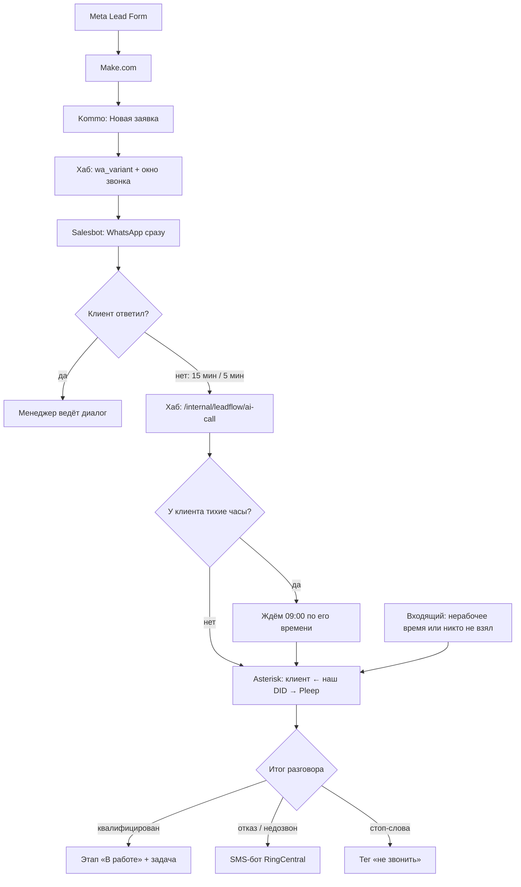

# Лид-машина: WhatsApp → AI-звонок Pleep → SMS

Обработка заявки из Meta без участия менеджера до момента, когда с клиентом
действительно есть о чём говорить. Собрано 10.08.2026.

## Схема



## Что уже сделано и работает

| Блок | Состояние |
|---|---|
| Поля сделки `wa_variant` (1420023) и «Окно звонка» (1420025) | созданы в Kommo |
| Хаб: `app/leadflow.py`, `app/ami.py`, эндпоинты, 20 тестов | задеплоено, флаг `ENABLE_LEADFLOW=false` |
| Таймзона клиента по коду номера, отложенный звонок до 09:00 | в хабе |
| AMI на Asterisk (`lbhub`), порт 5038 только для IP хаба | логин с хаба проверен |
| Диалплан: `lb-ai-outbound`, `lb-ai-connect`, `lb-ai-pleep` | выложено |
| Часы работы 09:00–18:00 America/New_York | включены (`LB_HOURS_ENABLED=1`) |
| Перевод входящего на Pleep в нерабочее время и при недозвоне | выложено, **выключено рубильником** `LB_AI_ON=0` |

Рубильник стоит в 0 намеренно: агент не берёт трубку. Пока это так, включать
перевод нельзя — клиент в нерабочее время слышал бы 45 секунд гудков вместо
короткого сброса.

### Диагностика 11.08: сторона телефонии исправна

Тест с полным SIP-логом на `+1 646 425 6862` (`asterisk -rx 'pjsip set logger on'`,
добавочный `8873`):

```
SIP/2.0 100 Telnyx Trying → 180 Ringing → 183 Session Progress → (45 с) → 487
```

`180 Ringing` означает, что Telnyx довёл вызов до оператора номера и номер звонит.
`200 OK` не приходит: на стороне Pleep вызов никто не снимает. Наш транк, маршрут и
CallerID тут ни при чём — доводить нечего.

Второй факт: за всё время в логах Asterisk **нет ни одной попытки** Pleep к нам
подключиться — `grep -c pleepai /var/log/asterisk/full` = 0, эндпоинт `PJSIP/pleep`
в состоянии `Unavailable`, входящих `REGISTER`/`INVITE` с их адресов не было (только
сканеры `45.156.87.148`, `185.243.5.110`). «Свой SIP-транк» в панели сохранён, но
трафика не порождает.

В [документации Pleep](https://docs.pleep.app/ru/voice-agent/setup) про SIP-транк
нет ни строки: раздел голосового агента (Beta, тариф PRO) описывает только выбор
голоса, первое сообщение, скрипт и пункт «Привяжите телефонный номер к голосовому
агенту, определите правила маршрутизации». То есть штатный путь у них — их
собственный номер, а поле SIP-транка — недокументированная бета.

**Обновление 11.08 (после ответа поддержки Pleep):** поддержка попросила проверить
сигнальный IP и dial-string на корректный SIP-домен ElevenLabs (голосовой агент
Pleep работает на их SIP-транкинге) — и это дало прорыв.

По [документации ElevenLabs](https://elevenlabs.io/docs/eleven-agents/phone-numbers/sip-trunking)
модель оказалась не «Pleep регистрируется у нас», а обратная: **мы сами обязаны
слать INVITE** на их общий адрес `sip.rtc.elevenlabs.io:5060` (TCP), с номером,
импортированным в их систему, в SIP URI: `sip:+18188066735@sip.rtc.elevenlabs.io:5060`.
Старый номер `+16464256862` тут вообще ни при чём — это был не тот путь.

Добавил в Asterisk статическое исходящее плечо `pleep_out` (не регистрация, а
прямой dial) и убрал диалплан, ждавший регистрации от Pleep. Результат теста
(`8873`) с полным SIP-логом:

```
INVITE sip:+18188066735@sip.rtc.elevenlabs.io:5060;transport=tcp → 100 Processing
                                                                  → 407 Proxy-Authenticate: Digest realm="LiveKit"
(повтор с Digest username="pleepai", ...)                        → 401 Unauthorized (без нового nonce — креды не приняты)
```

Голосовой агент Pleep подтверждённо работает на **LiveKit** (SIP-инфраструктура
ElevenLabs). Домен, порт, транспорт, кодеки (PCMU/PCMA — ровно то, что требует
ElevenLabs) — все верны, до их сервера долетаем. Осталось только: их сторона
требует digest-логин на **наш исходящий** запрос (realm `LiveKit`), а «Логин/
Пароль» из панели Pleep для этого не подошли — похоже, это креды для ИХ звонков
к нам, не для наших звонков к ним.

**Вопрос в поддержку Pleep** (следующий шаг):
> Домен и SIP-URI подтверждены: `sip:+18188066735@sip.rtc.elevenlabs.io:5060;transport=tcp`,
> ответ от `136.112.48.140:5060`. На INVITE получаем `407 realm="LiveKit"`, логин
> `pleepai` отклонён. Нужны корректные SIP Trunk Username/Password для входящего
> в ваш транк направления (не для исходящего от агента), либо переключить это
> направление на ACL по IP `159.65.97.156` (уже в разрешённых).

## Что осталось сделать (по ролям)

### 1. Pleep (Павел / владелец аккаунта) — блокирует всё остальное

1. **Входящие на номер агента.** Написать в поддержку Pleep: номер `+1 646 425 6862`
   звонит (`180 Ringing`), но агент не отвечает. Спросить прямо: привязан ли номер к
   голосовому агенту на входящие и что должно быть включено, чтобы он снимал трубку.
   Второй вопрос — рабочий ли раздел «Свой SIP-транк»: с их стороны к нам не пришло
   ни одного SIP-пакета.
2. **Выбрать голос** (в карточке агента дропдауны были пустыми).
3. **Приветствие.** Первая фраза обязана раскрывать две вещи, иначе разговор в
   Калифорнии незаконен (two-party consent):
   > "Hi, this is the AI assistant from LicenseBridge. This call is recorded.
   > You submitted a request about a contractor license — do you have a minute?"
4. **HTTP tool «итог разговора»** в конце сценария:
   - метод `POST`, URL `https://72-56-123-137.sslip.io/internal/pleep/outcome`
   - заголовок `X-Api-Key: <PLEEP_API_KEY из .env хаба>`
   - тело: `{"phone": "<номер клиента>", "outcome": "<см. ниже>", "summary": "<2-3 строки о разговоре>"}`
   - `outcome`: `qualified` (готов говорить с менеджером), `callback` (просил
     перезвонить), `refused` (отказался), `no_answer` (автоответчик, бросил
     трубку), `do_not_call` (просил больше не звонить).

Номер клиента приходит на Pleep как CallerID звонка, отдельно его передавать не нужно.

### 2. Salesbot WhatsApp (создать новый, старые не трогаем)

**Запуск:** сделка попадает на этап «Новая заявка» (108112044) воронки Pipeline.

**Шаги:**

1. Условие по полю сделки `wa_variant` (значения `1`–`4`, хаб проставляет сам) →
   четыре ветки, в каждой своё первое сообщение в WhatsApp. Чередование нужно,
   чтобы серая интеграция Wazzup не выглядела рассылкой одинакового текста.
2. Перевести сделку на этап «Первичный контакт» (86527439).
3. Ждать ответ клиента: **15 минут** в рабочее время команды (09:00–18:00
   America/New_York) и **5 минут** вне его — вечером клиент чаще всего у телефона,
   а менеджера рядом нет, поэтому агент подключается быстрее.
4. Клиент ответил → бот останавливается, дальше работает менеджер.
5. Клиент молчит → HTTP-запрос:
   - `POST https://72-56-123-137.sslip.io/internal/leadflow/ai-call`
   - заголовок `X-Internal-Key: <INTERNAL_API_KEY>` (если блок не умеет заголовки —
     положить то же значение в тело полем `key`)
   - тело: `{"lead_id": "{{lead.id}}", "phone": "{{contact.phone}}"}`

Повторный вызов по той же сделке второго звонка не создаёт — хаб считает заявку
уже обработанной.

**Четыре текста первого сообщения** (без ссылок и без слова «оффер» — это ответ
на заявку клиента, а не рассылка):

1. `Hi {name}, this is LicenseBridge — you just requested info about getting your contractor license. What state are you applying in?`
2. `Hi {name}, LicenseBridge here. We got your request about the contractor license. Are you looking to apply this month?`
3. `Hello {name}, this is LicenseBridge about your contractor license request. Quick question — do you already have work experience documented?`
4. `Hi {name}, LicenseBridge — thanks for reaching out about your license. Which license class do you need?`

### 3. Salesbot SMS (создать новый)

- **Без собственного триггера**: запускает только хаб через `salesbot/run`, когда
  AI-звонок закончился отказом или недозвоном.
- Один шаг — SMS через RingCentral:
  `Hi {name}, LicenseBridge here — we tried to reach you about your contractor license request. Reply here and we'll pick it up when you're ready.`
- После создания бота прислать его **id** (виден в адресной строке редактора
  бота) — он идёт в `SMS_BOT_ID` хаба. Пока id нет, вместо SMS хаб ставит задачу
  менеджеру, ничего не теряется.

## Включение (после пунктов 1–3)

```bash
# 1. агент отвечает на звонок?
ssh root@159.65.97.156 "asterisk -rx 'channel originate Local/8873@lb-test application Wait 60'"
ssh root@159.65.97.156 "tail -2 /var/log/asterisk/cdr-csv/Master.csv"   # ждём ANSWERED

# 2. перевод входящих на агента
#    в asterisk/extensions.conf: LB_AI_ON=1 → ./deploy.sh

# 3. лид-машина в хабе
#    в tilda-webhook/.env: ENABLE_LEADFLOW=true, SMS_BOT_ID=<id нового бота>
cd tilda-webhook && python3 scripts/deploy.py
```

Проверка на тестовом лиде: завести сделку с реальным номером на «Новую заявку»,
не отвечать в WhatsApp, дождаться звонка агента, проверить в карточке примечание
о звонке с записью и итог разговора.

## Правовой контур

- Звоним только с 09:00 до 20:00 **по местному времени клиента** — таймзону хаб
  считает по коду номера. TCPA разрешает 8:00–21:00, мы взяли уже.
- Тихие часы останавливают только звонок. Сообщения идут всегда: клиент сам
  оставил заявку, и WhatsApp — ответ на неё.
- Первая фраза агента раскрывает, что это AI и что разговор записывается.
- Стоп-слова → тег «не звонить», сделка снимается с автоматики.
- **Открытый вопрос к клиенту:** есть ли в Meta-форме строка согласия на звонки
  и SMS. Если нет — добавить до массового обзвона.

## Откат

| Что выключить | Как |
|---|---|
| Только AI-звонки хаба | `ENABLE_LEADFLOW=false` → деплой хаба |
| Только перевод входящих на агента | `asterisk -rx 'dialplan set global LB_AI_ON 0'` (мгновенно, без деплоя) |
| Часы работы (снова круглосуточно на менеджеров) | `LB_HOURS_ENABLED=0` в `extensions.conf` → `./deploy.sh` |
