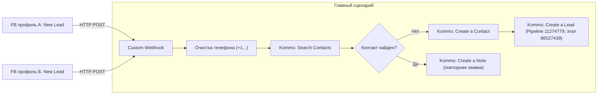

# Интеграция Facebook Lead Ads → Make.com → Kommo CRM

**Проект:** LicenseBridge USA
**Стек:** Make.com, Kommo (нативное приложение в Make), Facebook Lead Ads

Приём лидов с двух изолированных рекламных кабинетов Facebook (разные профили) в Kommo без долгой верификации собственного Meta App — используем готовое (уже проверенное Meta) приложение Make.

## Важное ограничение Make (определяет архитектуру)
В одном сценарии Make может быть **только один триггер**. Поэтому два профиля Facebook нельзя свести в один сценарий через роутер. Решение — паттерн «фидеры + общий сценарий».

## Архитектура (3 сценария)

- **Фидер А** и **Фидер Б** — два отдельных простых сценария, каждый со своим подключением Facebook (изоляция профилей сохраняется). Каждый ловит лид и шлёт его HTTP POST в главный сценарий.
- **Главный сценарий** — стартует с Custom Webhook, делает всю общую логику один раз (DRY). Добавить третий рекламный аккаунт = добавить ещё один фидер на тот же webhook, логику не трогаем.

> Альтернатива попроще, но с дублированием: сделать два полных одинаковых сценария (FB → очистка → поиск → создание). Быстрее собрать, но при правках придётся менять оба. Для масштабирования рекомендуется паттерн с фидерами.

## Реальные модули Make (для сборки)
- **Facebook Lead Ads** → триггер **Watch Leads / New Lead** (выбрать страницу и форму, либо Any form).
- **HTTP** → **Make a request** (в фидере) или модуль **Webhooks → Custom webhook** (в главном).
- **Kommo** (нативное приложение Make), доступные действия: `Search Contacts`, `Create a Contact`, `Create a Lead`, `Create a Note`, `Update a Lead`, `Make an API Call`.
- **Tools / Text parser** или встроенные функции (`replace`, regex) — для очистки телефона.

## Пошаговая сборка

### Фидеры (А и Б) — по одному на профиль
1. Новый сценарий → триггер **Facebook Lead Ads: Watch Leads**.
2. Создать Connection под нужным профилем (для второго — авторизация в инкогнито), выбрать страницу/форму.
3. Модуль **HTTP: Make a request** → POST на URL главного сценария (webhook), тело — поля лида (имя, телефон, email, form_id, ad_id, campaign) + метка `source` = `profile_A`/`profile_B`.
4. Расписание: `Immediately as data arrives`.

### Главный сценарий
1. Триггер **Webhooks: Custom webhook** (скопировать его URL в фидеры).
2. **Очистка телефона** до формата `+1XXXXXXXXXX` (убрать пробелы, скобки, дефисы) — критично для поиска дублей.
3. **Kommo: Search Contacts** по очищенному телефону/email.
4. **Router** на два пути:
   - **Контакт НЕ найден:** `Kommo: Create a Contact` (имя, телефон, email) → `Kommo: Create a Lead`:
     - Воронка `Pipeline` (`11274779`), этап `Первичный контакт` (`86527439`);
     - привязать созданный контакт;
     - поля источника: `Channel` (`143104`), `ttad_id` (`1408266`), UTM, `source`.
   - **Контакт НАЙДЕН (дубль/повтор):** найти активную сделку контакта:
     - есть активная → `Kommo: Create a Note` в эту сделку («повторная заявка FB: [форма]»);
     - активных нет → `Kommo: Create a Lead` с привязкой существующего контакта.

## Импорт blueprint
Готовый JSON-blueprint здесь намеренно не прикладываю: точные коды/версии модулей Make берутся только из самого аккаунта при экспорте, иначе импорт ломается. Правильный порядок, если захотим шаблон:
1. Собрать сценарий руками один раз по этой схеме.
2. `...` (внизу редактора) → **Export Blueprint** → получить валидный JSON.
3. Этот экспортированный JSON уже можно переиспользовать/импортировать в другие аккаунты (после импорта — заново привязать Connections и webhooks; они в blueprint не сохраняются).

## Тестирование
- Прогон через **Facebook Lead Ads Testing Tool** (тестовый лид с профиля А и с профиля Б).
- Проверить в Kommo: сделка на нужном этапе, заполнены источник/UTM, при повторной отправке того же номера дубль не создаётся.

## Подводные камни
- **Один триггер на сценарий** → паттерн фидеры + главный webhook (см. выше).
- **Лимит операций Make** (бесплатный тариф ~1000 оп/мес) → отключить/удалить старые ненужные сценарии; следить за расходом.
- **Дубли (боль клиента)** → обязательный шаг Search Contacts до создания.
- **Формат телефона** → нормализация до `+1...` перед поиском.
- **Безопасность** → токены/Connections хранить в Make, не в репозитории.
