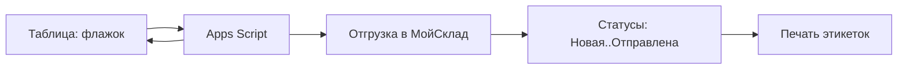

# Шпаргалка к созвону — RUSbrend × МойСклад

Держать перед глазами. Цель: показать, что система работает по «жизни короба», без слайдов — кликаем вживую.

---

## 0. Что приготовлено (факт на сейчас)

- Товаров в МойСклад: **385** (вся матрица), с фото — **301**.
- Склады: **Основной** + **Фулфилмент** (своё/клиентское).
- Организации: **ИП Ткачев** (RUSbrend) + **GripOn**. Контрагент-покупатель: **Ozon**.
- Остатки: **29 позиций в плюсе, 0 минусовых** (топ: 508, 486, 477, 465…). Старые тестовые отгрузки удалены.
- Демо-отгрузки: **10 шт**, по 2 в каждом статусе (Новая / В сборке / На проверке / Проверено / Отправлена) — живая воронка. Имена `DEMO-106`, `DEMO-103` и т.д.
- Штрихкоды: 48 уже залиты; остальные доливаются автоматически из PDF (показываем как «фишку», полный долив — после).

---

## 1. Чек-лист ПЕРЕД звонком (Максим, 10 мин)

- [ ] **Шаблоны печати.** МойСклад → любая отгрузка `DEMO-...` → **Печать** → проверить, что есть «Этикетка товара» и «Этикетка короба». Если нет — создать (ТЗ §3.5). Выбрать эталон с фото+ШК: **106**.
- [ ] **Смоук-тест золотого пути.** Открыть карточку **106** (фото, артикул, ШК, атрибуты), открыть «Отгрузки» (видно 10 со статусами), в таблице «Склад Белград / План работы» поставить тестовый флажок → убедиться, что отгрузка создаётся и ID пишется обратно. Тестовую отгрузку потом удалить.
- [ ] Открыть заранее вкладки: МойСклад (Товары, Отгрузки, Остатки) + Google-таблица. Войти в оба аккаунта.

---

## 2. Золотой сценарий (~12–15 мин)

1. **Завязка (30 сек).** «Сделали единый источник правды: товары, остатки, отгрузки, статусы, печать — без слома вашей таблицы».
2. **Номенклатура (2 мин).** Товары → открыть **106** → фото, артикул, ШК, атрибуты (Магазин, Тип короба, Кол-во в коробе). «375+ позиций залиты автоматически из вашей матрицы, с фото».
3. **Бренды и фулфилмент (1 мин).** Фильтр по бренду (RUSbrend / GripOn) + два склада. «Своё и клиентское не путается».
4. **Остатки (1 мин).** Остатки → Основной → положительные числа; переключить на Фулфилмент — отдельный учёт клиентского.
5. **Интеграция таблица → МойСклад (3 мин, вживую).** В «План работы» поставить флажок → через 5–10 сек в МойСклад появляется отгрузка, ID пишется обратно. «Серёжа не дублирует руками».
6. **Воронка статусов (2 мин).** Отгрузки → фильтр по статусам → Новая / В сборке / На проверке / Проверено / Отправлена. Акцент: **«разделили проверку — сборщик не закрывает короб сам, только Серёжа после проверки → меньше ошибок»**.
7. **Печать этикеток (2 мин).** Отгрузка → Печать → этикетка товара/короба.
8. **Надёжность (1 мин).** Лист `Errors` + Telegram-алерт при сбое интеграции.
9. **ШК из PDF (1 мин).** Показать товар с уже подтянутым EAN-13. «Остальные доливаются автоматически из ваших PDF на Google Drive — без ручного ввода».
10. **Финал (1 мин).** Регламенты для Серёжи и Димы — «команда работает по чек-листу».

---

## 3. Сильные фразы (по KPI клиента)

- «Один источник правды → не дублируете товар в двух местах».
- «Разделённая проверка (На проверке → Проверено) → человеческий фактор на сборке падает».
- «Товары и фото залиты автоматически из вашей же матрицы — система повторяема, а не ручная».
- «Своё и клиентское на разных складах → остатки не смешиваются».

---

## 4. Усиление (говорить «к месту», без обещаний сроков)

- **Вариант 2:** сканирование коробов перед отправкой — «всё ли уехало», авто-смена статуса (защита от потери паллеты: 1.5–10к ₽/инцидент).
- **Авто-простановка ШК Ozon** в каждую отгрузку (backlog, ТЗ §15).
- **KPI/мотивация** Серёжи и сборщиков на базе статусов и факта отгрузок.

---

## 5. Если спросят про «остальные ШК / приёмки»

Честно: «48 ШК уже в системе, остальные доливаются автоматически из ваших PDF — это фоновый процесс, к работе склада не критично. Боевую приёмку (Заказ поставщику → Приёмка) включим на тестовой неделе — тогда остатки станут на 100% по факту прихода».

---

## 6. После созвона (остаток работ по DoD)

- Долить оставшиеся ШК до 375 (меню «3. Синхронизировать ОТМЕЧЕННЫЕ» батчами по ~50 строк, столбец W).
- Боевая приёмка (Заказ поставщику → Приёмка) → корректные остатки.
- Финализировать шаблоны печати, проверить чтение сканером.
- Тестовая неделя в боевом режиме (ТЗ T15–T17).

---

*Инструменты подготовки демо: `scripts/demo_prep.py` (del-demands / enter-main / enter-fulfil / demands / report). Перезапуск безопасен — демо-документы помечены префиксами «Демо-приёмка» и «DEMO».*
