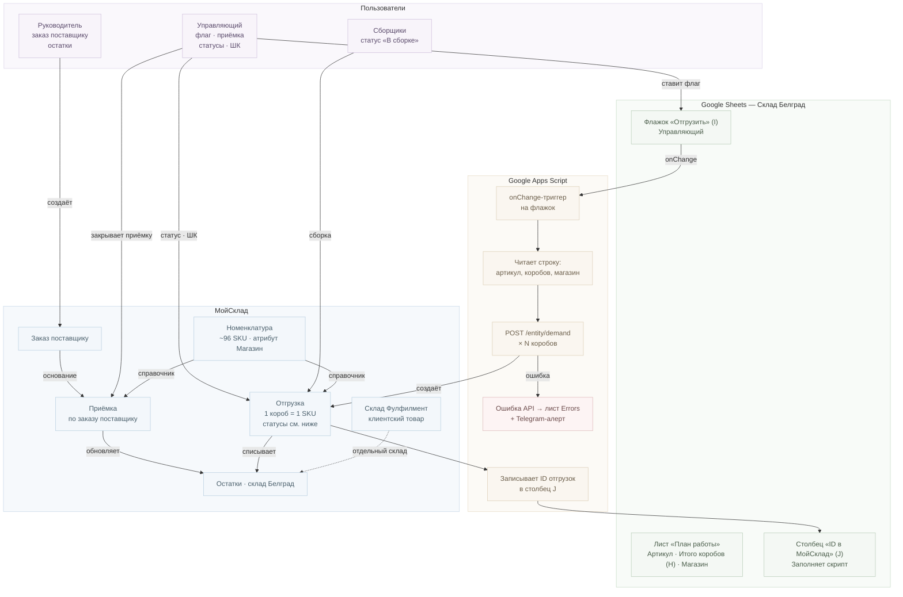
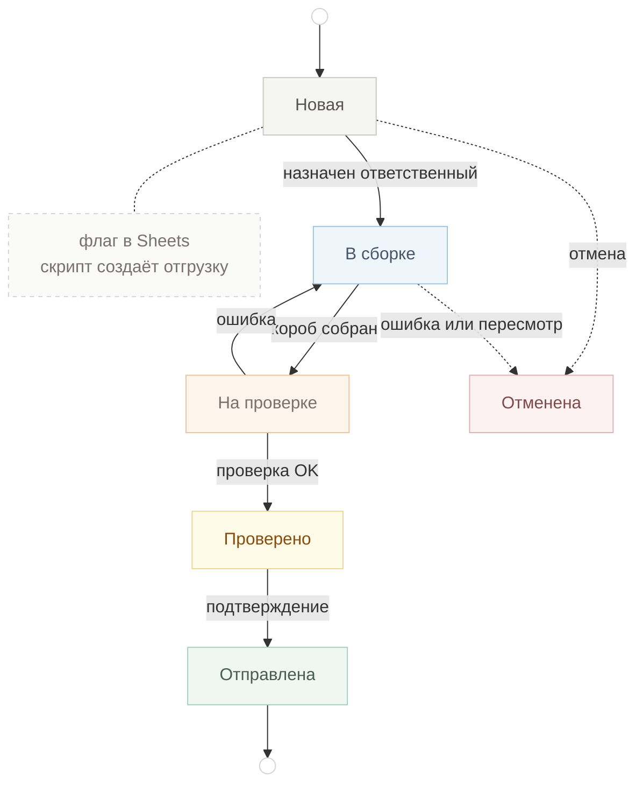
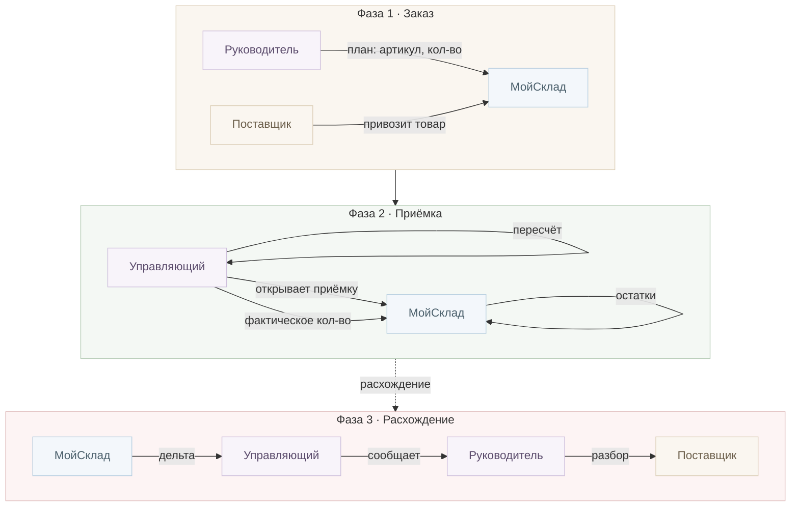

# Интеграционная карта — RUSbrend (Вариант 1)

**Клиент:** rusbrend
**Дата:** 2026-05-14
**Scope:** Google Sheets ↔ МойСклад через Google Apps Script

**Легенда цветов:** 🟢 Google Sheets · 🟠 Apps Script · 🔵 МойСклад · 🟣 Пользователи · 🔴 Ошибки / расхождения · 🟤 Заказ · 🌿 Приёмка

**Статусы отгрузки (как в МойСклад):** ⚪ Новая · 🔵 В сборке · 🟠 На проверке · 🟡 Проверено · 🟢 Отправлена · 🔴 Отменена

**Инструкция для Серёжи:** [`../05_Материалы/инструкция/Серёжа_МойСклад.html`](../05_Материалы/инструкция/Серёжа_МойСклад.html)

---

## Диаграмма: поток данных

---

## Диаграмма: жизненный цикл отгрузки

---

## Диаграмма: процесс приёмки

---

## Компоненты и роли

| Компонент | Роль в системе | Кто управляет |
|-----------|----------------|---------------|
| Google Sheets "Склад Белград" / "План работы" | Источник задач для создания отгрузок | Управляющий |
| Google Apps Script | Middleware: триггер + вызов МойСклад API | Максим (настройка) |
| МойСклад — Номенклатура | Справочник товаров, SKU, баркоды, атрибуты | Максим (импорт) / Руководитель (поддержка) |
| МойСклад — Отгрузка | Учёт отгрузок, задачи сборщикам, статусы | Управляющий |
| МойСклад — Приёмка | Учёт приёмки товара, остатки | Управляющий |
| МойСклад — Заказ поставщику | Плановая закупка | Руководитель |
| Склад "Белград" | Основной склад RUSbrend + Gripon | Управляющий |
| Склад "Фулфилмент" | Клиентский товар | Управляющий |
| Шаблоны печати | Этикетка на товар и на короб | Максим (настройка) |

**Цвета статусов отгрузки (МойСклад):**

| Статус | Цвет | Кто переводит |
|--------|------|---------------|
| Новая | серый | скрипт при создании |
| В сборке | синий | управляющий назначает ответственного |
| На проверке | оранжевый | сборщик завершил короб |
| Проверено | жёлтый | управляющий после проверки |
| Отправлена | зелёный | управляющий перед погрузкой |
| Отменена | красный | ручная отмена |

---

## За пределами интеграции (Вариант 1)

- Ozon ЛК — создание поставок на маркетплейс (остаётся как раньше)
- ЗП-таблица "Склад Белград" — KPI и расчёт зарплат сборщиков
- WB / Яндекс ЛК — пока не подключены
- Сканирование коробов перед отгрузкой — Вариант 2
- ШК короба для Ozon — берётся из Ozon ЛК; внутренняя этикетка МойСклад — основа для Варианта 2
