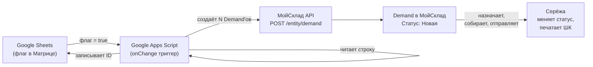

# Техническое задание — RUSbrend × МойСклад (Вариант 1)

**Клиент:** RUSbrend (Дима)
**Исполнитель:** Максим (интегратор)
**Версия:** 1.0
**Дата:** 2026-05-14
**Бюджет:** 70 000 ₽
**Инструменты:** МойСклад JSON API 1.2 · Google Apps Script · Google Sheets

---

## 1. Контекст и цель

**Бизнес-контекст:** склад "Белград", ~90 SKU, маркетплейсы (Ozon, WB, Яндекс). Два бренда (RUSbrend + Gripon) и фулфилмент для сторонних клиентов. Вся операционка — в Google Sheets, МойСклад отсутствует.

**Боль:** нет актуальных остатков; короба теряются перед отгрузкой (возврат паллеты = 1 500–10 000 ₽/инцидент); расхождения при приёмке не фиксируются; нет прозрачности статусов по сборке.

**Цель:** базовый контур учёта — остатки + отгрузки + приёмка — без ломки текущих процессов.

---

## 2. Фазы внедрения

### Фаза 1: Настройка МойСклад (сложность: Low–Medium, ~3–5 дней)

Регистрация аккаунта, справочники, склады, статусы, шаблоны печати.

**DoD фазы 1:**
- [ ] Аккаунт МойСклад создан, организация заполнена
- [ ] Два склада созданы: "Белград" и "Фулфилмент"
- [ ] ~90 позиций номенклатуры загружены с OZN-баркодами и атрибутом "Магазин"
- [ ] Статусы Demand настроены: Новая → В сборке → На проверке → Проверено → Отправлена → Отменена
- [ ] Шаблон печати ШК на товар и на короб работают

### Фаза 2: Интеграция Google Sheets → МойСклад (сложность: Medium, ~3–5 дней)

Google Apps Script читает флаг в Матрице и создаёт Demand'ы через API.

**DoD фазы 2:**
- [ ] Apps Script подключён к таблице, токен в Script Properties
- [ ] При постановке флажка создаётся нужное кол-во Demand'ов в МойСклад
- [ ] ID созданных Demand'ов записываются обратно в таблицу
- [ ] При ошибке API — запись в лист "Errors" без крэша скрипта
- [ ] Тест: 5 разных артикулов, разные кол-ва коробов — всё создаётся корректно

### Фаза 3: Приёмка (сложность: Low, ~1–2 дня)

Обучить Серёжу создавать PurchaseOrder + Supply.

**DoD фазы 3:**
- [ ] Серёжа умеет создавать Supply на основе PurchaseOrder
- [ ] Остатки обновляются корректно после приёмки
- [ ] Расхождение план/факт видно в интерфейсе МойСклад

### Фаза 4: Регламенты + тестовый прогон (сложность: Low, ~5–7 дней)

**DoD фазы 4:**
- [ ] Регламент для Серёжи написан и распечатан/отправлен
- [ ] 1 полная неделя работы склада через МойСклад
- [ ] Найденные баги исправлены, корнер-кейсы закрыты

---

## 3. Фаза 1: Настройка МойСклад — пошагово

### 3.1 Регистрация и базовые настройки

1. Зайти на [moysklad.ru](https://www.moysklad.ru), зарегистрировать аккаунт на Диму (ИП)
2. Настройки → Организации → заполнить реквизиты ИП (наименование, ИНН, телефон)
3. Настройки → Склады → создать два склада:
   - **Название:** `Белград` | Тип: `Склад` | Адрес: (адрес склада)
   - **Название:** `Фулфилмент` | Тип: `Склад` | Описание: `Клиентский товар`
4. Настройки → Пользователи → пригласить Серёжу (роль: `Сотрудник склада`) и Максима (роль: `Администратор`)

### 3.2 Кастомный атрибут номенклатуры

1. Справочники → Настройки номенклатуры → Доп. поля → Добавить поле:
   - **Название:** `Магазин`
   - **Тип:** `Список` (строка из списка)
   - **Значения:** `РУСбренд`, `Гриппон`, `Фулфилмент-клиент`

2. Добавить второй атрибут:
   - **Название:** `Тип_короба`
   - **Тип:** `Список`
   - **Значения:** `S`, `M`, `L`

### 3.3 Импорт номенклатуры

**Способ:** импорт через CSV (Справочники → Товары → Загрузить).

Подготовить CSV-файл из Матрицы со следующими столбцами:

| Столбец в CSV | Источник в Матрице | Поле в МойСклад |
|---|---|---|
| `Наименование` | Наименование (колонка D) | name |
| `Артикул` | Артикул (колонка C) | article |
| `Штрихкод` | ШК Ozon (колонка F, `OZN...`) | barcode |
| `Вес` | Вес г факт (колонка P), разделить на 1000 | weight (кг) |
| `Магазин` | Магазин (колонка A): РУСбренд / Гриппон | доп. поле |
| `Тип_короба` | Часто используемый короб (колонка K) | доп. поле |
| `Кол-во_в_коробе` | Количество в выбранном коробе (колонка L) | доп. поле (число) |
| `Кол-во_в_комплекте` | Количество в пакете (колонка M) | доп. поле (число) |
| `Описание` | Комментарий (колонка O) — инструкция сборщику | description |

> **Готовый файл:** `номенклатура_import.csv` уже сформирован в папке клиента (96 строк). Открыть → проверить 5 строк → использовать напрямую.

> **Важно:** строки с Магазин = "Новый" в матрице — это новые SKU без ШК; в CSV они уже приведены к "РУСбренд". Баркод для них пустой — добавить вручную после получения OZN-кода.

**Шаги импорта:**
1. Взять готовый файл `номенклатура_import.csv` из папки клиента
2. МойСклад → Справочники → Товары → кнопка "Загрузить из файла"
3. Сопоставить столбцы CSV с полями МойСклад
4. Проверить 5-10 случайных позиций после импорта (баркод, вес, атрибуты)

### 3.4 Настройка статусов Demand (Отгрузка)

1. Настройки → Типы статусов → Отгрузки → Добавить:

| Название | Цвет | Смысл |
|----------|------|-------|
| `Новая` | Серый | Создана из Sheets, не назначена |
| `В сборке` | Синий | Серёжа назначил ответственного |
| `На проверке` | Оранжевый | Сборщик собрал короб, ждёт проверки Серёжей |
| `Проверено` | Жёлтый | Серёжа проверил содержимое короба |
| `Отправлена` | Зелёный | Уехала с курьером |
| `Отменена` | Красный | Отменена (флаг снят или ошибка) |

> **Зачем разделили "Готова":** сборщик сам не может перевести короб в финальный статус — это делает только Серёжа после визуальной проверки. Снижает ошибки при упаковке.

### 3.5 Настройка шаблонов печати

МойСклад поддерживает шаблоны в формате .xls/.docx или встроенный редактор.

**Шаблон "Этикетка товар"** — для печати на товар перед упаковкой:
- Штрихкод (баркод из поля номенклатуры)
- Артикул
- Наименование (первые 30 символов)
- Размер: 58×40 мм (стандартная термоэтикетка)

**Шаблон "Этикетка короб"** — для печати на короб перед отгрузкой:
- Артикул
- Наименование (кратко)
- Кол-во в коробе
- Магазин (РУСбренд / Гриппон)
- Дата отгрузки
- Штрихкод Demand (внутренний ID — для будущего сканирования)
- Размер: 100×150 мм (А6)

**Как создать шаблон:**
1. МойСклад → Отгрузки → любая отгрузка → Печать → Управление шаблонами → Создать
2. Использовать переменные МойСклад: `{{demand.positions[0].assortment.article}}` и т.д.
3. Протестировать на тестовом Demand

---

## 4. Фаза 2: Google Apps Script — пошаговая реализация

### 4.1 Подготовка таблицы

В таблице **"Склад Белград"**, лист **"План работы"**:

1. Найти столбец **H "Итого коробов"** → правее него добавить два новых столбца:
   - **Столбец I:** `Отгрузить` — тип: Флажок (Вставка → Флажок)
   - **Столбец J:** `ID в МойСклад` — тип: текст (заполняется скриптом автоматически)
2. Добавить отдельный лист с именем **"Errors"** — для логов ошибок скрипта

> **Флаг ставит Серёжа** (не Дима) — после того как расписал задание сборщикам и готов зафиксировать отгрузку в МойСклад. В ближайшем будущем эта роль будет передана полностью Серёже.

### 4.2 Создание Apps Script

1. В таблице **"Склад Белград"**: Расширения → Apps Script → Новый проект → назвать `RUSbrend_MoySklad`
2. Вставить код (см. §4.3)
3. Сохранить → Запустить `setup` для первичной авторизации → дать разрешения

### 4.3 Код Google Apps Script

> **АКТУАЛЬНЫЙ КОД — в файле [`../../../../../08_Системное/_код/bereza-gas/RUSbrend_Отгрузки.gs`](../../../../../08_Системное/_код/bereza-gas/RUSbrend_Отгрузки.gs) (v2.0).**
> Он включает организацию/контрагента, обязательный «Тип короба», ретраи и доп-поля
> **«Наименование»** и **«Комплектов»** (для удобного списка отгрузок). Вставлять в Apps Script нужно его.
> Блок ниже — исходный v1.0, оставлен как история; **не использовать**.

```javascript
// ============================================================
// RUSbrend × МойСклад — интеграция Google Sheets → Demand
// Версия 1.0 | 2026-05-14  (УСТАРЕЛО — см. gas/RUSbrend_Отгрузки.gs)
// ============================================================

const MS_BASE_URL = 'https://api.moysklad.ru/api/remap/1.2';

// Имя листа в таблице "Склад Белград"
const SHEET_NAME = 'План работы';

// Индексы колонок в листе "План работы" (0-based, A=0, B=1, ...)
// ⚠️ УТОЧНИТЬ при первом открытии листа — указаны ориентировочные позиции
const COL = {
  ARTICLE:       0,   // Колонка A — Артикул (уточнить!)
  NAME:          1,   // Колонка B — Наименование (уточнить!)
  SHOP:          2,   // Колонка C — Магазин / Бренд (уточнить!)
  BOXES_TO_SHIP: 7,   // Колонка H — Итого коробов (подтверждено)
  FLAG:          8,   // Колонка I — Отгрузить (флажок, НОВЫЙ)
  MS_IDS:        9,   // Колонка J — ID в МойСклад (НОВЫЙ, заполняет скрипт)
};
// Кол-во штук в коробе берётся из атрибута номенклатуры в МойСклад,
// а не из листа — чтобы не дублировать данные.

// ============================================================
// SETUP: запустить один раз для настройки триггера
// ============================================================
function setup() {
  const ss = SpreadsheetApp.getActiveSpreadsheet();
  
  // Удалить старые триггеры (если были)
  ScriptApp.getProjectTriggers().forEach(t => ScriptApp.deleteTrigger(t));
  
  // Создать триггер onChange
  ScriptApp.newTrigger('onFlagChange')
    .forSpreadsheet(ss)
    .onChange()
    .create();
  
  Logger.log('Триггер установлен. Проверь Script Properties: MS_TOKEN и MS_STORE_ID.');
}

// ============================================================
// ОБЯЗАТЕЛЬНО: заполнить в Script Properties:
//   MS_TOKEN     — Bearer токен МойСклад (Настройки → Доступ → Токен)
//   MS_STORE_ID  — href склада "Белград" (получить через API /entity/store)
// ============================================================
function getToken() {
  return PropertiesService.getScriptProperties().getProperty('MS_TOKEN');
}

function getStoreHref() {
  return PropertiesService.getScriptProperties().getProperty('MS_STORE_HREF');
}

// ============================================================
// ОСНОВНОЙ ОБРАБОТЧИК — срабатывает при любом изменении
// ============================================================
function onFlagChange(e) {
  const ss = SpreadsheetApp.getActiveSpreadsheet();
  const sheet = ss.getSheetByName(SHEET_NAME);
  if (!sheet) return;

  const range = e.range;
  const row = range.getRow();
  const col = range.getColumn() - 1; // 0-based

  // Реагируем только на флажок (COL.FLAG)
  if (col !== COL.FLAG) return;
  
  const flagValue = sheet.getRange(row, COL.FLAG + 1).getValue();
  if (flagValue !== true) return; // флажок снят — не обрабатываем

  // Уже есть ID — не дублировать
  const existingIds = sheet.getRange(row, COL.MS_IDS + 1).getValue();
  if (existingIds && existingIds.toString().trim() !== '') {
    logError(ss, row, 'Флаг поставлен повторно. ID уже есть: ' + existingIds);
    return;
  }

  processRow(ss, sheet, row);
}

// ============================================================
// ОБРАБОТКА СТРОКИ
// ============================================================
function processRow(ss, sheet, row) {
  const data = sheet.getRange(row, 1, 1, COL.MS_IDS + 1).getValues()[0];

  const article  = data[COL.ARTICLE]  ? data[COL.ARTICLE].toString().trim()  : '';
  const name     = data[COL.NAME]     ? data[COL.NAME].toString().trim()     : '';
  const shop     = data[COL.SHOP]     ? data[COL.SHOP].toString().trim()     : '';
  const numBoxes = parseInt(data[COL.BOXES_TO_SHIP]) || 1;

  if (!article || !name) {
    logError(ss, row, 'Пустой артикул или наименование — пропускаем.');
    return;
  }

  // Найти товар в МойСклад по артикулу → получить href и кол-во в коробе из атрибутов
  const product = findProductByArticle(article);
  if (!product) {
    logError(ss, row, 'Товар не найден в МойСклад по артикулу: ' + article);
    return;
  }

  // Создать N Demand'ов (по кол-ву коробов); записывать ID сразу после каждого создания
  const createdIds = [];
  for (let i = 0; i < numBoxes; i++) {
    const demandId = createDemand({
      name:        `${article} — ${name} (короб ${i + 1}/${numBoxes})`,
      productHref: product.href,
      quantity:    product.boxQty || 1,
      shopLabel:   shop,
    });
    if (demandId) {
      createdIds.push(demandId);
      // Записываем сразу — защита от сбоя на середине
      sheet.getRange(row, COL.MS_IDS + 1).setValue(createdIds.join(', '));
    } else {
      logError(ss, row, `Ошибка создания отгрузки ${i + 1}/${numBoxes} для артикула ${article}`);
    }
    Utilities.sleep(250); // Пауза 250 мс — защита от превышения лимитов API МойСклад
  }
}

// ============================================================
// НАЙТИ ТОВАР ПО АРТИКУЛУ
// ============================================================
// Возвращает { href, boxQty } или null
function findProductByArticle(article) {
  const token = getToken();
  const url = `${MS_BASE_URL}/entity/product?filter=article=${encodeURIComponent(article)}`;
  
  const resp = UrlFetchApp.fetch(url, {
    method: 'GET',
    headers: { 'Authorization': 'Bearer ' + token },
    muteHttpExceptions: true,
  });

  if (resp.getResponseCode() !== 200) return null;
  
  const body = JSON.parse(resp.getContentText());
  if (!body.rows || body.rows.length === 0) return null;

  const product = body.rows[0];
  // Ищем атрибут "Кол-во_в_коробе" среди доп. полей товара
  let boxQty = 1;
  if (product.attributes) {
    const attr = product.attributes.find(a => a.name === 'Кол-во_в_коробе');
    if (attr && attr.value) boxQty = parseInt(attr.value) || 1;
  }

  return { href: product.meta.href, boxQty };
}

// ============================================================
// СОЗДАТЬ DEMAND (ОТГРУЗКУ)
// ============================================================
function createDemand({ name, productHref, quantity, shopLabel }) {
  const token     = getToken();
  const storeHref = getStoreHref();

  const payload = {
    name: name,
    moment: new Date().toISOString(),
    store: { meta: { href: storeHref, type: 'store', mediaType: 'application/json' } },
    positions: [
      {
        quantity: quantity,
        assortment: {
          meta: {
            href: productHref,
            type: 'product',
            mediaType: 'application/json',
          }
        }
      }
    ],
    // Кастомный атрибут Магазин — заполнить href атрибута после создания (см. §4.4)
    // attributes: [{ meta: { href: '...' }, value: shopLabel }]
  };

  const resp = UrlFetchApp.fetch(`${MS_BASE_URL}/entity/demand`, {
    method: 'POST',
    headers: {
      'Authorization':  'Bearer ' + token,
      'Content-Type':   'application/json',
    },
    payload: JSON.stringify(payload),
    muteHttpExceptions: true,
  });

  const code = resp.getResponseCode();
  if (code === 200 || code === 201) {
    const body = JSON.parse(resp.getContentText());
    return body.id;
  }

  Logger.log('Ошибка createDemand: ' + resp.getResponseCode() + ' — ' + resp.getContentText());
  return null;
}

// ============================================================
// ЛОГИРОВАНИЕ ОШИБОК + TELEGRAM-АЛЕРТ
// ============================================================
function logError(ss, row, message) {
  const errSheet = ss.getSheetByName('Errors') || ss.insertSheet('Errors');
  errSheet.appendRow([new Date(), row, message]);
  Logger.log(`Строка ${row}: ${message}`);
  sendTelegramAlert(`⚠️ RUSbrend скрипт\nСтрока ${row}: ${message}`);
}

// Отправить сообщение в Telegram.
// Script Properties: TG_BOT_TOKEN, TG_CHAT_ID (chat_id Максима или группы)
function sendTelegramAlert(text) {
  const token  = PropertiesService.getScriptProperties().getProperty('TG_BOT_TOKEN');
  const chatId = PropertiesService.getScriptProperties().getProperty('TG_CHAT_ID');
  if (!token || !chatId) return; // если не настроено — молча пропускаем
  try {
    UrlFetchApp.fetch(`https://api.telegram.org/bot${token}/sendMessage`, {
      method: 'POST',
      contentType: 'application/json',
      payload: JSON.stringify({ chat_id: chatId, text: text }),
      muteHttpExceptions: true,
    });
  } catch (e) {
    Logger.log('Telegram alert failed: ' + e.message);
  }
}

// ============================================================
// УТИЛИТА: получить href склада "Белград" (запустить вручную один раз)
// ============================================================
function printStoreHrefs() {
  const token = getToken();
  const resp = UrlFetchApp.fetch(`${MS_BASE_URL}/entity/store`, {
    headers: { 'Authorization': 'Bearer ' + token },
  });
  Logger.log(resp.getContentText());
  // Скопировать href нужного склада → Script Properties → MS_STORE_HREF
}
```

### 4.4 Настройка API-токена и констант

**Шаг 1: Получить API-токен МойСклад**
1. МойСклад → Настройки (шестерёнка) → Доступ к API → Создать токен
2. Скопировать токен (показывается один раз)

**Шаг 2: Записать в Script Properties**
1. Apps Script → Проект → Настройки проекта → Свойства скрипта → Добавить:
   - Ключ: `MS_TOKEN` | Значение: `<токен из шага 1>`
   - Ключ: `MS_STORE_HREF` | Значение: получить функцией `printStoreHrefs()` — запустить вручную, скопировать href склада "Белград" из логов
   - Ключ: `TG_BOT_TOKEN` | Значение: токен бота (создать через @BotFather в Telegram)
   - Ключ: `TG_CHAT_ID` | Значение: chat_id Максима (узнать через `api.telegram.org/bot{TOKEN}/getUpdates` после того как написать боту `/start`)

**Шаг 3: Добавить атрибут "Магазин" в Demand (после создания атрибутов в МойСклад)**
1. Получить href атрибута через API:
   ```
   GET https://api.moysklad.ru/api/remap/1.2/entity/demand/metadata/attributes
   Authorization: Bearer <TOKEN>
   ```
2. Найти атрибут с именем `Магазин` → скопировать его `href`
3. В функции `createDemand` раскомментировать блок `attributes` и вставить `href`

### 4.5 Структура столбцов (итог)

Таблица **"Склад Белград"**, лист **"План работы"** — добавить **два новых столбца** сразу после столбца H:

| Столбец | Название | Тип | Заполняет |
|---------|----------|-----|-----------|
| H | `Итого коробов` | Число | Серёжа (уже существует) |
| I | `Отгрузить` | Флажок (чекбокс) | Серёжа (ставит когда готов запустить сборку в МойСклад) |
| J | `ID в МойСклад` | Текст | Скрипт (автоматически, не трогать руками) |

> **Важно:** кол-во коробов берётся из столбца H (уже заполняется Серёжей). Кол-во штук в коробе — из атрибутов номенклатуры МойСклад (не нужно дублировать в Sheets).

> **Роль:** флаг ставит **Серёжа**. В ближайшем будущем вся работа с системой на стороне склада будет полностью на нём.

---

## 5. Сущности и поля МойСклад

### 5.1 Номенклатура (Product)

| Поле | Значение | Источник |
|------|----------|----------|
| `name` | Наименование | Матрица колонка D |
| `article` | Артикул (103, 104, A501...) | Матрица колонка C |
| `barcode[0]` | OZN-код (`OZN2062192717`) | Матрица колонка F |
| `weight` | Вес в кг (Вес г факт ÷ 1000) | Матрица колонка P |
| `attributes[Магазин]` | РУСбренд / Гриппон | Матрица колонка A |
| `attributes[Тип_короба]` | S / M / L | Матрица колонка K |
| `attributes[Кол-во_в_коробе]` | Число | Матрица колонка L |

### 5.2 Отгрузка / Demand

| Поле | Значение | Источник |
|------|----------|----------|
| `name` (номер) | Присваивается **автоматически по порядку** (00001, 00002, …) | МойСклад (скрипт его НЕ задаёт) |
| `organization` | ИП Ткачев (RUSbrend) / GripOn | Скрипт (по бренду из листа) |
| `agent` | Ozon | Скрипт |
| `store` | href склада "Основной" | Скрипт |
| `state` | `Новая` | Скрипт (при создании) |
| `positions[0].assortment` | href товара в МС | Поиск по артикулу |
| `positions[0].quantity` | Кол-во штук в коробе | Атрибут `Количество в выбранном коробе` номенклатуры |
| `attributes[Тип короба]` | S / M / L (обязательный) | Атрибут `Часто используемый короб` товара (по умолч. S) |
| `attributes[Наименование]` | `{Артикул} — {Наименование}` (+ « (короб N/M)» при нескольких коробах) | Скрипт — для удобной навигации в списке отгрузок |
| `attributes[Комплектов]` | Кол-во комплектов в коробе (= `positions[0].quantity`) | Атрибут `Количество в выбранном коробе` товара |

> **Номер отгрузки** не задаётся вручную — его ведёт сама МойСклад сквозной нумерацией.
> **Доп-поля «Наименование» (артикул + имя) и «Комплектов»** выведены отдельными колонками, чтобы в списке всех отгрузок было видно товар и количество комплектов без открытия документа. Логика — в `gas/RUSbrend_Отгрузки.gs` (функция `createDemand_`).

### 5.3 Приёмка / Supply

| Поле | Значение | Кто заполняет |
|------|----------|---------------|
| `name` | Авто (дата) или ручное | Серёжа |
| `purchaseOrder` | href соответствующего PurchaseOrder | Серёжа (выбирает) |
| `store` | склад "Белград" | Серёжа |
| `positions[N].assortment` | товар | Серёжа (из заказа) |
| `positions[N].quantity` | Факт кол-во | Серёжа (вносит) |

### 5.4 Заказ поставщику / PurchaseOrder

| Поле | Значение | Кто заполняет |
|------|----------|---------------|
| `agent` | Контрагент-поставщик | Дима |
| `positions[N].assortment` | Товар | Дима |
| `positions[N].quantity` | Плановое кол-во | Дима |

### 5.5 Контрагенты (Supplier / Agent)

Создаются вручную в МойСклад → Справочники → Контрагенты.

| Контрагент | Тип | Кол-во | Правило идентификации |
|------------|-----|--------|-----------------------|
| Поставщики (3–5) | Поставщик | 3–5 | Создать по имени; ИНН вносить при наличии |
| Фулфилмент-клиент (Глеб / другие) | Покупатель | 1+ | Отдельный контрагент на каждого клиента |

**Правило матчинга:**
- Поставщик в МойСклад идентифицируется по **названию** (вручную, не автоматически)
- Для PurchaseOrder Дима выбирает поставщика из списка контрагентов вручную
- Дублирование контрагентов исключается ручной проверкой перед созданием (поиск по названию)

---

## 6. Интеграционная схема (повтор из карты)



---

## 7. События, API, надёжность

- **Входящие события:** onChange в Google Sheets (флаг = true)
- **Исходящие вызовы:** `GET /entity/product?filter=article=...` + `POST /entity/demand`
- **Аутентификация:** Bearer токен → хранится в Script Properties (не в коде)
- **Лимиты МойСклад API:** 45 запросов/сек; для нас нагрузка минимальная (< 5 запросов на строку)
- **Идемпотентность:** проверка наличия ID в столбце V перед созданием (повторный флаг игнорируется)
- **Ретраи:** при ошибке API — запись в лист "Errors" + снятие флага (ручной повтор)
- **Dead letter:** лист "Errors" с датой, номером строки, сообщением ошибки

---

## 8. Edge cases и ошибки

| Сценарий | Ожидаемое поведение | Кто уведомляется |
|----------|---------------------|------------------|
| Товар не найден в МС по артикулу | Запись в лист "Errors", флаг не снимается | Макс (видит ошибку) |
| Поставлен флаг на строку без артикула | Запись в "Errors", выход | Макс |
| МойСклад вернул 5xx | Запись в "Errors", флаг не снимается → ручной повтор | Макс |
| Флаг поставлен повторно (ID уже есть) | Игнорирование + запись в "Errors" | Макс |
| Кол-во коробов не указано | Создаётся 1 Demand | Поведение по умолчанию |
| Новый артикул (не загружен в МС) | Ошибка "Товар не найден" | Макс → добавить номенклатуру вручную |
| Фулфилмент-клиент в строке | Создаётся Demand с атрибутом `Магазин=Фулфилмент-клиент` | — |
| Сборщик закрыл неправильный Demand | Серёжа вручную меняет статус обратно | Серёжа |

---

## 9. Регламент для Серёжи (склад)

> Распечатай и повесь на складе. Версия 1.0.

### 9.1 Приёмка товара

1. Откройте МойСклад → **Закупки → Приёмки**
2. Найдите приёмку с именем сегодняшней даты (или создайте новую на основе Заказа поставщику)
3. Пересчитайте товар → впишите **факт кол-во** в строку каждого артикула
4. Если факт ≠ план — **не меняйте** плановое кол-во, просто впишите факт (система покажет расхождение)
5. Сохраните и **проведите** приёмку → остатки обновятся автоматически
6. При расхождении — сообщите Диме (фото/сообщение в Telegram)

### 9.2 Запустить отгрузки в МойСклад (перед выдачей заданий)

1. Открыть таблицу **"Склад Белград"** → лист **"План работы"**
2. Убедиться, что в столбце **H "Итого коробов"** стоит правильное число
3. Поставить **флажок в столбце I "Отгрузить"** — через 5–10 секунд в столбце J появятся ID отгрузок
4. Если ID не появился — проверить лист "Errors" или Telegram-уведомление

### 9.3 Сборка (ежедневно)

1. Откройте МойСклад → **Продажи → Отгрузки** → фильтр по статусу "Новая"
2. Распределите задачи: откройте отгрузку → поле "Ответственный" → выберите сборщика → сохраните → поменяйте статус на "В сборке"
3. Для **печати ШК на товар:** откройте отгрузку → Печать → шаблон "Этикетка товар" → укажите кол-во копий
4. Для **печати ШК на короб (внутренняя):** откройте отгрузку → Печать → шаблон "Этикетка короб" → 1 копия
5. Приклейте внутреннюю этикетку на короб. Этикетку Ozon (для маркетплейса) печатаете как раньше из ЛК Ozon

### 9.4 Проверка и закрытие коробов

1. Сборщик завершил короб → переводит (или говорит Серёже) → статус "На проверке"
2. Серёжа открывает список с фильтром "На проверке" → визуально проверяет короб
3. Всё верно → меняет статус на "Проверено" → закрывает скотчем
4. Если ошибка — возвращает в "В сборке" с комментарием

### 9.5 Отгрузка

1. Перед погрузкой — убедитесь, что все отгрузки этой поставки в статусе "Проверено"
2. Погрузите коробы → в МойСклад переведите каждую отгрузку в статус "Отправлена"
3. При отгрузке с отсутствующим коробом — **не грузите** до выяснения

### 9.6 Фулфилмент (клиентский товар)

- Приёмка клиентского товара → выбирайте склад **"Фулфилмент"** при создании приёмки
- Отгрузки клиентского товара → атрибут Магазин = "Фулфилмент-клиент"

---

## 10. Регламент для Димы

> Короткая инструкция — как работать с системой со стороны владельца. Версия 1.0.

### 10.1 Создать заказ поставщику (перед закупкой)

1. МойСклад → **Закупки → Заказы поставщикам** → кнопка "Создать"
2. Выбрать поставщика из списка контрагентов
3. Добавить позиции: "Добавить товар" → ввести артикул или название → выбрать → указать кол-во
4. Сохранить (не нужно проводить — Серёжа закроет через приёмку по факту)
5. Сообщить Серёже, что поставка ожидается

### 10.2 Проверить актуальные остатки

МойСклад → **Остатки** → фильтр по складу "Белград" → при необходимости фильтровать по атрибуту "Магазин" (РУСбренд / Гриппон).

### 10.3 Что делать при ошибке скрипта

1. Если пришёл Telegram-алерт — открыть лист "Errors" в "Склад Белград", прочитать сообщение
2. **"Товар не найден в МойСклад"** → артикул не загружен; добавить номенклатуру вручную в МойСклад → сообщить Серёже → снять флаг в строке → поставить снова
3. **Любая другая ошибка API** → написать Максиму

### 10.4 Добавить новый артикул (новый SKU)

1. МойСклад → Справочники → Товары → Создать
2. Заполнить: Наименование, Артикул, Штрихкод (OZN-код), Вес, Описание (инструкция сборщику), атрибуты Магазин / Тип_короба / Кол-во_в_коробе
3. Сообщить Серёже — он может добавлять в "План работы" этот артикул

> **Флаги в таблице ставит Серёжа.** В ближайшем будущем он будет полностью самостоятельно вести операционный цикл в МойСклад. Твоя роль — стратегическое управление через остатки и заказы поставщикам.

---

## 11. Тест-план

Выполнить **перед** переводом склада в боевой режим. Все тест-кейсы — на тестовых данных (не на реальных остатках).

### 11.1 Настройка МойСклад

| # | Тест | Ожидаемый результат | Статус |
|---|------|---------------------|--------|
| T1 | Открыть МойСклад → Справочники → Товары → найти артикул `104` | Строка с наименованием, баркодом `OZN2062276159`, описанием, атрибутами | ☐ |
| T2 | Открыть номенклатуру `104` → проверить поле "Описание" | Текст: "Проверяйте хотя бы одну из короба..." | ☐ |
| T3 | Остатки → склад "Белград" | Список товаров, остатки = 0 (ещё не было приёмки) | ☐ |
| T4 | Отгрузки → Статусы | Все 6 статусов: Новая / В сборке / На проверке / Проверено / Отправлена / Отменена | ☐ |
| T5 | Печать → шаблон "Этикетка товар" на любой позиции | Распечатывается этикетка с баркодом, артикулом, наименованием | ☐ |
| T6 | Печать → шаблон "Этикетка короб" | Распечатывается с артикулом, кол-вом, магазином, датой | ☐ |

### 11.2 Google Apps Script

| # | Тест | Ожидаемый результат | Статус |
|---|------|---------------------|--------|
| T7 | В листе "План работы" / "Склад Белград" — тестовая строка (артикул `103`, H=2) → Серёжа ставит флаг в I | В МойСклад появляются 2 отгрузки "103 — Пистолет... (короб 1/2)" и "...2/2"; в столбце J — их ID | ☐ |
| T8 | В той же строке снять флаг → поставить снова | В столбце "Errors" запись "Флаг поставлен повторно. ID уже есть: ..." | ☐ |
| T9 | Поставить флаг на строку с несуществующим артикулом (например `999`) | Запись в лист "Errors" + Telegram-алерт "Товар не найден" | ☐ |
| T10 | Поставить флаг на строку без заполненного "Кол-во коробов" | Создаётся 1 Demand (поведение по умолчанию) | ☐ |
| T11 | Demand в МойСклад → открыть → проверить позицию | Товар правильный, кол-во = значение из Матрицы "Кол-во_в_коробе" | ☐ |

### 11.3 Приёмка

| # | Тест | Ожидаемый результат | Статус |
|---|------|---------------------|--------|
| T12 | Создать PurchaseOrder (арт. `103`, кол-во 100) → создать Supply на его основании → ввести факт 95 | Остатки "Белград" = 95 для арт. `103`; расхождение видно в документе | ☐ |
| T13 | Создать Supply → провести → проверить остатки | Остатки обновились корректно | ☐ |
| T14 | Проверить фильтрацию остатков по атрибуту "Магазин" = "РУСбренд" | Видны только позиции РУСбренд | ☐ |

### 11.4 Полный цикл (боевой прогон)

| # | Тест | Ожидаемый результат | Статус |
|---|------|---------------------|--------|
| T15 | Приёмка 1 реальной поставки (3–5 артикулов) через Supply | Остатки зафиксированы, расхождения при наличии задокументированы | ☐ |
| T16 | Серёжа ставит флаги для 3 артикулов → назначает ответственных → меняет статусы (В сборке → На проверке → Проверено → Отправлена) | Цикл проходит без ошибок, все 6 статусов работают | ☐ |
| T17 | Серёжа печатает этикетки короба из МойСклад | Этикетки читаются сканером | ☐ |

---

## 12. DoD — критерии приёмки всего проекта

- [ ] Все статусы и триггеры согласованы с Димой и Серёжей
- [ ] Номенклатура загружена, баркоды проверены (выборочно 10 позиций)
- [ ] Флаг в Матрице создаёт корректный Demand: проверено на 5 артикулах (тест-кейсы T7–T11)
- [ ] Приёмка через Supply обновляет остатки: проверено (тест-кейсы T12–T14)
- [ ] Шаблоны печати распечатаны и читаются сканером (T5–T6, T17)
- [ ] Telegram-алерт при ошибке работает (T9)
- [ ] Регламент выдан Серёже и Диме; они могут выполнить все шаги самостоятельно
- [ ] Лист "Errors" настроен и работает при намеренной ошибке
- [ ] Тестовый прогон 1 неделя: нет критических инцидентов (T15–T17)

---

## 13. Открытые вопросы

1. Какие поставщики заводить в МойСклад сейчас — все 5 или только активные 3?
2. Точные индексы столбцов в листе "План работы" — уточнить при первом открытии и обновить `COL` в скрипте.

---

## 14. Приложения

- **Готовый CSV для импорта:** `номенклатура_import.csv` (96 позиций, в папке клиента)
- **МойСклад JSON API 1.2:** https://dev.moysklad.ru/doc/api/remap/1.2/
- **Лимиты API:** https://dev.moysklad.ru/doc/api/remap/1.2/#mojsklad-json-api-obschie-swedeniq-ogranicheniq
- **Google Apps Script триггеры:** https://developers.google.com/apps-script/guides/triggers
- **Матрица (База)** — исходный файл: `Матрица RUSbrend - База.csv`
- **Plan/Fact ЗП** — исходный файл: `Склад Белград - План_факт, ЗП.csv`

---

## 15. Будущие возможные доработки (вне Варианта 1)

Не входят в текущий договор и фиксируются как направление для последующей оценки.

1. **ШК Ozon на уровне отгрузки.** Сделать связку таблицы «Склад Белград» / план работ и МойСклад, чтобы оперативно проставлять **штрихкод Ozon** в каждой отгрузке (`Demand`): например отдельный столбец в строке плана или импорт из экспорта Ozon → Apps Script вызывает API МойСклад и записывает значение в доп. поле отгрузки (или в согласованное поле позиции). Цель — убрать ручное копирование ШК из личного кабинета в каждую созданную отгрузку при высоком объёме коробов. Точная схема данных и момент в процессе FBO согласуются отдельно.
