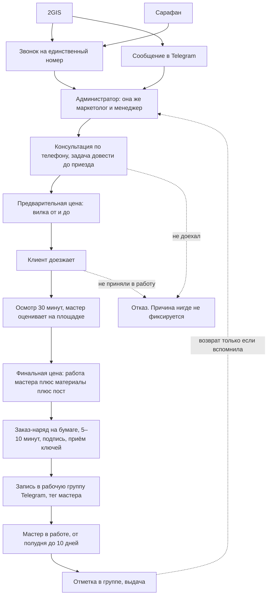

# AS-IS — как есть сейчас

**Клиент:** `divo-detailing`
**Дата:** 2026-09-18
**Источник:** созвон 18.09.2026, 53 минуты ([транскрипт](../04_Встречи/2026-09-18_созвон_детейлинг_транскрипт.md))

> Всё ниже — со слов администратора. Где данных нет, стоит пометка «не выяснено». Не додумывать при переходе к TO-BE.

---

## 1. Описание текущего процесса

### 1.1. Основной поток: от обращения до выдачи машины

**По шагам:**

1. **Обращение приходит на один номер или в Telegram.** Звонки идут через карточку 2GIS, поток пока единичный: «если там есть какой-то единичный звонок в день, то самое главное нам его ответить». Рекламу ещё не запускали.
2. **Всё закрывает один человек.** Вопрос «а администратор какие вопросы закрывает» получил ответ «все вопросы. Это я. Я администратор, я маркетолог». Она же ведёт динамику заявок, она же продаёт, она же распределяет мастеров, она же контролирует.
3. **Цель первого контакта — довести до приезда.** Удалённо оценить нельзя: «я же не смогу ему удалённо сказать, что у вас здесь вот это, приезжайте, это стоит вот это». Задача менеджера сформулирована прямо: «менеджер выполняет функцию просто, что у него цель это довести клиента до вас».
4. **Переход в мессенджер вручную.** Она пишет первой: «Здравствуйте, Николай, вы там оставляли нам заявку на сайте, хотели с вами обсудить, какая услуга вас интересовала, какой запрос, какая машина, какой бюджет». Номер фиксирует себе: «это, считайте, уже свою базу набираем потихонечку».
5. **Осмотр и оценка на площадке.** Полчаса на осмотр территории и приглашение мастера, плюс 5–10 минут на заказ-наряд и приём ключей.
6. **Цена собирается руками из прайса.** «Я открываю прайс. Я считаю соответственно с мастером. Работа мастера, работа материала, сколько это занимает времени, и уже из этого я всё посчитываю». Категории сложности: легкая, средняя, сложная.
7. **Заказ-наряд на бумаге.** «Там есть заказ-наряд, есть список всех услуг. Печатаем лист, ставлю подпись, принимаю ключи, документы завожу».
8. **Машина уходит в рабочую группу Telegram.** «Закидываем всё в единую группу: такая-то машина, такой-то номер, список работ, и там прикрепляем туда мастера, тегаем мастера, кто будет, и запустили в работу. Как только машина готова, мы там раз отметили, что всё, выдали».
9. **Загрузка мастеров держится в её голове.** «Я могу одному мастеру определить три машины на три дня вперёд. И я знаю, что я прикреплю туда мастера. Если он, не дай бог, заболел, я тогда сама решила поменять местами сотрудников».
10. **Возврат клиента — только если вспомнила.** Задачу себе ставит вручную: «что я себе пишу в календаре или там ставлю задачу связаться с клиентом через там 28 дней».

### 1.2. Чем ведут учёт

Ничем. Вопрос был задан прямо, ответ: «Ничего не было, никто не вёл АМО, то есть, чтобы вы понимали, что я занимаюсь. Всё переписка, всё вручную писали».

| Где живёт информация | Что именно | Проблема |
|---|---|---|
| Рабочая группа в Telegram | Машина, номер, список работ, тег мастера, отметка о выдаче | Нет фильтра, счёта и истории по клиенту. Поток сообщений вместо реестра |
| Личные переписки | Диалог с клиентом, фотографии, договорённости | Видит только тот, кто переписывался |
| Бумажный заказ-наряд | Список услуг, подпись, приём ключей и документов | Не связан ни с клиентом, ни с суммой в учёте |
| Её собственные записи и календарь | Напоминания перезвонить, кто в отпуске | «Как бы я себе всё всегда пишу». Уходит вместе с человеком |
| Голова | Загрузка десяти с лишним мастеров, сроки, приоритеты | Единственная точка правды по площадке |

Она пришла в компанию недавно и обозначила это как личную боль: «я прихожу, я говорю, в какой системе отслеживаете машины? Ну, не в какой. Здесь нет системности. Я привыкла работать, что у меня есть какая-то программка».

### 1.3. Телефония

Номер один. Телефония формально подключена через 2GIS, но не настроена: «телефония не подключена. Ну, как? Нет, она подключена. У нас какие-то звонки через раз поступают».

Телефон физически один на двоих: «пока у нас телефон на двоих», «все звонки поступают на один телефон». Записи разговоров нет, поэтому послушать, с чем обращался клиент, нельзя — а именно это она называет нужным для передачи смены.

Пропущенный звонок закрывается вручную: «либо звонок просто упал, провалился, никто не ответил, я перезваниваю максимально быстро». Про допустимую задержку сказала точно: «20 секунд это много. Обычно я после четвёртого гудка трубку кладу, твари не отвечают. Поехала в другой детейлинг».

Трубки как у салона брать не хотят: «мы бы хотели просто немного обойти эту, нам пока не актуально». Звонки должны приходить на сам телефон.

### 1.4. Каналы и источники

| Канал | Состояние | Комментарий |
|---|---|---|
| Telegram | Заведён, работает | Основной канал переписки |
| WhatsApp | Не заведён | «Телеграм есть, Ватсапа и Макса нет» |
| MAX | Не заведён | Нужен под старшую аудиторию: «постарше дедульчик, у меня нет Телеграма, напишите мне в Максе» |
| Почта | Нет вообще | «Ничего, её даже нет» |
| Сайт | Нет, делают сами | Вне нашего проекта |
| 2GIS | Работает, приносит звонки и переходы | Основной источник сейчас |
| Сарафан | Работает | Звонки поступают |
| Яндекс.Реклама | В планах, под сайт | Бюджет и ведение на их стороне |
| Instagram | В планах, следующим шагом | — |

### 1.5. Деньги по заказу

Оплата гибкая: «по-хорошему 50% от стоимости и остаток в день выдачи машины, либо же полная оплата. Как удобно клиенту». Жёсткого правила нет.

Цена собирается из работы мастера, материалов и поста. Пример по химчистке: 5 000 работа мастера, 5 000 материалы, 2 000 моечный пост, итого 12 000, при сложном загрязнении до 20–25 000. Оклейка локально 70–200 000, только передняя часть 85 000.

Себестоимость они знают приблизительно и в систему сейчас не просят: «можно это сделать чуть-чуть попозже. Это не основное».

### 1.6. Сроки работ

| Тип работ | Срок |
|---|---|
| Химчистка, мойка, простые работы | в течение одного дня |
| Полировка стекла | полдня до дня |
| Ремонт двери, сложные вмятины, покрас | 4–10 дней |
| Средний ориентир по площадке | около двух дней |

Срок озвучивается клиенту с запасом и предупреждением о возможной задержке на день: «дабы не вводить клиента в заблуждение, что сроки будут нарушены, мы определяем средний, стандартный, плюс-минус можем предупредить, что максимум задержимся на один день».

Когда клиент доедет — предсказать нельзя: «а как мы определим средние сроки, если я не знаю, когда он приедет». Бывает день в день, бывает через месяц из отпуска.

---

## 2. Узкие места

| Узкое место | Проявление | Масштаб |
|---|---|---|
| Один человек на всех ролях | Администратор, маркетолог, менеджер и диспетчер площадки в одном лице | Постоянно. «Все вопросы. Это я» |
| Передача смены не работает | Старший менеджер Илья не может понять, о чём была речь с клиентом | Названо как боль прямо: «я должна понимать, о чём вообще была речь» |
| Разговоров не слышно | Записи звонков нет, потребность клиента восстановить нельзя | Каждый звонок |
| Переписка разорвана по каналам и людям | Диалог видит только тот, кто его вёл | Постоянно |
| Пропущенный звонок ловится вручную | Нет каскада, нет второй трубки, нет автозадачи на перезвон | Каждый пропуск. Клиент уезжает к конкуренту после четырёх гудков |
| Двух каналов из трёх просто нет | WhatsApp и MAX не заведены, часть аудитории не имеет способа написать | Постоянная потеря, объём неизвестен |
| Источник обращения не фиксируется | Спрашивают голосом, клиент отвечает как попало | Каждое обращение. «Он может просто сказать рандомно, ой» |
| Загрузка мастеров только в голове | Десять с лишним мастеров, очередь и подмены держит один человек | Ежедневно |
| Причина отказа нигде не остаётся | Известны только два возражения на словах: дорого и далеко | Каждый отказ |
| Суммы заказов не собираются | Цена считается и уходит в бумагу, свода нет | Каждый заказ |
| Возврат клиента зависит от памяти | Напоминание живёт в личном календаре | Названо как обида клиента: «а вы мне даже через 3 месяца не позвонили» |
| Реестра машин нет | Что где стоит, у кого, до какого числа — только по группе Telegram | Постоянно |

---

## 3. Потери

- **Время администратора.** Основная потеря. Роль состоит из механики: переписка вручную по каждому каналу, ручной расчёт цены, ручная запись машины в группу, ручные напоминания, ручное распределение мастеров. Часов не замеряли, нужен baseline.
- **Заявки, которых нет.** Двух каналов из трёх не существует, при этом она сама называет сегмент, который придёт только через MAX. Пока рекламы нет, потеря не видна. С запуском рекламы станет системной.
- **Деньги рекламы без атрибуции.** Реклама ещё не запущена, но запускается. Сейчас источник фиксируется голосом и ненадёжно, а значит первый же рекламный бюджет будет оценён на глаз.
- **Повторные визиты.** LTV зависит от того, вспомнит ли человек. При потоке уличных клиентов это перестанет масштабироваться первым.
- **Качество передачи смены.** Пока второй сотрудник подключается в смену, контекст восстанавливается опросом. При работе в выходные и втором менеджере это удвоится.
- **Рост ломает схему.** Она сама связала объём и систему: масштабирование планируется, мастера в запасе есть, не хватает потока и учёта.

---

## 4. Системы и ручные операции

| Шаг | Система | Ручное действие | Кто |
|---|---|---|---|
| Приём звонка | Телефон, один номер | Ответить, запомнить | Администратор |
| Приём сообщения | Telegram | Прочитать, ответить | Администратор |
| Первый контакт в мессенджере | Telegram | Написать вручную по памяти | Администратор |
| Фиксация номера клиента | Записи, переписка | Выписать себе | Администратор |
| Определение источника | — | Спросить голосом | Администратор |
| Предварительная оценка | Прайс | Посчитать вилку | Администратор |
| Финальная оценка | Прайс плюс мастер | Работа, материалы, пост | Администратор и мастер |
| Заказ-наряд | Бумага | Распечатать, подписать, принять ключи | Администратор |
| Запуск машины в работу | Telegram-группа | Написать машину, работы, тег мастера | Администратор |
| Распределение мастера | — | Держать очередь в голове | Администратор |
| Подмена при болезни мастера | — | Переставить машины местами | Администратор |
| Отметка о готовности | Telegram-группа | Написать, что выдали | Администратор или мастер |
| Напоминание клиенту | Календарь | Поставить себе, перезвонить через 28 дней | Администратор |
| Повторное касание и акции | — | Вспомнить и написать | Администратор |
| Учёт отказов и причин | — | Не ведётся | — |
| Аналитика заявок и конверсии | — | Не ведётся | — |

---

## 5. Риски текущего процесса

1. **Bus factor на администраторе.** Клиентская история, загрузка площадки, цены и договорённости держатся на одном человеке. Она в компании недавно и сама просит систему именно из этого.
2. **Реклама запускается раньше учёта.** Схема «сначала трафик, потом система» даёт максимальную стоимость ошибки: деньги уже потрачены, атрибуции нет. Её же формулировка про прошлое: «два года никто не занимался всей этой историей».
3. **Масштабирование хаоса.** Мощности площадки позволяют удвоить поток, а учёт не выдерживает и текущего.
4. **Потеря клиента на первом гудке.** Она сама описала поведение клиента: четыре гудка и человек уехал в другой детейлинг. Без каскада и второй трубки это прямая потеря выручки.
5. **Второй сотрудник и выходные.** Планируется второй менеджер и работа в субботу и воскресенье. Без системы передача смены превратится в постоянный опрос.
6. **Смешение контуров с салоном.** Требование раздельных баз жёсткое. Любая реализация признака клиента салона обязана удержать это разделение, иначе решение хуже текущего состояния.
7. **Подписант не участвовал в разговоре.** Срочность заявлена словами «вчера чтобы было», но решение по деньгам принимает руководство, которое созвон не слушало.

---

## 6. Что нельзя ломать при переходе

- **Осмотр как обязательный шаг.** Удалённо цена не определяется. Онлайн-запись она отвергла прямо, и система не должна её навязывать.
- **Гибкость оплаты.** 50 на 50 или полная — по удобству клиента. Жёсткое правило предоплаты не вводим.
- **Вилку цены на первом контакте.** «От и до» — это её рабочий инструмент квалификации по бюджету, а не неточность.
- **Раздельные базы с салоном.** Признак клиента DIVO Motors — да, слияние баз — нет.
- **Рабочую группу в Telegram как среду мастеров.** Мастера живут там. Систему сажаем на администратора, мастеров в CRM не переселяем.
- **Роль администратора как хозяйки площадки.** Убираем механику, а не полномочия: распределение мастеров остаётся её решением.
- **Личный контакт с клиентом.** Её слова: «здесь более такой личный коннект». Автоматизация не должна превращать первый контакт в робота.

---

## 7. Не выяснено

1. Имя и должность контакта, юрлицо, подписант, кто решает по бюджету.
2. Состав прайса: обещала отправить, «там полный спектр всех услуг».
3. Текущий шаблон заказ-наряда: какие поля, какие подписи, какие документы принимаются.
4. Оператор текущего номера, условия переноса, доступ в кабинет.
5. Объём обращений в месяц сейчас. Известно только «единичный звонок в день» до рекламы.
6. Средний чек и структура спроса по услугам.
7. Сроки запуска сайта и рекламы. Нас не блокирует: сайт вне состава.
8. Кто будет назначен ответственным за CRM после запуска и кто принимает этапы.
