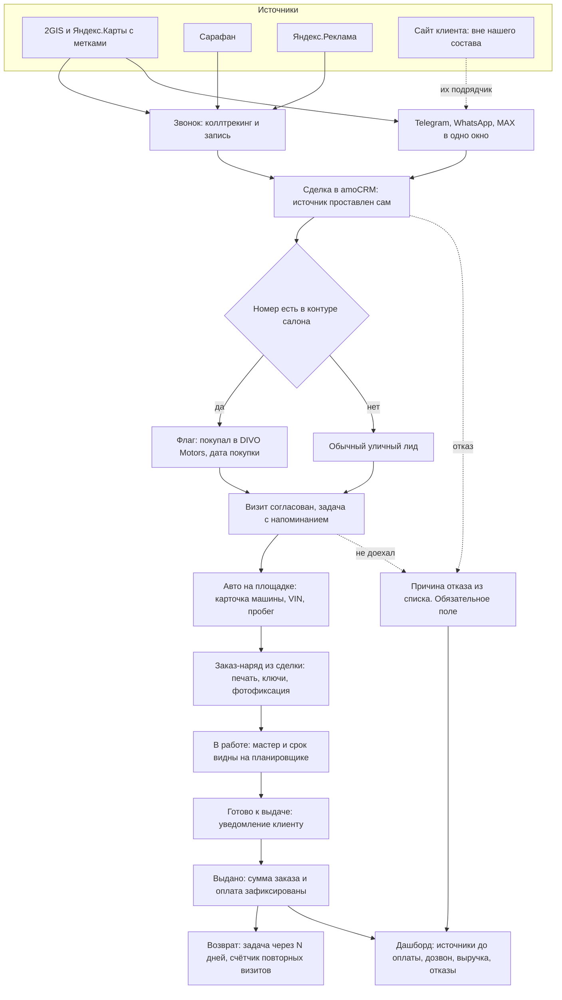

# TO-BE — целевая картина

**Клиент:** `divo-detailing`
**Дата:** 2026-09-18
**Основание:** [AS-IS.md](AS-IS.md), [КОНТЕКСТ.md](КОНТЕКСТ.md)
**Стек:** amoCRM плюс телефония, мессенджеры, коллтрекинг, внешний дашборд

> Разметка по вариантам: **Б** входит в базовый и в полный, **П** только в полный. Всё, что помечено «следующий этап», в цену не входит.

---

## 1. Целевой процесс

---

## 2. Воронка детейлинга

Семь этапов, повторяют реальный путь машины, а не абстрактную продажу.

| Этап | Когда переводим | Что обязательно | Вариант |
|---|---|---|---|
| Новое обращение | Звонок, сообщение, заявка | Источник проставлен автоматически | Б |
| Контакт установлен | Дозвонились или ответили в мессенджере | Услуга-интерес, предварительная вилка цены | Б |
| Визит согласован | Клиент назвал дату приезда | Дата визита, задача на напоминание | Б |
| Авто на площадке | Машина приехала, идёт осмотр | Карточка авто: марка, модель, VIN, пробег | Б |
| В работе | Заказ-наряд подписан, ключи приняты | Сумма заказа, срок сдачи, мастер | Б |
| Готово к выдаче | Работы закончены | Уведомление клиенту о готовности | П |
| Выдано, успех | Машина отдана, расчёт закрыт | Итоговая сумма, способ оплаты | Б |
| Отказ | Не доехал или не приняли в работу | Причина отказа из списка. Без неё этап не закрывается | Б |

**Список причин отказа** заводим сразу закрытым: дорого, далеко, выбрал другой сервис, не устроил срок, не устроила оценка после осмотра, передумал, спам. Открытого поля «Другое» избегаем сознательно: в контуре салона 70–80 процентов провалов закрыты именно им и аналитика по ним мертва ([источник](../../../Активные/DIVO_Motors/02_Знание/КОНТЕКСТ_AMOCRM.md)). Клиенту это не показываем, это наш проектный вывод.

**Отдельное состояние «ждём клиента»** для тех, кто уехал в отпуск и приедет через месяц. Такая сделка не выглядит просрочкой менеджера, а возвращается задачей в назначенный день. Прямо из её примера про «прилечу первого числа».

---

## 3. Поля

| Сущность | Поле | Тип | Зачем |
|---|---|---|---|
| Сделка | Источник | список | Атрибуция. Заполняется автоматически, руками только правится |
| Сделка | Услуга-интерес | список из прайса | Структура спроса |
| Сделка | Предварительная цена от и до | число, два поля | Её рабочий инструмент квалификации по бюджету |
| Сделка | Сумма заказа | число | Выручка и средний чек. Обязательное на выдаче |
| Сделка | Способ оплаты | список: 50 на 50, полная | Как есть у них, без жёсткого правила |
| Сделка | Предоплата получена | число | Остаток к выдаче |
| Сделка | Срок сдачи | дата | Обещание клиенту |
| Сделка | Мастер | список | Кто делает |
| Сделка | Категория сложности | список: легкая, средняя, сложная | Её собственная градация |
| Сделка | Причина отказа | список | Обязательное при отказе |
| Сделка | Дата визита | дата | Планирование площадки |
| Контакт | Покупал в DIVO Motors | флаг | Горячий лид. Без слияния баз |
| Контакт | Дата покупки в салоне | дата | Контекст для разговора |
| Контакт | Повторных визитов | число | LTV и лояльность |
| Контакт | Дата последней услуги | дата | Триггер возврата |
| Авто | Марка, модель, год, VIN, пробег, цвет | текст | Услуга привязана к машине, не только к человеку |
| Авто | Состояние на приёмке | фото | Защита от споров при выдаче |

Обязательность включаем на переходах этапов, а не глобально: иначе сотрудник обходит систему. Это прямой вывод из контура салона, где поле цены заполнено у двух сделок из семидесяти.

---

## 4. Телефония и каналы

**Телефония, Б.** Один номер, две трубки. Запись разговоров включена: именно она закрывает её боль «послушать клиента, с чем он обращался». Каскад дозвона короче 20 секунд по её прямому замечанию, затем автозадача на перезвон с пропущенного. Все звонки прикрепляются к сделке и контакту.

Трубки как в салоне не покупаем: звонки приходят на рабочий телефон. Её слова: «самое главное, чтобы они поступали».

**Мессенджеры, Б.** Telegram, WhatsApp и MAX в одно окно amoCRM. WhatsApp и MAX заводим с нуля и прогреваем: сейчас их нет. MAX нужен под сегмент, который она назвала сама, — люди старшего возраста без Telegram.

Переписка видна второму сотруднику. Это и есть её требование к передаче смены: Илья открывает сделку и читает историю без опроса.

**Первое сообщение по шаблону, Б.** Заготовка её же текста: здравствуйте, оставляли заявку, какая услуга интересует, какая машина, какой бюджет. Отправляется в один клик из сделки, не набирается заново.

---

## 5. Источники и аналитика

**Коллтрекинг, П.** Подмена номеров, метка сохраняется на звонке. Закрывает то, что она описала как ненадёжное: спрашивать голосом, откуда узнал.

**UTM и разметка внешних карточек, П.** Ссылки в 2GIS и Яндекс.Картах размечаются, видно цепочку от карточки до обращения. Разметку ставим мы. Сайт при этом делают они, и в наш состав он не входит.

**Источник до оплаты, а не до заявки, П.** Ключевое отличие от обычной статистики: метрика считается по сделкам, дошедшим до выдачи и оплаты. Ровно то, о чём шла речь на созвоне: важно не с какого кабинета пришёл человек, а с какого кабинета он купил.

**Дашборд в браузере, П.** Метрики детейлинга: обращения по источникам, доля дозвона, доезд до площадки, машины в работе, выданные, выручка и средний чек, причины отказа, источник оплаченного заказа, повторные визиты. Техническая основа переиспользуется от салона, данные только детейлинга.

На созвоне она спросила «нам такое нужно?» и запрос сформулирован не был. Поэтому дашборд стоит в полном варианте как рекомендация, а не в базовом как обязательство.

---

## 6. Площадка и мастера

**Планировщик занятости, П.** Видно десять с лишним мастеров, какие машины на каждом, сроки и объём работ. Это её дословный запрос: «я вижу в расписании, допустим, 10 мастеров, здесь три машины, здесь две машины».

Подмена мастера остаётся её решением в один клик: «я тогда сама решила поменять местами сотрудников».

**Онлайн-записи нет.** Она отвергла её прямо, причина рабочая: срок работ определяется только после осмотра, а место на площадке надо резервировать под реальный объём.

**Мастеров пользователями amoCRM не заводим** в первой версии. Обсуждалось как перспектива, в состав не входит. Мастера остаются в своей рабочей группе Telegram.

---

## 7. Заказ-наряд и деньги

**Заказ-наряд из сделки, П.** Печатная форма вместо ручного листа: клиент, машина, список работ, срок, сумма, приём ключей и документов. Фотофиксация состояния авто при приёмке прикрепляется к сделке.

**Деньги по заказу, П.** Предварительная и итоговая цена, предоплата и остаток, способ оплаты. Гибкость сохраняется: 50 на 50 или полная по удобству клиента.

**Себестоимость, работа мастера, материалы и маржа — следующий этап.** Её решение: «можно это сделать чуть-чуть попозже, это не основное».

---

## 8. Возврат клиента

**Автоматический возврат, П.** Задача на касание через заданное число дней после услуги. Сезонная волна: подготовка к осени, керамика, защитное покрытие. Счётчик повторных визитов на контакте.

Формулировка боли — её: клиент сделал услугу, остался доволен и обиделся, что через три месяца никто не позвонил. В базовом варианте это остаётся ручной задачей в amoCRM, в полном становится автоматическим.

**Рассылки аккуратные.** Её условие: «не то, что мы ему там 20 сообщений пахнули раз в месяц».

---

## 9. Что остаётся ручным

Пишем прямо, чтобы не создавать ложное ожидание.

| Что | Почему |
|---|---|
| Осмотр и финальная оценка | Только на площадке с мастером. Так устроена услуга |
| Решение, какой мастер берёт машину | Её полномочие, система показывает загрузку и не выбирает за неё |
| Первый разговор и личный контакт | Её слова про личный коннект. Робота на вход не ставим |
| Скидки клиентам салона | Решает начальство салона |
| Реклама и её бюджет | Не наша зона, отдельное агентство |
| Сайт | Делают сами, вне нашего состава |

---

## 10. Definition of Done

Проверяем на живом входе, а не на демонстрации.

- Входящий звонок создаёт сделку с проставленным источником и записью разговора.
- Пропущенный звонок дозванивается на вторую трубку быстрее 20 секунд и оставляет задачу на перезвон.
- Сообщения из Telegram, WhatsApp и MAX попадают в одну сделку, и второй сотрудник читает историю без опроса.
- Машина проходит путь от обращения до выдачи, на выдаче зафиксированы сумма и способ оплаты.
- Отказ нельзя закрыть без причины из списка.
- Клиент, покупавший в DIVO Motors, помечен флагом с датой покупки, при этом базы остаются раздельными.
- Источник виден не только по заявке, но и по оплаченному заказу (полный).
- Загрузка мастеров открывается одним экраном, подмена делается в один клик (полный).
- Заказ-наряд печатается из сделки, фото состояния авто прикреплено (полный).
- Задача на возврат создаётся автоматически после выдачи (полный).
- Двое сотрудников обучены, инструкция роли на руках, неделя живой работы пройдена.
