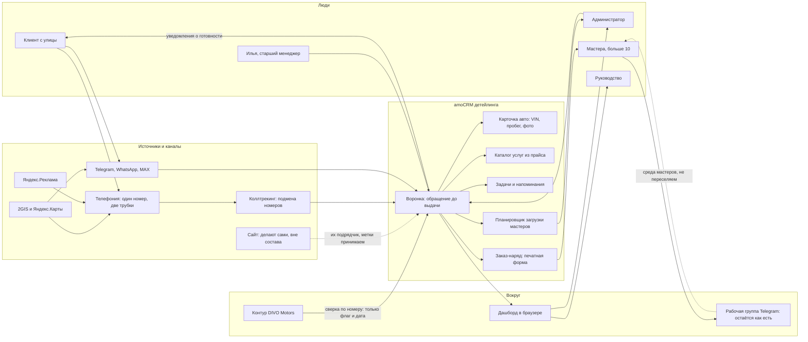

# Интеграционная карта

**Клиент:** `divo-detailing`
**Дата:** 2026-09-18
**Архитектура:** amoCRM в центре контура. Телефония, мессенджеры и коллтрекинг подключаются к ней, дашборд читает её данные.
**Назначение:** согласовать границы контура до предложения и ТЗ.
**Основание:** [AS-IS.md](AS-IS.md), [TO-BE.md](TO-BE.md).

---

## 1. Контур целиком

---

## 2. Потоки данных

| Поток | Направление | Триггер | Содержание | Вариант |
|---|---|---|---|---|
| Входящий звонок | Телефония → amoCRM | Звонок на номер | Сделка, контакт, запись разговора, источник | Базовый |
| Пропущенный звонок | Телефония → amoCRM | Никто не ответил | Каскад на вторую трубку, затем задача на перезвон | Базовый |
| Сообщение из мессенджера | Telegram, WhatsApp, MAX → amoCRM | Клиент написал | Сделка или дополнение существующей, вся переписка | Базовый |
| Первое сообщение клиенту | amoCRM → мессенджер | Кнопка в сделке | Шаблон её текста: услуга, машина, бюджет | Базовый |
| Каталог услуг | Прайс → amoCRM | Внедрение | Список услуг и цен для выбора в сделке | Базовый |
| Карточка авто | Человек → amoCRM | Машина на площадке | Марка, модель, VIN, пробег, фото состояния | Базовый |
| Задача на перезвон | Внутри amoCRM | Клиент назвал дату | Напоминание в нужный день, включая через 28 дней | Базовый |
| Закрытие сделки | Человек → amoCRM | Выдача или отказ | Сумма и оплата либо причина отказа из списка | Базовый |
| Метка звонка | Коллтрекинг → amoCRM | Звонок с размеченного источника | Источник, кампания, ключ | Полный |
| Метка из карточек карт | 2GIS, Яндекс.Карты → amoCRM | Переход по размеченной ссылке | UTM в сделке | Полный |
| Источник до оплаты | amoCRM → дашборд | Сделка дошла до выдачи | Связка источник плюс выручка | Полный |
| Флаг клиента салона | Контур DIVO Motors → amoCRM | Совпадение по номеру телефона | Только признак покупки и дата. Базы не сливаются | Полный |
| Заказ-наряд | amoCRM → печать | Приём машины | Клиент, машина, работы, срок, сумма, подпись | Полный |
| Загрузка мастеров | amoCRM → планировщик | Машина в работе | Мастер, срок, объём, очередь | Полный |
| Уведомление клиенту | amoCRM → мессенджер | Машина готова или срок сдвинулся | Короткое сообщение по шаблону | Полный |
| Возврат клиента | Внутри amoCRM | Прошло N дней после выдачи | Задача на касание, счётчик повторных визитов | Полный |
| Показатели | amoCRM → дашборд | Постоянно | Обращения, дозвон, доезд, выручка, отказы, источники | Полный |
| Себестоимость и маржа | — | — | Следующий этап по решению клиента | Вне состава |
| Заявка с сайта | Сайт → amoCRM | — | Технически принимаем, но сайт не делаем и в DoD не ставим | Вне состава |

---

## 3. Модули

| Модуль | Назначение | Сложность | Вариант |
|---|---|---|---|
| Аккаунт amoCRM с нуля | Создание на реквизитах клиента, базовая гигиена, права | Low | Базовый |
| Воронка детейлинга | Семь этапов от обращения до выдачи плюс отказ и ожидание клиента | Medium | Базовый |
| Поля и обязательность | Источник, услуга, суммы, причина отказа, категория сложности | Medium | Базовый |
| Карточка авто | Отдельная сущность машины при сделке и контакте | Medium | Базовый |
| Каталог услуг | Список из прайса, привязка к сделке | Low | Базовый |
| Телефония | Номер, две трубки, запись, каскад короче 20 секунд, задачи на перезвон | Medium | Базовый |
| Мессенджеры | Telegram, WhatsApp, MAX в одно окно, шаблон первого сообщения | Medium | Базовый |
| Права и роли | Два пользователя, задел под второго менеджера и выходные | Low | Базовый |
| Задачи и напоминания | Перезвон, визит, ожидание клиента | Low | Базовый |
| Обучение и инструкция | HTML-инструкция роли, обучение двух сотрудников | Low | Базовый |
| Коллтрекинг | Подмена номеров, сохранение метки на звонке | Medium | Полный |
| UTM и разметка карточек | Ссылки 2GIS и Яндекс.Карт, приём меток в сделку | Medium | Полный |
| Атрибуция до оплаты | Связка источника с выручкой по выданным машинам | Medium | Полный |
| Флаг клиента DIVO Motors | Сверка по номеру, признак и дата, раздельные базы | Medium | Полный |
| Заказ-наряд | Печатная форма из сделки плюс фотофиксация | Medium | Полный |
| Планировщик загрузки | Мастера, машины, сроки, объём, подмена в один клик | High | Полный |
| Уведомления клиенту | Готовность, сдвиг срока | Low | Полный |
| Возврат и лояльность | Автозадача после выдачи, сезонная волна, счётчик визитов | Medium | Полный |
| Дашборд | Метрики детейлинга в браузере | Medium | Полный |
| Регламенты ролей | Инструкции администратора и менеджера | Low | Полный |

---

## 4. Точки интеграции

### 4.1. Телефония — обязательная

Сейчас номер один, телефония формально есть через 2GIS, но не настроена, физический телефон один на двоих.

| Что делаем | Зачем |
|---|---|
| Подключаем номер к amoCRM | Звонок становится сделкой, а не памятью человека |
| Две трубки на один номер | Илья отвечает, когда её нет на месте |
| Запись разговоров | Её прямая боль: послушать, с чем обращался клиент |
| Каскад короче 20 секунд | Её замечание дословно: 20 это много |
| Задача на перезвон с пропущенного | Клиент уезжает к конкуренту после четырёх гудков |

Трубки как в салоне не покупаем, это её решение. Звонки приходят на рабочий телефон, интернет на месте хороший.

### 4.2. Мессенджеры — обязательная

Telegram есть. **WhatsApp и MAX не заведены**, их надо создать и прогреть: это организационный шаг на их стороне, и чем раньше, тем лучше. На созвоне это проговорено прямо.

MAX обязателен не для галочки: она сама назвала сегмент, который иначе не напишет вообще — клиенты старшего возраста без Telegram.

### 4.3. Коллтрекинг и метки — полный вариант

Ставим подмену номеров и размечаем внешние карточки. Источник перестаёт зависеть от вопроса голосом.

Важная граница: **атрибуцию считаем по тому, что доступно нам** — звонки, мессенджеры, размеченные карточки карт. Сайт делают они, и его часть цепочки зависит от их подрядчика.

### 4.4. Контур DIVO Motors — сверка по номеру

| Правило | Как |
|---|---|
| Что передаём в детейлинг | Только признак «покупал» и дату покупки |
| Что не передаём | Ничего больше: ни сделок, ни сумм, ни истории салона |
| Как ищем | Сверка по номеру телефона |
| Базы | Остаются раздельными. Это её жёсткое требование |
| Обратный поток | Нет. Детейлинг в салон ничего не пишет |

Контур салона ведём мы же, поэтому доступ технически есть: `divomotors.amocrm.ru`, см. [контекст салона](../../../Активные/DIVO_Motors/02_Знание/КОНТЕКСТ_AMOCRM.md).

### 4.5. Рабочая группа Telegram — остаётся как есть

Мастера живут в группе, машины запускаются тегом. Мы это не ломаем и мастеров в amoCRM не переселяем.

Планировщик загрузки — инструмент администратора, а не мастеров. Так же, как сейчас: она распределяет, они работают.

### 4.6. Сайт — вне контура

Решение владельца: сайт не входит ни в базовый, ни в полный вариант. Они делают его сами на современном конструкторе.

- Мы не делаем сайт, не верстаем формы и не отвечаем за их работу.
- Заявку с сайта система принять готова, но в DoD это не ставится.
- Если они попросят сайт — отдельное направление и отдельный разговор, не часть этого проекта.

### 4.7. Чего в контуре нет

- **Сайт.** См. выше.
- **Реклама и её ведение.** Отдельное агентство, на созвоне сказано прямо.
- **Онлайн-запись.** Отвергнута клиентом, не предлагаем.
- **Личный кабинет клиента.** Не звучал.
- **Склад материалов и себестоимость.** Следующий этап по её решению.
- **Зарплата и мотивация мастеров.** Не обсуждалось.
- **Мастера как пользователи amoCRM.** Перспектива, не состав.
- **Слияние баз с салоном.** Запрещено требованием клиента.
- **Историческая миграция двух лет переписок.** Объём неизвестен, оценивается отдельно.

---

## 5. Риски

| Риск | Влияние | Как снимаем |
|---|---|---|
| Прайс неполный: нет покраса и сложного кузова из созвона | Низкое. Каталог соберём из того, что прислали | Дозапрос отдельным скрином, если эти работы делают. В каталог не выдумывать |
| WhatsApp и MAX не заведены на их стороне | Среднее. Каналы нельзя подключить | Просим завести и прогревать заранее, это организационный шаг клиента |
| Реклама запустится раньше системы | Высокое. Первый бюджет без атрибуции | Коллтрекинг и метки ставим в первые недели полного варианта |
| Подписант не участвовал в созвоне | Высокое для сделки | КП написано так, чтобы читалось человеком, который разговор не слышал |
| Один сотрудник на всех ролях | Среднее. Некому принимать этапы | Ответственный за CRM назначается на старте, приёмка по чекпоинтам |
| Обязательные поля начнут обходить | Высокое для аналитики | Обязательность на переходах этапов, закрытый список причин отказа, регламент и обучение |
| WhatsApp через QR требует переавторизации | Низкое, эксплуатационное | Пишем в регламент, показываем на обучении. Канал при этом обещаем |
| Загрузка мастеров разрастётся в отдельный продукт | Среднее для экономики | Планировщик держим как экран занятости, не как систему производственного планирования |
| Рост потока после рекламы | Среднее | Воронка и права проектируются под второго менеджера и выходные с самого начала |

---

## 6. Что нужно от клиента для старта

1. Текущий шаблон заказ-наряда. Прайс получен 2026-09-21, [`ПРАЙС.md`](ПРАЙС.md).
2. Имя и должность контактного лица, юрлицо, подписант.
3. Решение, кто ответственный за CRM и кто принимает этапы.
4. Доступ к текущему номеру: оператор, кабинет, возможность настройки.
5. Заведённые и прогретые WhatsApp и MAX на рабочий номер.
6. Список мастеров с направлениями работ.
7. Логотип детейлинга получен 2026-09-21.

Сверку по номеру с контуром салона для флага «покупал в DIVO Motors» отдельным разрешением не блокируем: салон ведём мы, доступ есть, признак передаётся без выгрузки базы.
