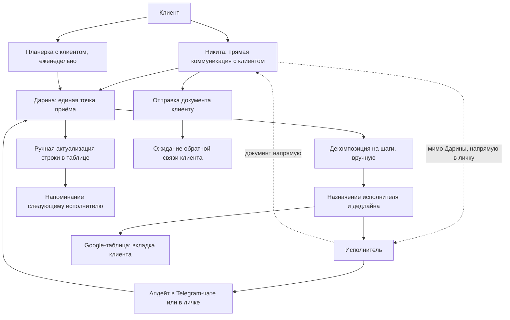

# AS-IS — как есть сейчас

**Клиент:** `hide`
**Дата:** 2026-09-07
**Источники:** голосовые Никиты Семёнова 01.09 ([транскрипт](../04_Встречи/2026-09-01_ответы_Никита_вопросы_транскрипт.md)), созвон с Дариной 02.09 ([транскрипт](../04_Встречи/2026-09-02_созвон_Дарина_транскрипт.md)), три скриншота рабочей таблицы и отчёта ([скрины](скрины/README.md))

> Всё ниже — со слов Никиты и Дарины плюс то, что видно на скриншотах. Где данных нет, стоит пометка «не выяснено». Не додумывать при переходе к TO-BE.

---

## 1. Описание текущего процесса

### 1.1. Основной поток: дело от появления до закрытия

**По шагам:**

1. **Дело появляется тремя путями.** От клиента через Никиту, от самого Никиты, или на еженедельной планёрке с клиентом, где Дарина конспектирует и фиксирует задачи, сроки, ответственных. Слова Никиты: «задача от клиента, или от меня, или от кого-либо». Планёрки участились: сейчас каждую неделю созвон с одним из клиентов.
2. **Дело заводится на Дарину.** Она единая точка приёма. Её же слова про свой функционал: «контроль и учёт поручений, разделение между коллегами, контроль сроков выполнения задач». Полный жизненный цикл — постановка, дедлайн, маршрутизация, внесение изменений.
3. **Декомпозиция вручную.** Дело может быть многоуровневым. Пример Никиты: обменять долю одной компании на другую — пять-семь подзадач. Пример Дарины: оценка объектов недвижимости — сформировать реестр и согласовать с клиентом (юрист), запросить коммерческие предложения у оценочных компаний (аналитик), внутренняя оценка перед внешним запросом. Связь родительской и дочерней задачи Дарина делает руками: общий номер по порядку плюс выделение цветом.
4. **Классификация по направлению.** Никита назвал: аналитика, юристы, инвестиции, переговоры, «и какие-то ещё, сложно сейчас сказать». Формального справочника нет. Дарина распределяет сама: «в целом есть понимание, то есть у нас немного профильная компания», при сомнении спрашивает Никиту.
5. **Запись в Google-таблицу.** Отдельная вкладка на каждого клиента плюс лист «частные задачи» для внутренних дел компании. Сводного листа по всем клиентам нет намеренно: «информация очень конфиденциальная, и если что-то спутается на одном листе, больше вероятность такой ошибки». Правит только Дарина, у коллег доступ на просмотр.
6. **Исполнитель работает и отчитывается в Telegram.** Апдейт прилетает в общий чат, в профильный чат или в личку. Система уведомлений — сама Дарина.
7. **Дарина вручную ловит изменения.** Её утро: открывает таблицу и параллельно читает Telegram-чаты, переносит в таблицу документы и новые вводные. Дальше в течение дня — «регулярно по поступлению информации». Увидела в чате, что коллега скинул материал, — отмечает этап выполненным и напоминает следующему исполнителю, что наступил его черёд.
8. **Контроль по двум кругам.** Первый — горящие задачи и напоминания по ним. Второй — апдейт по каждой задаче. Планёрки внутри компании собирает редко и сознательно: «стараюсь не дёргать коллег лишний раз».

### 1.2. Структура рабочей таблицы

Со скриншота вкладки клиента (клиенты закодированы, например «ИИК», а не по названию):

| Колонка | Что внутри | Проблема |
|---|---|---|
| Дата | Дата постановки | Часто пустая |
| Задача | Формулировка дела | — |
| Исполнитель | Имя, но бывает до четырёх имён в одной ячейке | Не нормализовано, нельзя отфильтровать «мои задачи» |
| Дедлайн | Дата, либо «Ежемесячно», «ноябрь», «На долгосрочное планирование» | Разнородный формат, сортировка по срокам невозможна |
| План | Нумерованные шаги текстом внутри одной ячейки, с датами | Это и есть декомпозиция, но у шагов нет своей сущности: ни срока, ни ответственного на шаг |
| Статус | Выпадающий список: не приступили, в процессе, выполнено, закрыто | «Закрыто» = неактуальна, пересмотрена или трансформирована в другие задачи |
| Комментарий | Контекст дела: суммы, договорённости, кто с кем говорил, запросы, даты | Основной носитель истории |

**Цвет несёт смысл, которого нет в данных.** Красным — не согласовано с клиентом, просроченная дата, срочное к вниманию. Зелёным — согласовано с клиентом. Дарина: «самую актуальную информацию я поднимаю вверх, в ячейку, чтобы визуально это бросалось в глаза». Ни отфильтровать, ни выгрузить, ни посчитать.

**Принцип Дарины по контексту:** «я максимально выгружаю всё из головы, если я ухожу из компании, я хочу, чтобы максимально вся информация осталась у коллег». Поэтому в ячейке «план действий» — дорожная карта и активные этапы, в «комментарии» — фактура: с кем подписан договор, какая сумма, с кем держим коммуникацию. Провалившись в ячейку, можно проследить всю историю дела с датами.

### 1.3. Месячная отчётность клиенту

На той же вкладке клиента, отдельными блоками сверху, руками пересобираются:

- **«ИТОГИ за <месяц>»** — нумерованный список сделанного со статусом «Выполнено».
- **«Задачи на <следующий месяц>»** — нумерованный список с планом и дедлайнами.
- Ниже — операционный реестр дел.

Дальше готовый отчёт инвестору: тёмная вёрстка, четыре страницы, «Multi Family Office. Ежемесячный отчёт для инвестора». Состав: показатели портфеля (начальный инвестиционный капитал, изменение портфеля за всё время, действующий портфель, дивиденды за месяц, вывод и пополнение средств), график изменения стоимости портфеля по месяцам, «Ключевые действия» таблицей задача плюс статус, план на следующий месяц.

**Путь сборки:** аналитик Данил считает показатели портфеля по кварталам и за год → Дарина собирает список задач, удаляет мелкие подзадачи → Никита решает, что не показывать клиенту → Дарина пересылает всё дизайнеру → дизайнер верстает. Дарина об этом этапе: «это, наверное, самый критичный этап формирования отчётов. Если возможно, его в первую очередь хотелось стандартизировать. Много ошибок, много доработок, корректировок».

Пробовала сделать выгрузку — не вышло: «я её не трансформировала под выгрузку, чтобы можно было проанализировать, за какой период что выполнено. Хронология есть, а вот именно отчёт сделать я не могу пока».

Параллельно каждый аналитик и юрист ведут собственный недельный отчёт руками и шлют список выполненного в Telegram. Дарина хотела эти отчёты отменить, но не может: её таблица не закрывает потребность в такой выгрузке.

### 1.4. Где живёт информация

| Источник | Доля и роль | Комментарий Дарины |
|---|---|---|
| Telegram | 80% всего контекста | «Как такой внутренний корпоративный софт». Документы, цифры, аналитика — всё там |
| Google-таблица | Единственный учёт задач | Вкладка на клиента плюс «частные задачи» |
| Яндекс.Диск | Хранение документов | Дарина сейчас вручную собирает туда документы по проектам и клиентам |
| Бумага | Минимально | — |

**Структура чатов Telegram:** общий чат HIDE, профильные «HIDE аналитика» и «HIDE юридический блок», отдельный чат по каждому клиенту с участием самого клиента, плюс личные переписки с каждым сотрудником.

Документы задваиваются: сначала присылаются в Telegram, потом Дарина вручную раскладывает их на Яндекс.Диск. Её слова: «это такая двойная немножко история получается».

### 1.5. Использование ИИ

Хаотичное и без регламента. Никита обучает ИИ и собирает базу знаний внутри — по словам Дарины, единственный, кто это делает системно. Аналитика прогоняется через ИИ: рыночная стоимость, окупаемость аренды бизнес-центра, аналитические справки, которые потом дополняют и корректируют руками.

Сама Дарина пользуется осторожно и только как справочником: «много информации конфиденциальной, и я лучше не дозалью информацию, чем лишнее что-то туда отправлю». Для контроля задач не использует. Хотела бы загружать туда отчёт, чтобы ИИ его причесал, но не делает.

### 1.6. Опыт TickTick

Не прижился. Аналитика приложение устраивало, он им пользовался. Юриста не устроил интерфейс, она не пользовалась вообще и вела свои задачи мини-списком по каждому клиенту прямо в Telegram, раз в неделю обновляя и отправляя в общий чат.

---

## 2. Узкие места

| Узкое место | Проявление | Частота / масштаб |
|---|---|---|
| Дарина как живой маршрутизатор | Опрашивает коллег, ловит апдейты из чатов, напоминает по каждой задаче каждому | Постоянно. Её слова: «я как ассистент у каждого сотрудника» |
| Изменения по делу проходят мимо учёта | Коллеги обсудили между собой, решение поменялось, Дарина не в курсе | Приводит к дезинформации клиента через Никиту, случай с оценкой недвижимости |
| Задача выполнена, но об этом не сообщили | Исполнитель закрыл, не уведомил; Дарина ждёт, считая задачу в работе | Регулярно. «Если бы был софт, он бы просто отжал задачу и все были уведомлены» |
| Документ уходит Никите в личку мимо контроля | Договорённость, что Дарина проверяет и форматирует документ, нарушается | Названо как узкое место прямо |
| Документ теряется у Никиты | Работа сделана, но документ не ушёл клиенту и висит в переписке | Первый из двух названных сценариев потери |
| Клиент не даёт обратную связь | Документ отправлен, ответа нет; нужно дёргать Никиту, чтобы он дёрнул клиента | Второй сценарий. Статуса под это нет |
| Нет метрики принятия работы руководителем | Отправили Никите документ и не понимают: прочитал, проверил, отправил клиенту, будут ли замечания | Её формулировка: «как в 1С руководитель согласовал, отжал» |
| Созвоны Никиты без обратной связи | Дарина напоминает про созвон, не получает ответа, не знает, состоялся ли, нужно ли добивать | «Очень большой процент неопределённости сейчас у меня» |
| Декомпозиция текстом в ячейке | Шаги дела нельзя назначить, посчитать, отследить отдельно | Каждое многоуровневое дело |
| Смысл в цвете, а не в данных | Согласованность, срочность и просрочка живут в заливке ячейки | Вся таблица |
| Месячный отчёт пересобирается руками | Итоги и план на месяц набиваются заново отдельными блоками | Ежемесячно, по каждому клиенту |
| Недельные отчёты дублируются вручную | Аналитик и юрист ведут свои списки и шлют в Telegram | Еженедельно, потому что выгрузки из таблицы нет |
| Документы в двух местах | Приходят в Telegram, вручную раскладываются на Яндекс.Диск | Постоянно |
| Никто, кроме Дарины, не видит своей очереди | Сотрудник не может открыть список своих задач: правит только она | Постоянно. «Мог бы просто зайти в табличку, нажать на сортировку и посмотреть все свои задачи» |

---

## 3. Потери (время, деньги, качество данных)

- **Время Дарины.** Основная потеря. Роль координатора почти целиком состоит из механики: перенос апдейтов из чатов в таблицу, опросы коллег, напоминания, ручная пересборка отчётов. Её собственная оценка: «я посмотрела сейчас софты, и половину работы, которую я делаю, это возможно перевести в автоматизацию». Точных часов не замеряли, нужен baseline.
- **Время команды.** Исполнителей регулярно отвлекают вопросом «что там по задаче», хотя ответ уже есть в чате. Плюс ручное ведение личных недельных отчётов у аналитика и юриста.
- **Качество данных перед клиентом.** Прямой зафиксированный случай: команда решила не запрашивать внешнюю оценку, Дарина не знала, Никита передал клиенту устаревшую информацию. Дословно: «мы дезинформируем клиента».
- **Скорость отчётности.** Никита не может получить срез «чем занимался сотрудник за неделю» или данные для презентации клиенту без ручной работы Дарины. Формулировка Дарины: «очень важно для Никиты иметь возможность выгрузки выполненных задач за неделю. Сейчас это сложно сделать».
- **Масштабирование.** Дарина прямо связала объём с ростом: «если количество клиентов будет кратно увеличиваться» — текущая схема со вкладкой на клиента и ручным ведением не выдержит.

---

## 4. Системы и ручные операции

| Шаг | Система | Ручное действие | Кто |
|---|---|---|---|
| Приём дела от клиента | Telegram, созвон | Услышать, зафиксировать | Никита, Дарина |
| Фиксация с планёрки | Блокнот, конспект | Записать задачи, сроки, ответственных | Дарина |
| Классификация по направлению | — | Определить направление по опыту | Дарина |
| Декомпозиция | Google-таблица | Написать шаги текстом в ячейку «План» | Дарина |
| Связывание родитель-потомок | Google-таблица | Общий номер по порядку плюс заливка цветом | Дарина |
| Назначение исполнителя и срока | Google-таблица | Вписать имя и дату | Дарина |
| Уведомление исполнителя | Telegram | Написать в чат или в личку | Дарина |
| Сбор статуса | Telegram | Читать чаты, опрашивать коллег | Дарина |
| Актуализация статуса | Google-таблица | Открыть строку, поменять статус, дописать комментарий | Дарина |
| Приоритизация | Google-таблица | Поднять строку вверх, залить красным | Дарина |
| Напоминание о дедлайне | Telegram | Написать исполнителю | Дарина |
| Напоминание Никите о созвонах | Telegram | Написать, часто повторно | Дарина |
| Хранение документов | Яндекс.Диск | Скачать из Telegram, разложить по папкам | Дарина |
| Недельный отчёт исполнителя | Telegram | Составить список выполненного руками | Аналитик, юрист |
| Показатели портфеля | Не выяснено | Посчитать по составляющим портфеля, свести за квартал и год | Данил |
| Месячные итоги и план | Google-таблица | Набить блоки заново на вкладке клиента | Дарина |
| Фильтрация для клиента | Google-таблица | Удалить мелкие подзадачи, согласовать с Никитой | Дарина, Никита |
| Вёрстка отчёта | Не выяснено | Собрать четыре страницы отчёта инвестору | Дизайнер |

---

## 5. Риски текущего процесса

1. **Bus factor на Дарине.** Весь маршрут, приоритеты, история дел и связи между задачами держатся на одном человеке и её ручной дисциплине. Она сама это осознаёт и специально выгружает контекст в комментарии на случай ухода.
2. **Второй узел на Никите.** Он единственная точка связи с клиентом и единственный, кто принимает работу. При его загрузке дела встают молча: документ лежит в личке, созвон не подтверждён, клиент не отвечает.
3. **Данные попадают клиенту устаревшими.** Изменения, обсуждённые между исполнителями, не доходят до учёта. Прецедент уже был.
4. **Конфиденциальность.** Клиенты HIDE — частные инвесторы, в делах фигурируют суммы, доли компаний, судебные споры и реквизиты. Разделение по вкладкам сделано именно ради этого. Любая новая система обязана удержать этот уровень разграничения, иначе она хуже таблицы.
5. **Рост клиентской базы ломает схему.** Сейчас пять-семь клиентов, планируется масштабирование. Вкладка на клиента плюс ручное ведение не масштабируются линейно: нагрузка растёт целиком на Дарину.
6. **Второй провал внедрения.** TickTick уже не прижился, и причина организационная, а не техническая: юристу не подошёл интерфейс, и она просто не пошла в инструмент. Риск повторения выше среднего.
7. **ИИ без регламента.** Аналитика прогоняется через модели без правил, при этом данные клиентов конфиденциальны. Дарина сознательно ограничивает себя, остальные — неизвестно.

---

## 6. Что нельзя ломать при переходе

- **Telegram как среда, где живёт команда.** 80% контекста там, и это работает. Система должна встроиться в Telegram уведомлениями и быстрыми действиями, а не требовать переселения.
- **Разграничение доступа по клиентам.** Логика раздельных вкладок должна переехать в права. Не сводить всё в один общий список без ограничений.
- **Роль Дарины как хозяйки процесса.** Убираем механику, а не полномочия. Она остаётся тем, кто отвечает за маршрут и приоритеты.
- **Прямая связь Никиты с клиентом.** Клиентская коммуникация остаётся на нём, система её не подменяет.
- **Принцип «весь контекст выгружен из головы».** Место под фактуру по делу нужно сохранить: это её осознанная практика, а не побочный эффект таблицы.
- **Отчёт инвестору как формат.** Клиенты привыкли к этим четырём страницам. Меняем способ сборки, а не сам документ.
- **Низкий порог входа.** TickTick умер об интерфейс. Каждый лишний экран повышает риск повторения.

---

## 7. Не выяснено

1. Как Данил считает показатели портфеля: отдельная таблица, ручной расчёт, внешний сервис. Влияет на то, можно ли вообще подтягивать цифры в отчёт.
2. Структура листа «частные задачи» вживую не видели. Предполагается близкой к клиентской вкладке.
3. Точное число дел в работе одновременно. Известно только, что клиентов пять-семь и на каждого несколько дел.
4. Полный список направлений: Никита назвал четыре и добавил «и какие-то ещё».
5. Имя юриста и полный состав исполнителей ниже уровня руководителей.
6. Кто и в каком инструменте верстает отчёт инвестору.
7. Участвуют ли клиенты в клиентских чатах как читатели или активно ставят задачи там же.
