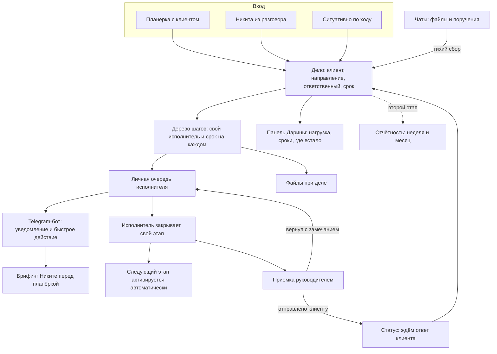

# TO-BE — целевое состояние

**Клиент:** `hide`
**Дата:** 2026-09-07
**Архитектура:** своя веб-система под процесс. CRM и готовый таск-трекер отвергнуты клиентом на своём опыте (TickTick не прижился, CRM не села).
**Основание:** [AS-IS.md](AS-IS.md), рамки владельца от 2026-09-07.

> Структуру проектируем свою, оптимальную. Текущая таблица — источник фактуры, а не образец для копирования.

---

## 1. Целевой процесс (кратко)

Дело заводится в систему из любой точки: Дарина с планёрки, Никита из разговора с клиентом, исполнитель по ходу работы. У дела есть клиент, направление, ответственный и срок. Многоуровневое дело разбивается на реальные подзадачи, у каждой свой исполнитель и свой дедлайн, а не строчка текста в ячейке. Исполнитель видит свою очередь сам и закрывает свой этап сам, следующий получает уведомление в Telegram автоматически. Дарина перестаёт быть механическим маршрутизатором и видит на одной панели, где дело встало, кто перегружен и что горит. Документ, ушедший руководителю, не пропадает: есть явная приёмка — принял, вернул с замечанием, отправил клиенту. Дело, зависшее на стороне клиента, имеет свой статус и не выглядит как просрочка исполнителя. Файлы лежат при деле, а не собираются вручную по чатам.

---

## 2. Целевая схема

---

## 3. Целевая схема по зонам

### 3.1. Дело и подзадачи

Главная сущность — **дело**, не сделка и не карточка клиента. Так его описал Никита, так его ведёт Дарина.

| Поле | Назначение | Откуда |
|---|---|---|
| Клиент | Привязка к клиенту или к внутренним делам компании | Вкладки клиентов плюс лист «частные задачи» |
| Направление | Аналитика, юристы, инвестиции, переговоры и далее. Справочник редактируемый | Никита назвал четыре и добавил «и какие-то ещё» |
| Название и суть | Формулировка дела | Колонка «Задача» |
| Ответственный | Владелец дела целиком | Колонка «Исполнитель» |
| Срок | Дата. Отдельно поддерживаем регулярные и бессрочные дела | Сейчас в одной колонке лежат дата, «Ежемесячно» и «На долгосрочное планирование» |
| Контекст | Фактура: суммы, договорённости, кто с кем общается | Колонка «Комментарий», её принцип выгружать всё из головы |
| Файлы | Документы по делу | Сейчас Telegram плюс ручная раскладка на Яндекс.Диск |

**Подзадачи — полноценные сущности, и это дерево произвольной глубины.** То, что сейчас нумерованным текстом лежит в колонке «План», становится структурой шагов: у каждого свой исполнитель, свой срок и свой статус, и внутри шага может быть свой набор шагов. Это снимает ручную нумерацию и заливку цветом, которыми Дарина сейчас связывает родителя с потомками.

Правила дерева, зафиксированы до разработки:

| Правило | Зачем |
|---|---|
| Срок узла не раньше срока последнего потомка, при нарушении предупреждение | Иначе родитель «просрочен» при живых детях, и панели перестают верить |
| Прогресс узла вычисляется по закрытым листьям, руками не ставится | Убирает расхождение между «отмечено выполнено» и реальным ходом |
| У каждого узла есть ответственный за узел, исполнители сидят на листьях | Иначе непонятно, чья работа и в чью очередь она попадает |
| В интерфейсе три уровня по умолчанию, глубже по раскрытию | Порог входа: дерево не должно пугать на первом экране |
| Закрытие последнего листа поднимает вопрос закрытия родителя | Родитель не закрывается молча, решение остаётся за человеком |

**Несколько исполнителей на одно дело поддерживаются нормально.** В таблице встречается до четырёх имён в одной ячейке, значит это не исключение, а рабочая ситуация. В дереве это выражается естественно: разные листья на разных людях.

### 3.2. Статусы

Расширяем текущие четыре, добавляя то, чего людям не хватало.

| Статус | Смысл | Было ли раньше |
|---|---|---|
| Не приступили | Дело заведено, работа не начата | Есть |
| В работе | Идёт исполнение | Есть |
| На приёмке | Работа сделана, ждём решения руководителя | Нет. Тот самый провал: «отправили Никите и не понимаем, прочитал ли» |
| Ждём ответ клиента | Отправлено клиенту, ждём реакцию | Нет. Второй сценарий потери |
| Ждём информацию | Дело стоит из-за нехватки данных от клиента или коллеги | Нет. Сейчас неотличимо от «исполнитель не сделал» |
| Выполнено | Закрыто результатом | Есть |
| Отменено | Неактуально, пересмотрено, трансформировано в другое дело | Есть, называлось «закрыто» |

**Статусы ожидания останавливают счётчик просрочки.** Дело, стоящее из-за молчания клиента, не должно выглядеть как вина исполнителя. Иначе панель покажет массовую просрочку там, где вины нет, и ей перестанут верить.

### 3.3. Признаки вместо цвета

Сейчас смысл живёт в заливке ячейки: красным — не согласовано и просрочка, зелёным — согласовано с клиентом. Переводим в поля, по которым можно фильтровать и считать.

- **Согласовано с клиентом** — да, нет, не требуется.
- **Приоритет** — вместо поднятия строки вверх и красной заливки.
- **Просрочено** — вычисляется системой, а не красится руками.

### 3.4. Личная очередь исполнителя

Каждый сотрудник открывает свой список: что на мне, что горит, что следующим. Очередь собирается из листьев дерева, где он исполнитель, плюс узлов, где он ответственный за узел целиком. Дарина описала это дословно как желаемое: сотрудник «мог бы просто зайти в табличку, нажать на сортировку и посмотреть все свои задачи. А получается, сейчас эта функция как бы на мне».

Исполнитель сам отмечает выполнение своего этапа. Следующий по цепочке получает уведомление автоматически — это убирает главный ручной цикл Дарины: опросить, узнать, отметить, напомнить следующему.

### 3.5. Приёмка руководителем

Отдельный контур под два зафиксированных сценария потери.

- Работа уходит на приёмку, а не в личку в Telegram.
- Решения принимающего: принял, вернул с замечанием, отправил клиенту.
- После «отправил клиенту» дело переходит в ожидание ответа клиента с напоминанием, если ответа нет.
- **Роль принимающего настраивается.** По разговору всё замыкается на Никите, но в таблице дела стоят и на Константина. Не зашивать в одного человека.

Формулировка Дарины про эталон: «как в 1С руководитель согласовал, отжал».

### 3.6. Панель контроля

Что Дарина назвала сама, отвечая про метрики:

- **Нагрузка по людям** — сколько на ком дел и подзадач.
- **Ход дела по этапам** — визуально, она произнесла «как диаграмма Ганта, чтобы можно было понимать этапность задач».
- **Где встало** — дела в статусах ожидания дольше нормы.
- **Что горит** — приоритет и просрочка.

### 3.7. Файлы и права

- Документы кладутся к делу и к подзадаче, а не рассылаются по чатам.
- **Яндекс.Диск работает параллельно** на переходный период, пока не убедимся, что в системе всё. Резкого отключения нет.
- **Права по клиентам.** Логика раздельных вкладок переезжает в разграничение доступа: кто из команды видит дела какого клиента. Это не украшение, а причина, по которой Дарина сознательно не сводила всё на один лист.
- Журнал действий: кто менял статус, срок, ответственного.

### 3.8. Telegram-бот: четыре режима вместо одного

Веб — основной интерфейс, но не единственный. У компании четыре типа чатов, и бот ведёт себя в каждом по-разному. Универсальный бот здесь проигрывает: то, что уместно в личке, недопустимо в чате с клиентом.

| Где | Роль | Что делает |
|---|---|---|
| Личка сотрудника | Персональный ассистент | Утренний дайджест из дел на сегодня, уведомление о наступлении этапа, кнопки «взял», «сделал», «переношу с причиной». Можно вообще не открывать веб |
| Профильные чаты: аналитика, юрблок | Слушатель внутренних решений | Ловит договорённости и изменения по делам, кладёт Дарине карточку на подтверждение. Автоматом ничего не меняет |
| Чат по клиенту, где сидит сам клиент | Тихий сборщик | В чат не пишет ничего. Перехватывает файлы с привязкой к делу, делает черновик дела из поручения клиента, считает время молчания. Отвечает только команде в личку |
| Общий чат HIDE | Сводки | Что горит сегодня, итоги недели |

**Тишина в клиентских чатах — принципиальное решение.** Клиенты HIDE это частные инвесторы, и внутренняя кухня подрядчика в их чате видна быть не должна. Бот там присутствует как участник, но молчит.

**Захват файлов важнее умных функций и не требует никакого ИИ.** Сейчас документ приходит в Telegram, а потом Дарина руками перекладывает его на Яндекс.Диск, называя это «двойной историей». Бот ловит файл в чате и предлагает команде одним нажатием прицепить его к делу.

Это прямо снимает риск повторения TickTick: чтобы отметить работу, не нужно осваивать новый интерфейс.

### 3.9. Брифинг перед планёркой

У компании еженедельные созвоны с клиентами, и сейчас Никита идёт на них либо со своей памятью, либо предварительно дёргая Дарину. За час до встречи бот присылает ему сводку по этому клиенту: что сделано с прошлой планёрки, что зависло и по какой причине, что нужно попросить у клиента.

Дешёвая функция, которая работает на самого загруженного человека в компании и даёт заметный эффект с первой недели.

### 3.10. Контроль тишины

Система сама следит за тем, что раньше висело в голове у Дарины:

- Дело в ожидании ответа клиента дольше нормы — напоминание Никите.
- Дело на приёмке дольше нормы — напоминание принимающему, затем эскалация.
- Созвон назначен, но не подтверждён — напоминание. Прямо лечит её фразу про «очень большой процент неопределённости».

### 3.11. Стадия клиента

У компании есть собственный путь клиента из семи этапов, опубликованный на их сайте: знакомство, NDA, рассмотрение структуры капитала с анкетой, Wealth Check, тестовый период три месяца, инвестиционная стратегия на десять лет, основное обслуживание.

Клиент в системе получает стадию из этого списка. Это не воронка продаж и не CRM, от которой они отказались, а их собственный регламент. Даёт руководителям картину не только по делам, но и по портфелю отношений: кто на тестовом периоде, у кого пора собирать стратегию.

### 3.12. Задел под реестр активов

Основная услуга компании — контроль и управление имуществом. Дела крутятся вокруг конкретных объектов: здание, доля в ООО, ЗПИФ, портфель бумаг. Сегодня объект живёт только текстом в названии дела и в комментарии.

**В первую версию реестр активов не входит,** но модель данных готовится так, чтобы дело можно было привязать к активу без перестройки. Это открывает разрез «что вообще происходит по этому объекту» — именно то, что клиент хочет видеть в личном кабинете и что собирается в отчёт.

---

## 4. Метрики успеха

| Метрика | Как измеряем | Baseline | Цель |
|---|---|---|---|
| Ручные опросы коллег ради статуса | Наблюдение Дарины, самооценка за неделю | Постоянно, «половина моей работы» | Единичные случаи |
| Доля дел, где статус меняет исполнитель, а не Дарина | Журнал действий | 0%, правит только она | Большинство |
| Время от закрытия этапа до старта следующего | Отметки времени | Не измерено, зависит от того, когда Дарина заметит | Минуты |
| Документов, потерянных на приёмке | Дела в статусе «на приёмке» дольше нормы | Не измеряется, случается регулярно | Видимый ноль просроченной приёмки |
| Дел, зависших на клиенте | Счётчик по статусу | Не отличимо от просрочки | Отдельная цифра |
| Выгрузка выполненного за неделю | Есть или нет | Невозможна, отчёты ведутся руками | Одной кнопкой, второй этап |
| Сборка месячного отчёта | Время Дарины на подготовку | Ручная пересборка блоков | Черновик из данных, второй этап |

> Baseline по времени Дарины стоит замерить до старта: без него нечем будет доказать результат.

---

## 5. Фазы

### Первая реализация — ядро дел и контроль

Контур Дарины целиком, в потолок бюджета.

Водораздел по боту простой: **в первой версии бот реагирует на команду, во второй думает сам.**

- Дела, дерево шагов, направления, клиенты со стадией, права доступа.
- Статусы, включая приёмку и оба вида ожидания.
- Личная очередь исполнителя, самостоятельное закрытие этапов.
- Приёмка руководителем с настраиваемой ролью принимающего.
- Панель Дарины: нагрузка, сроки, где встало, ход дела по этапам.
- Файлы при деле, Яндекс.Диск параллельно.
- Веб для всей команды плюс Telegram-бот: личный ассистент, приёмка кнопками, перехват файлов, создание дела ответом на сообщение, контроль тишины, брифинг перед планёркой.
- Перенос текущих дел из таблицы.
- **DoD:** реальное многоуровневое дело проходит путь от заведения до закрытия без единого ручного опроса коллег; исполнитель сам закрыл свой этап, следующий узнал об этом без Дарины; документ прошёл приёмку и получил статус ожидания клиента; файл из чата попал к делу без перекладывания руками.

### Второй этап — отчётность, правила и активный бот

Отдельной ценой, после того как в системе накопятся живые данные.

- Выгрузка выполненного за неделю по сотруднику и по клиенту. Это отменяет ручные недельные отчёты аналитика и юриста.
- Черновик месячного отчёта из тех же дел: блок «Ключевые действия» собирается кнопкой, с отметками, что показываем клиенту, а что нет. Сейчас этот блок — прямая копия строк таблицы.
- Показатели портфеля берём от аналитика как есть. Вёрстку дизайнера не трогаем, отдаём готовые данные.
- **Календарь регулярных обязательств:** ежемесячный отчёт, квартальный расчёт портфеля, налоговые сроки, даты по договорам. Дело заводится само за N дней до срока. Сейчас это живёт как «Ежемесячно» текстом в ячейке дедлайна.
- **Активный слушатель чатов:** бот сам разбирает реплики в профильных чатах и предлагает обновить дело. Вынесен во второй этап осознанно: требует письменного согласия команды на обработку переписки и накопленных данных, иначе будет предлагать ерунду и его выключат в первую неделю.
- **Протокол планёрки в дела:** запись или конспект встречи превращается в список дел на подтверждение. Основной канал появления дел, сейчас Дарина разносит его руками.
- **DoD:** Никита получает срез «чем занимался сотрудник за неделю» сам, без Дарины; месячный отчёт собирается правкой черновика, а не набивкой блоков заново.

### Третий этап и заявленные направления

- **Реестр активов.** Дела в разрезе объекта: здание, доля, ЗПИФ. Мост к порталу и к отчёту.
- **Клиентский портал.** Клиент видит ход своих дел сам, без пересказа через Никиту. Метим туда, поэтому архитектуру закладываем с учётом этого.
- **ИИ-контур компании.** Общий Claude с единой базой знаний и коннектором к системе, см. раздел 8.

---

## 6. Ограничения и допущения

1. **Порог входа важнее функциональности.** TickTick умер не о нехватку возможностей, а об интерфейс: юристу не подошёл, и она просто не пошла в инструмент. Каждый лишний экран повышает риск повторения.
2. **Telegram не заменяем.** 80% контекста живёт там. Система встраивается уведомлениями, а не требует переселения команды.
3. **Разграничение по клиентам обязательно.** Это причина, по которой Дарина не сводила всё на один лист. Система без прав будет хуже таблицы.
4. **Конфиденциальность как отдельное обещание.** Клиенты — частные инвесторы, в делах суммы, доли, судебные споры. Дарина осознанно ограничивает себя даже в работе с ИИ. Хранение и доступы проговариваем письменно.
5. **Дарина остаётся хозяйкой процесса.** Убираем механику, а не полномочия. Она сама заметила, что автоматизация делает её «не такой полезной» — в предложении это надо развернуть: освобождается на проектную работу, которой сейчас нет времени.
6. **Расчёт на рост.** Сейчас пять-семь клиентов, закладываем 15–20 с несколькими делами на каждого.
7. **Показатели портфеля вне скоупа.** Приходят от аналитика, к делам отношения не имеют.
8. **Хостинг на нашей стороне.** Своего сервера у клиента нет, есть только Яндекс.Диск. Ежемесячные расходы проговариваем заранее.
9. **Внедрение сразу на всю команду.** Приоритет и порядок задаём мы. Отдельного пилота на одном человеке не делаем, но первым в систему заходит контур Дарины.
10. **Никакого замка на подрядчике.** У компании на сайте прямо заявлено, что она принципиально не создаёт зависимости от себя: структура капитала строится передаваемой другому управляющему. Система обязана отвечать тем же — полная выгрузка данных в любой момент в читаемом формате. Это их собственная ценность, и нарушать её нашим инструментом нельзя.

---

## 7. Открытые решения

| Вопрос | Варианты | Рекомендация |
|---|---|---|
| Заведение дела с планёрки | Ручной ввод Дариной / загрузка конспекта / расшифровка записи | Ручной ввод в первой версии. Расшифровка встречи — отдельная тема, у нас для этого есть свой контур |
| Кто заводит дела | Только Дарина / все | Все могут завести, Дарина назначает и приоритизирует. Иначе останется тем же узким местом |
| Внутренние дела компании | Отдельный раздел / клиент с именем компании | Отдельный раздел, как её лист «частные задачи» |
| Регулярные дела | Шаблон с повтором / отдельная сущность | Повторяющееся дело, в таблице такие есть с дедлайном «Ежемесячно» |
| Глубина подзадач | Один уровень / вложенность | **Решено: дерево произвольной глубины.** Правила в разделе 3.1, в интерфейсе три уровня по умолчанию |
| Кто принимает работу | Только Никита / настраиваемо | Настраиваемо. В таблице дела стоят и на Константина |
| Бот в клиентских чатах | Виден клиенту / тихий / не ставим | **Решено: тихий.** В чат не пишет, отвечает команде в личку |
| Клиенты в системе | Сразу / вторым этапом | Справочник со стадией в первой версии, карточка клиента с историей и документами — позже |
| Перенос истории | Все дела / только активные | Активные дела плюс контекст. Архив таблицы остаётся доступным на чтение |
| Реестр активов | В первой версии / позже | Позже. Место в модели данных оставляем сейчас, чтобы не перестраивать |

---

## 8. ИИ-контур компании

Запрос сформулирован так: у каждого свой аккаунт, но единая база знаний, одни правила и взаимное усиление вместо хаотичного использования моделей по углам. Сейчас Никита ведёт базу знаний в одиночку, аналитика прогоняется через модели без регламента, а Дарина сознательно себя ограничивает из-за конфиденциальности.

### 8.1. Архитектурный принцип

**Система становится источником истины, ИИ работает поверх неё.** Не наоборот. Тогда база знаний одна не потому, что все загрузили одинаковые файлы, а потому что данные лежат в одном месте, и каждый видит через ИИ ровно тех клиентов, к которым у него есть доступ в системе.

Отсюда требования к первой реализации, которые ничего не стоят сейчас и дорого стоят потом: структурированные данные с метаданными вместо текста в ячейке, отдельный слой доступа к данным с самого начала, права на уровне пользователя.

### 8.2. Состав этапа

Идёт одним этапом после сдачи системы, тремя частями:

1. **Устойчивый доступ для всей команды.** Главная техническая проблема, см. 8.3.
2. **Командная подписка с общими проектами.** Единая база знаний, права на уровне «смотрит» и «редактирует», административный контроль, лимиты расходов. Каждый под своим аккаунтом, контекст общий.
3. **Коннектор к системе.** Каждый в своём ИИ видит дела, контекст и файлы по своим клиентам. Технически это внешний коннектор к нашему API.

### 8.3. Устойчивый доступ

Главный риск направления — не техника, а блокировки. За первое полугодие 2026 Anthropic заблокировала более 11,5 млн аккаунтов, из 400 тысяч апелляций удовлетворено около 40 тысяч. Для командной подписки бан означает потерю доступа сразу у всех вместе с общей базой знаний.

| Что делаем | Почему так |
|---|---|
| Выделенный сервер под компанию, собственный IP | Публичный VPN — это один адрес на сотни людей, он попадает в списки и отваливается сам |
| Профиль подключения каждому, на компьютер и на телефон | Одна кнопка, работает постоянно, переживает смену сети |
| Согласованность страны сервера, платёжной карты и домена почты | Антифрод ловит именно рассинхрон реквизитов |
| Корректно оформленная оплата | При блокировке остаток средств возвращается |
| Письменный регламент и настройка сразу на всех | Достаточно одному зайти мимо контура, и последствия лягут на всю организацию |

Туннелируется только трафик: документы, переписка и файлы не проходят через промежуточный сервер и не оседают на нём.

**Коннектор к системе от этого не зависит.** Внешний ИИ обращается к нашему endpoint из своей облачной инфраструктуры, это отдельный канал, никак не связанный с тем, откуда заходят сотрудники. Отсюда следствие: endpoint должен быть публично доступен по HTTPS с авторизацией, спрятать его за VPN не получится. Защита строится правами и журналом, а не сетевой изоляцией.

### 8.4. Конфиденциальность

Отдельное обещание, а не строчка в списке. У Дарины прямой страх заливать данные наружу, и он обоснован: в делах суммы, доли компаний, судебные споры. Подключение ИИ к системе подаётся как контролируемый доступ с правами и журналом обращений, а состав передаваемого согласуется письменно. Данные для нейросети обезличиваются автоматически до отправки в модель и используются без привязки к конкретному клиенту — это закладывается сразу при реализации шага, а не отдельной настройкой потом. Решение владельца 2026-09-09.
