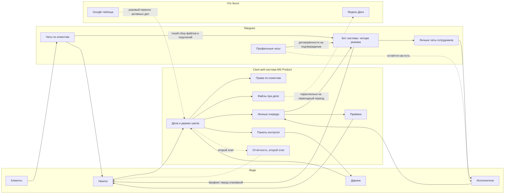

# Интеграционная карта

**Клиент:** `hide`
**Дата:** 2026-09-07
**Архитектура:** своя веб-система в центре контура. CRM и готового таск-трекера нет и не будет: клиент отверг оба на своём опыте.
**Назначение:** согласовать границы контура до предложения и ТЗ.
**Основание:** [AS-IS.md](AS-IS.md), [TO-BE.md](TO-BE.md).

---

## 1. Контур целиком

---

## 2. Потоки данных

| Поток | Направление | Триггер | Содержание | Этап |
|---|---|---|---|---|
| Заведение дела | Человек → система | Планёрка, разговор, ситуативно | Клиент, направление, суть, ответственный, срок | Первый |
| Заведение дела из чата | Telegram → система | Ответ на сообщение командой боту | Черновик дела с текстом сообщения в контексте | Первый |
| Разбивка на дерево шагов | Внутри системы | Дело многоуровневое | Узел, исполнитель, срок, вложенные шаги | Первый |
| Уведомление о назначении | Система → Telegram | Назначен исполнитель | Что, по какому клиенту, до когда | Первый |
| Закрытие этапа | Исполнитель → система | Работа сделана | Отметка, комментарий, файл | Первый |
| Активация следующего этапа | Внутри системы | Предыдущий закрыт | Уведомление следующему исполнителю | Первый |
| Отправка на приёмку | Система → руководитель | Дело готово | Результат, файлы, контекст | Первый |
| Решение по приёмке | Руководитель → система | Проверил | Принял, вернул с замечанием, отправил клиенту | Первый |
| Ожидание клиента | Внутри системы | Отправлено клиенту | Статус плюс напоминание при молчании | Первый |
| Загрузка документа | Человек → система | Появился файл по делу | Файл с привязкой к делу | Первый |
| Перехват файла из чата | Telegram → система | Файл появился в чате клиента или профильном | Файл плюс запрос команде, к какому делу прицепить | Первый |
| Контроль тишины | Система → руководитель | Ожидание дольше нормы | Напоминание, при молчании эскалация | Первый |
| Брифинг перед планёркой | Система → Никита | За час до созвона с клиентом | Что сделано с прошлой встречи, что зависло, что попросить | Первый |
| Панель контроля | Система → Дарина | Постоянно | Нагрузка, сроки, где встало, что горит | Первый |
| Перенос из таблицы | Google-таблица → система | Старт внедрения | Активные дела и контекст | Первый, разово |
| Недельная выгрузка | Система → человек | Запрос | Выполненное за период по сотруднику и клиенту | Второй |
| Черновик месячного отчёта | Система → человек | Конец месяца | Ключевые действия с отметками показа клиенту | Второй |
| Разбор реплик в чатах | Telegram → система | Изменение обсудили в профильном чате | Карточка изменения Дарине на подтверждение | Второй |
| Протокол планёрки в дела | Запись или конспект → система | После встречи | Список дел на подтверждение | Второй |
| Регулярное обязательство | Внутри системы | За N дней до срока | Дело заводится автоматически из повторяющегося обязательства | Второй |
| Показатели портфеля | Аналитик → отчёт | Конец месяца | Цифры как есть, вне системы | Вне скоупа |
| Вёрстка отчёта | Человек → дизайнер | Данные готовы | Как сейчас | Вне скоупа |

---

## 3. Модули системы

| Модуль | Назначение | Сложность | Этап |
|---|---|---|---|
| Дела и дерево шагов | Ядро: клиент, направление, ответственный, срок, контекст, вложенные шаги с расчётом прогресса | Medium | Первый |
| Справочники | Клиенты со стадией, направления, сотрудники. Редактируемые | Low | Первый |
| Права по клиентам | Кто какие дела видит. Замена логики раздельных вкладок | Medium | Первый |
| Статусы и признаки | Приёмка, оба вида ожидания, согласовано с клиентом, приоритет, просрочка | Low | Первый |
| Личная очередь | Свой список задач, самостоятельное закрытие этапов | Low | Первый |
| Приёмка | Настраиваемая роль принимающего, возврат с замечанием | Medium | Первый |
| Панель контроля | Нагрузка, сроки, ход дела по этапам, где встало | Medium | Первый |
| Файлы | Хранение при деле, загрузка из веба и из Telegram | Medium | Первый |
| Telegram-бот, личка | Уведомления, быстрые действия «взял», «сделал», утренний дайджест | Medium | Первый |
| Telegram-бот, чаты | Тихий перехват файлов, создание дела ответом на сообщение | Medium | Первый |
| Контроль тишины | Напоминания по ожиданиям и приёмке, эскалация | Low | Первый |
| Брифинг перед планёркой | Сводка по клиенту за час до созвона | Low | Первый |
| Журнал действий | Кто менял статус, срок, ответственного | Low | Первый |
| Перенос данных | Импорт активных дел из Google-таблицы | Medium | Первый, разово |
| Выгрузки | Выполненное за период по сотруднику и клиенту | Low | Второй |
| Черновик отчёта | Ключевые действия с отметками показа клиенту | Medium | Второй |
| Календарь обязательств | Автосоздание регулярных дел за N дней до срока | Low | Второй |
| Активный слушатель чатов | Разбор реплик, карточка изменения на подтверждение | High | Второй |
| Протокол планёрки | Запись или конспект в список дел | Medium | Второй |
| Реестр активов | Дела в разрезе объекта: здание, доля, ЗПИФ | High | Третий |

---

## 4. Точки интеграции

### 4.1. Telegram — единственная обязательная интеграция

Не потому что так удобнее нам, а потому что там живёт команда: 80% контекста, по словам Дарины, и это «внутренний корпоративный софт».

| Что проверить | Почему важно |
|---|---|
| Формат бота: отдельный бот компании | Нужен доступ к созданию и владению ботом |
| Личные уведомления против групповых | Личные обязательны, групповые опциональны и могут раздражать |
| Кто из команды готов принимать уведомления в личку | Организационный вопрос, а не технический |
| Согласие на присутствие бота в клиентских чатах | Решение Никиты, затрагивает клиентов |
| Права бота в группах | Для перехвата файлов нужен доступ к сообщениям группы |

**Четыре режима по типам чатов** описаны в [TO-BE, раздел 3.8](TO-BE.md). Коротко: в личке персональный ассистент, в профильных чатах слушатель, в клиентских чатах тихий сборщик, в общем чате сводки.

**Позиция по первой версии:** бот реагирует на команду, а не читает переписку сам. Уведомления, быстрые действия, перехват файлов, создание дела ответом на сообщение, контроль тишины, брифинг перед планёркой. Автоматический разбор реплик и вытаскивание задач из истории переписки — второй этап: это требует доступа к корпоративной переписке с конфиденциальными данными и отдельного письменного согласования.

**Тишина в клиентских чатах обязательна.** Бот присутствует, но в чат не пишет ничего: клиент не должен видеть внутреннюю кухню. Всё общение с командой идёт в личку.

### 4.2. Яндекс.Диск — параллельная работа, не интеграция

Клиент хранит документы там, Дарина раскладывает их руками. В целевой картине файлы живут при деле.

**Позиция:** программной интеграции в первой версии нет. Яндекс.Диск продолжает работать как есть, пока не убедимся, что в системе всё нужное. Отключение — решение клиента, не наше условие. Автоматическую синхронизацию не обещаем, пока не выяснили объёмы и тип аккаунта.

### 4.3. Google-таблица — разовый перенос

Источник истины по задачам переезжает в систему. Таблица не интегрируется и не синхронизируется: две системы правды породят ровно тот же разрыв, от которого уходим.

- Переносим активные дела и контекст.
- Архив вкладок остаётся у клиента доступным на чтение.
- Обратной выгрузки в таблицу нет.

### 4.4. Хостинг

Своего сервера у клиента нет, только Яндекс.Диск. Система размещается на нашей стороне на выделенном контуре под клиента.

- Не общий сервис, где дела инвесторов лежат рядом с чужими данными.
- Ежедневные резервные копии базы и файлов.
- Ежемесячная стоимость хостинга проговаривается в предложении заранее, без сюрприза после подписания.
- Лицензий за пользователей нет: рост штата не меняет цену. Это прямой контраргумент к CRM, которую они уже отвергли.
- **Полная выгрузка данных в любой момент.** У компании на сайте заявлено, что она принципиально не создаёт зависимости от себя. Наш инструмент обязан отвечать тем же: никакого замка на подрядчике.

### 4.5. ИИ-контур — отдельный этап после сдачи системы

Компания уже пользуется моделями, но хаотично: аналитика, справки, расчёты окупаемости. Никита ведёт свою базу знаний. Дарина сознательно ограничивает себя из-за конфиденциальности.

**Позиция:** в первую версию ИИ не закладываем, но архитектуру готовим. Полное описание — [TO-BE, раздел 8](TO-BE.md).

Что это означает для контура интеграций:

- **Система — источник истины, ИИ работает поверх.** Значит нужен отдельный слой доступа к данным с первого дня, а не интерфейс, лезущий в базу напрямую.
- **Внешний ИИ ходит к нам из своего облака,** а не с машины сотрудника. Endpoint придётся выставить публично по HTTPS с авторизацией: спрятать за VPN не получится. Защита — права и журнал обращений.
- **Устойчивость доступа — отдельная работа.** Выделенный сервер под компанию, согласованность страны сервера, карты и почты, регламент для команды. Публичный VPN здесь не годится: общий IP на сотни людей ведёт к блокировке командной подписки.
- **Состав передаваемого согласуется письменно.** Это условие сделки, а не пожелание.

### 4.6. Чего в контуре нет

- **CRM.** Ни amoCRM, ни Битрикс. Клиент отверг сам, у него нет воронки продаж, у него дела.
- **Готовый таск-трекер.** TickTick уже не прижился.
- **Учётные системы и 1С.** Не звучали ни разу.
- **Показатели портфеля.** Считает аналитик, к делам отношения не имеют.
- **Вёрстка отчёта инвестору.** Остаётся у дизайнера, мы отдаём данные.
- **Клиентский доступ.** Вне первой версии, архитектуру закладываем.
- **Реестр активов.** Третий этап. Место в модели данных оставляем сейчас, сам модуль не делаем.
- **Автоматическое чтение переписки.** Второй этап и только с письменного согласия. В первой версии бот отвечает на команду.

---

## 5. Технические и организационные риски

| Риск | Влияние | Как снимаем |
|---|---|---|
| Команда не пойдёт в систему, как не пошла в TickTick | Высокое, организационный и главный | Telegram-действия без захода в веб, минимум экранов, внедрение с сопровождением |
| Дарина остаётся единственной, кто правит данные | Высокое, обнуляет эффект | Личные очереди и самостоятельное закрытие этапов как обязательная часть первой версии |
| Часть работы продолжит идти в личку мимо системы | Высокое | Приёмка как единственный путь сдачи документа, плюс договорённость на уровне Никиты |
| Конфиденциальность: данные инвесторов у подрядчика | Высокое, может убить сделку | Выделенный контур, права по клиентам, журнал действий, бэкапы, письменные условия |
| Перенос данных из таблицы окажется грязным | Среднее | Переносим активные дела, архив оставляем в таблице на чтение |
| Объём файлов из Telegram неизвестен | Среднее | Первая версия — перехват новых файлов и загрузка руками к делу; массовая миграция истории отдельно после оценки |
| Число дел и клиентов вырастет кратно | Среднее | Проектируем на 15–20 клиентов вместо текущих пяти-семи |
| Бот в клиентском чате замечен клиентом | Среднее, репутационное | Бот молчит: ни одного сообщения в чат, вся коммуникация в личку команде. Присутствие согласовывает Никита |
| Дерево шагов окажется слишком сложным для команды | Среднее | Три уровня по умолчанию, глубже по раскрытию; в личной очереди человек видит плоский список, а не дерево |

---

## 6. Что нужно от клиента для старта

1. Доступ на чтение к рабочей Google-таблице целиком, включая лист «частные задачи», для оценки объёма переноса.
2. Список сотрудников с ролями: кто исполнитель, кто руководитель, кто принимает работу.
3. Полный список направлений, включая те, что Никита не назвал.
4. Решение, кто из руководителей принимает работу помимо Никиты.
5. Возможность создать бота компании в Telegram и согласие команды получать уведомления в личку.
6. Решение Никиты о присутствии бота в клиентских чатах и список чатов, куда его добавляем.
7. Один живой пример многоуровневого дела от начала до конца, с реальной вложенностью — для проверки, что модель дерева легла правильно.
8. Стадии клиентов по их собственному регламенту из семи этапов: кто где находится сейчас.
9. Контактное лицо для согласований и приёмки этапов. По умолчанию Дарина, решение за Никитой.
