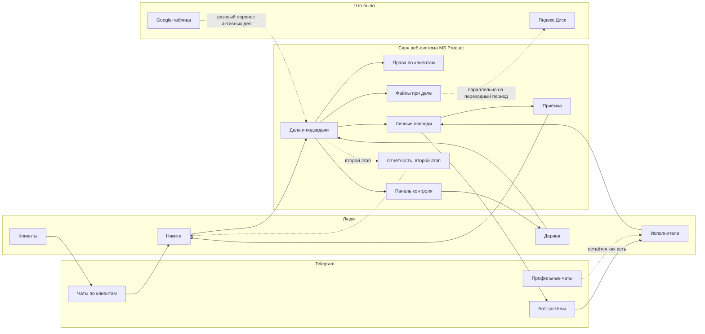

# Интеграционная карта

**Клиент:** `hide`
**Дата:** 2026-09-07
**Архитектура:** своя веб-система в центре контура. CRM и готового таск-трекера нет и не будет: клиент отверг оба на своём опыте.
**Назначение:** согласовать границы контура до предложения и ТЗ.
**Основание:** [AS-IS.md](AS-IS.md), [TO-BE.md](TO-BE.md).

---

## 1. Контур целиком

---

## 2. Потоки данных

| Поток | Направление | Триггер | Содержание | Этап |
|---|---|---|---|---|
| Заведение дела | Человек → система | Планёрка, разговор, ситуативно | Клиент, направление, суть, ответственный, срок | Первый |
| Разбивка на подзадачи | Внутри системы | Дело многоуровневое | Шаг, исполнитель, срок | Первый |
| Уведомление о назначении | Система → Telegram | Назначен исполнитель | Что, по какому клиенту, до когда | Первый |
| Закрытие этапа | Исполнитель → система | Работа сделана | Отметка, комментарий, файл | Первый |
| Активация следующего этапа | Внутри системы | Предыдущий закрыт | Уведомление следующему исполнителю | Первый |
| Отправка на приёмку | Система → руководитель | Дело готово | Результат, файлы, контекст | Первый |
| Решение по приёмке | Руководитель → система | Проверил | Принял, вернул с замечанием, отправил клиенту | Первый |
| Ожидание клиента | Внутри системы | Отправлено клиенту | Статус плюс напоминание при молчании | Первый |
| Загрузка документа | Человек → система | Появился файл по делу | Файл с привязкой к делу | Первый |
| Панель контроля | Система → Дарина | Постоянно | Нагрузка, сроки, где встало, что горит | Первый |
| Перенос из таблицы | Google-таблица → система | Старт внедрения | Активные дела и контекст | Первый, разово |
| Недельная выгрузка | Система → человек | Запрос | Выполненное за период по сотруднику и клиенту | Второй |
| Черновик месячного отчёта | Система → человек | Конец месяца | Ключевые действия с отметками показа клиенту | Второй |
| Показатели портфеля | Аналитик → отчёт | Конец месяца | Цифры как есть, вне системы | Вне скоупа |
| Вёрстка отчёта | Человек → дизайнер | Данные готовы | Как сейчас | Вне скоупа |

---

## 3. Модули системы

| Модуль | Назначение | Сложность | Этап |
|---|---|---|---|
| Дела и подзадачи | Ядро: клиент, направление, ответственный, срок, контекст, шаги | Medium | Первый |
| Справочники | Клиенты, направления, сотрудники. Редактируемые | Low | Первый |
| Права по клиентам | Кто какие дела видит. Замена логики раздельных вкладок | Medium | Первый |
| Статусы и признаки | Приёмка, оба вида ожидания, согласовано с клиентом, приоритет, просрочка | Low | Первый |
| Личная очередь | Свой список задач, самостоятельное закрытие этапов | Low | Первый |
| Приёмка | Настраиваемая роль принимающего, возврат с замечанием | Medium | Первый |
| Панель контроля | Нагрузка, сроки, ход дела по этапам, где встало | Medium | Первый |
| Файлы | Хранение при деле, загрузка из веба и из Telegram | Medium | Первый |
| Telegram-бот | Уведомления и быстрые действия «взял в работу», «сделал» | Medium | Первый |
| Журнал действий | Кто менял статус, срок, ответственного | Low | Первый |
| Перенос данных | Импорт активных дел из Google-таблицы | Medium | Первый, разово |
| Выгрузки | Выполненное за период по сотруднику и клиенту | Low | Второй |
| Черновик отчёта | Ключевые действия с отметками показа клиенту | Medium | Второй |

---

## 4. Точки интеграции

### 4.1. Telegram — единственная обязательная интеграция

Не потому что так удобнее нам, а потому что там живёт команда: 80% контекста, по словам Дарины, и это «внутренний корпоративный софт».

| Что проверить | Почему важно |
|---|---|
| Формат бота: отдельный бот компании | Нужен доступ к созданию и владению ботом |
| Личные уведомления против групповых | Личные обязательны, групповые опциональны и могут раздражать |
| Кто из команды готов принимать уведомления в личку | Организационный вопрос, а не технический |

**Позиция:** бот только для уведомлений и быстрых действий. Разбор существующих чатов, вытаскивание задач из переписки и чтение истории в первую версию не входят. Это заманчиво выглядит, но требует доступа к корпоративной переписке с конфиденциальными данными — отдельный разговор с отдельным согласованием.

### 4.2. Яндекс.Диск — параллельная работа, не интеграция

Клиент хранит документы там, Дарина раскладывает их руками. В целевой картине файлы живут при деле.

**Позиция:** программной интеграции в первой версии нет. Яндекс.Диск продолжает работать как есть, пока не убедимся, что в системе всё нужное. Отключение — решение клиента, не наше условие. Автоматическую синхронизацию не обещаем, пока не выяснили объёмы и тип аккаунта.

### 4.3. Google-таблица — разовый перенос

Источник истины по задачам переезжает в систему. Таблица не интегрируется и не синхронизируется: две системы правды породят ровно тот же разрыв, от которого уходим.

- Переносим активные дела и контекст.
- Архив вкладок остаётся у клиента доступным на чтение.
- Обратной выгрузки в таблицу нет.

### 4.4. Хостинг

Своего сервера у клиента нет, только Яндекс.Диск. Система размещается на нашей стороне на выделенном контуре под клиента.

- Не общий сервис, где дела инвесторов лежат рядом с чужими данными.
- Ежедневные резервные копии базы и файлов.
- Ежемесячная стоимость хостинга проговаривается в предложении заранее, без сюрприза после подписания.
- Лицензий за пользователей нет: рост штата не меняет цену. Это прямой контраргумент к CRM, которую они уже отвергли.

### 4.5. ИИ — вне первой версии

Компания уже пользуется моделями, но хаотично: аналитика, справки, расчёты окупаемости. Никита ведёт свою базу знаний. Дарина сознательно ограничивает себя из-за конфиденциальности.

**Позиция:** в первую версию ИИ не закладываем. Заявляем как отдельное направление. Любая работа с моделями по их данным потребует письменного согласования состава передаваемого.

### 4.6. Чего в контуре нет

- **CRM.** Ни amoCRM, ни Битрикс. Клиент отверг сам, у него нет воронки продаж, у него дела.
- **Готовый таск-трекер.** TickTick уже не прижился.
- **Учётные системы и 1С.** Не звучали ни разу.
- **Показатели портфеля.** Считает аналитик, к делам отношения не имеют.
- **Вёрстка отчёта инвестору.** Остаётся у дизайнера, мы отдаём данные.
- **Клиентский доступ.** Вне первой версии, архитектуру закладываем.

---

## 5. Технические и организационные риски

| Риск | Влияние | Как снимаем |
|---|---|---|
| Команда не пойдёт в систему, как не пошла в TickTick | Высокое, организационный и главный | Telegram-действия без захода в веб, минимум экранов, внедрение с сопровождением |
| Дарина остаётся единственной, кто правит данные | Высокое, обнуляет эффект | Личные очереди и самостоятельное закрытие этапов как обязательная часть первой версии |
| Часть работы продолжит идти в личку мимо системы | Высокое | Приёмка как единственный путь сдачи документа, плюс договорённость на уровне Никиты |
| Конфиденциальность: данные инвесторов у подрядчика | Высокое, может убить сделку | Выделенный контур, права по клиентам, журнал действий, бэкапы, письменные условия |
| Перенос данных из таблицы окажется грязным | Среднее | Переносим активные дела, архив оставляем в таблице на чтение |
| Объём файлов из Telegram неизвестен | Среднее | Первая версия — загрузка руками к делу; массовая миграция отдельно после оценки |
| Число дел и клиентов вырастет кратно | Среднее | Проектируем на 15–20 клиентов вместо текущих пяти-семи |

---

## 6. Что нужно от клиента для старта

1. Доступ на чтение к рабочей Google-таблице целиком, включая лист «частные задачи», для оценки объёма переноса.
2. Список сотрудников с ролями: кто исполнитель, кто руководитель, кто принимает работу.
3. Полный список направлений, включая те, что Никита не назвал.
4. Решение, кто из руководителей принимает работу помимо Никиты.
5. Возможность создать бота компании в Telegram и согласие команды получать уведомления в личку.
6. Один живой пример многоуровневого дела от начала до конца — для проверки, что модель шагов легла правильно.
7. Контактное лицо для согласований и приёмки этапов. По умолчанию Дарина, решение за Никитой.
