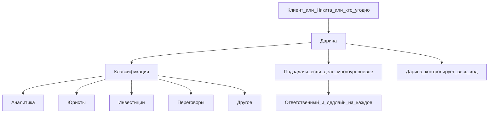

# HIDE — контекст

**Ид:** `hide`
**Статус:** лид. Ответы на бриф 2026-09-01, только вопросы 1 и 2.
**ЛПР:** Никита Семёнов. Операционный узел: Дарина.
**Источник:** Telegram 2026-09-01, транскрипт [`../04_Встречи/2026-09-01_ответы_Никита_вопросы_транскрипт.md`](../04_Встречи/2026-09-01_ответы_Никита_вопросы_транскрипт.md)

Ниже только то, что сказал Никита, плюс открытые дыры. Сайт и старый COO-контекст сюда не подмешиваю.

## Боль через 60 дней

Иначе внедрение бесполезно:

одна система на всю команду: передача и ведение дел по всем клиентам, видны задачи, ими управляют, у каждой дедлайн и ответственный. Задачи приходят двумя путями: ситуативно по ходу и основные после планерок с клиентами.

Первый контур его словами: учёт, задачи, ответственные, выполнение.

## Как сейчас идёт дело

1. Задача приходит от клиента, от Никиты или от кого угодно.
2. Её заводят на Дарину. Она не исполнитель всего: распределяет людей, дедлайны, процесс, держит контроль.
3. Классификация, которую он назвал: аналитика, юристы, инвестиции, переговоры, плюс ещё не сформулировал.
4. Дело может быть многоуровневым. Пример: обменять долю одной компании на другую = 5–7 подзадач. На каждую свой человек и срок, по направлению.

Главная сущность по его речи: **дело / задача**, не сделка CRM. Карточка клиента и активы в этих двух ответах не звучат.

## Команда из этих ответов

| Кто | Роль в потоке | Источник |
|---|---|---|
| Никита | ставит задачи, ЛПР | голос 2 |
| Дарина | единая точка приёма, распределение, дедлайны, контроль | голос 2, чат про созвон |
| Аналитика, юристы, инвестиции, переговоры | исполнители по классу задачи | голос 2 |

Имена кроме Никиты и Дарины, штат 12 с сайта, приоритет внедрения: **нет в ответах**.

## Созвон

2 сентября 2026, 15:00, Никита плюс Дарина. Он сам спросил анкету, потом ответил голосом на 1 и 2.

## Ещё нет

3. приоритет людей в систему  
4. что сломалось в TickTick  
5. кто в Claude и чего не хватает  
6. где лежит контекст: документы, таблицы, переписка  
7. критерий года  

Живых файлов как есть тоже нет.

## Что это меняет в архитектуре

Гипотеза, не решение: первая версия = очередь дел с классами, ответственными, дедлайнами и контролем Дарины. Разбиение большого дела на подзадачи сразу, не потом. Планерка с клиентом должна порождать пачку основных задач.

Не закладывать CRM-воронку. Не обещать клиентское одно окно и общий Claude, пока нет ответов 5–7.
