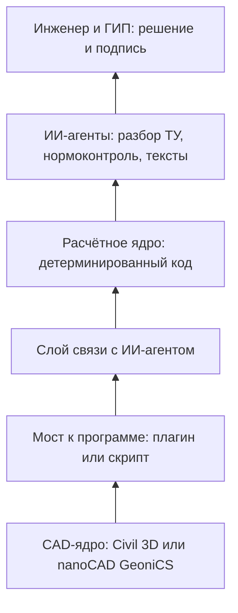

# ИИ в проектировании наружных сетей: что уже работает и как внедрять

Разбор для руководителя проектной организации или начальника отдела. Не про технологии, про сроки, возвраты из экспертизы и себестоимость раздела.

Дата подготовки: 18.08.2026.

---

## 1. Короткий вывод

Полностью заменить инженера-проектировщика нейросеть не может, и упирается это не в интеллект, а в право подписи. С 1 марта 2026 года по 309-ФЗ специалисты по организации проектирования отвечают за качество проектной и рабочей документации, а документация подаётся на экспертизу подписанной усиленной квалифицированной электронной подписью участников разработки. Ответственность лежит на физическом лице из национального реестра специалистов, и передать её инструменту нельзя.

При этом существенная доля рабочего времени инженера уходит на механику: разбор исходных данных, оформление, сверка, поиск норм, выпуск ведомостей и спецификаций, ответы на замечания. Отраслевые оценки называют до 60% времени, но это оценки поставщиков решений, а не независимое исследование. Свою долю организация измеряет по собственному учёту.

**Реалистичная модель ближайших лет — не «ИИ вместо инженера», а перераспределение: механика уходит в инструменты, инженер занимается решениями, согласованиями и защитой проекта.** Сокращение штата как цель внедрения — плохая постановка: она убивает мотивацию тех, кто должен внедрять.

---

## 2. Что автоматизируется, а что нет

Важное уточнение к таблице: «автоматизируется» почти везде означает не языковую модель, а специализированные CAD- и расчётные инструменты. Чат с нейросетью и автотрассировка в Civil 3D — разные технологии, и путать их дорого.

| Операция | Статус | Чем именно |
|---|---|---|
| Сбор и разбор исходных данных, ТУ | Помогает языковая модель | Разбор ТУ в чек-лист, поиск недостающих данных, сверка ТУ с заданием |
| Трассировка сети в плане с обходом препятствий | Автоматизируется CAD-инструментами | Алгоритмы поиска пути по графу (A*, Дейкстра, Йена), генеративный дизайн. Требует разработки или покупки |
| Гидравлика, подбор диаметров и уклонов | Автоматизируется расчётными программами | Детерминированный расчёт плюс подбор по каталогу. Языковая модель к арифметике не допускается |
| Продольные профили, колодцы, футляры | Автоматизируется CAD-инструментами | Надстройки к Civil 3D и nanoCAD, при условии модельной дисциплины |
| Коллизии со смежными сетями, нормативные расстояния | Автоматизируется при комплексной модели | Работает только если все сети моделируются в единой технологии |
| Спецификации, ведомости, объёмы | Автоматизируется генерацией из модели | Экономия тем выше, чем чище модель |
| Нормоконтроль и оформление | Частично, с проверкой человеком | Формальная часть автоматизируется, финальная проверка за человеком |
| Принципиальные решения, переговоры с ресурсниками, защита в экспертизе | Только человек | Ответственность и коммуникация |
| Подпись, статус в НРС, ответственность по 309-ФЗ | Только человек | Юридически непередаваемо |

---

## 3. Кто это уже сделал

Публичные заявления компаний и государственных структур. Отнеситесь к цифрам как к заявлениям заинтересованных сторон: независимого аудита ни по одному из кейсов нет.

**ПИК.** Единая технология моделирования всех наружных сетей в Autodesk Civil 3D плюс собственные инструменты. Автоматизировано около 70% основных графических данных рабочей документации **по наружным сетям связи** (не по всем разделам). Время выпуска сократилось с нескольких дней до нескольких часов, трудозатраты минимум вдвое. Адаптация проектировщика к технологии — 3–5 дней.

**Ростех, платформа «KPD-проект».** По заявлению компании: пилот с участием более 350 инженеров из 18 регионов, подготовка полного комплекта с трёх месяцев до одной недели, возвраты от госэкспертизы до 2%. Оттуда же оценка про 60% механической рутины. Решение выведено в коммерческую эксплуатацию.

**НЛМК-Инжиниринг.** Автоматический трассировщик с элементами ИИ в nanoCAD и Model Studio CS: компоновка оборудования и трассировка трубопроводов в автоматическом режиме.

**Государственная экспертиза.** Сервис «Цифровой нормоконтроль» Центра ИИ в градостроительстве Москвы прошёл межрегиональный пилот на реальных объектах госэкспертизы и тиражируется в регионы. Проверяет соответствие требованиям ГОСТ Р 21.101 к оформлению.

**Коммерческие ИИ-нормоконтролёры** (TimDoc, RomanAI и аналоги): проверка комплекта по тысяче с лишним нормативных требований, подготовка ответов на замечания экспертизы.

**Вывод, который стоит осознать отдельно:** экспертиза уже проверяет документацию нейросетью. Организация, которая не проверяет себя тем же способом до подачи, отдаёт преимущество.

---

## 4. Как это устроено технически

Шесть слоёв, снизу вверх:

**Ключевой инженерный принцип: цифры считает код, языковая модель только читает, ищет, формулирует и проверяет.** Всё, что попадает в расчёт, должно быть детерминированным и воспроизводимым. Нарушение этого принципа — главная причина провальных внедрений.

Для нормоконтроля работает только схема, где модели подаётся сам текст действующей нормы, а она ищет расхождения в нём. Требование «привести пункт и цитату» без такой подачи снижает риск, но не снимает его: модель способна сгенерировать и номер пункта, и правдоподобный текст цитаты. Финальная сверка по первоисточнику остаётся обязательной операцией регламента.

---

## 5. Три волны внедрения

Порядок принципиален: каждая следующая волна опирается на результат предыдущей и на доверие, наработанное на ней.

### Волна 1. Текстовый контур. Месяц, без вмешательства в CAD

Что внедряется: разбор ТУ и заданий, ИИ-нормоконтроль комплектов перед сдачей, подготовка пояснительных записок, писем и ответов на замечания экспертизы.

Почему первой: нулевой технический риск, ничего не меняется в производственном процессе, проверяется на архиве закрытых проектов. Окупается сразу за счёт снижения возвратов.

Что нужно: доступ к моделям, полдня обучения на инженера, регламент по конфиденциальности.

### Волна 2. Автоматизация выпуска. Месяцы 2–4

Что внедряется: генерация продольных профилей, таблиц колодцев, спецификаций и ведомостей из модели, автопроверка нормативных расстояний и коллизий между всеми сетями, библиотека узлов и шаблонов.

Здесь основная экономия часов, и здесь же основные затраты: это разработка или покупка инструментов, а не подписка на чат. Именно на этом этапе ПИК получил сокращение выпуска графики в разы.

Что нужно: единая технология моделирования всех наружных сетей (без этого автопроверка коллизий не работает), разработка или покупка инструментов под CAD, ответственный за развитие технологии.

### Волна 3. Генеративная трассировка. Месяцы 5–9

Что внедряется: автотрассировка по графу с учётом препятствий и нормативных разрывов, автоподбор диаметров и уклонов, генерация вариантов решений с оценкой стоимости, работа с моделью через диалог с агентом.

Что нужно: результаты волны 2, зрелая модельная дисциплина, готовность инвестировать в разработку.

---

## 6. Пилот на две недели

Точка входа с минимальным риском и понятной метрикой.

**Что делаем.** Берём 3 закрытых проекта, по которым известны замечания экспертизы. Прогоняем текстовую часть через ИИ-нормоконтроль. Сравниваем результат с реальными замечаниями.

**Метрика.** Доля реальных замечаний экспертизы, которые ИИ нашёл заранее. Плюс доля ложных срабатываний.

**Решение.** Переход к волне 2 принимается по этой цифре, а не по впечатлению.

**Ресурс.** Один инженер, две недели по два часа в день. Стоимость доступа к моделям на этом объёме несущественна.

---

## 7. Экономика

Расчёт под конкретную организацию делается по своим данным. Схема расчёта:

| Показатель | Как считать |
|---|---|
| Трудоёмкость раздела сейчас | Часы на один раздел НВК, из вашего учёта |
| Доля механики | Считать по своему учёту. Отраслевой ориентир «до 60%» — оценка поставщиков решений |
| Реалистичное снятие в волне 1 | Гипотеза: 15–25% общей трудоёмкости |
| Реалистичное снятие в волне 2 | Гипотеза: ещё 25–35% |
| Стоимость нормо-часа | Ваша |
| Экономия на возвратах экспертизы | Число возвратов за год × стоимость переделки |
| Затраты | Подписки на модели, обучение, разработка инструментов в волне 2 |

Все проценты снятия помечены как гипотеза: они зависят от типа объектов и текущего уровня автоматизации. Достоверную цифру даёт пилот.

**Отдельная статья выгоды, которую часто забывают.** С 1 марта 2026 отрицательное заключение экспертизы влечёт передачу сведений о специалисте в НОПРИЗ в течение 5 рабочих дней. Это не автоматическое исключение из реестра: обстоятельства рассматриваются, решение принимает Совет. Но история накапливается, и для организации это кадровый риск — специалисты с правом подписи заменяются тяжело. Снижение числа отрицательных заключений здесь ценнее операционной экономии.

---

## 8. Риски и как их закрывать

| Риск | Как закрывается |
|---|---|
| Галлюцинации в нормах: выдуманные пункты и цитаты | Подача модели самого текста действующей нормы, обязательная сверка по первоисточнику, регламентный запрет ссылок без проверки |
| Ссылки на отменённые редакции | Проверка статуса документов в официальном источнике, отдельный шаг в чек-листе сдачи. Свежий пример: ГОСТ Р 21.101-2020 заменён редакцией 2026 года |
| Ошибки в расчётах | Числа считает детерминированный код, языковая модель к арифметике не допускается |
| Утечка данных клиента | Регламент по конфиденциальности, обезличивание, для закрытых проектов — локальный контур |
| Расслабление инженеров | ИИ на входе, человек на выходе. Проверка обязательна, ответственность персональна |
| Зависимость от одного энтузиаста | Технология описывается регламентом, а не живёт в голове одного сотрудника |

---

## 9. Что сделать на этой неделе

1. Назначить ответственного за пилот. Один инженер, две недели
2. Выбрать 3 закрытых проекта с известными замечаниями экспертизы
3. Утвердить регламент по конфиденциальности: что нельзя загружать
4. Через две недели посмотреть на цифру найденных замечаний и принять решение по волне 2

Первый шаг стоит несколько часов рабочего времени и не меняет ни одного производственного процесса. Решение о дальнейших вложениях принимается после него, по цифре.

---

*Юридическая часть актуальна на 18.08.2026. За первое полугодие 2026 регулирование менялось трижды, включая отзыв разъясняющего письма Минстроя от 30.01.2026 № 4420-КМ/14 письмом от 07.08.2026 № 49157-АЕ/14. Перед принятием решений сверяйтесь с действующими редакциями.*
