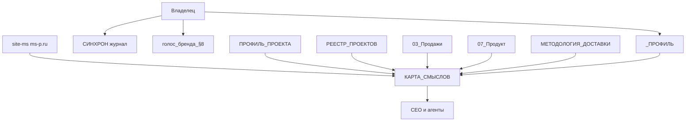

# Карта смыслов бизнеса (MS Product)

> Слой StartPack v1.6 · единая точка правды (SSOT) для ИИ-команды.  
> **Правило:** утверждение → ссылка на источник в vault. Нет данных → `*пробел*`, не выдумывать.  
> Детали не копировать объёмом — править в исходных файлах, здесь держать сводку и статусы.

**Статусы полей:** ✓ подтверждено владельцем · ⚠ из vault, ждет сверки · ❌ устарело · — пусто

---

## Сводка-дашборд

| Параметр | Значение |
|---|---|
| **Бизнес** | MS Product (ИП Шлыков Максим Александрович) |
| **Версия карты** | `1.3` (полная сверка владельца **2026-08-19**, обновлён состав отделов) |
| **Последнее обновление** | 2026-08-19, Архитектор — установка Модуля 2 |
| **Подтверждено владельцем** | **2026-08-19** — «карта подтверждена» после сводки и кассового факта май–август |
| **Источников в vault** | профиль, контекст, продажи, продукт, реестр, сайт, КП, касса `02_Финансы/2026-08-13_доходы_май-август.csv`, ответы владельца |
| **Полнота карты** | **~95%** — закрыты все пробелы, кроме сознательно отложенных |
| **Статус** | 🟢 · вход в Модуль 2 открыт · отложено на ~2026-09-12: контент-машина §13 и тиры коробок §4 |

---

## 1. Идентичность бизнеса

| Поле | Значение | Источник | Статус |
|---|---|---|---|
| Название (юр. + бренд) | ИП Шлыков М.А. / бренд **MS Product** | `08_Системное/ПРОФИЛЬ_ПРОЕКТА.md` | ✓ 2026-08-12 |
| Юр. форма + реквизиты | ИП РФ; полные реквизиты в финансах | `02_Финансы/РЕКВИЗИТЫ_ИП.md` | ✓ 2026-08-12 |
| Сайт | https://ms-p.ru | `08_Системное/_код/site-ms/README.md`, OG в `…/public/index.html` | ✓ 2026-08-12 |
| Год основания | Компания **2023**; в теме с **2019**, «точно в игре» с **2021** | ответ владельца 2026-08-11 | ✓ |
| Стадия зрелости | рост / систематизация (коробки, фикс-чек) + давление долгов | контекст + ответ | ✓ |
| География клиентов | РФ (+ проекты вроде LicenseBridge USA) | реестр + сверка | ✓ 2026-08-12 |
| География операций | **Москва**, удалёнка / свой сервер | ответ владельца | ✓ |
| Часовой пояс | **МСК (UTC+3)** | ответ владельца | ✓ |
| Языки | русский | практика vault | ✓ |

**Одной фразой — что делает бизнес:**
> Системная автоматизация B2B/B2C: CRM + учёт + мессенджеры + код/n8n, с упором на регламент и фикс-чек за продукт.
> (→ `07_Продукт/ПОЗИЦИОНИРОВАНИЕ.md`, `ПРОФИЛЬ_ПРОЕКТА.md`)

**Одной фразой — что НЕ делает:**
> Не веб-студия «сайт ради сайта»; не «включили виджет — готово» без обучения и приёмки; не замена внутреннего продукта/стратегии клиента.
> (→ `07_Продукт/ПОЗИЦИОНИРОВАНИЕ.md` § «Чем мы не являемся»)

---

## 2. Миссия, видение, ценности

| Поле | Значение | Источник | Статус |
|---|---|---|---|
| Миссия | Вывод владельца (и клиентов) из операционки через архитектуру и системность | `.cursorrules`, контекст | ✓ 2026-08-12 |
| Видение (3–5 лет) | 1 млн+ ₽/мес, 0% операционки у владельца | ответ владельца; §17 этой карты | ✓ 2026-08-12 |
| Ценности | Бог в центре; Твердое слово; Регулярность; системность > пожары | контекст + `.cursorrules` | ✓ 2026-08-12 |
| Девиз / манифест | «Хочу, чтобы каждый малый бизнес имел правильный фундамент для возможностей большого роста» | `03_Продажи/БОЛИ_И_ВОЗРАЖЕНИЯ.md` | ✓ 2026-08-12 |

---

## 3. Целевая аудитория

| Сегмент | Кто это | Боль (JTBD) | Что покупают | Источник | Статус |
|---|---|---|---|---|---|
| ЦА-1 Собственник / РОП SMB | Продажи + склад/оплаты, ручные переносы между системами | Хаос учёта, зависимость от себя, нет контроля заявок | Внедрение amo/МС/интеграций, регламенты | `ПОЗИЦИОНИРОВАНИЕ.md`, боли | ✓ 2026-08-12 |
| ЦА-2 Крупный собственник | Масштаб, отдел продаж | Нужна «боевая» система: CRM, стандарты, ОК, менеджеры дерутся за заявки | Диагностика + системный контур | якорь в `БОЛИ_И_ВОЗРАЖЕНИЯ.md` | ✓ 2026-08-12 |
| ЦА-3 | **нет и не нужен** — фокус сознательно на двух сегментах | | | ответ владельца 2026-08-13 | ✓ |

**Главная боль клиента (банк фраз):** операционный хаос, склад/CRM/касса врозь, «всё держится на мне»  
(→ `03_Продажи/БОЛИ_И_ВОЗРАЖЕНИЯ.md`)

**Топ-3 возражения:**
1. «Мы уже пробовали, не прижилось»
2. «Дорого»
3. «У нас специфика»  
(→ тот же файл)

**Кому НЕ продаём:** кто хочет галочку без дисциплины обучения/приёмки; чистый сайт без процессов — только с явными границами  
(→ `ПОЗИЦИОНИРОВАНИЕ.md`)

**Триггер покупки:** **рост** — объём вырос, старая схема не тянет. Не пожар и не рекомендация: клиент приходит, когда упёрся в потолок ручного процесса ✓ (ответ владельца 2026-08-13)

Следствие для продаж: питч строится не на «спасём от хаоса», а на «выдержит следующий объём». Разбор дыр и кейсы работают как подтверждение, а не как повод.

---

## 4. Продукты и линейка

### Модель денег (подтверждено владельцем 2026-08-11)

1. **Флагман / основная прибыль — проектные внедрения** (фикс за этап/проект, DoD).  
2. **Обязательный второй контур — техсопровождение** (почасовка): без него бизнес «не живёт».  
3. Тиры Базовый/Стандарт/Премиум в `КАРКАС_ПАКЕТОВ.md` — **скелет**, не зафиксированы ценами.  
   **Отложено до ~2026-09-12:** заполнить тиры ценами/составом (не трогаем сейчас — не бьёт в −500к долгов).

| Продукт | Кому | Цена | Срок | Чем отличается | Источник | Статус |
|---|---|---|---|---|---|---|
| Проектное внедрение (фикс) | ЦА-1–2, ЛПР | **от 70 000 ₽**; ощущение среднего чека **~150 000 ₽** (владелец: «очень по ощущениям»); на 70к обычно есть продолжение | по DoD / этапам | инженерия + регламент + приёмка | ответ владельца | ✓ вилка / ⚠ среднее |
| **Keris Club — эталон упаковки фикса** | Карина / питомник+груминг | **220 000 ₽**: 110к + 80к + 30к (модули); оплата 80 / 80 / 60 | 4 недели | 3 именованных результата; гарантия 6 мес amo/неделя (cap 12); старт срока после оплаты | `Keris_Club/README.md`, `ЭТАЛОН_КП_И_ПРЕЗЕНТАЦИИ.md` | ✓ эталон |
| Billboardoff — другой фикс-КП (не эталон) | Сергей / РА | **260 000 ₽** одной ценой; оплата 100 / 90 / 70; допы **4 000 ₽/ч**; гарантия 3 мес/неделя | 5 недель | цена модулями клиенту не дробится; КП ещё пересобирать (было «размыто») | `Billboardoff/КОММЕРЧЕСКИЕ_УСЛОВИЯ.md` | ⚠ вариант / дожим |
| LicenseBridge — телефония/Pleep (малый фикс) | Павел | 55–75 000 ₽ (варианты A/B) | *в предложении* | модульный фикс | `LicenseBridge_USA/2026-07-25_…Pleep.md` | ⚠ |
| Триумф снабжение | Андрей | **цена этапа TBD** (блок до 10–15 заявок); внутр. ориентир ≥5 000 ₽/ч проекта | этапно | своя система, не CRM; высокий потенциал | `Триумф_снабжение/КОММЕРЧЕСКИЕ_УСЛОВИЯ.md` | ⚠ черновик |
| Техсопровождение | текущие клиенты | было **3 000 ₽/ч**; цель **4 000 ₽/ч** (МАРТАче переведён; ещё с одним согласует); гибко **3 500 ₽/ч** | по запросу | SLA / доработки вне фикса | ответ владельца | ✓ |
| Тиры коробок | рынок | *пробел* | *пробел* | логика 3 тиров есть | `07_Продукт/КАРКАС_ПАКЕТОВ.md` | ⏰ ~2026-09-12 |

**Эталон коммерческой упаковки:** Keris Club (и шаблон [`08_Системное/Шаблоны/ЭТАЛОН_КП_И_ПРЕЗЕНТАЦИИ.md`](../Шаблоны/ЭТАЛОН_КП_И_ПРЕЗЕНТАЦИИ.md)). Billboardoff — частный кейс с другой логикой цены/гарантии, не подменять эталон.

**Внутренняя экономика проектов (не для клиента):** себестоимость часа ориентир **4 000 ₽/ч**, целевая ставка проекта **≥5 000 ₽/ч** (ориентиры в Billboardoff/Триумф).

**Флагман:** проектные внедрения (amo/МС/кастом/аналитика) ✓  
**Lead-magnet:** диагностика / разбор дыр ⚠  
**Upsell:** сопровождение 4к/ч + следующие этапы у того же клиента ✓  
**Промо:** *пробел*

**Метод доставки (5 шагов):** погружаемся → настраиваем → обучаем → внедряем → сопровождаем  
(→ `04_Производство/Шаблоны_ТЗ/МЕТОДОЛОГИЯ_ДОСТАВКИ.md`)

**Продуктовый критерий (владелец, ✓):** решение усиливает **коробку и фикс-чек**, а не разовый «пожар». Приоритет Dev — код вместо найма ассистента: автоматизация должна заменять человека, а не добавлять исполнителя.

---

## 5. Конкуренты

> Список от владельца 2026-08-12. Расширенный пул партнёров amoCRM для глубокого разбора: [amocrm.ru/partners](https://www.amocrm.ru/partners).  
> Сравнения «сильнее/слабее» — по публичным сайтам + позиционированию MS Product; цены публичные ориентиры, не внутренний учёт конкурентов.

### Ближний контур (сопоставимый / прямой)

| Конкурент | URL | Сильнее нас (публично) | Мы сильнее (гипотеза → УТП) | Цена (публично) | Статус |
|---|---|---|---|---|---|
| Make Rock | https://makerock.ru/ | Контент/обучение amo, виджеты в подарок, «без брифов», 200+ внедрений | Глубже инженерия (свой сервер, код, МС+amo), фикс по Keris-эталону, не виджет-фабрика | внедрение от 60к; сопровождение от 5к/ч | ✓ URL |
| Медников, Садыгов и партнёры | https://ms-partners.ru/ | Консалтинг ОП + amo, итерации от 120к / от 2 мес | Кастом + МойСклад/склад/касса, меньше «только воронка» | от 120 000 ₽ / итерация | ✓ URL |
| SINTEZ | https://sintezdev.ru/…/avtomatizaciya-processov | Явные пакеты Старт/Бизнес/Про, срок от 10 дней, Битрикс+1С | Фокус amo/МС + продуктный фикс; мы в CRM-продажах глубже | от 80к / 180к / 400к | ✓ URL |
| LAND PRO | https://landpro.site/crm | Широкий вендорный CRM-консалтинг (не только amo) | Узкая ниша системной автоматизации B2B с кодом и регламентом доставки | *не на лендинге* | ✓ URL |

### Гиганты рынка (не бить в лоб ценой — другая лига)

| Конкурент | URL | Сильнее нас | Мы сильнее | Цена (публично) | Статус |
|---|---|---|---|---|---|
| Команда F5 | https://cmdf5.ru/ | Топ-партнёр amo, виджеты, масштаб команды, AI-агенты | Личный собственник-исполнитель, кастом без «пакета виджетов», МС/касса | *по запросу / калькулятор* | ✓ URL |
| ROCKET.red | https://rocket.red/ | Enterprise-кейсы, от 250к внедрение, бренд | Гибкость малого чека от 70к, скорость, сопровождение 4к/ч | аудит от 30к; внедрение от 250к; сопр. от 50к/мес | ✓ URL |
| Ингруппа | https://ingru.ru/ | 500+ проектов, свои виджеты, BI | Тот же тезис: глубина кастома vs продуктовая линейка виджетов | *по запросу* | ✓ URL |
| Интроверт Системс | https://introvert.bz/ | Крупнейший моновендор amo, 1200+ проектов, Enterprise Edition | Не конкурируем за enterprise-тендеры; играем в SMB/среднем с инженерией | *по запросу* | ✓ URL |
| Leadfactor | https://www.leadfactor.ru/ | 294 проекта, сопровождение действующих аккаунтов, свои решения | Проект+сопровождение одной рукой владельца; связка с учётом/кодом | *по запросу* | ✓ URL |
| Генезис | https://gnzs.ru/ | Виджеты/маркет, кейсы роста конверсий, AI-РОП | Меньше «коробка виджетов» — больше сквозной процесс + сервер | *по запросу* | ✓ URL |

**Также на радаре (AI-команда в CRM, соседняя категория):** [Nexus Pro](https://nexuspro.kz/ai-team) — AI-сотрудники в amo/Kommo/Bitrix; не классический интегратор, но отъедает «автоматизацию продаж».

**Категория:** системная автоматизация / внедрение CRM+учёта под ключ с инженерией ✓  
**УТП:** системный партнёр + гарант фундамента + код/API/свой сервер, не «настроили поля и виджеты» ✓  
**Пул для глубокого анализа:** весь каталог [партнёров amoCRM](https://www.amocrm.ru/partners)

---

## 6. Каналы продаж и трафика

| Канал | URL / @ | Активность | Что приносит | % выручки | Источник | Статус |
|---|---|---|---|---|---|---|
| Сарафан / текущие клиенты | — | **единственный работающий** | проекты + сопровождение | **~100%** | ответ владельца 2026-08-13 | ✓ |
| Сайт | https://ms-p.ru | визитка | доверие при проверке, не источник лидов | ~0% | `08_Системное/_код/site-ms/` | ✓ 2026-08-13 |
| Telegram | https://t.me/MSP_msproduct | CTA сайта | контакт по уже пришедшему лиду | ~0% | `_код/site-ms` | ✓ 2026-08-13 |
| Email | info@msproduct.ru | в CTA | документы и переписка, не привлечение | 0% | `_код/site-ms` | ✓ 2026-08-13 |
| IG / YT / VK / реклама | не ведутся | нет | — | 0% | ответ владельца | ✓ 2026-08-13 |

**Главный канал (деньги сейчас):** сарафан плюс текущие клиенты — **практически 100% выручки** ✓

**Рискованный канал — он же единственный.** Все деньги идут из одного источника, который владелец не контролирует и не масштабирует по своей воле. Сайт и Telegram выручку не приносят: они закрывают проверку на доверие, когда клиент уже пришёл по рекомендации. Плюсом — SPOF на одном исполнителе.

Это не «пробел в маркетинге», а структурный риск номер один после долга: рост объёма невозможно запланировать, пока приток лидов зависит от чужих рекомендаций.

**Конвейер денег (приоритет дожима, слова владельца):**
1. **Триумф** (Андрей) — много денег, предложение/прототип в работе · **в кассе май–август: 0**
2. **MANSBAND** (Миша) — дожать прошлые + следующие · **факт: 343 400 ₽, 33% кассы, главный плательщик**
3. **Береза Групп** (Дима, Глеб; `Активные/Береза_Групп/`) — дожать закрытие прошлых → следующие · **факт: 8 500 ₽ (подписка МойСклад)**
4. **Keris Club** — чтобы стабильно работало · **факт: 168 000 ₽ из заявленных 230к, остаток этапа**
5. **Billboardoff** (от Максима DKAcademy) — новое предложение: прошлое «размыто» · **в кассе май–август: 0**
6. **DIVO Motors** — меньше денег, но в работе · **факт: 69 500 ₽**

Расхождение: приоритет конвейера и фактические поступления — разные списки. Платят сейчас Mansband, Keris, LicenseBridge, МАРТАче. Триумф и Billboardoff в приоритете №1 и №5, в кассе их нет.

---

## 7. Воронка и путь клиента

| Этап | Что происходит | Источник | Статус |
|---|---|---|---|
| Узнавание | сайт / сарафан / сеть | практика | ✓ 2026-08-12 |
| Лид | TG / диагностика | боли, сайт | ✓ 2026-08-12 |
| Квалификация | погружение в процессы | методология доставки | ✓ 2026-08-12 |
| КП / презентация | пакеты, якорь для собственников, эталон Keris | продажи, продукт | ✓ 2026-08-12 |
| Сделка | согласование фикса / старт оплаты | практика | ✓ 2026-08-12 |
| Поставка | 5 шагов доставки; **здесь главное узкое место** | методология + ответ | ✓ 2026-08-12 |
| Повтор / поддержка | техподдержка 4к/ч, доработки, следующие этапы | реестр | ✓ 2026-08-12 |

**Цикл сделки (lead → деньги):** примерно **1,5–2 месяца** ✓ (ответ владельца 2026-08-12)

**Узкое место:** дожимать проекты до конца — чтобы встали на рельсы и стабильно работали без ошибок. «Последние 10% будто бы всегда не дожимаю.» ✓  
(→ напрямую бьёт в конвейер денег и −500к долгов: закрытие = деньги + репутация)

---

## 8. Голос бренда (tone of voice)

| Параметр | Значение | Источник | Статус |
|---|---|---|---|
| Tone (3 эпитета) | прямой, конкретный, без канцелярита | сверка владельца 2026-08-12 | ✓ 2026-08-12 |
| Обращение | «ты»/«вы» по каналу; внешне — как живой человек | сверка 2026-08-12 | ✓ 2026-08-12 |
| Эмодзи | по умолчанию нет в деловой переписке | сверка 2026-08-12 | ✓ 2026-08-12 |
| Длина | коротко, 2–3 абзаца | сверка 2026-08-12 | ✓ 2026-08-12 |
| Стоп | длинное тире; слэш; двойные кавычки; «коллеги»; вода | сверка 2026-08-12 | ✓ 2026-08-12 |
| Маркеры | «Проверили…», «упираемся в…», прямой вопрос в конце | сверка 2026-08-12 | ✓ 2026-08-12 |
| Референс | не бот / не пресс-релиз | сверка 2026-08-12 | ✓ 2026-08-12 |

В чате Cursor с владельцем — ультра-коротко, ISTJ (`_ПРОФИЛЬ/СТИЛЬ_РАБОТЫ.md`).

---

## 9. Команда и роли

| Роль | Имя | Зона | % | Источник | Статус |
|---|---|---|---|---|---|
| Собственник / исполнитель | Максим | всё: продажи, производство, сопровождение, финансы | ~100% операций | профиль проекта + ответ 2026-08-13 | ✓ |
| ИИ-команда в Cursor | Ио (CEO), Архивариус, Аудитор, Архитектор плюс 12 руководителей отделов | подготовка ТЗ, инструкции, порядок, аналитика контекста, ведение отделов | рабочая сила вместо найма | `_СИСТЕМА/РЕЕСТР_КОМАНДЫ.md` | ✓ 2026-08-19 |

**Размер:** 1 человек в штате. Подрядчиков и фрилансеров **нет** ✓ 2026-08-13  
**Чем закрывается нехватка рук:** ИИ-команда в Cursor. Это осознанная ставка, а не временная мера — продуктовый критерий владельца (§4) прямо говорит: автоматизация должна заменять человека, а не добавлять исполнителя.  
**Формат:** удалёнка, свой сервер  
**Single point of failure:** Максим — да, полностью

Что это значит для сборки отделов: руководителей-людей нет ни в одном отделе. Все руководители отделов — ИИ, режим «играю», а не «усиливаю». Владелец остаётся единственным исполнителем и приёмщиком.

(→ `ПРОФИЛЬ_ПРОЕКТА.md`, `3. АГЕНТЫ/README.md`)

---

## 10. Финансовая модель

> Чувствительное. Цифры только из владельца / контекста; не тащить в отчёт ДЗ.

| Поле | Значение | Источник | Статус |
|---|---|---|---|
| Выручка / мес | **кассовый факт май–июль: 216 / 314 / 331 тыс. ₽**, среднее **287 тыс.** Август на 13-е уже **187 тыс.** (месяц не закрыт). Оценка «150–250к, стоит» — снята | `02_Финансы/2026-08-13_доходы_май-август.csv` | ✓ 2026-08-13 |
| Долг **итого** | **1 722 294 ₽** (сверка 2026-08-11) | реестр кредитов владельца | ✓ |
| — Т-Банк Максим | 53 879 + 396 169 | ответ | ✓ |
| — Сбер Максим | 173 253 | ответ | ✓ |
| — Альфа Максим | 47 993 | ответ | ✓ |
| — Альфа Настя | 740 000 | ответ | ✓ |
| — Т-Банк Бизнес | 210 000 | ответ | ✓ |
| — Альфа займ | 51 000 | ответ | ✓ |
| — Дедушка займ | 50 000 | ответ | ✓ |
| Подушка | 0 (срез) | контекст | ⚠ |
| Цель 90 дней | закрыть **500 000 ₽** долгов (из ~1,72 млн) | ответ владельца | ✓ |
| Средний чек проекта | ощущение ~150к; вход от 70к | ответ владельца | ⚠ ощущение |
| Ставка сопровождения | 3к → 4к ₽/ч (частично) | ответ владельца | ✓ |
| Модель | фикс-проекты + почасовое сопровождение | ответ + КП | ✓ |
| Контур учёта | **один** — бизнес и личное не разделяются | решение владельца 2026-08-13 | ✓ |

**Один финансовый контур.** Долг смешанный по происхождению: Т-Банк Бизнес 210 000 стоит рядом с Альфа Настя 740 000 и займом дедушки 50 000. Цель «минус 500к» не делит долги на бизнесовые и личные, значит и учёт один, и отдел финансов в цифровой организации будет один.

**Кассовый факт май–август 2026** (41 платёж, **1 047 200 ₽**):

| Месяц | Касса | Из них подписки | Своя работа (проекты + часы + ТП) |
|---|---|---|---|
| Май | 215 900 | 75 900 | 140 000 |
| Июнь | 313 500 | 8 500 | 305 000 |
| Июль | 330 600 | 60 600 | 270 000 |
| Август (по 13-е) | 187 200 | 49 200 | 138 000 |

Структура кассы: проектные этапы 45% · часы и техподдержка 24% · подписки 19% · мини-проекты 13%. Подписки (Wazzup, amoCRM, МойСклад) — перевыставление клиенту; если их вычесть, среднее май–июль **238 тыс./мес** — отсюда ощущение «150–250к».

Концентрация: **Mansband 33%**, Keris 16%, LicenseBridge (Павел) 15%, МАРТАче 12%. Четыре клиента = 76% кассы. Триумф и Billboardoff в поступлениях мая–августа **не появлялись**.

**Разрыв с целью −500к:** при кассе 287к/мес (май–июль) цель 90 дней всё ещё требует отдавать больше полутора месяцев выручки при подушке 0. Достигается дожимом незакрытых этапов (Keris остаток от 230, Pleep остаток от 55, конвейер Триумф / Берёза / Billboardoff — в кассе их пока нет), не экономией.

---

## 11. Процессы и регламенты

> Сверено 2026-08-13. Исполнитель везде один — Максим (§9), поэтому колонка «кто» показывает не человека, а **кто должен забрать процесс**.

| Процесс | Что входит | Где описан | Кому отдаём | Статус |
|---|---|---|---|---|
| **Продажи** | лид из сарафана → диагностика → КП → сделка; боли и возражения | `03_Продажи/БОЛИ_И_ВОЗРАЖЕНИЯ.md` | ИИ: подготовка КП, работа с возражениями. Переговоры — владелец | ✓ 2026-08-13 |
| **Производство** | 5 шагов доставки: погружаемся → настраиваем → обучаем → внедряем → сопровождаем | `04_Производство/Шаблоны_ТЗ/МЕТОДОЛОГИЯ_ДОСТАВКИ.md`, 11 клиентов в `Активные/` | ИИ: ТЗ, схемы, HTML-инструкции ролей, дашборды. Код и приёмка — владелец | ✓ 2026-08-13 |
| **Техсопровождение** | SLA, доработки вне фикса, почасовка 4к/ч | `05_Поддержка/` | **часть производства**, не отдельный контур управления | ✓ 2026-08-13 |
| **Финансы** | счета, долги, юнит-экономика, реквизиты | `02_Финансы/`, §10 этой карты | ИИ: учёт и сводки. Решения — владелец | ✓ 2026-08-13 |
| **Продукт и упаковка** | коробки, тиры, эталон КП | `07_Продукт/КАРКАС_ПАКЕТОВ.md`, `Шаблоны/ЭТАЛОН_КП_И_ПРЕЗЕНТАЦИИ.md` | ИИ: сборка по эталону. Цены — владелец | ✓ 2026-08-13 |
| **Маркетинг** | сейчас не ведётся, 0% выручки (§6) | `06_Маркетинг/` | отложено до ~2026-09-12 вместе с контент-машиной (§13) | ⏰ |
| **Стратегия и приоритеты** | цели, хвосты, что дожимаем первым | `01_Стратегия/ХВОСТЫ.md`, реестр проектов | ИИ: повестка и план-факт | ✓ 2026-08-13 |
| **Системное** | vault, регламенты, ИИ-команда, раскладка файлов | `08_Системное/`, `1. ЛИЧНОЕ/СТРУКТУРА_И_ПРИНЦИПЫ.md` | Архивариус и Аудитор | ✓ 2026-08-13 |

**Топ-3 процесса, жрущих время собственника:**
1. **Последние 10% проекта** — дожать до «на рельсах без ошибок». Главное узкое место воронки (§7) и прямая преграда цели минус 500к (§17)
2. Техсопровождение текущих — обязательный контур денег, но съедает время, которое нужно на дожим
3. Упаковка и пересборка КП: Billboardoff «размыто», Триумф без цены этапа

**Отделы бизнеса — развёрнуты 2026-08-19** (Модуль 2, наложением на существующие папки):

| Отдел | Папка | Вызов |
|---|---|---|
| Стратегия · Соломон | `01_Стратегия/` | `@dept-стратегия`, `@соломон` |
| Продажи | `03_Продажи/` | `@dept-продажи` |
| Производство, техсопровождение внутри | `04_Производство/` (плюс `05_Поддержка/`) | `@dept-производство` |
| Продукт | `07_Продукт/` | `@dept-продукт` |
| Финансы, единый контур с личным | `02_Финансы/` | `@dept-финансы` |

Маркетинг (`06_Маркетинг/`) — заглушка до ~2026-09-12, пометка в `ОТДЕЛ_ОТЛОЖЕН.md`: заводить руководителя под нулевую активность бессмысленно. Системное (`08_Системное/`) руководителя не имеет, ведут Архивариус и Аудитор. Полный состав команды — `_СИСТЕМА/РЕЕСТР_КОМАНДЫ.md`.

---

## 12. Стек инструментов

| Категория | Инструмент | Источник | Статус |
|---|---|---|---|
| CRM | amoCRM (клиенты), Kommo (отд. проекты) | контекст, реестр | ✓ 2026-08-12 |
| Учёт | МойСклад | контекст | ✓ 2026-08-12 |
| Оркестрация | n8n | контекст | ✓ 2026-08-12 |
| Dev | JS/TS, Python, API, SQL | контекст | ✓ 2026-08-12 |
| База знаний | Obsidian / этот vault | контекст | ✓ 2026-08-12 |
| Задачи | TickTick | контекст | ✓ 2026-08-12 |
| ИИ-работа | Cursor | практика | ✓ 2026-08-12 |
| Сайт | `ms-p.ru` / `site-ms` | `08_Системное/_код/site-ms` | ✓ 2026-08-12 |
| Сервер | свой VPS (несколько хостов в реестре) | реестр | ✓ 2026-08-12 |

---

## 13. Контент-машина

| Канал | Формат | Частота | Кто | Статус |
|---|---|---|---|---|
| *пробел* | | | | — отложено |

**Стратегия:** *пробел*  
**Топ-3 темы:** *пробел*

> **Ритуал ~2026-09-12 (через месяц):** заполнить контент-машину (каналы, частота, темы). Сейчас сознательно не трогаем — не бьёт в −500к долгов. Задача в открытых вопросах.

---

## 14. Партнёры и зависимости

**Партнёров нет.** Ни реферальных, ни агентских, ни совместных продаж. Только сервисы-подрядчики, у которых нет доли и влияния на бизнес ✓ (ответ владельца 2026-08-13)

| Зависимость | Что даёт | Критичность | Статус |
|---|---|---|---|
| amoCRM, МойСклад | платформы, на которых стоят внедрения клиентов | высокая: смена их API ломает поставленные решения | ✓ 2026-08-13 |
| Свой VPS | хостинг клиентских сервисов и интеграций | высокая: падение задевает сразу нескольких клиентов | ✓ 2026-08-13 |
| Nexara, OpenAI и прочие AI-API | транскрибация, ИИ-команда | средняя: заменяемы, но переезд стоит времени | ✓ 2026-08-13 |

**Главная зависимость:** владелец как единственный исполнитель (SPOF). Второй по величине — единственный канал продаж (§6). Обе не про внешних партнёров, а про то, что бизнес держится на одной точке.

---

## 15. Юридическая база

| Документ | Где | Статус |
|---|---|---|
| Оферта | `08_Системное/_код/site-ms/public/offer.html` | ✓ 2026-08-12 |
| Политика ПД | `08_Системное/_код/site-ms/public/privacy.html` | ✓ 2026-08-12 |
| Согласие на ПД | `08_Системное/_код/site-ms/public/consent.html` | ✓ 2026-08-12 |
| Реквизиты ИП | `02_Финансы/РЕКВИЗИТЫ_ИП.md` | ✓ 2026-08-12 |
| ТЗ / лицензии / СРО | не применимо / не ведём | ✓ 2026-08-12 |

---

## 16. Метрики и KPI

| Метрика | Текущее | Цель | Где | Статус |
|---|---|---|---|---|
| Доход / мес | касса май–июль **216 / 314 / 331 тыс.**, среднее 287; без подписок 238 | 300–400к чистой / 90д | `02_Финансы/2026-08-13_доходы_май-август.csv` | ✓ 2026-08-13 |
| Хвосты закрыты | **3 критичных** открыты | 0 критичных | ответ владельца 2026-08-13; список в `ХВОСТЫ.md` пока пуст | ✓ цифра / ⚠ имена |
| Операционка владельца | **97%** рабочего времени | ↓ к 0% на горизонте 5 лет | ответ владельца 2026-08-13 | ✓ |

**3 KPI квартала:** хвосты · упаковка коробки · прибыль квартала  
(→ `_ПРОФИЛЬ/PROFILE.md`)

Разрыв: цель 5 лет — 0% операционки при текущих 97%. ИИ-команда и коробки — единственный заявленный путь. Файл `ХВОСТЫ.md` ещё не содержит трёх имён: цифра есть, состав — нет.

---

## 17. Цели и боли на 90 дней

**Главная боль (дословно, владелец 2026-08-11):**
> Закрыть 500 тысяч долгов.
> (→ ответ владельца в чате StartPack-выравнивания)

**Что уже пробовали / что работает:**
- Сложные проекты с Cursor: Америка (LicenseBridge), касса MANSBAND, Keris Club — реализованы, **ещё не все закрыты** ✓  
- Личный контур (ёмкость): больше времени с женой; стабильнее зал; снова утренние прогулки с Богом ✓

**Главная цель на 90 дней:**
> Закрыть 500 000 ₽ долгов — через дожим конвейера клиентов (Триумф → MANSBAND → Берёза → Keris → Billboardoff → DIVO) и сопровождение.
> Параллельно в старом контексте: 300–400к чистой — **сверить**, не отменяет боль по долгам.

**Кейс-победа за месяц:**
> Реализовал (не закрыл) сложные проекты с Cursor: Америка, касса MANSBAND, Keris Club. Плюс восстановление ритма (жена, зал, Бог по утрам).

**Кейс-провал за месяц:**
> Много долгов + взял новый долг. Несистемно проходил обучение; перестал системно вести задачи → упали фокус и эффективность; прокрастинация и апатия.

**Фокус дожима (порядок владельца):** Триумф (Андрей) · MANSBAND · Берёза Групп (Дима, Глеб) · Keris Club · Billboardoff (новое КП, старое размыто) · DIVO Motors  
(→ реестр + ответ)

**Горизонты бэклога (приоритет сверху вниз):**

| Горизонт | Что | Где детали |
|---|---|---|
| Критично | Закрыть старые обязательства — «хвосты» | [`../../01_Стратегия/ХВОСТЫ.md`](../../01_Стратегия/ХВОСТЫ.md) |
| Важно | Упаковка типового решения (стандартизация); питч собственникам | [`../../03_Продажи/БОЛИ_И_ВОЗРАЖЕНИЯ.md`](../../03_Продажи/БОЛИ_И_ВОЗРАЖЕНИЯ.md) |
| Поддержка | Автоматизация своей воронки продаж и финучёта | §6, §10 |

**Цель на 5 лет:** 1 млн+ ₽/мес при 0% операционки.

---

## 18. Риски и ограничения

| Риск | Вероятность | Импакт | Что делаем | Статус |
|---|---|---|---|---|
| SPOF — всё на Максиме, **97% времени в операционке** | высокая | высокий | автоматизация, коробки, ИИ-команда | ✓ 2026-08-13 |
| **3 критичных хвоста** едят доверие и фокус | высокая | высокий | приоритет хвостов; имена ещё не в `ХВОСТЫ.md` | ✓ 2026-08-13 |
| Много агентов без использования | — | — | закрыт 2026-08-13: команда сведена к канон-4, агенты ловят обычные фразы, а не только `@имя` | ✓ снят |
| Долг 1,72 млн / подушка 0 | высокая | высокий | цель 90д: −500к долгов | ✓ |
| **Единственный канал продаж** — 100% выручки из сарафана | высокая | высокий | пока не закрывается: маркетинг отложен до ~2026-09-12 | ✓ 2026-08-13 |
| Выручка не растёт четвёртый месяц при цели −500к за 90 дней | — | — | **снят 2026-08-13:** касса май–июль 216→314→331 тыс., оценка «стоит 150–250к» не подтвердилась | ✓ снят |
| Концентрация: 4 клиента = 76% кассы, из них Mansband 33% | высокая | высокий | дожим остальных в конвейере; Триумф и Billboardoff в кассе мая–августа = 0 | ✓ 2026-08-13 |

**Не делегировать ИИ без явного запроса:** секреты; смена регламента раскладки; публикация от лица Максима без сверки тона; автораздувание объёма  
(→ PROFILE, синхрон)

---

## 19. Открытые вопросы

Топ: [`_ПРОФИЛЬ/ОТКРЫТЫЕ_ВОПРОСЫ.md`](../../../_ПРОФИЛЬ/ОТКРЫТЫЕ_ВОПРОСЫ.md)

---

## 20. Граф источников

---

## 21. Журнал изменений карты

| Дата | Что изменилось | Кто | Триггер |
|---|---|---|---|
| 2026-08-11 | Первая сборка v0.2 из vault (без голосовых) | CEO | StartPack шаг 3, усиление |
| 2026-08-11 | v0.3: ответы владельца (город, боль 500к, победы/провалы, каналы, ставки, годы); анализ КП | CEO | интервью 7 пунктов |
| 2026-08-11 | Эталон упаковки фикса: **Keris Club** (не Billboardoff) | CEO | правка владельца |
| 2026-08-11 | Реестр кредитов → долг 1 722 294 ₽; сверка «все ок» → карта **v1.0** | CEO | ответ владельца |
| 2026-08-12 | Аудит: полнота 76%, статус 🟡; агент `@аудитор` | Аудитор | шаг курса «светофор» |
| 2026-08-12 | Конкуренты (ближний + гиганты); воронка 1,5–2 мес + узкое «последние 10%»; batch ✓ на §§1–2,7–8,12,15; отложено контент+тиры → 2026-09-12 | CEO | ответ владельца |
| 2026-08-13 | Снят `РАСШИРЕННЫЙ_КОНТЕКСТ.md`: продуктовый критерий → §4, горизонты бэклога и цель 5 лет → §17, граф §20 перестроен на `_ПРОФИЛЬ` | CEO | выравнивание по канону StartPack |
| 2026-08-13 | **v1.1, карта зелёная.** §3: ЦА-3 нет сознательно, триггер покупки — рост. §6: сарафан ~100%, сайт и TG выручки не дают. §9: подрядчиков нет, руки закрывает ИИ-команда → все руководители отделов в режиме «играю». §10: выручка 150–250к подтверждена, зафиксирован один финансовый контур. §11: восемь процессов сверены и размечены под будущие отделы. §14: партнёров нет, есть три технические зависимости. §18: снят риск «много агентов», добавлены риск единственного канала и стагнации выручки | CEO | подготовка входа в Модуль 2 |
| 2026-08-13 | §16: 3 критичных хвоста, операционка 97%. Сводка карты на подтверждение владельцем | CEO | сверка перед сдачей М1 |
| 2026-08-13 | §10 переписан по кассовому факту: таблица доходов май–август (1 047 200 ₽). Снята оценка «150–250к стоит». Добавлена концентрация клиентов и расхождение конвейера с кассой | CEO | файл владельца `Новая таблица - Лист7.csv` |
| 2026-08-19 | **v1.2.** Владелец: «карта подтверждена». Сводка + кассовый факт май–август приняты целиком | CEO | сверка StartPack шаг 4 |
| 2026-08-19 | **v1.3.** §9 и §11: развёрнута цифровая организация Модуля 2. CEO получил имя Ио, пять бизнес-отделов с руководителями, маркетинг отложен, системное без руководителя. Отделы наложены на существующие папки, контент клиентов не двигался | Архитектор | установка Модуля 2 |

---

## Связанные файлы vault

- [`_ПРОФИЛЬ/PROFILE.md`](../../../_ПРОФИЛЬ/PROFILE.md)
- [`../ПРОФИЛЬ_ПРОЕКТА.md`](../ПРОФИЛЬ_ПРОЕКТА.md)
- [`../РЕЕСТР_ПРОЕКТОВ.md`](../РЕЕСТР_ПРОЕКТОВ.md)
- [`../../03_Продажи/БОЛИ_И_ВОЗРАЖЕНИЯ.md`](../../03_Продажи/БОЛИ_И_ВОЗРАЖЕНИЯ.md)
- [`../../07_Продукт/ПОЗИЦИОНИРОВАНИЕ.md`](../../07_Продукт/ПОЗИЦИОНИРОВАНИЕ.md)
- [`../../01_Стратегия/ХВОСТЫ.md`](../../01_Стратегия/ХВОСТЫ.md)
- [`site-ms/README.md`](../_код/site-ms/README.md)
