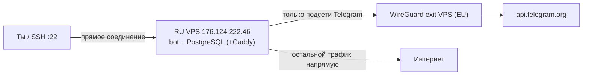

# Telegram-бот на русском VPS + split-VPN к Telegram

Воспроизводимый шаблон деплоя. Бот и БД остаются в РФ (152-ФЗ), а доступ к
`api.telegram.org` идёт через собственный заграничный WireGuard exit-узел.
Через тоннель уходит **только** трафик к подсетям Telegram (split-routing) —
SSH к хосту и доступ к БД не рвутся.

## Архитектура



Split-routing реализован не на хосте (риск залочиться), а изолированно в Docker:
VPN живёт в контейнере `wg`, бот стартует в его сетевом namespace
(`network_mode: "service:wg"`), а `AllowedIPs` в `wg/wg0.conf` = только Telegram.

## Состав

| Путь | Назначение |
|---|---|
| `harden.sh` | Шаг sec: SSH-ключ, ufw (22/80/443), отключение парольного входа |
| `exit-node/` | Шаг exit: `wg-easy` (WireGuard) на заграничном VPS -> клиентский `.conf` |
| `wg/wg0.conf.example` | Шаг split: клиентский конфиг с `AllowedIPs` = подсети Telegram |
| `docker-compose.yml` | Шаг compose: `wg` + `bot` + `postgres` (+ `caddy` для webhook) |
| `bot/` | build-контекст бота (положить код/Dockerfile) |
| `caddy/Caddyfile.example` | Только для webhook / Web App |
| `telegram-subnets.txt` | Официальные CIDR Telegram (сверяться периодически) |

## Порядок действий

### Шаг 1 — Безопасность RU VPS (sec)

Локально создай ключ, затем на сервере запусти hardening:

```bash
ssh-keygen -t ed25519 -C "tgbot-ru-vps"            # локально, если ключа нет
scp harden.sh root@176.124.222.46:/root/           # залить скрипт
ssh root@176.124.222.46
bash /root/harden.sh "$(cat ~/.ssh/id_ed25519.pub)"  # ключ передать строкой
```

Скрипт: добавит ключ, поднимет ufw (только 22/80/443), сменит root-пароль и —
после твоего подтверждения во втором терминале — отключит вход по паролю.
Не закрывай сессию, пока не проверишь вход по ключу из второго окна.

Установи Docker (если ещё нет):

```bash
curl -fsSL https://get.docker.com | sh
```

### Шаг 2 — Заграничный exit-узел WireGuard (exit)

1. Купи дешёвый VPS в EU (Aeza / PQ.Hosting / Zomro, Amsterdam/Frankfurt, ~3-5 EUR/мес).
2. Установи Docker, скопируй туда папку `exit-node/`.
3. Сгенерируй хэш пароля для веб-UI и заполни `.env`:

```bash
docker run --rm ghcr.io/wg-easy/wg-easy:14 wgpw 'ТВОЙ_ПАРОЛЬ'
cp .env.example .env      # вставь WG_HOST (публичный IP) и PASSWORD_HASH
docker compose up -d
```

4. Открой `https://<IP_exit_VPS>:51821`, создай клиента `ru-vps`, скачай `.conf`.
   Порт `51821` (веб-UI) закрой фаерволом на свой IP.

### Шаг 3 — Split-routing на RU VPS (split)

Из скачанного клиентского `.conf` собери `wg/wg0.conf`:

```bash
cp wg/wg0.conf.example wg/wg0.conf
```

Подставь `PrivateKey`, `Address`, `PublicKey`, `Endpoint` (и `PresharedKey`, если есть)
из клиентского конфига. **AllowedIPs оставь как в примере** — только подсети Telegram
(из `telegram-subnets.txt`), НЕ `0.0.0.0/0`.

### Шаг 4 — Стек бота (compose)

```bash
cp .env.example .env         # TELEGRAM_BOT_TOKEN, POSTGRES_*, DATABASE_URL
# положи код бота в ./bot (см. bot/README.md) или укажи build: ../../study-bot
docker compose up -d --build
docker compose logs -f bot
```

Проверка, что тоннель поднялся и Telegram доступен через VPN:

```bash
docker compose exec wg wg show
docker compose exec wg curl -s -o /dev/null -w "%{http_code}\n" https://api.telegram.org
```

### Шаг 5 — Деплой и проверка (deploy)

- **Long polling** (по умолчанию, проще): домен не нужен, бот сам опрашивает Telegram.
- **Webhook / Web App**: нужен домен (A-запись на RU VPS) + Caddy:

```bash
cp caddy/Caddyfile.example caddy/Caddyfile   # впиши домен и порт бота (reverse_proxy wg:<порт>)
docker compose --profile webhook up -d --build
```

Проверь бота в Telegram: команда `/start`, приём и отправка сообщений.
При webhook — `https://api.telegram.org/bot<TOKEN>/getWebhookInfo` (без ошибок доставки).

## Обновление

```bash
git pull
docker compose up -d --build
```

## Безопасность и 152-ФЗ

- ПДн (БД) — только на RU VPS. Заграничный VPS — исключительно транзит трафика к Telegram, данные там не хранятся.
- Секреты в `.env` и `wg/wg0.conf` — в `.gitignore`, в git не попадают.
- Телеграм-токен при утечке — перевыпусти у `@BotFather` (`/revoke`).
- Периодически сверяй `telegram-subnets.txt` с https://core.telegram.org/resources/cidr.txt.
