# Папка менеджера по продажам — полный текст

**Клиент:** РА Билбордофф (ИП Горячев С.С.) / Billboardoff  
**Документ:** 05.02.2026, Ростов-на-Дону  
**Для кого:** менеджер по продажам  
**В vault:** 2026-07-10  
**Источник:** Google Docs → HTML (ZIP); PDF — параллельная копия (60 стр.)

**Оригиналы:** [`Папка_офис_менеджера_инструкции.pdf`](Папка_офис_менеджера_инструкции.pdf) · [`html/index.html`](html/index.html) · [`Папка_офис_менеджера_инструкции.zip`](Папка_офис_менеджера_инструкции.zip)  
**Навигация:** [`ОГЛАВЛЕНИЕ.md`](ОГЛАВЛЕНИЕ.md) · [`КАТАЛОГ_СКРИНШОТОВ.md`](КАТАЛОГ_СКРИНШОТОВ.md)

> Сырьё клиента. Не редактировать оригинал — только ссылаться / делать выжимки рядом.

---

Конфиденциально:
Компания: РА Билбордофф (ИП Горячев С.С.)
Для кого: менеджера по продажам

Дата создания: 05.02.2026 г.

ПАПКА 
МЕНЕДЖЕРА

по продажам 

г. Ростов-на-Дону, 2026 год

## Менеджер по продажам – общие условия

Основная обязанность менеджера по продажам: 

- Получение дохода компании за счет продажи размещения рекламных материалов Заказчиков на конструкциях по Югу России 

Дополнительные обязанности менеджера по продажам:

- Обработка входящих заявок и поиск новых клиентов

- Отправление коммерческих предложений (адресных программ) клиентам 

- Заполнение гугл-таблицы “Заявки” 

- Заполнение СРМ системы 

- Заполнение ежемесячной отчетности по текущим сделкам в гугл-таблице “Продажи”

- Отправление информации по резервам,подтверждениям и макетам 

- Ведение Гугл-таблицы с каждым своим клиентом по всем адресам размещения

- Объезд проданных конструкций нашей компанией

- Взаимодействие с менеджерами владельцев щитов (запросы сторон, резервы, подтверждения)

- Создание договоров и приложений 

- Загрузка документов в СБИС

- Согласование дизайн-макетов с владельцами конструкций 

- Запуск в печать рекламных материалов клиента 

- Создание счетов на оплату

- Создание УПД

- Создание актов сверки с клиентами

- Изучение карты города, где расположены конструкции, и выявление топовых и свободных мест для своих клиентов

- Заполнение своих планов и отчетов на день/неделю

## Продукт поста:

Доход компании, полученный вовремя по всем выставленным счетам с подписанным УПД с клиентом и предоставленным ему фотоотчетом.

## Предназначение:

Увеличивать доход компании и делать так чтобы клиенты с нами работали на постоянной основе, за счет обработки всех заявок, не допуская ухода клиентов к другим.

## Образцовое положение дел:

Уверенно, профессионально, спокойно и вежливо общается со всеми клиентами. Получает входящие заявки, звонит новым клиентам, выявляет необходимые потребности, подготавливает и отправляет необходимое коммерческое предложение (формирует адресную программу мест на нашем сайте, скачивает эксель и указывает в нем всю подробную информацию о местах размещений). После получения ответа от клиентов по заинтересовавшим их местам - ставит резерв поставщику. Подготавливает необходимые документы для клиента (договор, приложение, счет) и отправляет их в ЭДО. Контролирует подписание документов/оплату и после этого пишет подтверждение поставщику. Заполняет информацию о своих сделках в таблице Продажи. Передает информацию о подтверждении сторон, бренду и макету Старшему менеджеру. Получает макет от клиента, согласовывает с юристом и запускает в печать. После подтверждения монтажа, получает фотоотчет и отправляет клиенту. Проезжает конструкции после монтажа и фотографирует их. После завершения, подготавливает и отправляет УПД всем клиентам в ЭДО и заполняет данные в таблице Продажи. 
По истечению каждого квартала создает и отправляет акты сверки своим клиентам в ЭДО.

Статистики:

Главные:

## 1.        Кол-во полученного дохода

## 2.        Кол-во дебиторской задолженности  (обратный график)

Дополнительные:

## 1.        Кол-во проданных конструкций

## 2.        Кол-во действующих клиентов

* VIP клиент - клиент, оплативший 150.000 руб и более (новый или текущий клиент который раньше покупал меньше) 

Взаимодействие:

С Административным менеджером 

- Передавать служебные записки для руководителя

- Получать входящие заявки 

- Передавать поручения на подписание документов в ЭДО или оригиналов у Директора

- Получать запросы от Бухгалтерии на получение необходимых документов от клиентов или поставщиков 

- Получать расчет и выплату заработной платы

Со Старшим менеджером

- Обращаться за помощью при возникновении сложных ситуаций 

- Получать задачи на день,неделю и месяц 

- Отправлять информацию по резервам, подтверждению и разбивки макетов для поставщиков

- Получать информацию по статусу монтажей и фотоотчеты        

- Передавать свой заполненный файл ПРОДАЖИ на проверку

С другими менеджерами по продажам

## 1) Помогать в случае возникновения сложных ситуаций в работе с клиентами

## 2) Уточнять при налаженном контакте с клиентом, работает ли на данный момент кто-либо уже с ним

## 3) Проводить тренировки друг с другом по звонкам клиентам

С Директором

## 1) Получать план продаж на месяц

## 2) Составлять и сдавать планы, отчеты и статистики на день/неделю

## 3) Присутствовать на планерках с подготовленными вопросам

## 4) Получать и выполнять поручения

## 5) Получать и выполнять стратегические задачи

График работы:
-с пн по пт с 9.00 до 18.00
-перерыв с 13.00 до 14.00 

-сб-вс - выходной

Государственные праздники – выходные

Отпуск – 28 дней в году

но не более 7 дней подряд 

*обсуждается индивидуально с руководителем
* На время отпуска окладная часть не меняется, отпускные не выплачиваются

* Оформление по ТК РФ осуществляется после успешного испытательного срока в течении 3-х месяцев по рассмотрению Директора 

Про возможности карьерного роста

Причина создания: сотрудники хотят расти в карьере, но не понимают как в целом и куда можно вырасти, как ускорить этот процесс и от этого страдает компания и сам сотрудник

Задача: разъяснить принцип как сотруднику начать расти 

Если вы хотите расти, то первый и самый главный шаг - начать действовать из позиции "обмен с превышением". Начните выдавать больше, чем от вас ожидается.
Очень часто, сотрудники хотят роста, но сами ничего для этого не делают. Нужно добиться чтобы вас заметили. Лучше всего это сделать в виде растущих статистик и показателей.
Как только вы поняли, что у вас растущие статистики и показатели и вас заметили – подойдите к своему руководителю и сами заявите, что вы хотите расти.
Узнайте, какие свободные позиции есть в компании? Выберите ту, которая показалась вам наиболее интересной и попросите дать вам личный план развития в эту должность.
Выполните этот план как можно скорее и со всей страстью – тогда карьерный и финансовый рост вам обеспечен.

Для менеджера по продажам следующая ступень – это старший менеджер или руководитель отдела продаж

Что требуется для перехода:

- работать в компании 3 месяца

- 

## соблюдать политику компании и работать по инструкциям

- изучить материалы и инструкции Руководителя отдела продаж

- сдать экзамен директору

- выполнить тестовое задание

Идеальная картина:
Проявлять инициативу, показать результат, подойти к директору и заявить о желании расти, изучить материалы и инструкции Руководителя отдела продаж и занять должность.
Неправильно:
Сидеть и ждать, когда вас повысят; ворчать, что в компании нет возможностей для роста и вас никто не замечает.

## 1. ИНСТРУКЦИЯ ПО ОБРАБОТКЕ ВХОДЯЩЕЙ ЗАЯВКИ И ОТПРАВЛЕНИЮ АДРЕСНОЙ ПРОГРАММЫ КЛИЕНТУ

- Получить заявку от офис-менеджера 

- Созвониться с клиентом:
- Общение вежливое, спокойное и деловое 
- Нужно узнать, какую рекламу клиент хочет разместить 

*Если реклама частного характера – отказываем

*Если реклама непристойного характера – отказываем

*Если другая нестандартная реклама – сказать, что уточните у руководителя, и отправляете в последствии всю информацию клиенту.

- Далее нужно узнать, когда клиент хочет разместиться и на какой срок.

- После этого договариваемся, где удобно клиенту принять от Вас информацию по свободным местам (почта или вотсап) 

- Записать всю подробную информацию в Гугл-таблицу “ЗАЯВКИ НОВЫЕ”

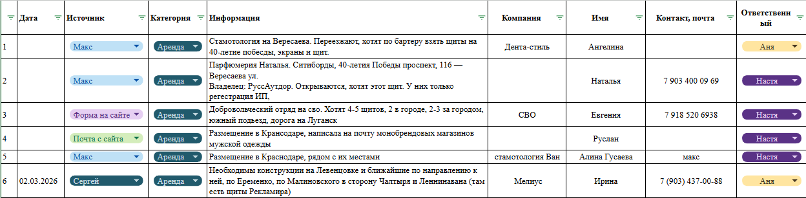

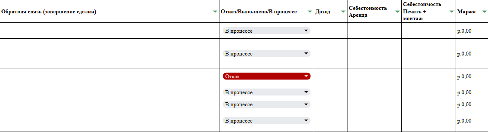

- Обработать заявку на основе запрошенных свежих АП от владельцев или из текущих наших поверхностей 

- Переходим на наш сайт с входом админа (если нужно после корректировать подборку мест) 
https://www.billboardoff.ru/?mode=admin

- Нажимаем на карту поверхностей и ищем нужные места 

(самостоятельно на карте, по списку улиц или районов, по id которые сказал клиент)

- После того как нашли подходящее место – нажимаете на значок, в карточке которая открылась – нажимаете кнопку заказать. 
После этого щит автоматически попадает в корзину.

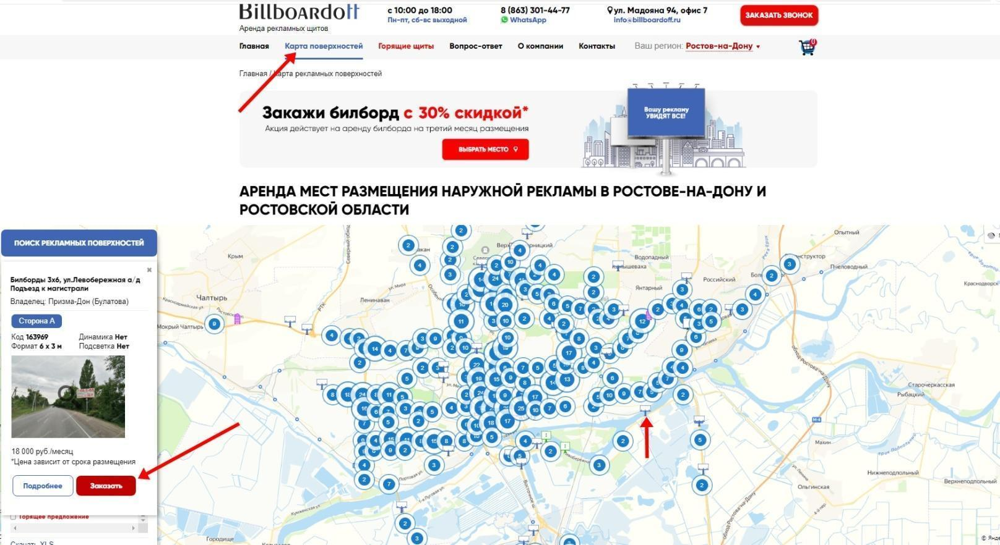

- После выбора всех необходимых сторон, переходите в корзину и нажимаете кнопку скачать эксель (фиксируете себе дату и время скачанной подборки, а также фиксируете уникальное название подборки, для того чтобы в будущем снова можно было её редактировать) 
Если нужно что-то из сторон удалить нажимаете на х
И также нажимаем посмотреть на карте и копируем ссылку на выбранные места, затем вставляем её в эксель

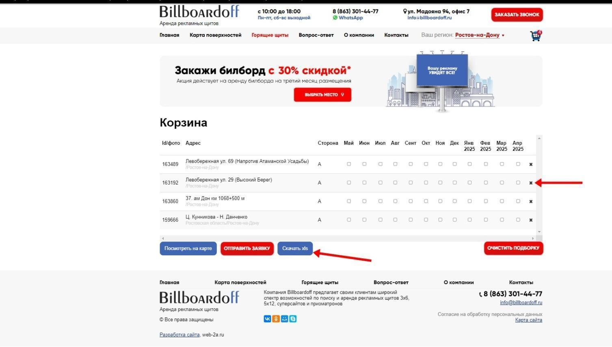

- После скачивания – открываем эксель и вносим нужные данные:

- цена аренды, печати и монтажа 

- привязка (по пожеланиям клиента) 

- свои комментарии к каждому месту, чтобы клиенту легче было ориентироваться

- свой телефон и почту

- ссылку на карту выбранных мест с сайта

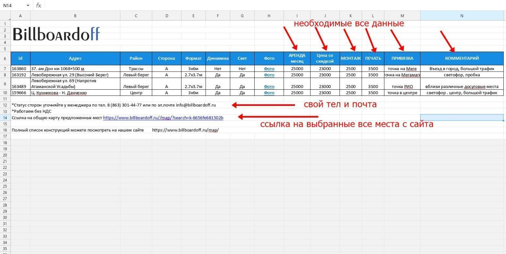

## 2. Инструкция по разговору с новым клиентом

- Узнаем у менеджеров о взаимодействии с клиентом, которому вы хотите позвонить. Если клиент крупный, то также уточняем информацию у руководителя 

- Узнаем больше информации о данном клиенте (записываем всю информацию в СРМ систему). Например вы знаете ЖК Звезда Столицы. Нужно узнать кто Застройщик, где у него сданы ЖК, где он еще сейчас строит. Поискать на их сайтах контакты отдела рекламы.

- После получения информации о клиенте, пытаетесь найти ЛПР (лицо принимающее решение). 
Далее звоните по скрипту:

- Здравствуйте, имя!
-Меня зовут ....

- Я представляю компанию Билбордофф 

- Знаю что Вы сейчас размещаетесь (или знаю что вы размещались ранее)

- Работаем более 10 лет, у нас в базе более 2000 рекламных мест. Работаем под ключ от создания дизайна до размещения.

- Хотим Вам предложить эффективное и выгодное для Вас сотрудничество 

- Есть ли у Вас сейчас потребность в рекламе?

*Если клиент говорит Да, то стараетесь уточнить подробную информацию: 
Далее нужно узнать где человек хочет разместиться (город, улицы, районы или другие пожелания)

- Далее нужно узнать какую рекламу клиент хочет разместить 

*Если реклама частного характера – отказываем

*Если реклама непристойного характера – отказываем

*Если другая нестандартная реклама – сказать, что уточните у руководителя, как при входящем звонке, и отправляете в последствии всю информацию клиенту.

- Далее нужно узнать, когда клиент хочет разместиться и на какой срок.

- После этого договариваемся, где удобно клиенту принять от Вас информацию по свободным местам (почта или вотсап) 

*Если клиент говорит Нет, то нужно сказать:

- Я понимаю Вас, тогда давайте обменяемся контактами, и, если Вам потребуется реклама, Вы будете знать, к кому обратиться!

Спасибо! Всего Вам доброго! 

## 3. Инструкция по заполнению СРМ системы

(Воронка СОПРОВОЖДЕНИЕ)

- Необходимо перейти по ссылке  https://billboardof.amocrm.ru/ 
Ввести свой логин и пароль

- 

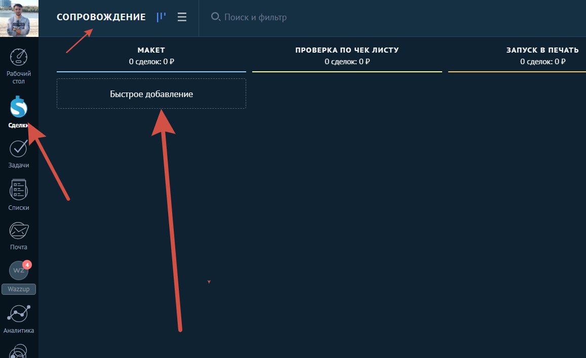

- 

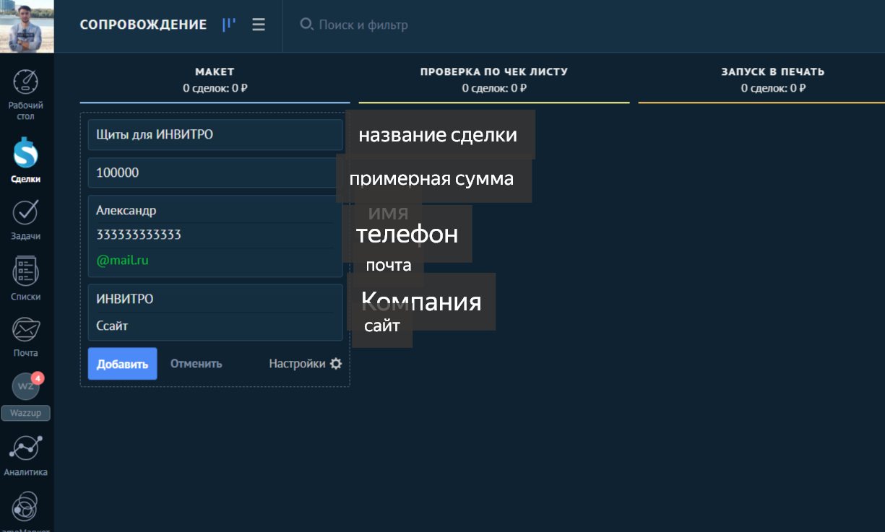

- Перейти во вкладку Сделки, выбрать воронку СОПРОВОЖДЕНИЕ,  затем БЫСТРОЕ ДОБАВЛЕНИЕ – далее внести  все необходимые данные клиента и нажать кнопку Добавить.

- После добавления автоматически создается новая задача по действию с данным клиентом, далее нужно перейти в карточку сделки, нажав на Название синего цвета. 

- 

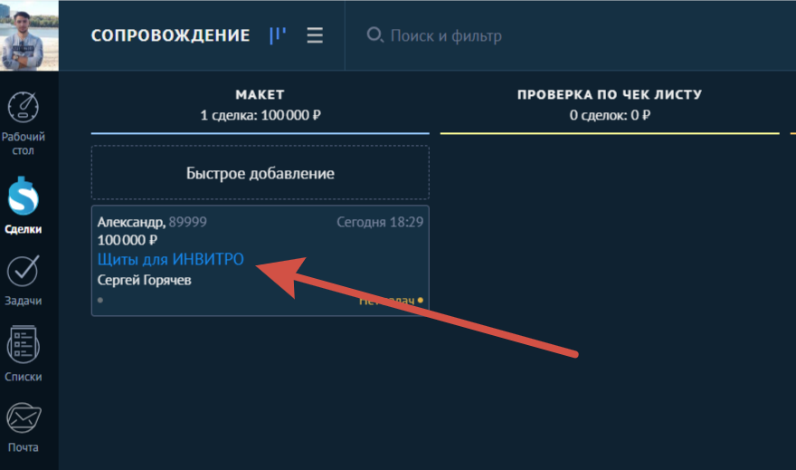

- Внутри сделки важно проверить и отметить все данные о клиенте: 
ИМЯ, телефон, почта, сайт. Адрес, доп. контакты. 

- Важно вставить ссылку на гугл-таблицу согласованных щитов с клиентом. Без этого действия сделка не будет продвигаться дальше.

- 

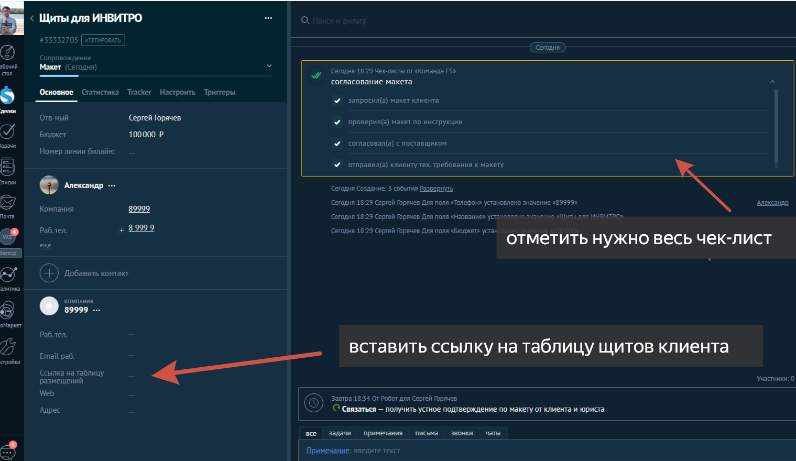

- Вверху автоматически появился чек-лист задач, которые нужно выполнить на данном этапе, без выполнения этих пунктов нельзя продвинуться дальше.
*Если с данным клиентом все уже согласовано, макет Пролонгация, необходимо все равно нажать выполнение данного чек-листа. 

- После выполнения всех пунктов происходит следующее: 
-  задача, которая создавалась на этапе Макет, автоматически будет Выполнена 

- сделка автоматически переходит на новый этап со своим чек-листом

- 

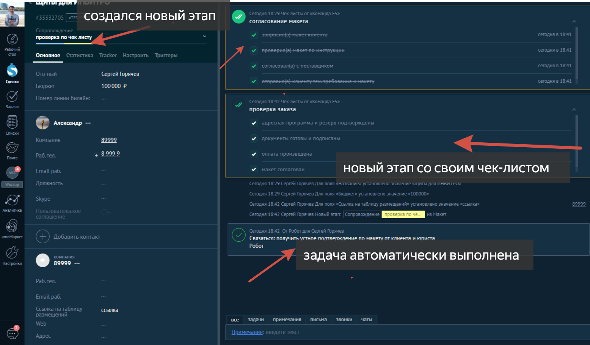

- Через 1 минуту появится новая задача на данном этапе, которую необходимо также выполнить с помощью отметки всех пунктов в новом чек-листе. 

- Также для удобства необходимо открепить прошлый чек-лист.

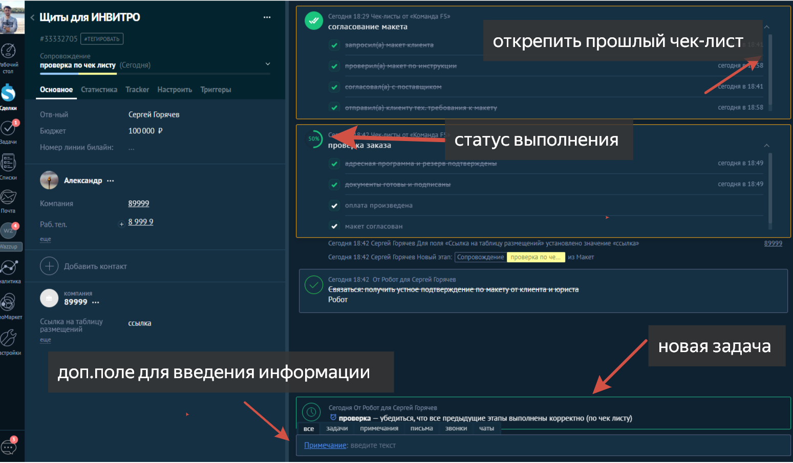

Создание повторной сделки 

## 1.  Для того чтобы создать повторную сделку ,необходимо текущую довести до этапа МОНТАЖ с выполнением всех чек-листов

## 2. Новая сделка появится через 2 минуты на этапе ВЫСТАВЛЕН СЧЕТ

## 3. При этом необходимо вновь созданную сделку (Автосделка) переименовать и указать :

- Название услуги и клиента также месяц размещения 
 например Щит Ремолл (август) 

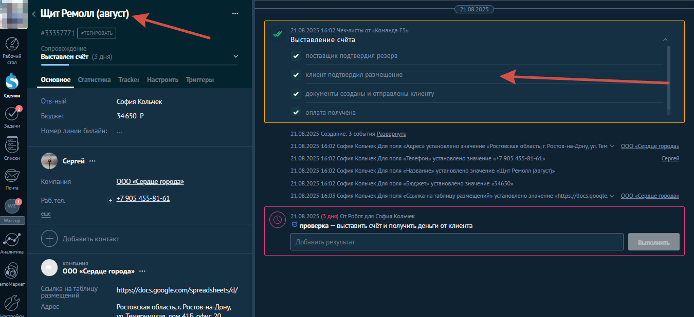

## 4. Инструкция по заполнению Гугл-таблицы (ПРОДАЖИ)

## 1) Зайти в гугл-таблицу и заполнить данные по каждому клиенту, которому выставлен счет в текущем месяце

- Сначала заполните данные по клиенту во вкладке «справочник», в дальнейшем эти данные будут сами заполняться в процессе выставления счета

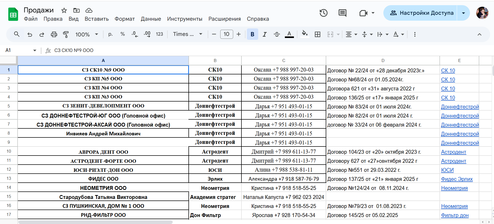

## 2. В при заполнении данных счета заполняем только следующие поля:

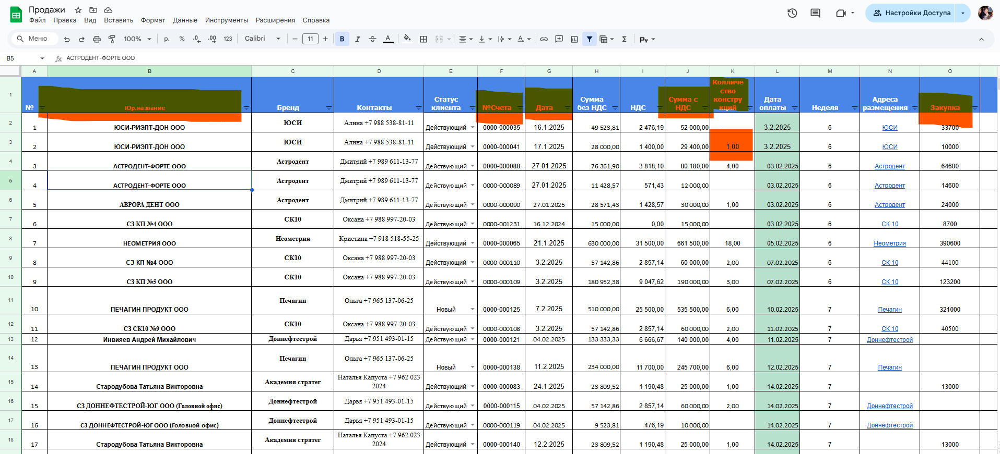

Таблица сама считает, кто и на какую сумму выставил счета, сумму оплаченных и сумму ожидающих оплаты – так вы сможете прогнозировать свой доход.

## 3) В конце завершенного месяца, проверить общую сумму продаж и сдать отчет директору

## 5. Инструкция по заполнению таблицы НАШИ ЩИТЫ

Заполнение этой гугл-таблицы является одним из самых важных пунктов в Вашей работе!

В эту таблицу нужно вносить всю информацию, которая относится к щитам (резерв, подтверждение, клиент, оплата, макет, сверка с владельцами)

- При подтверждении стороны или постановке резерва владельцу нужно заполнить информацию в данной таблице:

- находим данного владельца (по названию или юр. лицу) 

- в алфавитном порядке добавить нужный щит, указать сторону и статус (1-подтверждение или резерв – указываем до какого числа)

- указать свое Имя

- указать название клиента и его юр. лицо

- указать макет (1.Новый, 2.Пролонгация, 3.Перевес с другого места) 

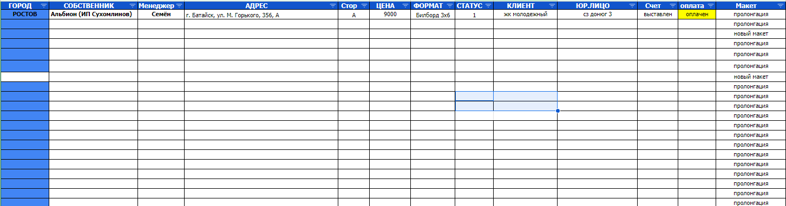

- В случае отказа клиента от какой либо конструкции

Поставить в известность старшего менеджера и руководителя для внесения ими изменений.

Если есть возможность отказаться от стороны у поставщика делаем это сразу через написания письма в электронной почте поставщику, ставим в копию старшего менеджера и руководителя.

Если от стороны нет возможности отказаться у поставщика или было принято решение оставить сторону на балансе – начать активно ее предлагать клиентам

## 6.  ИНСТРУКЦИЯ по ведению своей клиентской базы в гугл-таблице Клиенты

- Заполнить подробную информацию о каждом своем клиенте 

- Если клиент Активный – выделить желтой заливкой, 
если клиент Не активный – выделить красной заливкой,
если клиент в состоянии Заключения сделки – выделить зеленой заливкой 

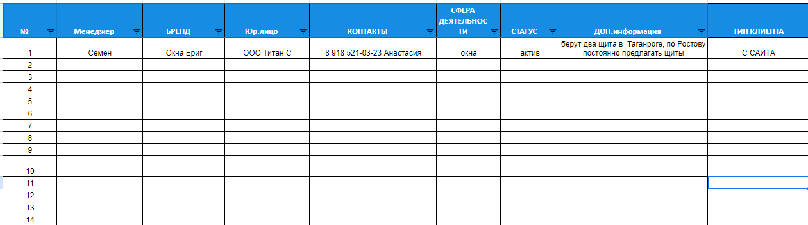

## 7.ИНСТРУКЦИЯ по ведению Гугл-таблицы с клиентами по адресам размещения

## 1) Заполнить информацию по всем продажам на следующий месяц

## 2) Если макеты отличаются, то указать разбивку

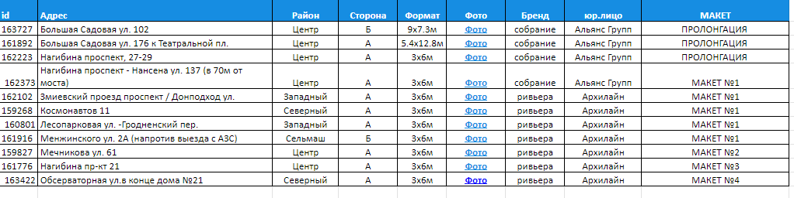

## 8. Объезд проданных конструкций нашей компанией

## 1. После 3-го числа текущего месяца, получить общий список от старшего менеджера по проданным нашим конструкциям

## 2. Согласовать с руководителем районы для объезда

## 3. Объехать необходимые конструкции , сфотографировать и загрузить в общую папку на яндекс-диске (фотоотчеты общий доступ –месяц - дата объезда +свое Имя)

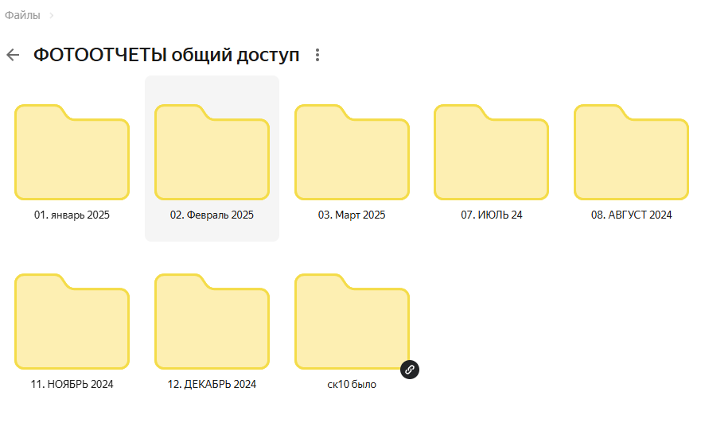

## 9.Инструкция по взаимодействию с менеджерами владельцев конструкций

- Деловое и уважительное общение.

- Все проблемные вопросы – писать в эл. почту.

- Все резервы и подтверждения – писать исключительно в эл. почту. 

- Отправка макетов на согласование – в эл. почту.

- Список всех владельцев можно увидеть в общей папке на Яндекс-диске.

- При выявлении нового владельца – общаться по-деловому, запрашивать адресные программы, при сложности получения скидки обращаться к руководителю.

Пример резерва:
- Прошу поставить в резерв на октябрь до 15 сентября следующие места: 

## 1. Нагибина 27 сторона А

## 2. Стачки 199 сторона А

Пример подтверждения: 
- Подтверждаем данные конструкции на октябрь 

## 1. Нагибина 27 сторона А

## 2. Стачки 199 сторона А

*если места нам интересны на длительный период, то указываем на какой. 
*обязательно получить ответное сообщение на эл. почту от менеджера, если сообщение в течение 2 часов не приходит, то нужно ему позвонить. 

Взаимодействие с поставщиком Русс Аутдор: 

Цены согласованы с ними общие.
При запросе необходимой конструкции, нужно сказать название клиента и получить окончательную цену от них. Только после этого нужно сообщать цену клиенту. Если клиент не согласовывает, то тогда необходимо предложить альтернативу от других поставщиков. 

Внутреннее взаимодействие по резервам:

- Менеджер ставит резерв по шаблону менеджеру поставщика

- Поставщик подтверждает и пишет срок резерва

- Менеджер вносит резерв в таблицу “Наши щиты” лист “Горящие щиты” (поставщик, адрес, сторона, бренд (если резерв под конкретного клиента), срок резерва)

- Менеджер устно сообщает коллегам о постановке нового резерва

- Каждый менеджер ежедневно заходит в таблицу, проверяет наличие Горящих щитов, предлагает их клиентам с соответствующим запросом

- В день снятия резерва менеджер должен написать на почту руководителя (doc@billboardoff.ru) статус резерва - подтверждение по шаблону или отказ

- Руководитель ежедневно проверяет сроки резервов. В день окончания срока резерва руководитель проверяет сообщения от менеджеров со статусом и пишет поставщику подтверждение по шаблону или отказ от резерва

## 10. Инструкция по созданию договоров и приложений

*За основу взять шаблон договора и приложения (взятого на яндекс-диске)

*То что выделено желтым цветом ,вставить необходимую информацию , полученную от менеджера по продажам

ДОГОВОР №....(нумерация в реестре)

г. Ростов-на-Дону                                                                                                 «15» мая  2024 г.

         Индивидуальный предприниматель Горячев Сергей Сергеевич, действующий на основании  ОГРНИП 317619600067825, именуемый в дальнейшем Исполнитель и  Общество с ограниченной ответственностью  "........" (юр лицо организации из реквизитов) в лице директора (из реквизитов или по ИНН на сайте налоговой), действующего на основании  Устава, именуемый в дальнейшем Заказчик, с другой стороны,  далее совместно именуемые Сторонами, заключили  настоящий  договор о нижеследующем:

## 1. Предмет договора

1.1. Заказчик поручает, а Исполнитель оказывает ему услуги  по  распространению рекламной информации Заказчика для конструкций со статичным и (или) динамичным видом смены информации (далее «Плакаты», «РИМ», «Рекламные материалы» и (или)  для видеоэкранов (далее «Видеоролики») на объектах наружной рекламы (далее – «Конструкции»),  на весь срок  распространения (далее – «Рекламная кампания»).

1.2. Сроки, продолжительность и места распространения наружной рекламы определяются сторонами в Приложениях к настоящему Договору, которые являются его неотъемлемой частью.

## 2. Порядок  организации  услуг

2.1. Заказчик передает Исполнителю рекламный материал  надлежащего качества для организации  распространения  рекламы  на конструкциях   не позднее, чем за 3 дня до начала периода рекламы. Заказчик может предоставить запасные Плакаты с целью обеспечения выполнения п. 3.1.2. настоящего договора (резерв в размере не менее 10 % от месячного размещения).

2.2. Исполнитель организует распространение рекламы для Заказчика на рекламных поверхностях в соответствии с согласованной адресной программой в течение 3 (Трех) дней с начала рекламной кампании и не позднее 2-х дней до даты окончания периода.

2.3. Исполнитель в течение всего периода распространения рекламной информации организует контроль за  рекламными носителями не реже одного раза в неделю с целью поддержания рекламного материала и рекламной поверхности в состоянии функциональной пригодности.

2.4. В темное время суток на  тех конструкциях, где это предусмотрено Приложением к договору, Исполнитель обеспечивает распространение рекламы на освещенных рекламных поверхностях  в соответствии с графиком работы энергоснабжающих организаций.

2.5. Исполнитель имеет право привлекать к выполнению работ по настоящему Договору третьих лиц, отвечая за их действия, как за свои собственные.

## 3. Права и обязанности Сторон

Исполнитель обязан: 

3.1.1.Осуществить организацию услуг по распространению рекламного материала, предоставленного Заказчиком, на рекламных поверхностях в соответствии с условиями настоящего Договора.

     В случае несоблюдения Заказчиком сроков предоставления  рекламного материала Исполнитель вправе сократить срок распространения рекламы на период задержки рекламного материала с полной оплатой услуг Исполнителя согласно Договору.

      В случае, если соблюдение сроков  рекламной кампании невозможно по причинам, признанными обеими Сторонами объективными,  Заказчик оплачивает лишь фактически проведенную часть кампании. 

3.1.2.Обеспечивать устранение повреждений рекламных материалов и/или рекламных поверхностей  Заказчика, возникших в течение срока рекламной кампании - отслоение рекламного материала, разрывы рекламных материалов, случаи вандализма, выход из строя осветительного оборудования и пр., в течение 3 (трех) календарных дней с момента обнаружения повреждения, либо заявления соответствующей претензии Заказчиком (если возможно обеспечить восстановление качества рекламных материалов), или производить замену Рекламных материалов из имеющегося резерва, состоящего из рекламных материалов дополнительно предоставленных Заказчиком.

     Если резерв рекламных материалов исчерпан, Исполнитель направляет Заказчику просьбу о предоставлении дополнительных плакатов за 5 (пять) дней (за исключением форс-мажора). До момента предоставления дополнительных плакатов, Исполнитель не имеет права использовать любые другие материалы, рекламного и социального характера. Стоимость периода рекламы при несвоевременном предоставлении запасных (новых) изображений перерасчету не подлежит.

Срок службы РИМ для эксплуатации в динамических рекламоносителях (пилон, скроллер) составляет 60 календарных дней. По истечению этого срока Исполнитель использует плакаты из  предоставленного Заказчиком резерва. 

3.1.3.Обеспечить подсветку оговоренных в  приложении рекламных конструкций от сетей городского освещения. «Исполнитель» не несет ответственности за отсутствие подсветки, произошедшее по причине неисправности сетей городского освещения. Устранение повреждений осветительного оборудования Исполнитель обеспечивает в течение 3 (трех) календарных дней с момента обнаружения повреждения, либо заявления соответствующей претензии Заказчиком. 

3.1.4. Предоставлять  по  требованию «Заказчика» фото-отчет  по факту распространения рекламного материала. Условия  предоставления  фотоотчета  могут оговариваться  в  Приложении. 

3.1.5. В случае намерения «Исполнителя» внести изменения в адресную программу рекламной кампании, оговоренную в Дополнительном соглашении к настоящему Договору, «Исполнитель» обязуется согласовать эти изменения с «Заказчиком»  за  3  дня до внесения возможных изменений.

3.2. Заказчик обязан:

3.2.1. Предоставлять «Исполнителю»  цветной макет рекламного материала не менее чем за 15 дней до начала кампании. 

3.2.2.  Заказчик подтверждает, что рекламно-информационный материал не является недобросовестным и недостоверным, что рекламируемые товары, на производство и (или) реализацию которых требуется получение лицензий или иных специальных разрешений,  имеют таковые. Заказчик гарантирует соответствие предоставляемого рекламно-информационного материала требованиям Федерального закона от 13.03.2006 г. № 38-ФЗ «О рекламе», иным требованиям законодательства Российской Федерации. В случае невыполнения данного условия Заказчик обязуется принять на себя все расходы по ведению в этом случае спора и  возместить Исполнителю убытки (включая штрафные санкции и упущенную выгоду), которые возникли или могут возникнуть у последнего в связи с претензиями и исками к Исполнителю третьих лиц,  в течение 10 (десяти) рабочих дней с момента выставления исполнителем соответствующего счета и предоставления подтверждающих документов.

3.2.3. Своевременно производить оплату работ и услуг «Исполнителя».

3.2.4. Подписание данного договора и приложения с Адресной программой означает, что Заказчик ознакомился с местом размещения. Претензии по месту и адресу размещения в период размещения не допускаются. 

## 4. Порядок  расчетов

4.1. Стоимость распространения рекламы на одной стороне рекламоносителя в месяц определяется в Приложениях  к  Договору.

4.2. Оплата «Заказчиком» должна производиться в безналичном порядке путем перевода денежных средств на расчетный счет «Исполнителя» в порядке и сроки, указанные в Приложениях.

4.3. Исполнитель вправе не приступать, отложить, либо приостановить распространение рекламной информации Заказчика в случае ненадлежащего исполнения Заказчиком обязательства по оплате  настоящего Договора и не поступления денежных средств на расчетный счет Исполнителя, если иное не будет определено сторонами дополнительно.

4.4.Датой оплаты является день поступления денежных средств на расчетный счет «Исполнителя». 

4.5. В случае просрочки Заказчиком любого платежей по настоящему договору,  Исполнитель вправе отказаться от исполнения настоящего Договора в одностороннем порядке.

4.6. В случае невозможности исполнения, возникшей по вине Заказчика, услуги подлежат оплате в полном объеме.

## 5. Форс-мажор

5.1. Стороны освобождаются от исполнения обязательств по данному Договору вследствие обстоятельств непреодолимой  силы, возникших после заключения настоящего Договора в результате событий чрезвычайного характера, которые стороны не могли ни предвидеть, ни предотвратить разумными мерами;

5.2. К обстоятельствам непреодолимой силы относятся события, на которые сторона не может оказывать влияния и за возникновение которых она не несет ответственности, такие как: война, землетрясение, наводнение, пожар или подобные явления, правительственные постановления, распоряжения (указы) государственных органов, законы или прочие нормативные документы, принятые после подписания настоящего Договора и устанавливающие ограничения на деятельность, связанную с выполнением настоящего Договора.

5.3.Сторона, ссылающаяся на обстоятельства непреодолимой силы, обязана информировать другую сторону о наступлении подобных обстоятельств в течение трех дней с момента их наступления в письменной форме с приложением копий соответствующих документов. Информация должна содержать данные о характере обстоятельств, а также оценку их влияния  на исполнение стороной своих обязательств по настоящему Договору и на срок исполнения обязательств.

5.4.После прекращения действия указанных обстоятельств сторона должна без  промедления известить об этом другую сторону в письменном виде. При этом сторона должна указать срок, в который предполагается исполнить обязательства по настоящему Договору.

5.5.В случае возникновения  обстоятельств непреодолимой силы, срок выполнения обязательств по настоящему Договору отодвигается соразмерно времени, в течение которого действуют такие обстоятельства и их последствия.

5.6. В случае, если обстоятельства непреодолимой силы действуют более 2-х месяцев, настоящий Договор считается расторгнутым без каких-либо взаимных обязательств. 

## 6. Порядок приемки и сдачи услуг

6.1.После окончания срока распространения рекламы Исполнитель обязан направить Заказчику подписанный со своей стороны Акт об оказанных услугах. 

6.2.Заказчик обязан подписать Акт об оказанных услугах, либо составить мотивированный отказ в приемке услуг.  Подписанный экземпляр акта об оказанных услугах, либо мотивированный отказ в приемке услуг должны быть переданы «Исполнителю». 

В случае не получения Исполнителем подписанного акта об оказанных услугах, либо мотивированного отказа в течение 15 (пятнадцати) рабочих дней с даты  отправки Акта Заказчику, услуги признаются полностью оказанными Исполнителем (без претензий со стороны Заказчика) своих обязательств по настоящему Договору, и подлежат обязательной оплате Заказчиком в полном объеме.

## 7. Ответственность сторон и штрафные санкции.

7.1.За неисполнение или ненадлежащее исполнение обязательств по настоящему Договору и Приложений к нему стороны несут ответственность в соответствии с настоящим Договором и действующим законодательством Российской Федерации.

7.2.Заказчик несет ответственность за нарушения законодательства РФ в части содержания и достоверность рекламной информации, предоставляемой Исполнителю для размещения в соответствии с действующим законодательством Российской Федерации. Заказчик принимает на себя ответственность перед третьими лицами по претензиям, связанным с несоответствием рекламно-информационных материалов действительности, содержанием и формой рекламы, товарами и услугами, с несанкционированным использованием в рекламном материале торговых марок, товарных, защитных, фирменных знаков, наименований фирм и их логотипов, а также иных действий, связанных с нарушением законодательства Российской Федерации.  Заказчик самостоятельно и за свой счет урегулирует указанные претензии. Заказчик несет ответственность за содержание рекламного изображения и юридическую правомерность использования логотипов, названий фирм и т.п. Заказчик самостоятельно несет ответственность за несоблюдение требований к рекламе в соответствии с законодательством Российской Федерации.

Заказчик возмещает Исполнителю понесенный им ущерб при наложении контролирующим органом штрафа за нарушение п. 7 ст. 28 Федерального закона «О рекламе» от 13 марта 2006 г. № 38-ФЗ (в случае размещения рекламы, связанной с привлечением денежных средств участников долевого строительства для строительства (создания) многоквартирных домов и (или) иных объектов недвижимости).

7.3.Заказчик несет ответственность за нарушение законодательства Российской Федерации о рекламе в части оформления, производства и подготовки предоставляемого Исполнителю рекламного материала.

7.4.Исполнитель несет ответственность за нарушение законодательства РФ в части, касающейся времени, мест и средства размещения рекламного материала.

7.5.В случае несвоевременного перечисления денежных средств по условиям настоящего Договора Исполнитель вправе требовать с Заказчика уплаты пени в размере 0,1 % в день от суммы не перечисленных денежных средств за каждый день просрочки платежа. 

7.6. За нарушение сроков размещения, а также за несвоевременное устранение дефектов в соответствии с условиями настоящего Договора Заказчик вправе требовать от Исполнителя уплаты пени в размере 0,1 % в день от месячной стоимости распространения рекламы на дефектной Конструкции за каждый день просрочки устранения дефектов, либо, по выбору Заказчика,  Исполнитель предоставляет дополнительные стороны Конструкций на сумму штрафных санкций по ценам настоящего Договора. 

7.7.Исполнитель освобождается от ответственности, возникающей по условиям настоящего договора:

- за задержку начала распространения рекламы при температуре воздуха в городской черте ниже - 15 градусов по Цельсию;

- за задержку  начала распространения рекламы  при порывах  ветра более  10  м./сек.

- за отсутствие освещения на Конструкции при нарушении энергообеспечения линии сети городского освещения,   

     на которой расположена данная Конструкция;

- за дефекты изображения, вызванные некачественными Плакатами, переданными Заказчиком.

## 8. Дополнительные условия

8.1. «Исполнитель» распространяет на части рекламных конструкций, по возможному требованию Администрации, праздничное оформление города по одной неделе к каждому из ниже перечисленных праздников: Новый год, Рождество, Международный женский день, День Победы, День города. Срок распространения рекламного материала «Заказчика» продлевается на соответствующее время на данной конструкции или по согласованию с «Заказчиком» на эквивалентном месте, либо, по выбору заказчика «Исполнитель» производит  возврат  той  части  средств,  что   соответствует  периоду   распространения  социальной  рекламы.

8.2.Исполнитель вправе изменить цену, предусмотренную в Приложениях к настоящему договору. При этом Исполнитель обязан уведомить Заказчика об изменении цен в письменной форме не менее чем за 30 дней. После чего стороны согласовывают сумму увеличения цены, исходя из представленных документов.

В случае несогласия Заказчика с увеличением цены, он имеет право отказаться от размещения рекламы Исполнителем, не позднее, чем за 15 дней до  наступления следующего  периода  рекламы, без  уплаты штрафных санкций.

Условия данного пункта не распространяются на оплаченные  Заказчиком размещения.

8.3. Исполнитель не несет ответственности за причинение ущерба Рекламным материалам, ДТП, противоправными действиями третьих лиц (кража, порча изображения) и явлениями природы. Риск случайной гибели или повреждения рекламного материала несет  «Заказчик». 

Восстановление Рекламных материалов в указанных в данном пункте случаях производится за счет Заказчика.

Риск случайной гибели или повреждения рекламной конструкции несет «Исполнитель».

8.4.По окончании размещения РИМ «Заказчик» обязан в течение 1-го месяца забрать принадлежащее ему рекламное изображение. После обозначенного срока, изображения  подлежат  уничтожению, если иное  не  оговаривается  отдельным  приложением к  данному  договору. 

8.5.Стороны обязуются не разглашать конфиденциальные сведения, предоставленные каждой из сторон в связи с исполнением настоящего договора, за исключением тех случаев. Когда это необходимо для нормального оказания услуг по договору.

## 9. Срок действия Договора

9.1. Настоящий Договор вступает в силу с момента подписания его сторонами и действует на срок периода рекламы, указанного в Приложениях.

9.2.При наличии объективных возможностей и достижении взаимоприемлемых условий «Исполнитель» предоставляет «Заказчику» приоритетное право пролонгации настоящего Договора.  При этом стороны должны прийти к соглашению о дальнейшем распространении  рекламы не позднее, чем за 1(один) месяц до окончания срока текущего периода рекламной компании. Подтверждением такого соглашения является подписанное сторонами Приложение на следующий срок распространения рекламы. В ином случае Исполнитель не гарантирует возможность распространения рекламы в следующий срок.

9.3.Любые изменения и дополнения к данному договору вступают в силу, только после подписания их сторонами, за исключением случаев, указанных в договоре. 

9.4.Заказчик может в одностороннем порядке отказаться от распространения  Плакатов не позднее, чем за 30-ть дней до начала периода рекламы, определенного в Приложениях к настоящему Договору.

9.5.При этом, в случае полного или частичного отказа Заказчика от размещения, либо  предоставления  плакатов  с  явным  нарушением  закона  о рекламе, что может повлечь  необходимость расторжения  договора  в  одностороннем  порядке, Исполнитель вправе требовать с Заказчика уплаты убытков, которые стороны договорились определять от стоимости одного месяца демонстрации на соответствующей РК, в отношении которой Заказчик заявляет о полном или частично прекращении обязательств сторон, следующим образом:

- менее чем за 30 дней до начала размещения – в размере 25% от стоимости месяца размещения;

- менее чем за 15 дней до начала размещения – в размере 50% от стоимости месяца размещения;

- менее чем за 7 дней до начала размещения – в размере 90% от стоимости месяца размещения.

## 10. Порядок разрешения споров и прочие условия

10.1.Права, обязанности и ответственность сторон регулируется действующим законодательством Российской Федерации, настоящим Договором и  Приложениями к нему.

10.2.Все споры по настоящему Договору, будут решаться путем прямых переговоров между сторонами.

В случае не достижения соглашения в ходе переговоров заинтересованная Сторона направляет претензию в письменной форме, подписанную уполномоченным лицом.

Сторона, которой направлена претензия, обязана рассмотреть полученную претензию и о результатах уведомить в письменной форме заинтересованную Сторону в течение 10 (десяти) рабочих дней со дня получения претензии.

В случае не урегулирования разногласий в претензионном порядке, а также в случае неполучения ответа на претензию в течение 15 (пятнадцати) рабочих дней с даты ее направления, спор передается в арбитражный суд по месту нахождения Истца. 

10.3.Настоящий Договор составлен на русском языке, по одному экземпляру для каждой стороны, причем оба экземпляра имеют равную юридическую силу.

10.4 Стороны в обязательном порядке предоставляют друг другу оригиналы договора, счетов-фактур и актов сдачи-приемки оказанных услуг, и/или всех Приложений и дополнений к нему, а также дополнительных соглашений к договору не позднее 30 дней с даты подписания. 

## 11. Юридические адреса и платежные реквизиты сторон

«Исполнитель»

ИП Горячев Сергей Сергеевич

344041, Ростовская обл., 

г. Ростов-на-Дону, пер. Серебряный 21 а.

Фактический адрес: 344041, г. Ростов-на-Дону, ул. Мадояна 94/90а, офис 7.

ИНН 616520531643  ОКВЭД 73.11

ОГРНИП 317619600067825 

р/с 40802810620000141882

ООО «Банк Точка» г. Москва

к/с 30101810745374525104

БИК 044525104

 ___________________   Горячев С.С.

                            «Заказчик»

ООО (юр лицо)

Юр .адреса

ИНН

КПП 

ОГРН 

р/с 

наименование банка

к/с 

БИК 

Тел.: 

Email: 

ИЗ РЕКВИЗИТОВ

___________________   Загривный Д.А.

Приложение № ___

к Договору № 76/1 от «15 мая 2024г.»

г.Ростов-на-Дону                                                                                                    15мая 2024г.

                     Индивидуальный предприниматель Горячев Сергей Сергеевич, действующий на основании ОГРНИП 317619600067825, именуемый в дальнейшем «Исполнитель», с одной стороны, и Общество с ограниченной ответственностью Специализированный застройщик "СТРОЙПРОЕКТ-ВОСТОК" в лице директора  Загривного Дениса Александровича, действующий на основании  Устава, именуемый в дальнейшем «Заказчик », с другой стороны, далее совместно именуемые Сторонами, заключили настоящее Приложение о нижеследующем:

1.Исполнитель принимает на себя обязательства по размещению и изготовлению рекламных материалов на билборде 3х6м в г. ___________ 

1.1.Период размещения:  01.09.2024 г. по 31.12.2024г. (2 месяца)
  1.2.Адресная программа и  стоимость размещения в месяц.

№п/п

           Адрес

Сторона

Печать баннера, руб.

Монтаж баннера, руб.

Цена аренды за месяц, руб.

Сумма аренды за период, руб.

1

Морская ул. 43

А

6000

4000

16500

33000

2

Морская ул. 100

А

6000

4000

16500

33000

## 2. Общая стоимость услуг по изготовлению и размещению рекламных материалов составляет  86000 (Восемьдесят шесть тысяч) рублей 00 копеек

## 3. Оплата производится в рублях банковским переводом на расчетный счет Исполнителя на условиях 100 % предоплаты за каждый месяц размещения в течении 5-ти рабочих дней со дня выставления счета

4.  Настоящее приложение имеет статус дополнительного соглашения к вышеуказанному Договору, является его неотъемлемой частью и составлено в 2-х идентичных экземплярах, имеющих одинаковую юридическую силу по одному для каждой из сторон.

ИСПОЛНИТЕЛЬ:

ИП Горячев Сергей Сергеевич

344041, г. Ростов-на-Дону, 

Пер. Серебряный 21 а

ИНН 616520531643

ОГРНИП 317619600067825

р/с 40802810620000141882

ООО «Банк Точка» г. Москва

к/с 30101810745374525104

БИК 044525104

info@billboardoff.ru
   тел. 8 (863) 301-44-77

ЗАКАЗЧИК:

ООО СЗ "СТРОЙПРОЕКТ-ВОСТОК"

344003, Ростовская обл, г Ростов-на-Дону, ул Города Волос, д. 6, ком. 46, 

ИНН 6165232981

КПП 616501001

ОГРН 1226100016230

р/с 40702810800660010465

АО "Банк ДОМ.РФ"

к/с 30101810345250000266

БИК 044525266

Тел.: 8 (863) 310-05-85

Email: infobux.stroytrest@yandex.ru

___________________ Горячев С.С.

ООО СЗ "СТРОЙПРОЕКТ-ВОСТОК"

___________________ Загривный Д.А.

## 11. Инструкция по отправке документов в ЭДО (Сбис)

## 1) Сохраняем файл в формате PDF у себя на ПК

## 2) Открываем сайт Онлайн СБИС

## 3) Переходим во вкладку Исходящие и затем нажимаем на "+" и выбираем нужный вид документа

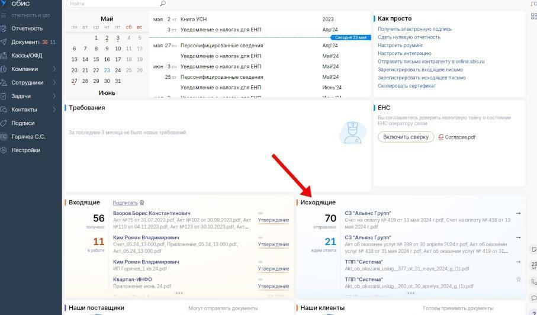

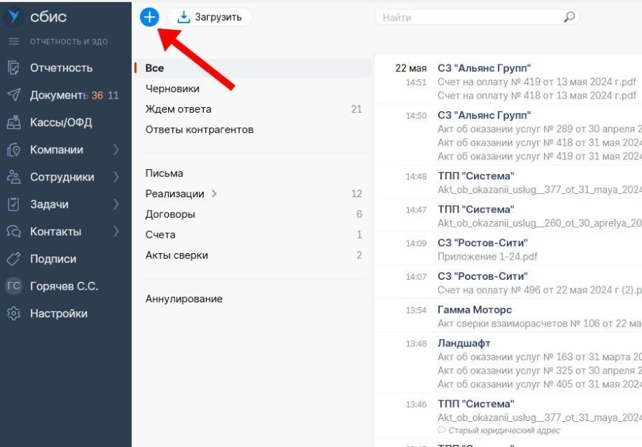

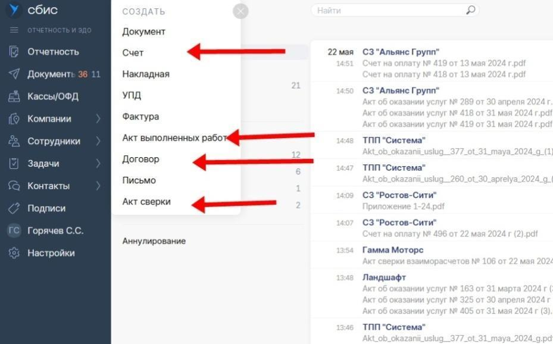

- Затем выбираем контрагента из списка или вводим нужный ИНН перетягиваем файл из ПК и нажимаем Отправить 

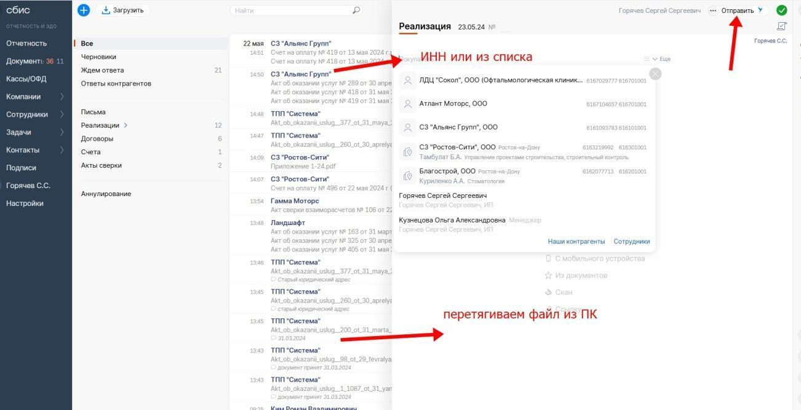

## 5) проверяем в списке Исходящих появился ли документ и затем проверяем подписан ли этот документ нашим клиентом .

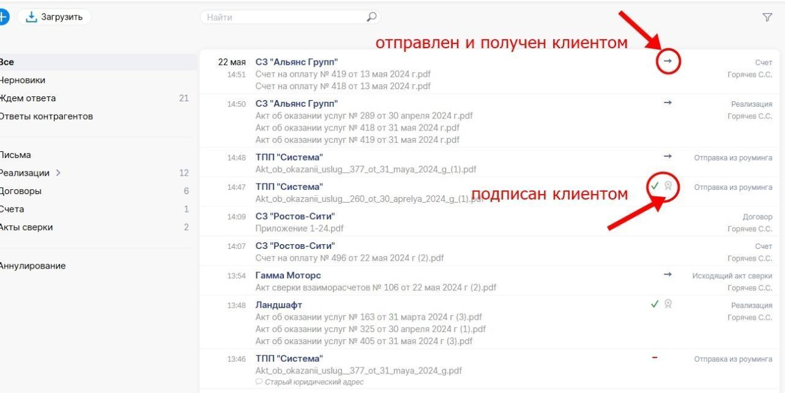

## 6) по всем возникшим вопросам в СБИСЕ можно просмотреть обучающие материалы по нужной странице

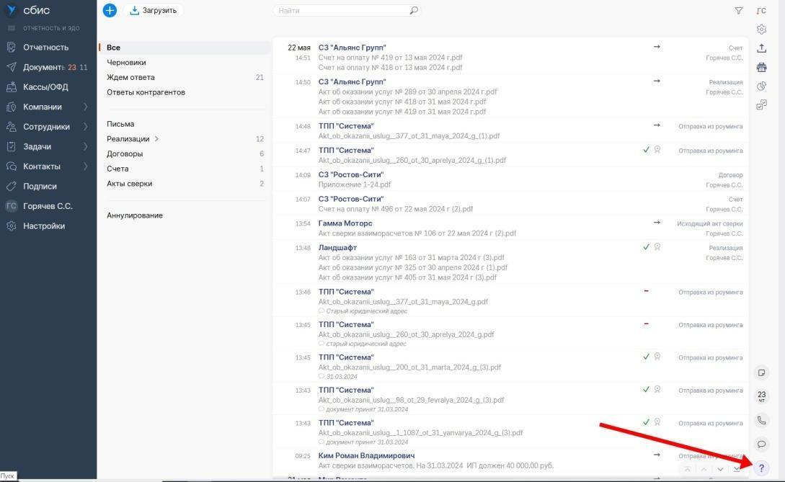

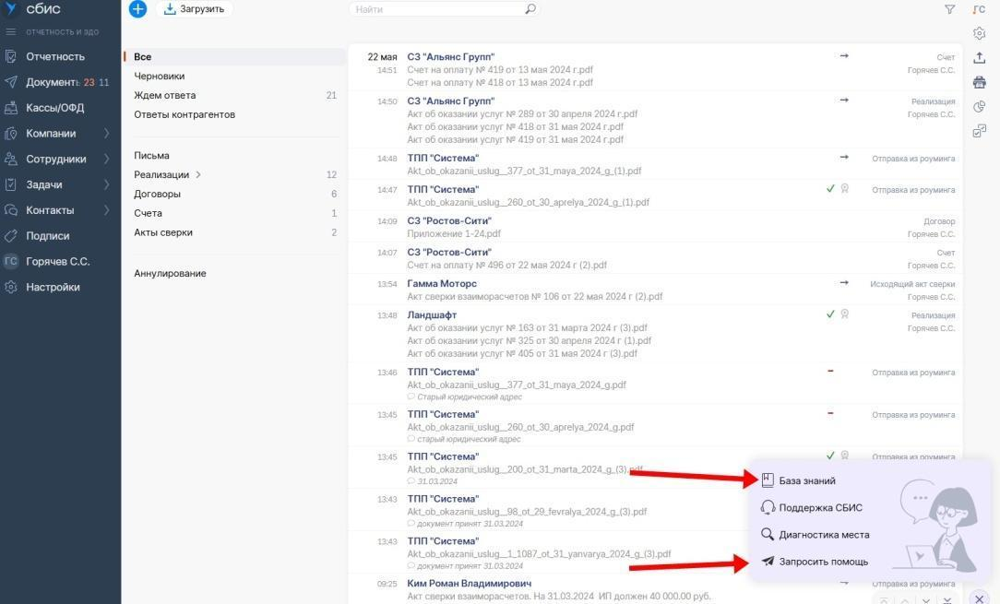

## 12.ИНСТРУКЦИЯ по согласованию дизайн-макетов с юристами владельцев щитов

Прежде чем отправлять макет на согласование ОБЯЗАТЕЛЬНО, нужно оценить его, все ли там данные указаны.

      1.1 Макет клиники, салона красоты и т.д,  
обязательно должны быть указаны следующие данные:
       а)  лицензия
       б)  строка о противопоказаниях, не менее 5% от общего макета 
ИМЕЮТСЯ ПРОТИВОПОКАЗАНИЯ, НЕОБХОДИМА КОНСУЛЬТАЦИЯ СПЕЦИАЛИСТА

       в) Если используется образ Врача, то только в мед. организациях, которые занимаются лечением и должна быть указана хотя бы одна такая услуга в макете

       1.2  Макет застройщика:

а) наименование застройщика
б) коммерческое обозначение ЖК, которое указано в проектной декларации (проектную декларацию можно посмотреть на сайте, например Дом.рф)

Пример: Застройщик ООО СЗ «Ростов-Сити» Проектные декларации на сайте наш Дом РФ

- Застройщик не получил проектную декларацию, 
а) наименование застройщика

б) внизу надпись, пример:

ГК «Донстрой» организует выставку «Притяжение Ростов-на-Дону», экспозицию составят работы жителей Ростов-на-Дону по адресу г.Ростов-на-Дону + наименование улицы

- Кафе, рестораны:

!!! Не допускается реклама любого вида алкоголя, в том числе коктейлей.
Если используется qr-код, то при его переходе в меню не должны быть алкогольные напитки 

ИПОТЕКА – КРЕДИТ

а) если в макете указаны кредит, ипотека, то:

Должна быть указана полная стоимость кредита, первоначальный взнос, банк заемщик, генеральная лицензия банка (застройщик, проектная декларация, шрифт не менее 4 см) 

Акция, скидка

а) должны быть указаны: место проведения, количество призов, сроки акции.
Пример: Источник информации об организаторе акции, о правилах ее проведения, количестве призов, по результатам акции, сроках, месте и порядке проведения, можно узнать на сайте…………………… Сроки проведения акции ООО «….»  лицензия №…… от……….. Срок проведения  с….. до……. 

Использование фото людей

Обязательно поинтересоваться, откуда фото человека.

а) Если фото с фото-стока, то оно допускается. Указать, с какого фото-стока оно взято (прислать ссылку)

б) Если реальные фото людей, то обязательно нужно согласие на использование фото. (Должно быть разрешительное заявление, от одного или нескольких человек) 

Макет отправляется вместе с ним.

## 13. Инструкция по запуску рекламных материалов в печать

- Отправить клиенту тех. требования к макетам + точные размеры (взять нужные требования конкретного печатника (например Микс, Глобус, Матрешка) в общей папке на яндекс-диске

- После получения макета от клиента (формат tif для печати и превью этого макета) - проверить его. Скачать tif и сопоставить с превью.

При затруднениях с макетами (файл например cdr или psd), отправить дизайнеру Маргарите, которая откроет и пересохранит файл в нужном формате 
тел. 8908-184-36-01 

- Если с макетом всё ок, отправить печатникам на эл. почту (например Микс)
*при необходимости напечатать цветопробу (если просит клиент, если есть сомнения в каком-то цвете)

Что нужно указать:

- тему письма (название клиента)

- название владельца кому нужно доставить (или самовывоз монтажником)

- вид рекламного материала (баннер, скроллер, пластик и т.д.)

- количество 

- информацию, что указать на баннере (название клиента и макета согласно разбивке отправленной владельцу)

- при необходимости тех.требования владельца к нужному формату

- вложить превью и ссылку на печать на наш яндекс-диск

## 14.Инструкция по созданию счета на оплату в 1С

## 1) Заходим в         1С   фрэш  в облаке

## 2)  Нажимаем ПРОДАЖИ – Счета покупателям

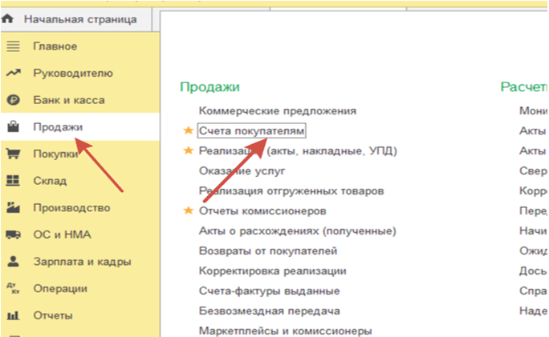

## 3) Если контрагент уже заведен и был ранее ему выставлен счет, то можно найти в списке и нажать скопировать

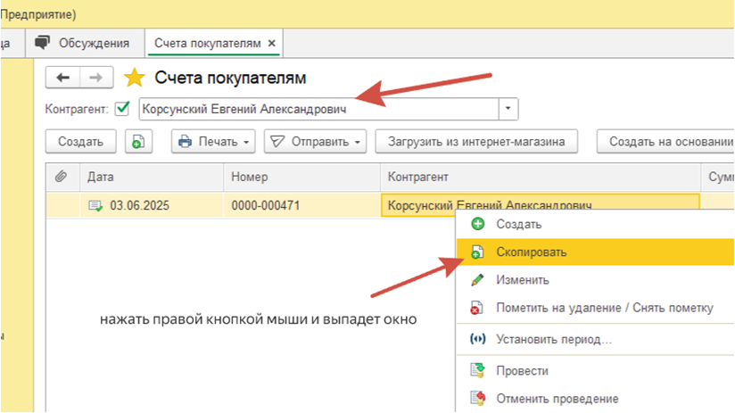

## 4) Если контрагент новый, то нужно сделать следующие действия:

## 1. Нажать СОЗДАТЬ, затем в поле контрагент в списке нажать +

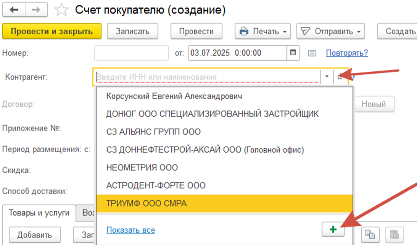

## 2. Далее необходимо ввести ИНН и нажать Заполнить, проверить все данные и внести недостающие (в группе, ответственного указать, комментарий при необходимости, банк и р/с, контактное лицо) и далее нажать Записать

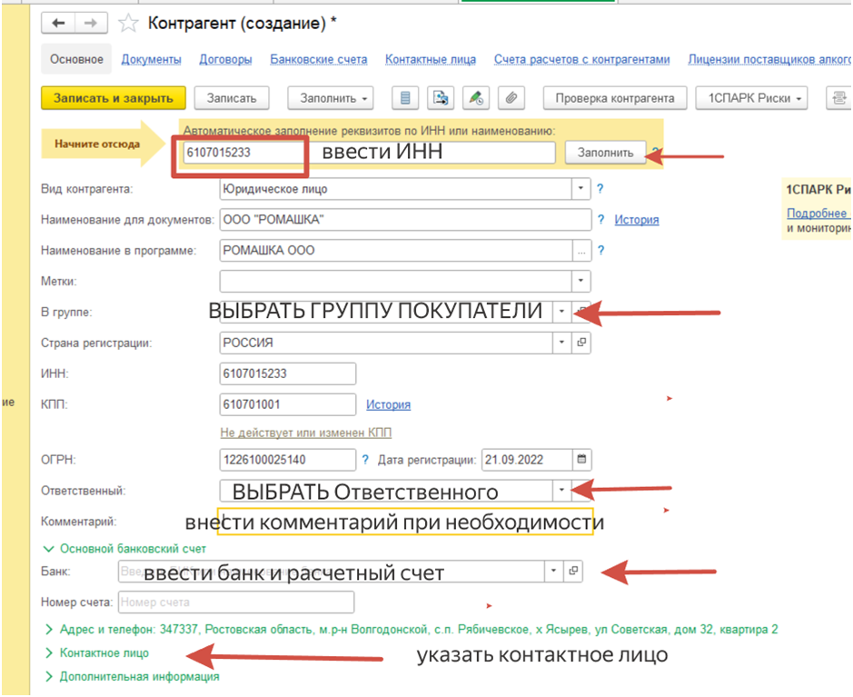

## 3. Далее необходимо создать договор.

Перейти во вкладку Договоры и нажать создать 

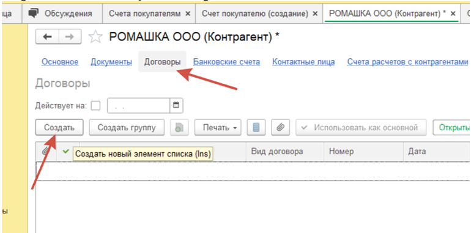

В нашем реестре договоров в экселе, взять следующий номер и указать его в номере договора

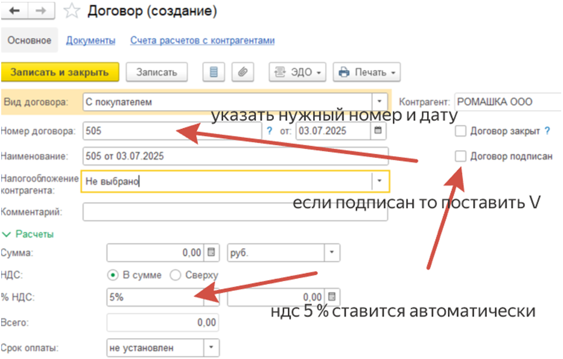

Затем нажать Записать и закрыть 

Дополнение к договорам

 Если у действующего контрагента есть несколько договоров, то необходимо лишние закрыть, порядок действий следующий: 

## 1. Находим счет контрагента, нажимаем на выпадающий список договоров и нажимаем Показать все

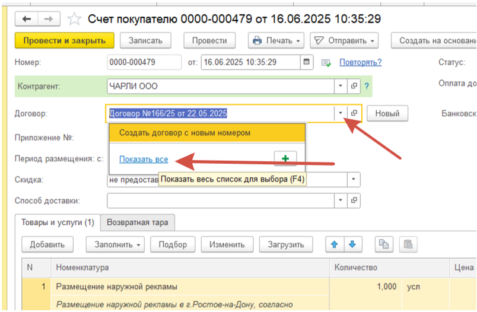

## 2. Далее видим что есть два договора, один из которых указан как основной (или может быть другая какая-то инфо), главный договор у  данного клиента 166/25.

Необходимо правой кнопкой нажать на основной договор и далее нажать Изменить 

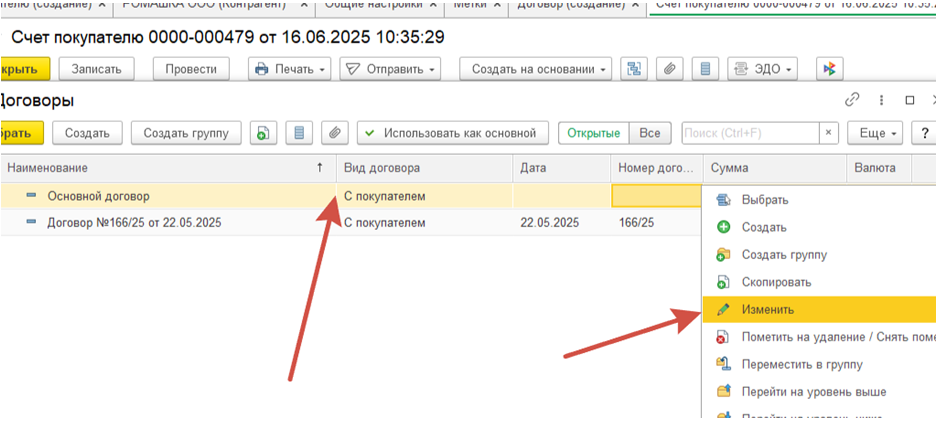

## 3. Далее необходимо нажать галочку Договор закрыт и нажать Записать и закрыть

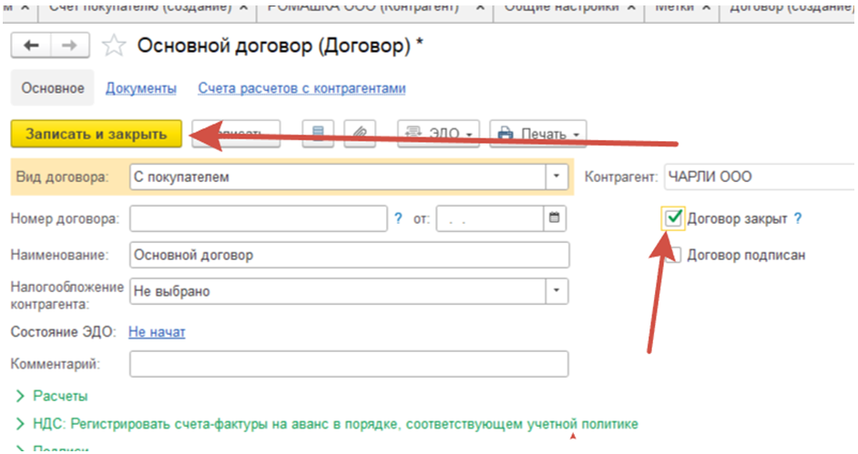

В данном случае договор не удаляется, а просто закрывается.

У каждого контрагента должен быть только один действующий договор. 

Далее в списке останется один договор и нужно отметить его как основной.

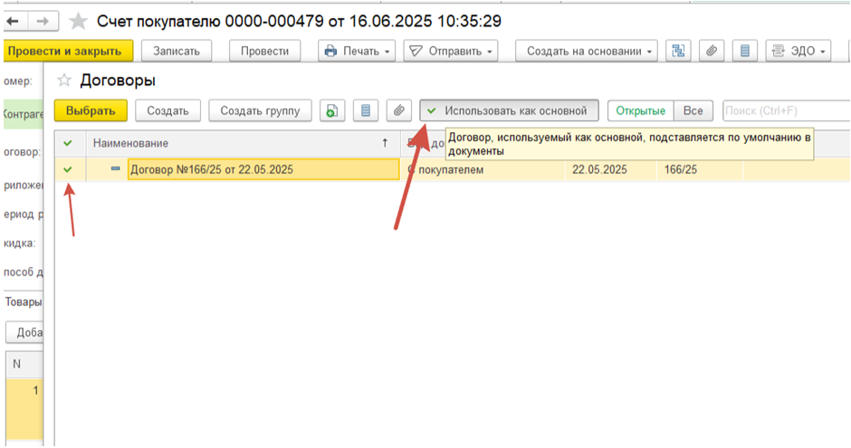

После создания Договора возвращаемся к созданию счета.

•        В поле контрагент пишем наименование, автоматически появляется Номер договора.

•        Затем указываем номер приложения и дату.

•        Затем указываем период размещения (если это размещение, если другая услуга, то поле оставляем пустое)

•        Затем нажимаем Добавить и указываем необходимую номенклатуру из списка Новые 

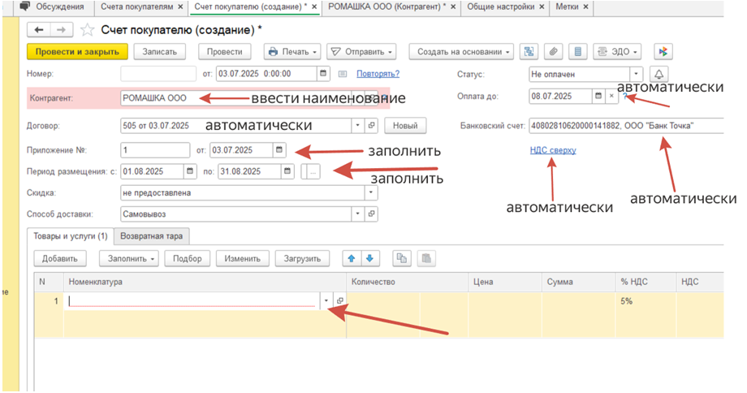

В падающем списке номенклатур необходимо выбрать нужную, если в списке не появилось нужной номенклатуры, необходимо нажать Показать все, перейти во вкладку НОВЫЕ и выбрать нужную номенклатуру

Наши номенклатуры: 

## 1) Изготовление наружной рекламы – нестандартные заказы по печати, вывескам

## 2) Монтажные работы – любой дополнительный монтаж баннеров, вывесок и прочее

## 3) Размещение крупного формата – скроллеры, билборды, панно, суперсайты и другие крупные конструкции

## 4) Размещение мелкого формата – указатели, остановки, пиллары, сити-форматы и другие мелкие конструкции

## 5) Разработка дизайн-макета – создание любого дизайн-макета

## 6) Реклама в лифтах - реклама в лифтах или подъездах

## 7) Реклама на транспорте – любая реклама на автобусах

## 8) Широкоформатная печать – вся печать для размещения наружной рекламы

Например: контрагент берет у нас размещение билборда и заказывает печать 3х6. 

В первой строчке выбираем номенклатуру Размещение крупного формата

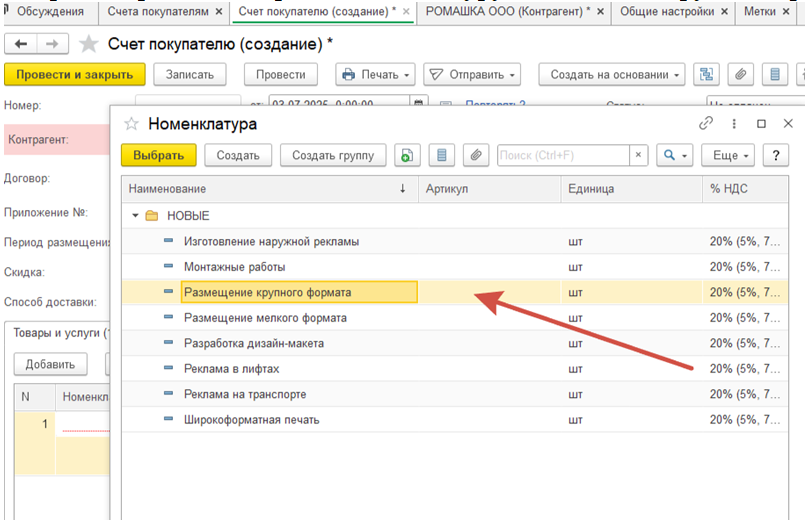

•        После создания в строчке ниже нужно указать всю подробную информацию о данной конструкции (формат, адрес, период) указать цену и количество, НДС автоматически рассчитается сверху данной суммы.

Ниже в комментарии необходимо указать период размещения (например, “август”, с маленькой буквы и без ошибок!!!) 

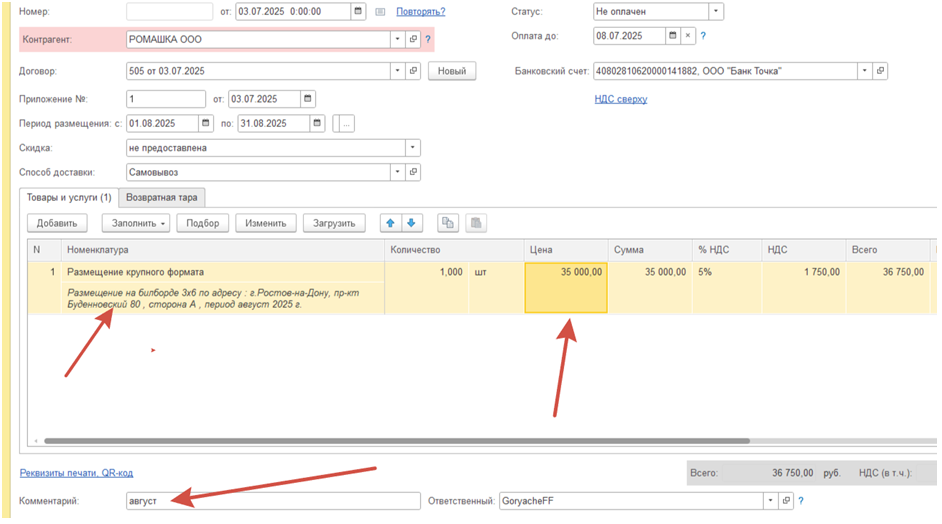

•        Далее добавляем строчку по печати (выбрать номенклатуру Широкоформатная печать, а ниже указать печать баннера 3х6м)

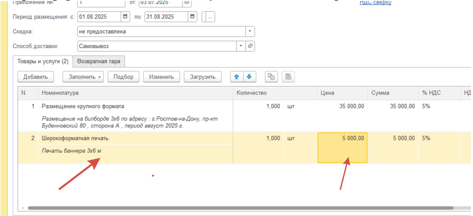

•        Нажимаем Записать и переходим к созданию договора и приложения.

•        Договор шаблон, в нем будут указаны все наши данные и все данные контрагента, которые были введены в его карточку.

•        В приложении будут указаны все данные, которые были введены в счете.

•        Необходимо перепроверить все данные и, если все верно, отправлять уже клиенту

•        Далее сохраняем счет 

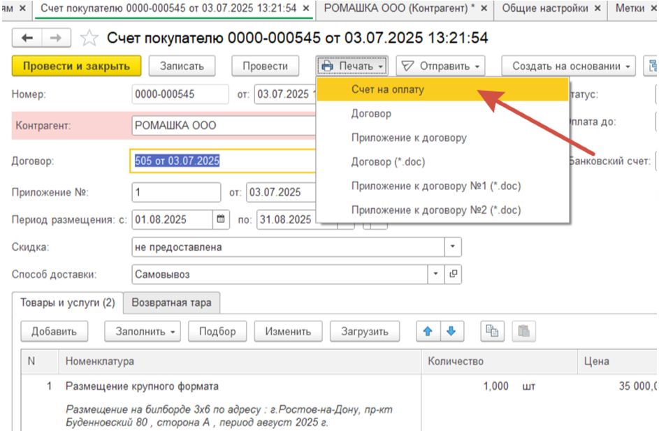

В счете еще раз перепроверить, все ли правильно введено, если счет нужен в скане, то оставляем факсимильную печать и подпись.

Если счет нужен в ЭДО, то нужно убрать печать и подпись

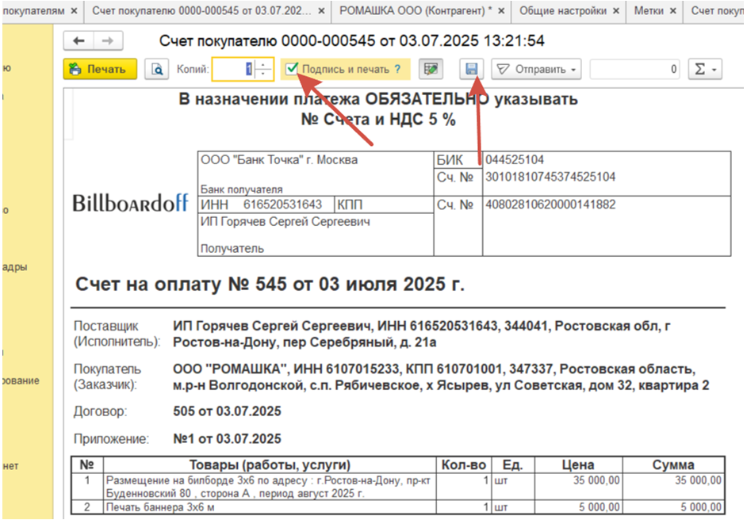

## 15. Инструкция по созданию УПД в         1С

Офисный менеджер создает и загружает документы в систему электронного документооборота (ЭДО). Важно уведомить клиентов о готовности универсального передаточного документа (УПД) для его подписания.  Если ЭДО у клиента нет запросить распечатку документа и его подписание с последующей передачей клиенту в бумажном виде. 

## 17.Инструкция по изучению города, где расположены конструкции

Пример: Ростов-на-Дону 

- Узнать из каких районов состоит город (в яндексе, у других менеджеров, у знакомых, которые там живут) 

- Далее выяснить какие улицы относятся к данным районам (например Космонавтов – Северный, Стачки – Западный, Буденновский – центр) 

- Далее на нашем сайте посмотреть на каких улицах располагаются конструкции и каких форматов 
Например: Пушкинская ул. – практически только мелкий формат 1.2х1.8 м, Будённовский, Ворошиловский – из крупного в основном 2.7х3.7 м 

- Далее зайти на сайт под админкой, и тогда в карточке каждого места будет видно владельца каждого места (при выявлении несоответствий с данными обратиться к руководителю)

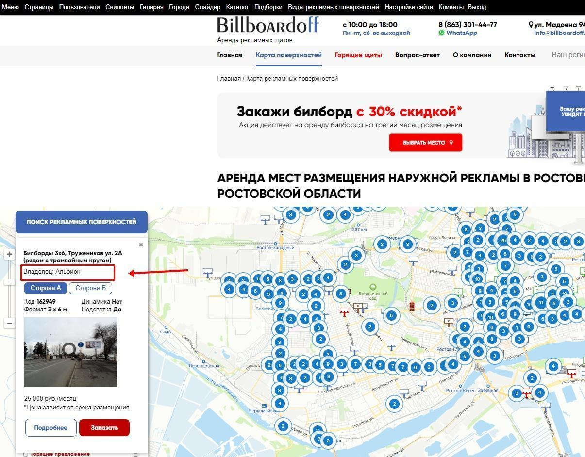

- Далее сделать несколько примерных подборок щитов для разных клиентов по разным районам или улицам.
Например:

- все крупные места по центру

- щиты возле фитнес клубов

- места возле поликлиник

- щиты по определенному району

- щиты по нескольким улицам в нескольких районах 

## 18. Инструкция по заполнению планов и отчетов на день/неделю

Заполненные планы-отчеты помогают структурировать и оптимизировать деятельность сотрудника на протяжении дня и недели.

При составлении плана важно расписывать задачи достаточно подробно, можно указывать необходимые названия, контакты, дополнительные действия или желаемый результат.

Все планы и отчеты заполняются по установленному образцу.

- План-отчет на день:

В конце каждого рабочего дня каждый сотрудник вносит данные по проделанной работе в дневной план-отчет, указывая выполненные действия и/или результат и пишет план действий на следующий день.

Образец плана на день:

01.03.2025

Задача

Статус

Связаться с компанией "А", согласовать пролонгацию размещения

Связаться с клиентом "Б", согласовать стоимость размещения на билбордах 

Выставить счет компании "В", отправить их представителю

Внести данные по продажам, стоимости и адреса конструкций, проданных за день

Образец отчета за день:

01.03.2025

Задача

Статус

Связаться с компанией "А", согласовать пролонгацию размещения

Согласовали пролонгацию по всем текущим конструкциям, информация внесена в таблицу

Связаться с клиентом "Б", согласовать стоимость размещения на билбордах 

Согласовали стоимость размещения, завтра необходимо выставить счет

Выставить счет компании "В", отправить их представителю

Счет отправлен клиенту, в течение трех дней должны оплатить

Внести данные по продажам, стоимости и адреса конструкций, проданных за день

Таблица заполнена

        Если в течение дня появляются дополнительные задачи, их также следует вносить в план и отчет.

        Дневные планы-отчеты должны быть готовы и отправлены ассистенту руководителя к 18:00.

При появлении дополнительных задач во внерабочее время необходимо добавить их в план и утром сообщить об этом ассистенту руководителя.

- План-отчет на неделю:

Каждый четверг в конце рабочего дня каждый сотрудник вносит данные по проделанной работе в недельный план-отчет, указывая выполненные действия и/или результат и пишет план действий на следующую неделю.

Задачи по статистикам: Это конкретные действия, направленные на достижение плановых показателям по статистикам.

Стратегические задачи: Это действия направленные на развитие компании или улучшение собственных результатов в перспективе. Определяются руководителем.

Административные задачи: Регулярные действия, направленные на систематизацию работы, отслеживание результатов и повышение эффективности. А также задачи, направленные на изменение или контроль внутренних процессов в организации.

По началу при написании задач разного типа можно ориентироваться на таблицы других сотрудников. 

Также в недельный отчет вносятся результаты по статистикам. Данные по сумме дохода и количеству проданных конструкций можно брать из таблицы «Продажи».

Образец плана на неделю:

Статистика

Норма

Факт

Сумма полученного дохода 

1 000 000

Кол-во проданных конструкций 

60

Кол-во звонков новым клиентам

60

Кол-во отправленных КП 

60

Задачи по статистикам:

Результат

Заборы ЮСС и СК10. Взять инициативу в свои руки, организовать замеры, рассчитать стоимость размещения 

Проверить по клиентам оплаты за апрель, актуализировать таблицу

Подготовить приложения для всех клиентов на май, отправить клиентам на подписание

Выставить всем клиентам счета на май, отправить для оплаты

Стратегические задачи:

Результат

Сделать в Битриксе шаблоны договоров

Дополнить инструкции в Папке менеджеров

Административные задачи:

Результат

В четверг проверить все накопившиеся акты, счета, приложения от поставщиков в СБИС

Постоянно отслеживать стороны Альбиона из списка

Ежедневно вовремя заполнять необходимые планы, отчеты, статистики, графики

Регулярно актуализировать необходимые таблицы

Образец отчета за неделю:

Статистика

Норма

Факт

Сумма полученного дохода 

1 000 000 ₽

1 120 000 ₽

Кол-во проданных конструкций 

60

55

Кол-во звонков новым клиентам

60

75

Кол-во отправленных КП 

60

40

Задачи по статистикам:

Результат

Заборы ЮСС и СК10. Взять инициативу в свои руки, организовать замеры, рассчитать стоимость размещения 

Монтажники произвели замеры, рассчитал себестоимость, подготовил КП для клиентов

Проверить по клиентам оплаты за апрель, актуализировать таблицу

Проверил оплаты, актуализировал таблицу, связался с должниками, напомнил про сроки оплаты

Подготовить приложения для всех клиентов на май, отправить клиентам на подписание

Подготовил приложения для всех клиентов, отправил клиентам, большую часть уже подписали, с остальными досогласуем и подпишем в течение пары дней

Выставить всем клиентам счета на май, отправить для оплаты

Выставил счета всем клиентам с подписанными приложениями, мониторю оплаты

Стратегические задачи:

Результат

Сделать в Битриксе шаблоны договоров

Сделал шаблон, опробовал на нескольких клиентах, все работает

Дополнить инструкции в Папке менеджеров

Отредактировал имеющиеся инструкции, начал писать новые, на следующей неделе завершу

Административные задачи:

Результат

В четверг проверить все накопившиеся акты, счета, приложения от поставщиков в СБИС

Все документы проверены, отправлены на подписание бухгалтеру

Постоянно отслеживать стороны Альбиона из списка

Отслеживаю, по мере необходимости актуализирую таблицу

Ежедневно вовремя заполнять необходимые планы, отчеты, статистики, графики

Все вовремя и качественно заполнено

Регулярно актуализировать необходимые таблицы

Регулярно и качественно делаю

Если в течение недели появляются дополнительные задачи, их также следует вносить в план и отчет. При появлении дополнительных задач во внерабочее время необходимо добавить их в план и утром сообщить об этом ассистенту руководителя.

        Недельные планы-отчеты должны быть готовы и отправлены ассистенту руководителя к 18:00 каждого четверга.

## 19. ПОШАГОВАЯ СИСТЕМА ПО РАБОТЕ С КЛИЕНТАМИ + возможные возникшие ситуации

По работе с новым клиентом добавляется в начале несколько действий:

- Получить заявку и отработать её по инструкции №1

- Составить коммерческое предложение (адресную программу) по инструкции на основе их запроса (сначала выявить, что есть подходящее из наших подтвержденных мест, затем сделать запросы владельцам)

- Поставить необходимые стороны в резерв у владельца до конкретного числа и получить ответ от владельца на почту с подтверждением резерва

- Заполнить всю необходимую информацию в СРМ систему по инструкции №4

- Запросить у клиента реквизиты и удобный вид документооборота, завести клиента в 1С, подготовить счет на оплату по инструкции №14

- Подготовить договор и приложение по инструкции №10

- Отправить документы клиенту в ЭДО (или распечатать оригиналы) по инструкции №11 и уведомить офис-менеджера для подписания.

- Получить подтверждение на выбранные стороны от клиента на электронную почту и подписать отправленные ему документы

- Добиться получения оплаты в кратчайшие сроки 

- Заполнить всю необходимую информацию в таблицы Наши щиты, Продажи и также в СРМ систему 

- Отправить клиенту Технические требования и необходимые размеры для выбранных конструкций 

- Согласовать дизайн-макет с владельцами щитов на основании инструкции №12 

- Запустить в печать рекламные материалы клиента по инструкции №13

-  Запросить статус монтажа новых размещений ( с 1 по 3 число текущего месяца размещения) 

- После получения статуса монтажа – объехать,  сфотографировать и загрузить фотоотчет на Яндекс-диск по инструкции №8

- После получения фотоотчета от владельцев конструкций или фото объезда нашей компанией – отправить фотоотчет клиенту загруженный в папку на Яндекс-диске 

- В конце месяца размещения с 25 по 31 число создать УПД по инструкции №15 и отправить клиенту в ЭДО или отправить оригиналы. 

- Добиться подписания всех отправленных УПД 

- Запросить у клиента отзыв о размещении, выслав ссылку на Яндекс-карты 

Дополнение к работе с клиентами: 

На примере одного квартала (апрель, май, июнь):

- Если размещение начинается с апреля, то согласовывать необходимо за 40 дней до начала, то есть 20 февраля (к 1 марта эти конструкции нам необходимо подтвердить или отказаться поставщикам) 

- Всегда необходимо стараться подписать приложения минимум на 2 месяца 

- Если возможно, то необходимо запросить дизайн-макет от клиента до начала подтверждения Поставщику 

- С 15.02 по 25.02 – Созвон/Встреча с клиентом для обсуждения размещения и подбор конструкций на будущий период 

- С 25.02 по 28.02 – Согласование и подписание приложения с клиентом на апрель и далее 

- С 10.03 По 15.03 – Выставление счета на оплату и контроль получения денежных средств

- С 15.03 по 20.03 – Запрос дизайн-макета и согласование с юристами поставщиков 

- С 22.03 по 27.03 – Отправка макетов в печать и оповещение поставщиков о доставке и необходимом монтаже (если не отправляли им разбивку), параллельно следить за получением оплаты до отправки в печать 

- С 01.04 по 03.04 – Запрос статуса монтажа (или по возможности сразу фотоотчета) от поставщика 

- С 01.04 – по 05.04 – Личный объезд новых конструкций или тех, где обновили макеты, осуществление фотоотчета 

- С 05.04 по 10.04 – Отправка фотоотчета клиентам 

- С 10.04 по 15.04 – Выставление новых счетов на оплату. Делаем разбивку по печати и повесам на май.

- С 25.04 по 31.04 – Создание УПД и отправка клиенту 

- С 01.05. По 10.05 – Отслеживание подписания всех отправленных УПД за завершенные сделки 

Важные правила:

- Ни в коем случае не передавать клиентам прямые контакты наших поставщиков.

- Конструкции считаются проданными, доход полученным, когда деньги от клиента приходят на счет нашей компании.

- Продажа считается завершенной, когда с клиентом подписано УПД.

- Рекламный материал клиента считается размещенным, когда мы отправляем клиенту фото-отчет.

- Нормой считается 95% предоплата от клиентов.

- Заказ дизайна, печати, монтажа можно делать, только когда клиент подписал соответствующие документы (приложения).

- Все официальные переписки, согласования, утверждение условий, подтверждение конструкций и сроков ведутся по электронной почте.

- Необходимо знать максимум о всех своих клиентах (Компания / ЛПР / локация / аудитория / маркетинговая стратегия / результаты / прошлые размещения / интересы на будущее / другая реклама / потребность в еще каких-то рекламных продуктах).

- Необходимо лично знать всех своих клиентов и регулярно с ними встречаться (намеренно / случайно / якобы случайно). Исключения – клиенты из других регионов, в этом случае необходимо регулярно созваниваться, проводить видео-созвоны.
