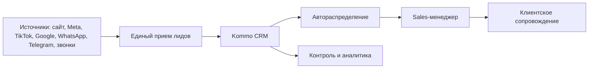

# TO-BE: LicenseBridge USA

## Принцип

Сначала стабилизируется базовая sales-система: лиды, связь, распределение, следующий шаг и контроль времени на этапах. После этого собирается понятный дашборд для РОПа с автоматическим обновлением данных из Kommo.

## Целевая схема

## Целевое поведение системы

### Лиды

- Каждый лид из рекламного, мессенджерного, сайт- или звонкового канала создаёт корректную сущность в Kommo.
- Лид не зависает в `Неразобранном`, если по бизнес-логике его можно сразу назначить менеджеру.
- В карточке сохраняются источник, канал, UTM/кампания, контакт, сообщение и контекст.
- Повторное обращение прикрепляется к существующей активной сделке или явно подсвечивает менеджеру существующий контакт.

### Распределение

- Новые заявки распределяются автоматически: равномерно, по графику, источнику или другому согласованному правилу.
- Если клиент уже закреплён за менеджером, система сохраняет владельца или показывает, кто ведёт клиента.
- Менеджеры не получают лишний доступ ко всей базе, но видят достаточный контекст для корректной обработки обращения.

### Задачи и SLA

- У каждой активной сделки есть следующий шаг.
- Сделки без задач выявляются автоматически.
- Для ключевых этапов есть контроль времени нахождения, чтобы сделки не застаивались.
- РОП видит просрочки и сделки без движения без ручного просмотра всей воронки.

### Телефония и мессенджеры

- RingCentral и SIP-схема имеют понятные роли: основной и резервный канал или разделение по сценариям.
- Пропущенные звонки и входящие обращения не теряются.
- WhatsApp/Telegram работают через выбранную схему: eChat или официальная WhatsApp Business-интеграция, если нужны первые сообщения и прогревы.
- Доступ к оборудованию телефонии решён без постоянного AnyDesk.

### Сопровождение после оплаты

- Продажная сделка корректно закрывается в успешный статус для аналитики.
- Воронка сопровождения получает нужный контекст: контакт, поля, историю, оплату, комментарии.
- Клиентский менеджер видит, что было обещано клиенту до оплаты.

### Аналитика

- Руководитель видит источники, конверсию, скорость первого контакта, просрочки и работу менеджеров.
- Дашборд для РОПа автоматически подтягивает данные из Kommo.
- Все дополнительные улучшения выносятся за рамки текущего проекта и согласуются отдельно.

## Этапность

1. Аудит и архитектура.
2. Стабилизация лидов, связи и распределения.
3. Снижение ручной работы менеджеров.
4. Дашборд для РОПа.
