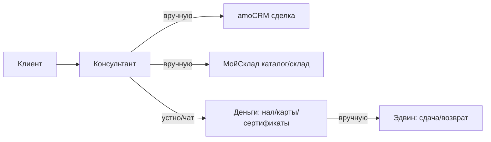

# MANSBAND — AS-IS (как сейчас)

**Клиент:** `mansband` · **Дата:** 2026-06-02 · Источники: `СТРУКТУРА_КАССЫ.md`, `СТАТУС_ЗАДАЧ.md`, ТЗ новой кассы, аудит API.

---

## Процесс продажи сейчас

1. amoCRM — главная система: лид/сделка, телефония (Telphin), воронки, поля, Roistat, статистика. Настроена глубоко (27 этапов в «Продажах», десятки полей).
2. МойСклад — фактически только **каталог и склад**: заводят номенклатуру, принимают и перемещают товар. Остальные кассовые действия — вручную/в заметках.
3. Деньги (нал, переводы на ~15 карт/счетов, сертификаты) считаются и фиксируются вручную.
4. Сдача и возвраты «не выдано» — устно/в переписке; выдаёт Эдвин.
5. Сверка кассы в конце смены — не системно.

---

## Боли (подтверждённые)

| # | Боль | Следствие |
|---|------|-----------|
| 1 | Нет быстрого ввода в сезон | Продавец занят кассой, а не клиентом; теряются чеки |
| 2 | Деньги вручную: мульти-оплата, сдача, доплата | Ошибки, потерянная сдача, нет прозрачности |
| 3 | Смену закрывают без сверки нала/переводов | Недостачи всплывают поздно |
| 4 | Сертификаты без реестра и баланса | Не видно остатка, путаница при оплате сертификатом |
| 5 | Аренда вручную | Нет контроля сроков, фото паспорта, возвратов |
| 6 | Слив/не-слив, отложки, обещания разрознены | Нечестная конверсия, теряются клиенты между шоурумами |
| 7 | Возвраты/обмены/дефекты без единого процесса | Нет фотофиксации, брак не уходит на склад Брака |
| 8 | Статистика общая | Не разделено: магазин vs call-менеджер, по людям/точкам |

---

## Что уже хорошо (фундамент, на котором строим)

- В amoCRM **уже есть** воронки и поля под все сценарии: Канал продаж, Цель покупки, Адрес магазина, № Сертификата, Имя гостя, Аренда до, Резерв до, Платная отложка, Причина провала, Сара, связки с МойСклад и СДЭК.
- В МойСклад корректно заведён каталог, склады = адреса/состояния (включая Ателье, Полупарки, В пути).
- Есть интеграция amoCRM ↔ МойСклад (поля «Заказ МойСклад», «№ Отгрузки» и т.п.).

**Вывод:** не нужна вторая база. Нужен **быстрый удобный UI** поверх готового amoCRM + каталога МойСклад, плюс лёгкий бэкенд там, где amoCRM не покрывает (деньги-проводки, сертификатный баланс, очередь Эдвина).
