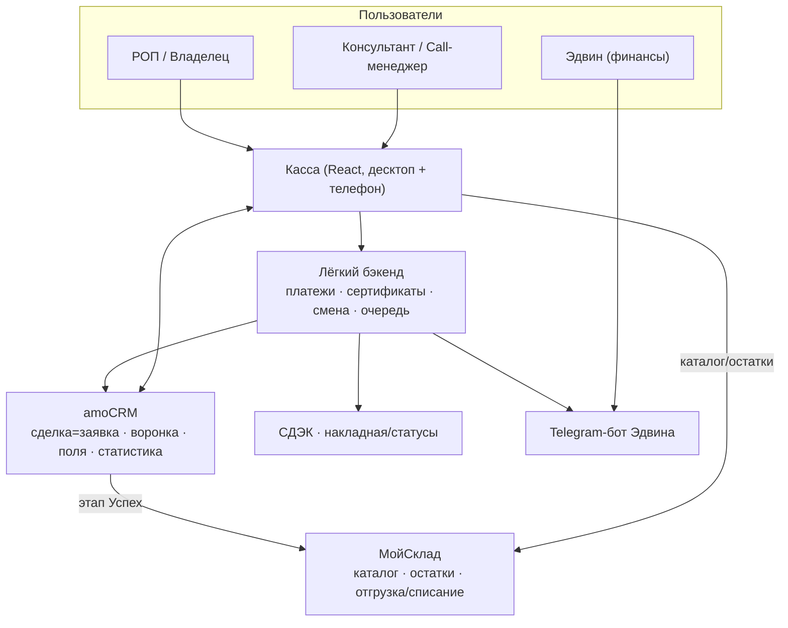
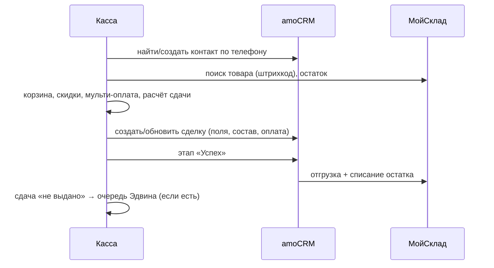

# MANSBAND — TO-BE (целевая архитектура)

**Клиент:** `mansband` · **Дата:** 2026-06-02

---

## Принцип

**Касса = быстрый UI поверх amoCRM (сделка = заявка) + каталог МойСклад.**
amoCRM остаётся «мозгом» (воронки, поля, автоматизации, статистика). Касса — «руки». Свой лёгкий бэкенд добавляется только там, где amoCRM не покрывает: денежные проводки, сертификатный баланс, очередь Эдвина, сверка смены.

---

## Поток «Продажа» (целевой)

---

## Сопоставление: где живёт что

| Данные | Источник истины | Примечание |
|--------|-----------------|------------|
| Клиент, источник, цель, этап, поля | **amoCRM** | поля уже есть |
| Товары, остатки, отгрузка, списание | **МойСклад** | каталог 66 поз. |
| Денежные проводки (мульти-оплата, сдача, доплата) | **бэкенд кассы** | итог синхронизируется в поле сделки |
| Сертификаты (номер, баланс, статус, связи) | **бэкенд кассы** | в amoCRM дублируется `№ Сертификата` |
| Очередь сдачи/возврата «не выдано» | **бэкенд кассы** | + Telegram-бот Эдвина |
| Закрытие смены / сверка | **бэкенд кассы** | по способам оплаты |
| Доставка | **СДЭК** + поля amoCRM | статусы Отправлен/Доставлен |

---

## Роли

Консультант · Call-менеджер · Снабженец (Илья) · РОП · Эдвин (финансы) · Владелец. Права на действия и видимость статистики — по роли.

---

## Нефункциональные требования

- **Скорость:** прямые вызовы amoCRM/МойСклад при стабильном интернете; кэш для тяжёлой статистики; оптимистичный UI.
- **Адаптив:** основной — десктоп, плюс телефон (камера для фото паспорт/брак/сертификат, скан штрихкода).
- **Надёжность денег:** проводки неизменяемы, аудит-лог, идемпотентность операций (нет двойного списания).
- **Масштаб/правки:** виды заявок и поля — конфигом; новый шоурум/продавец — настройка.

---

## Открытые вопросы (для Миши)

1. 54-ФЗ: касса учётная или нужна фискализация (ОФД)?
2. Отгрузку/списание при «Успехе» инициирует касса или текущая интеграция amoCRM↔МойСклад?
3. Роли заводим через пользователей amoCRM или отдельной таблицей?
4. Сертификат → «Успех» при использовании (баланс = 0) — подтвердить.
