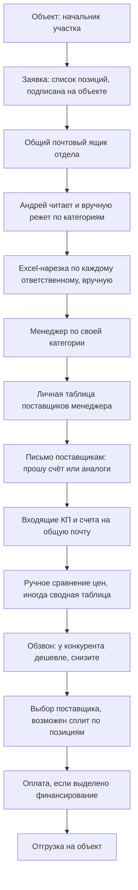

# AS-IS — как есть сейчас

**Клиент:** `triumf_snab`
**Дата:** 2026-08-10
**Источник:** discovery-встреча с Андреем 10.08.2026, транскрипт [`2026-08-10_Тверская_улица_транскрипт.md`](2026-08-10_Тверская_улица_транскрипт.md)

> Всё ниже — со слов Андрея. Там, где данных не хватило, стоит пометка «гипотеза» или «не выяснено» — не додумывать при переходе к ТЗ.

---

## 1. Описание текущего процесса

### 1.1. Основной поток: заявка с объекта → отгрузка

**По шагам:**

1. **Заявка приходит с объекта.** Список позиций: наименование, количество, единица измерения, подрядчик-получатель («для кого этот материал»). Документ подписан на объекте, есть виза Шахова. Приходит на общий почтовый ящик отдела, часть заявок — сканы PDF.
2. **Андрей разбирает заявку вручную.** Читает позиции и распределяет по ответственным по памяти: лопаты, буры, диски, проволока → Татьяна; вода и медоборудование → Олеся; электрика → Илья; монолит, труба ПВХ, электроды → Санёк; уличное и спортивное оборудование → Павлик. Формального справочника «категория → ответственный» нет, знание в головах: «они все знают, кто за что отвечает».
3. **Нарезка в Excel.** Андрей руками формирует для менеджера файл только с его позициями. Пример из разговора: отправил Павлику отдельный файл только по электрике на время отсутствия Ильи.
4. **Менеджер работает по своей таблице поставщиков.** У каждого своя, не связанная с другими. Производители выделены жирным как приоритетные.
5. **Запрос поставщикам письмом.** Шаблон однотипный: «Добрый день, прошу подобрать аналоги» + список позиций с типом, маркой, заводом-изготовителем, количеством, характеристиками + реквизиты для счёта. Для медицинских учреждений дополнительно требуется РУ (регистрационное удостоверение).
6. **Поставщики присылают КП и счета.** Дальше поставщики сами обзванивают: «будете покупать, когда оплатите». Отдел находится в позиции силы: «у нас большой пул, у кого купить, а у них, кому продать, небольшой».
7. **Сравнение и торг.** Иногда собирается сводная таблица «у кого что сколько стоит». Практикуется давление ценой конкурента: «Калужский газобетон дал дешевле, будете снижать?». Возможен сплит одного счёта: часть позиций у одного поставщика, часть у другого.
8. **Выбор и отгрузка.** Сейчас каждый менеджер вправе сам выбрать поставщика и отгрузить, согласование с Андреем не обязательно.

**Два режима по срочности:**

| Режим | Когда | Как работает |
|---|---|---|
| Обычный | Есть запас времени (норматив ~1 неделя на заявку) | Рассылка в 5–10 компаний, сбор КП, торг, выбор |
| Срочный | «Губернатор завтра приедет», забытая позиция | Запрос → кто дешевле прислал, того и оплачиваем, отгрузка сразу |

Отдел давит на объекты, чтобы заявки присылали заранее и обычный режим оставался основным.

### 1.2. Оснащение объектов

После сдачи стройки отдел закупает наполнение школы: мебель, компьютеры, доски, глобусы, указки, канцелярия, турникеты и рамки-металлоискатели, станки для трудового обучения, оборудование для столовой. Иногда с монтажом, иногда без. Процесс закупки тот же, что в 1.1, отличается номенклатура и требования к разрешительной документации.

### 1.3. КП для сметы

Проектировщики работают у компании на субподряде. Когда нужна смета, они передают список позиций, а отдел снабжения готовит пакет коммерческих предложений по установленной форме для обоснования цены. В речи Андрея это «конъюнктурный анализ» — в наших артефактах: **КП для сметы**.

Сейчас вручную через ChatGPT. Слова Андрея: «нужно 3 КП делать **условно**» — загружает форму, задаёт базовую цену, второе и третье получают +2% и +4%. Три — типичный шаблон, не жёсткий лимит «никогда больше».

### 1.4. Работа с новыми поставщиками

Поставщики звонят в отдел сами, постоянно. Андрей фильтрует их на слух за 7 лет опыта:

- **Отказ:** «мы можем привезти что угодно» (перекупщик), «только предоплата» (в норме отдел работает по отсрочке).
- **Интерес:** узкая специализация, «50 лет по этой позиции, сильнейший игрок на рынке», статус производителя.

Подходящему поставщику предлагают прислать информацию на почту, контакт записывается, следующий профильный запрос отправляют и ему тоже — для сверки цен с текущими.

### 1.5. Как сейчас контролируются сроки и цены

- **Сроки:** системного контроля нет. Реактивно: сверху дёргает первый зам («что там с металлом?»), Андрей дёргает менеджера. Начальники объектов звонят менеджерам напрямую, зная, кто за что отвечает; при проблемах с оплатами звонят Андрею.
- **Цены:** выборочно и вручную. Андрей видит в общей почте запросы менеджеров и параллельно запрашивает те же позиции у своих контактов. При расхождении подходит к менеджеру и показывает разницу.
- **Порог визирования:** правило «счёт свыше 100 000 ₽ только с подписью Андрея» **проговорено на совещании, но не введено**.

---

## 2. Узкие места

| Узкое место | Проявление | Частота / масштаб |
|---|---|---|
| Ручной разбор заявки руководителем | Андрей читает каждую заявку и распределяет позиции по памяти | Каждая заявка. По его оценке — 60–70% работы отдела |
| Матрица «категория → ответственный» только в головах | Нет справочника; при отпуске или уходе сотрудника перекидывают вручную (случай с Ильёй) | Постоянно, критично при отсутствии людей |
| Excel-нарезка вручную | Файл под каждого менеджера собирается руками; отдельно — выборка под конкретного поставщика | Каждая заявка × число ответственных (до 5+) |
| Реестры поставщиков разрознены | У каждого своя таблица, обмена нет; ключевые связи у Андрея в памяти | Постоянно. Риск потери базы при уходе сотрудника |
| Сравнение КП вручную | Сводная таблица собирается не всегда, только «бывает» | Каждая закупочная позиция |
| Нет визирования счетов | Любой менеджер сам выбирает поставщика и отгружает | Все закупки. Порог 100 тыс. не введён |
| Экономия не оцифрована | Нет накопленной цифры «сэкономлено за период»; разовые распечатки для руководства | Постоянно. Прямо влияет на статус отдела |
| Контроль сроков реактивный | Начинается после звонка сверху или с объекта | Каждый раз при эскалации |
| Кассовый разрыв как скрытый статус | Заявка стоит из-за отсутствия денег, но в системе координат это не отличается от «менеджер не сделал» | Текущий период, массово |

---

## 3. Потери (время, деньги, качество данных)

- **Время.** Основная потеря — время руководителя отдела на механическую операцию (чтение заявки, классификация, нарезка). Точный объём в часах не измерялся, есть только оценка доли работы 60–70% — при переходе к ТЗ нужен baseline.
- **Деньги / упущенная выгода.** По оценке Андрея, закупка через отдел минимум на 30% дешевле, чем через смежный отдел подрядчиков. Подтверждённый единичный пример: 4 900 ₽ против 3 100 ₽ по одной позиции. Отдельная потеря — пени 0,1% в день по просроченным оплатам поставщикам (обычный cap 10%) и репутационный ущерб от иска, попавшего в проверочные сервисы.
- **Ошибки и качество данных.** Знание о поставщиках не структурировано и не передаётся; условия (отсрочка, лимит, срок оплаты) живут в личных таблицах; истории закупочных цен по позициям нет, поэтому нельзя ответить «а сколько это стоило в прошлый раз».

---

## 4. Системы и ручные операции

| Шаг | Система | Ручное действие | Кто |
|---|---|---|---|
| Приём заявки | Общий почтовый ящик | Прочитать письмо, открыть PDF | Андрей |
| Классификация позиций | — | Определить категорию и ответственного по памяти | Андрей |
| Нарезка по ответственным | Excel | Скопировать строки в отдельный файл | Андрей |
| Постановка задачи | Почта / устно / телефон | Написать или сказать менеджеру | Андрей |
| Выбор поставщиков | Личная таблица Excel / Google Sheets | Найти профильных, отметить производителей | Менеджер |
| Запрос КП | Почта | Составить письмо со списком позиций и реквизитами | Менеджер |
| Сбор КП | Почта | Отследить, кто ответил | Менеджер |
| Сравнение цен | Excel | Собрать сводную таблицу | Менеджер |
| Торг | Телефон | Обзвон с аргументом цены конкурента | Менеджер |
| Поиск аналогов и производителей | ChatGPT, сайты дистрибьюторов (сертификаты) | Запрос вручную, без регламента | Андрей и часть менеджеров |
| Пакет КП для сметы (обычно 3 «условно») | ChatGPT + шаблон формы | Загрузить форму, задать цены и наценки +2/+4% | Андрей |
| Оплата и отгрузка | 1С (гипотеза, роль не выяснена) | Провести оплату при наличии финансирования | Не выяснено |
| Контроль сроков | — | Реактивный обзвон после эскалации | Андрей |

---

## 5. Риски текущего процесса

1. **Bus factor на руководителе.** Разбор заявок, ключевые контакты поставщиков и понимание рынка сосредоточены в голове одного человека, который при этом планирует передать закупку и уйти в другую роль.
2. **Bus factor на менеджерах.** Уход сотрудника уносит его личную таблицу поставщиков и наработанные условия. Случай с Ильёй показал, что переброс категории — ручная и болезненная операция.
3. **Отсутствие визирования.** Любой менеджер может отгрузить по любой цене. Контроль выборочный, постфактум.
4. **Кассовый разрыв искажает любую метрику исполнения.** Без явного статуса «ждём финансирование» просрочка не отличима от неисполнения — это ломает и текущий ручной контроль, и любую будущую систему дедлайнов.
5. **Ценность отдела не доказана в цифрах.** Экономия не фиксируется, поэтому отдел не может защитить свою позицию перед руководством и конкурировать с логикой «отдадим подрядчику с материалом».
6. **Неконтролируемое использование ИИ.** ChatGPT применяется без регламента и проверки, в том числе для документов, уходящих в смету. Риск непроверенных данных о поставщиках и характеристиках.
7. **Волатильность цен.** Ежедневные колебания делают невозможной фиксацию нормативной цены — только справочный ориентир с датой.

---

## 6. Что нельзя ломать при переходе

- **Почта остаётся основным каналом.** Вся внешняя коммуникация с поставщиками идёт письмами, и это работает. Система должна встроиться в почту, а не заменить её.
- **Excel как формат обмена с поставщиками.** Поставщику уходит файл, к которому он привык. Выгрузка должна оставаться обычным Excel.
- **Закрепление людей за категориями.** Сложившееся распределение — сильная сторона отдела, его нужно оцифровать в справочник, а не перекраивать.
- **Приоритет производителей над перекупщиками.** Признак «производитель» и логика отбора должны переехать в систему как есть.
- **Право менеджера торговаться.** Обзвон и торг после сбора КП — источник экономии, автоматизация не должна его вытеснять.
- **Прямая связь объектов с менеджерами.** Начальники объектов звонят напрямую тем, кто ведёт их позиции. Систему строим поверх этого, не запрещая прямой контакт.
- **Простота интерфейса.** Часть команды 40–55 лет; всё, что сложнее письма и одной страницы задачи, повышает риск отторжения.

---

## 7. Не выяснено (собрать в дискавери)

1. Почтовый провайдер и техническая возможность подключения по IMAP к общему ящику.
2. Единая ли форма заявки с объекта или каждый объект пишет по-своему; доля сканов против машиночитаемых файлов.
3. Конфигурация 1С, кто в ней работает, где проводятся счета и оплаты.
4. Существует ли утверждённый справочник категорий материалов.
5. Среднее число позиций в заявке и число заявок в месяц (нужен baseline для метрик).
6. Где хранится форма КП для сметы, откуда печати и подписи; бывает ли пакет >3.
7. Кто принимает решение по бюджету на внедрение и в каком горизонте.
