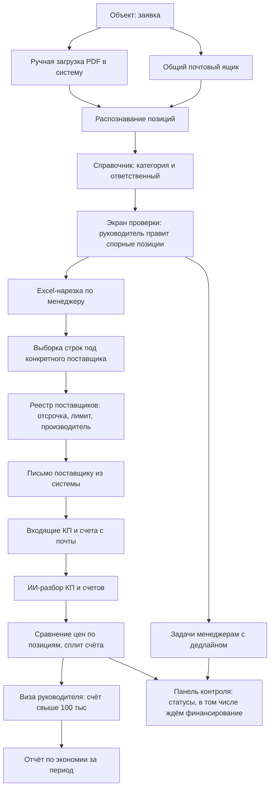

# TO-BE — целевое состояние

**Клиент:** `triumf_snab`
**Дата:** 2026-08-10 · обновлено 2026-08-11 (авторазбор КП)
**Архитектура:** вариант A — своя лёгкая веб-система (не Битрикс24, не amoCRM). Решение зафиксировано владельцем MS Product 2026-08-10.

---

## 1. Целевой процесс (кратко)

Заявка с объекта попадает в систему автоматически — письмом на общий ящик отдела или загрузкой PDF. Система распознаёт позиции (наименование, количество, единица измерения, получатель), сопоставляет каждую позицию с категорией по справочнику, определяет ответственного менеджера и одним действием создаёт задачи всем причастным. Каждый менеджер получает задачу и готовый Excel только по своим позициям, из которого может сформировать выборку под конкретного поставщика и отправить письмо. Входящие КП и счета система забирает с почты и **разбирает сама (ИИ)**: цены по позициям попадают в сравнительную таблицу без ручной сводки; спорное — в очередь проверки. Счёт свыше 100 000 ₽ уходит на визу руководителю. Руководитель видит все заявки на одной панели, где заявка, стоящая из-за отсутствия финансирования, помечена отдельным статусом и не считается просроченной. По каждой закупке система фиксирует выбранную цену против лучшей альтернативы и накапливает сумму экономии за период.

---

## 2. Целевая схема

---

## 3. Целевая схема по зонам

### 3.1. Приём и разбор заявки

- **Источники:** письмо на общий почтовый ящик отдела (основной, автоматический) и ручная загрузка файла в веб-интерфейсе (резервный, для случаев «принесли бумагу»).
- **Распознавание:** извлечение табличной части — наименование, количество, единица измерения, получатель («для кого материал»). Для сканов — распознавание текста. Точность зависит от стабильности формы заявки, см. допущения.
- **Классификация:** каждая позиция сопоставляется с категорией по справочнику, категория — с ответственным менеджером.
- **Обязательный экран проверки.** Система не ставит задачи молча: руководитель видит разбор, правит нераспознанные и спорные позиции и подтверждает. Правки запоминаются и повышают точность следующих разборов. Это защита от главного риска — задача ушла не тому.
- **Что не автоматизируем на первом этапе:** позиции, которые система не смогла отнести ни к одной категории, помечаются как «требует решения» и остаются на руководителе. Молчаливое угадывание запрещено.

### 3.2. Справочник категорий и ответственных

Оцифровка того, что сейчас в головах. Структура:

| Элемент | Содержание |
|---|---|
| Категория | Расходка, металл, электрика, монолит, вентиляция, инженерные системы, отделка, оснащение, спортивное и уличное оборудование и т.д. |
| Синонимы и написания | Варианты, которыми позицию называют в заявках с разных объектов |
| Ответственный | Основной менеджер |
| Заместитель | Кому уходит категория при отсутствии основного (сценарий Ильи) |

Передача категории при отпуске или уходе — смена ответственного в справочнике, а не ручная пересылка файлов.

### 3.3. Задачи и панель контроля

- **Задача** создаётся на менеджера по каждой заявке в разрезе его категорий: список позиций, объект, получатель, срок, приложенный Excel.
- **Статусы задачи:** новая → в работе (запросы отправлены) → собраны КП → ждём визу → согласовано → оплачено → отгружено. Плюс отдельный статус **«ждём финансирование»**.
- **Статус «ждём финансирование» — ключевое требование.** Заявка, стоящая из-за отсутствия денег, останавливает счётчик просрочки и на панели отображается отдельным цветом. Без этого система будет показывать массовую просрочку по вине менеджеров там, где вины нет. Требование сформулировано самим клиентом.
- **Приоритет.** Отметка «горит» на уровне отдельной позиции — начальники объектов регулярно просят ускорить конкретные строки внутри общей заявки.
- **Панель руководителя:** все активные заявки, по каждой — что сделано, кто тормозит, где ждём деньги, где ждём визу.

### 3.4. Реестр поставщиков (единый)

Переносим структуру личной таблицы Андрея, делаем общей на отдел:

| Поле | Назначение |
|---|---|
| Поставщик | Название |
| Категории | По каким позициям работает |
| Контакт, телефон, почта | Связь |
| Форма оплаты | Отсрочка / предоплата |
| Отсрочка | Срок в днях |
| Лимит по договору | Сумма, свыше которой отгрузка только после оплаты |
| Срок оплаты | По договору |
| Производитель | Флаг приоритета вместо выделения жирным |
| Комментарий | Как сейчас |
| История | Что и по какой цене брали раньше |

Видимость общая по отделу, но с сохранением ответственного за поставщика. Новый поставщик из входящего звонка заводится с признаком «на проверке» и попадает в следующую профильную рассылку для сверки цен — как это делает Андрей сейчас.

### 3.5. Запросы, сбор КП и сравнение цен

> **Решение 2026-08-11:** авторазбор входящих КП/счетов — обязательный контур Phase 2 (ИИ). Детали: [`РЕШЕНИЕ_авторазбор_КП.md`](РЕШЕНИЕ_авторазбор_КП.md).

- **Исходящий запрос** формируется из системы по существующему шаблону («прошу подобрать аналоги» + позиции + реквизиты + при необходимости требование РУ) и уходит с рабочей почты. В теме/служебных полях — идентификатор запроса для автопривязки ответа.
- **Сбор и разбор ответов (норма):** система забирает входящие письма и вложения (PDF, Excel, скан), классифицирует (КП / счёт / прочее), **ИИ извлекает позиции, цены, сроки и условия**, сопоставляет со строками заявки и кладёт в сравнение. Менеджер не собирает сводную таблицу руками.
- **Очередь проверки:** только строки/письма с низкой уверенностью или без привязки к запросу. Ручной ввод цены — аварийный fallback, не основной процесс.
- **Сравнительная таблица:** по каждой позиции — кто что предложил, с ценой и сроком поставки; зелёным — минимум.
- **Сплит счёта:** возможность выбрать у одного поставщика часть позиций, у другого — остальные, как отдел делает вручную сейчас.
- **Торг не автоматизируем.** Обзвон и давление ценой конкурента остаются за менеджером — это источник экономии, система только даёт аргумент под рукой.

### 3.6. Визирование счетов

- Порог **100 000 ₽** — правило, которое клиент проговорил, но не смог ввести без инструмента.
- Счёт выше порога переходит в статус «ждём визу», отгрузка блокируется до решения руководителя.
- Руководитель видит: позиции, выбранного поставщика, альтернативы с ценами, разницу.
- Решение: согласовать или вернуть с комментарием. Порог настраивается.

### 3.7. Отчёт по экономии

Аргумент отдела перед руководством, который сейчас отсутствует.

- По каждой закупке фиксируется выбранная цена и лучшая альтернатива из собранных КП.
- Накопительный отчёт за период: сумма закупок, сумма экономии, разрез по менеджерам и категориям.
- **Осторожно с трактовкой:** это экономия против собранных предложений, а не против абстрактной «рыночной цены». Из-за ежедневной волатильности цен любая историческая цена показывается только с датой и не используется как норматив.

### 3.8. КП для сметы и подбор аналогов (Phase 3)

Оцифровка того, что Андрей уже делает вручную через ChatGPT. В разговоре он называл это «конъюнктурный анализ» — в продукте и документах MS Product используем понятное имя **«КП для сметы»**.

Из встречи 10.08: «нужно 3 КП делать **условно**» + форма с наценками +2%/+4%. То есть **три — типичный шаблон сейчас, не жёсткое «всегда ровно 3»**.

- **Пакет КП по сохранённой форме:** число документов **настраивается** (по умолчанию 3). Базовая цена и ступени наценки задаются (сейчас в практике +2% и +4% на второе/третье).
- **Подбор аналогов:** по характеристикам позиции найти замену дешевле или с меньшим сроком поставки, включая российские аналоги импортных позиций.
- **Обязательное правило:** результат ИИ — черновик для проверки человеком, а не готовый документ. Особенно для того, что уходит в смету.

---

## 4. Метрики успеха

| Метрика | Как измеряем | Baseline | Цель |
|---|---|---|---|
| Время от письма с заявкой до задач у всех ответственных | Отметка времени письма и создания задач | Не измерен, собрать до старта | Минуты вместо ручного разбора |
| Доля заявок, разобранных без правок руководителя | Счётчик правок на экране проверки | Нет (сейчас 100% вручную) | Рост от месяца к месяцу |
| Доля позиций, классифицированных автоматически | Доля позиций без ручного вмешательства | Нет | Уточняется после первых реальных заявок |
| Заявок в работе одновременно | Панель контроля | ~7 (со слов клиента) | Прозрачность вместо обзвона |
| Зафиксированная экономия за период | Отчёт по экономии | Нет системного учёта | Появление регулярной цифры для руководства |
| Доля счетов свыше 100 тыс. с визой | Журнал согласований | 0% (правило не введено) | 100% |

> Baseline по времени и объёмам нужно собрать до старта разработки — иначе результат нечем будет доказать.

---

## 5. Фазы

### MVP — разбор заявки и постановка задач

Закрывает те самые 60–70% работы отдела.

- Приём заявок с почты и ручная загрузка файла.
- Распознавание позиций, справочник категорий и ответственных.
- Экран проверки разбора руководителем.
- Автосоздание задач с дедлайнами и Excel-нарезкой по менеджерам.
- Панель контроля со статусами, включая «ждём финансирование».
- **DoD:** реальная заявка с объекта проходит путь «письмо → задачи у всех ответственных с файлами» без ручной нарезки.

### Phase 2 — поставщики, цены, контроль

- Единый реестр поставщиков с историей закупочных цен.
- Формирование выборки под поставщика и отправка запроса из системы (с идентификатором для ответа).
- **Авторазбор входящих КП и счетов (ИИ)** → сравнительная таблица по позициям, сплит счёта. См. [`РЕШЕНИЕ_авторазбор_КП.md`](РЕШЕНИЕ_авторазбор_КП.md).
- Визирование счетов свыше 100 000 ₽.
- Отчёт по экономии.
- **DoD:** ответ поставщика попадает в сравнение без ручной сводной таблицы; счёт свыше порога не уходит в оплату без визы; за период есть цифра экономии. Точность авторазбора замеряется на 15–20 реальных письмах до фиксации срока этапа.

### Phase 3 — КП для сметы и аналоги

- Генерация пакета КП по форме: число КП и наценки настраиваются (дефолт — 3, как сейчас «условно»).
- Подбор аналогов и поиск производителей по характеристикам.
- **DoD:** пакет КП для сметы готовится в системе без ручной работы в ChatGPT; число КП не зашито навсегда как «только 3».

---

## 6. Ограничения и допущения

1. **Точность распознавания зависит от формы заявки.** Если бланк стабильный — точность высокая. Если каждый объект пишет по-своему и присылает фотографии бумаги, потребуется этап нормализации формы. Проверяется на реальных примерах до фиксации сроков.
2. **Экран проверки обязателен и не является недоработкой.** При ручной классификации ошибка ловится глазами Андрея; система должна давать ту же точку контроля, иначе неверно поставленная задача обнаружится только на срыве поставки.
3. **Статус «ждём финансирование» — обязательное условие полезности системы**, а не опция.
4. **Простота интерфейса приоритетнее функциональности.** Пользователи 40–55 лет; каждый лишний экран повышает риск отторжения. Ориентир — письмо и одна страница задачи.
5. **Почта остаётся основным каналом с поставщиками**, система встраивается в неё, а не заменяет.
6. **Исторические цены — справочный ориентир с датой**, не норматив: рынок волатилен.
7. **Результаты ИИ — с контролем уверенности.** Для пакета КП для сметы (Phase 3) — всегда черновик под проверку перед уходом в смету. Для разбора входящих КП (Phase 2) — автозанесение при высокой уверенности, очередь проверки при низкой; «всё руками» не является целевым режимом.
8. **Интеграция с 1С в MVP не входит.** Конфигурация и роль 1С в закупке не выяснены — сначала дискавери.
9. **Хостинг и поддержка на стороне MS Product** (следствие выбора варианта A).
10. **Коммерческий риск:** у клиента кассовый разрыв и судебная история с поставщиком. Условия оплаты проекта должны это учитывать.

---

## 7. Открытые решения

| Вопрос | Варианты | Рекомендация аналитика |
|---|---|---|
| Как забирать заявки с почты | IMAP по общему ящику / пересылка на служебный адрес системы | Пересылка на служебный адрес — проще на старте, не требует доступа к общему ящику и снимает вопросы безопасности. IMAP — когда процесс приживётся |
| Что делать с нераспознанной позицией | Угадывать по близости / отдавать руководителю | Только руководителю, с пометкой «требует решения». Молчаливое угадывание недопустимо |
| Кто ведёт справочник категорий | Руководитель / каждый менеджер свою категорию | Руководитель, с правками из экрана проверки. Иначе справочник разъедется, как разъехались таблицы поставщиков |
| Роль 1С | Интеграция / выгрузка файлом / вне scope | Вне scope MVP, решение после дискавери |
| Видимость реестра поставщиков | Общая на отдел / только своя категория | Общая с сохранением ответственного. Но это смена привычки — обсудить с клиентом отдельно, у людей есть чувство собственности на свою базу |
| Порог визирования | Фиксированные 100 тыс. / настраиваемый | Настраиваемый, стартовое значение 100 тыс. |
| Кто пилотный пользователь | Весь отдел сразу / одна категория | Одна категория и один объект на старте. Быстрее обратная связь, меньше риск отторжения |
