# Решение: авторазбор входящих КП и счетов

**Клиент:** `triumf_snab`  
**Дата:** 2026-08-11  
**Статус:** зафиксировано владельцем MS Product — обязательное требование Phase 2  
**Связано:** `TO-BE.md` §3.5, `интеграционная_карта.md`, `КОНТЕКСТ.md`

---

## 1. Решение

Входящие письма поставщиков (КП, прайсы, счета, ответы на запрос) **разбирает система сама** — с подключением ИИ. Менеджер не сводит Excel-таблицу сравнения вручную.

**Норма:** письмо → разбор → цены по позициям в заявке → сравнение.  
**Исключение:** только позиции/письма с низкой уверенностью или без привязки к запросу — очередь на короткую проверку человеком. Ручной ввод цены — аварийный контур, не основной процесс.

Это зеркало принципа MVP по заявкам с объектов: автоматика + контроль спорного, а не «потом научим парсить».

---

## 2. Целевой поток

```mermaid
flowchart LR
  Out["Исходящий запрос из системы"] --> Mail["Почта поставщика"]
  Mail --> In["Входящее письмо / вложение"]
  In --> Triage["Классификация: КП / счёт / прочее"]
  Triage --> Link["Привязка к запросу и заявке"]
  Link --> Extract["ИИ: позиции, цены, сроки, условия"]
  Extract --> Match["Сопоставление со строками заявки"]
  Match --> Conf{"Уверенность"}
  Conf -->|высокая| Compare["Сравнительная таблица"]
  Conf -->|низкая| Queue["Очередь проверки менеджера"]
  Queue --> Compare
  Compare --> Split["Сплит / счета / виза / экономия"]
```

---

## 3. Технические правила

| Правило | Суть |
|---|---|
| Исходящий запрос из системы | В теме/служебных заголовках — идентификатор запроса (`REQ-247-T-03` и т.п.), чтобы ответ цеплялся автоматически |
| Канал | IMAP / служебный ящик; ответы поставщиков не теряются в личных папках |
| Форматы | Текст письма, PDF, Excel, скан/фото — всё идёт в конвейер разбора |
| ИИ-слой | Извлекает: наименование, кол-во, ед., цена, срок, условия оплаты; нормализует к позициям заявки |
| Сопоставление | По названию + кол-ву + порядку в запросе; при сомнении — в очередь, не молчаливое угадывание |
| Счёт vs КП | Различаем коммерческое предложение и счёт; счёт выше порога → виза |
| Аудит | Сырое письмо и вложение хранятся; видно, что распознано и что поправил человек |
| Обучение | Правки менеджера повышают точность следующих разборов (как экран проверки заявок) |

---

## 4. DoD Phase 2 (дополнение)

Помимо сравнения и визы:

1. Реальный ответ поставщика на запрос из системы попадает в сравнение **без ручной сводной таблицы**.
2. На выборке из **15–20 реальных входящих КП/счетов** (разные поставщики и форматы) доля автозанесения с корректной привязкой к позициям — целевой ориентир **≥ 85%** строк; остальное — в очереди проверки, не «потеряно».
3. Менеджер видит статус ответа: «разобрано» / «нужна проверка» / «не привязано к запросу».

Оценка и срок Phase 2 **не фиксируются** без этой выборки писем — аналогично блокеру MVP по заявкам с объектов.

---

## 5. Что нужно от клиента

1. 15–20 реальных входящих ответов поставщиков (PDF/Excel/письмо «как есть»), в т.ч. «кривые».
2. Доступ к почте (пересылка на служебный ящик или IMAP) — без этого автосбор невозможен.
3. Подтверждение: исходящие запросы идут **из системы** (иначе слабее автопривязка ответа).

---

## 6. Что снимаем из прежней формулировки

Устарело: «ручное занесение цены как основной резерв, автоматизация по мере шаблонов».

Актуально: автоматический разбор — целевой и обязательный контур; ручной ввод — только fallback на низкую уверенность и счётчик для улучшения модели.
