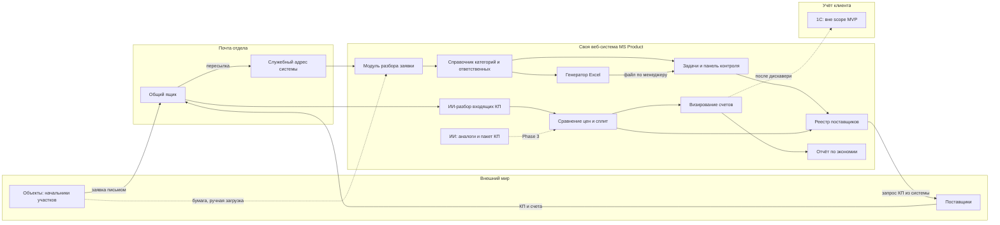

# Интеграционная карта

**Клиент:** `triumf_snab`
**Дата:** 2026-08-10 · обновлено 2026-08-11 (авторазбор КП)
**Архитектура:** вариант A — своя веб-система в центре контура. CRM-каркаса (Битрикс24 / amoCRM) нет.
**Назначение:** согласовать границы контура до написания ТЗ.

---

## 1. Контур целиком

---

## 2. Потоки данных

| Поток | Направление | Триггер | Содержание | Фаза |
|---|---|---|---|---|
| Приём заявки | Почта → система | Письмо с заявкой | Файл заявки, объект, отправитель | MVP |
| Ручная загрузка | Пользователь → система | Принесли бумагу или скан | Файл заявки | MVP |
| Разбор позиций | Внутри системы | Файл получен | Наименование, количество, единица измерения, получатель | MVP |
| Классификация | Внутри системы | Позиции извлечены | Позиция → категория → ответственный | MVP |
| Проверка разбора | Руководитель → система | Разбор готов | Правки категорий, подтверждение | MVP |
| Создание задач | Внутри системы | Разбор подтверждён | Задача на менеджера + Excel по его позициям | MVP |
| Выгрузка под поставщика | Система → файл | Менеджер выбрал строки | Excel с подмножеством позиций | Phase 2 |
| Запрос КП | Система → почта → поставщик | Менеджер отправил | Шаблон письма + файл + реквизиты | Phase 2 |
| Приём КП и счетов | Почта → система | Ответ поставщика | Письмо + вложения, привязка к запросу/заявке | Phase 2 |
| ИИ-разбор КП | Внутри системы (+ LLM) | Письмо классифицировано как КП/счёт | Позиции, цены, сроки → строки заявки; низкая уверенность → очередь | Phase 2 · **обязательно** |
| Сравнение цен | Внутри системы | Цены занесены | Таблица по позициям, лучшая альтернатива, сплит | Phase 2 |
| Виза счёта | Система → руководитель → система | Счёт свыше 100 000 ₽ | Позиции, поставщик, альтернативы, разница | Phase 2 |
| Фиксация экономии | Внутри системы | Закупка состоялась | Выбранная цена против лучшей альтернативы | Phase 2 |
| Подбор аналога / пакет КП | Система → ИИ → система | Запрос пользователя | Характеристики, форма КП, число КП и наценки (дефолт 3) | Phase 3 |
| Обмен с 1С | Система ↔ 1С | Не определён | Не определено | После дискавери |

---

## 3. Модули системы

| Модуль | Назначение | Сложность | Фаза |
|---|---|---|---|
| Приём почты | Забор писем со служебного адреса, отделение заявок от прочего | Medium | MVP |
| Разбор заявки | Извлечение табличной части из PDF, Excel и сканов | **High** — главный технический риск | MVP |
| Справочник категорий | Категории, синонимы написаний, ответственный, заместитель | Low | MVP |
| Классификатор | Сопоставление позиции с категорией, обучение на правках | Medium | MVP |
| Экран проверки | Подтверждение разбора руководителем перед постановкой задач | Medium | MVP |
| Задачи | Создание, статусы, дедлайны, приоритет позиции, «ждём финансирование» | Medium | MVP |
| Панель контроля | Сводка по всем заявкам для руководителя | Medium | MVP |
| Генератор Excel | Файл по менеджеру и выборка под поставщика | Low | MVP / Phase 2 |
| Реестр поставщиков | Единая база с условиями, флагом производителя и историей цен | Medium | Phase 2 |
| Отправка запросов | Письмо поставщику из системы по шаблону | Medium | Phase 2 |
| Сбор и ИИ-разбор КП | Приём писем, извлечение цен, привязка к позициям, очередь низкой уверенности | **High** — разнородные форматы; обязательный контур (решение 2026-08-11) | Phase 2 |
| Сравнение цен | Таблица по позициям, сплит счёта | Medium | Phase 2 |
| Визирование | Блокировка отгрузки до решения по счёту свыше порога | Low | Phase 2 |
| Отчёт по экономии | Накопительная цифра за период, разрезы | Medium | Phase 2 |
| ИИ-модуль (КП для сметы) | Аналоги, производители, пакет КП по форме (число настраивается) | Medium | Phase 3 |

---

## 4. Точки интеграции и что нужно проверить

### 4.1. Почта — критическая зависимость

Единственная обязательная внешняя интеграция в MVP.

| Что проверить | Почему важно |
|---|---|
| Провайдер и домен общего ящика | Определяет способ подключения |
| Возможность IMAP-доступа | Иначе только пересылка на служебный адрес |
| Политика безопасности клиента | Общий ящик содержит всю коммерческую переписку отдела |
| Объём и структура ящика | Отделить заявки от КП, счетов и спама поставщиков |

**Рекомендация:** MVP — пересылка заявок на служебный адрес. Phase 2 — тот же контур (или IMAP) обязателен для **входящих ответов поставщиков**: без забора почты авторазбор КП невозможен.

### 4.2. 1С — вне scope MVP

Известно только, что 1С используется и в ней работает Татьяна. Не выяснено: конфигурация, версия, где проводятся счета и оплаты, есть ли обмен с бухгалтерией, кто может дать доступ.

**Позиция:** до дискавери не проектировать обмен и не обещать интеграцию. Не выдумывать методы обмена. Возможные варианты после уточнения — файловый обмен, HTTP-сервисы 1С, промежуточная выгрузка; выбор только по факту конфигурации.

### 4.3. ИИ-провайдер

| Фаза | Применение | Ограничение |
|---|---|---|
| **Phase 2 (обязательно)** | Разбор входящих КП/счетов: извлечение позиций, цен, сроков; сопоставление со строками заявки | Низкая уверенность → очередь проверки; сырое письмо хранится |
| Phase 3 | Аналоги, производители, пакет КП по форме (дефолт 3 «условно») | Черновик под проверку человеком перед уходом в смету |

Отдел уже пользуется ChatGPT вручную — навык работы с ИИ-результатом у ключевых людей есть. Провайдер и политика ПДн/коммерческой тайны во вложениях — уточнить до разработки Phase 2.

### 4.4. Чего в контуре нет

- **CRM.** Ни Битрикс24, ни amoCRM — клиент отказался, архитектура A.
- **Телефония.** Торг по телефону остаётся вне системы.
- **ЭДО и банк.** Не обсуждались.
- **Порталы поставщиков.** Работа только через почту, как сейчас.

---

## 5. Технические риски

| Риск | Влияние | Как снимаем |
|---|---|---|
| Заявки приходят в разнородных форматах, в том числе фото бумаги | Высокое — прямо бьёт в ядро MVP | До фиксации сроков прогнать 10–15 реальных заявок и замерить точность разбора |
| Классификация позиции неоднозначна («диск отрезной» — расходка или электрика) | Высокое — задача уйдёт не тому | Обязательный экран проверки, справочник синонимов, обучение на правках |
| Нет доступа к почте по политике клиента | Среднее | Резервный путь: пересылка на служебный адрес и ручная загрузка |
| Входящие КП в свободной форме | Высокое, Phase 2 | ИИ-конвейер + очередь низкой уверенности; замер на 15–20 реальных письмах до фиксации срока; ручной ввод — только fallback (см. РЕШЕНИЕ_авторазбор_КП.md) |
| Отторжение системы сотрудниками 40–55 лет | Высокое — организационный, не технический | Пилот на одной категории, минимум экранов, письмо и одна страница задачи |
| Кассовый разрыв тормозит проект | Высокое — коммерческий | Фазирование с оплатой по результату каждой фазы |

---

## 6. Что нужно от клиента для старта

1. 10–15 примеров реальных заявок с разных объектов, включая худшие по качеству.
2. Текущий список категорий и закрепление за сотрудниками (можно голосом, как Андрей и предлагал: «сидишь и на диктофон записал, что Илюха вот за такое»).
3. Копия таблицы поставщиков Андрея как эталон структуры.
4. Решение по способу подключения почты: пересылка или IMAP.
5. Шаблон письма-запроса поставщику и форма КП для сметы; уточнить, бывает ли пакет больше трёх.
6. Точка входа по 1С: кто может рассказать про конфигурацию.
