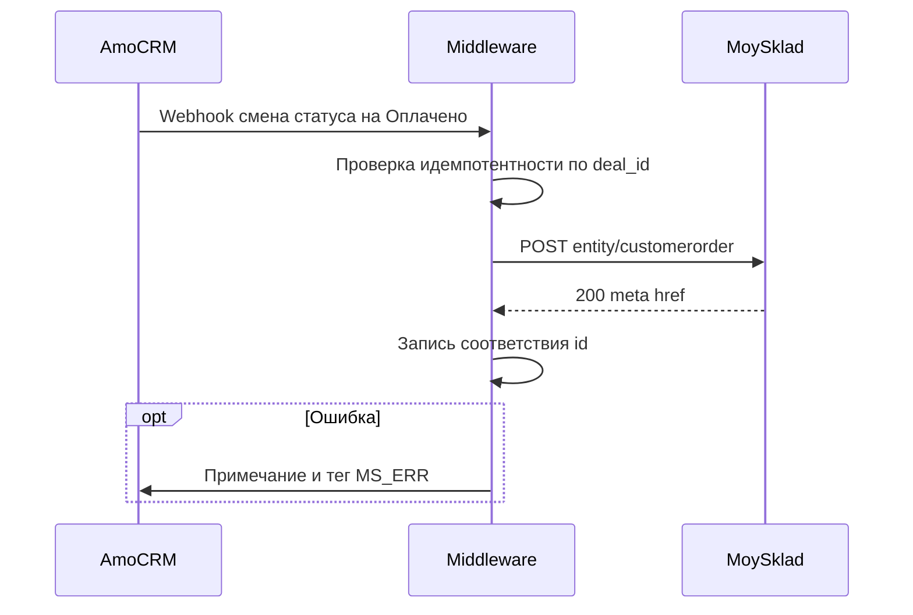

# ОБРАЗЕЦ ТЗ (учебный): amoCRM → «МойСклад», создание заказа покупателя

**Статус:** вымышленный кейс для демонстрации структуры. **Не** использовать как прод-конфиг без адаптации.  
**Клиент (фиктивно):** `demo_retail` — интернет-магазин оборудования, B2C + мелкий B2B.

---

## 1. Контекст и боль

- **Бизнес-контекст:** менеджеры доводят сделку до «Оплачено» в amoCRM, бухгалтер и склад вручную заносят тот же заказ в «МойСклад». Ошибки в номенклатуре и адресе доставки, задержка отгрузки на 0,5–1 день.
- **Боль клиента:** «Мы дважды вводим заказ; иногда расходится сумма и склад отгружает не то количество.»
- **Цель интеграции:** Автоматически создавать **заказ покупателя** в МС при переводе сделки в согласованный статус, с идемпотентностью и журналом ошибок.

---

## 2. Фазы внедрения

### 2.1 MVP

**Состав:** webhook amoCRM при переходе сделки в статус **«Оплачено (МС)»** в воронке **«Продажи»** → middleware → создание **customerorder** в МС; сохранение `amo_deal_id` ↔ `ms_order_meta_href` в таблице соответствий. Состав строк — из одноимённых позиций каталога (маппинг по `SKU`).

**DoD фазы:** тест на 10 сделках без дублей; при ошибке МС сделка помечается тегом `MS_ERR` и текстом ошибки в примечании (ручной контур).

**Сложность:** Medium  
**Оценка:** условно 4–6 чел.дн. (зависит от готовности каталога)

### 2.2 Phase 2

**Состав:** синхронизация **оплат**: при появлении `paymentin` / закрытии счёта в МС (по регламенту) — обновление поля сделки «Дата оплаты в учёте» и при необходимости статуса.

**DoD фазы:** таблица соответствий оплат; нет циклических обновлений.

**Сложность:** Medium  
**Оценка:** 4–8 чел.дн.

### 2.3 Phase 3

**Состав:** обратная передача **статуса отгрузки** из МС в amoCRM (поле / подстатус), уведомление ответственному.

**DoD фазы:** e2e тест «оплачено → заказ → отгрузка» с одной тестовой сделкой.

**Сложность:** High  
**Оценка:** 6–10 чел.дн.

---

## 3. Сущности и поля

### 3.1 amoCRM

| Сущность | Поле / атрибут | Тип | Обяз. | Источник значения | Пример |
|----------|----------------|-----|-------|-------------------|--------|
| Сделка | Воронка | enum | да | константа | Продажи |
| Сделка | Статус | enum | да | переход | Оплачено (МС) |
| Сделка | `order_lines` (кастом) | textarea/json | да | менеджер / робот | JSON строк позиций |
| Сделка | `delivery_address` | text | нет | сделка | Москва, ул. … |
| Сделка | Тег `MS_ERR` | tag | нет | middleware | при ошибке |

### 3.2 «МойСклад»

| Сущность | Поле | Тип | Обяз. | Источник | Пример |
|----------|------|-----|-------|----------|--------|
| counterparty | name, phone | string | да | контакт сделки | Иван, +7… |
| customerorder | organization | ref | да | константа аккаунта | href Организация |
| customerorder | agent | ref | условно | контрагент | href |
| customerorder | positions | array | да | маппинг SKU | см. JSON |

### 3.3 Маппинг номенклатуры

| SKU (CRM / каталог сделки) | UUID / code товара МС | Примечание |
|----------------------------|----------------------|------------|
| FAN-120 | `…` | проверить на дубликаты SKU |

---

## 4. Воронки и статусы (amoCRM)

| Текущий статус | Следующий | Триггер интеграции | Действие |
|----------------|-----------|--------------------|----------|
| Счёт отправлен | Оплачено (МС) | вход в статус | Создать customerorder |

**Обязательные поля до «Оплачено (МС)»:** заполнен контакт, `order_lines` валиден по JSON-схеме (MVP: ручная проверка; Phase 2: робот валидации).

---

## 5. Документооборот («МойСклад»)

**MVP:** только **customerorder**. Счёт и отгрузка — ручные по регламенту клиента.

| Документ | Когда | Примечание |
|----------|-------|------------|
| customerorder | После статуса в CRM | external id = id сделки |

---

## 6. Интеграционная схема

---

## 7. События, API, надёжность

- **Вход:** webhook amoCRM (конкретный набор событий — сверить с настройками аккаунта).
- **Выход:** REST МойСклад JSON API 1.2, `POST /entity/customerorder` (точный путь по доке).
- **Идемпотентность:** уникальный ключ `(amo_deal_id, target_status)` в БД middleware.
- **Ретраи:** 3 попытки с экспоненциальной задержкой на 5xx; не ретраить на 4xx валидации без исправления данных.

---

## 8. Edge cases

| Сценарий | Поведение |
|----------|-----------|
| Повтор webhook | Не создавать второй заказ; лог 409 |
| Не найден SKU | Не создавать заказ; MS_ERR с текстом |
| Несколько платежей | MVP: игнор; Phase 2: таблица оплат |

---

## 9. DoD (кратко)

- [ ] Нет дублей заказов при повторе webhook
- [ ] Закрыт happy path для 10 тестовых сделок
- [ ] Ошибки видны в CRM без доступа к логам middleware

---

## 10. Ссылки на документацию

- amoCRM: https://www.amocrm.ru/developers/content/crm_platform/api-reference  
- МойСклад: https://dev.moysklad.ru/doc/api/remap/1.2/#/general#1-mojsklad-json-api  
