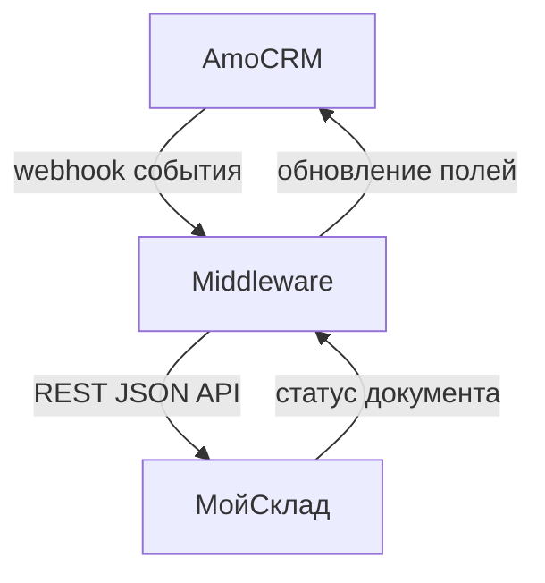

# Архитектура / интеграционная карта

**Клиент:** [[ид]]  
**Дата:** YYYY-MM-DD  
**Версия:** 0.1

---

## 1. Назначение карты

Одна страница для согласования scope до полного ТЗ: какие системы участвуют, куда идут данные, какие события запускают автоматизацию.

---

## 2. Системы и роли

| Система | Роль | Источник истины по данным |
|---------|------|---------------------------|
| amoCRM | CRM / воронки / коммуникация | |
| МойСклад | учёт / склад / документы | |
| Middleware | маппинг, ретраи, журнал | |

---

## 3. Основная диаграмма

---

## 4. Потоки данных

| Поток | Триггер | Данные | Риск / ограничение |
|-------|---------|--------|--------------------|
| CRM → МС | | | |
| МС → CRM | | | |

---

## 5. Допущения и открытые вопросы

- 

---

## 6. Решение по scope

- **Входит в MVP:** 
- **Не входит в MVP:** 
- **Переносится в Phase 2/3:** 
