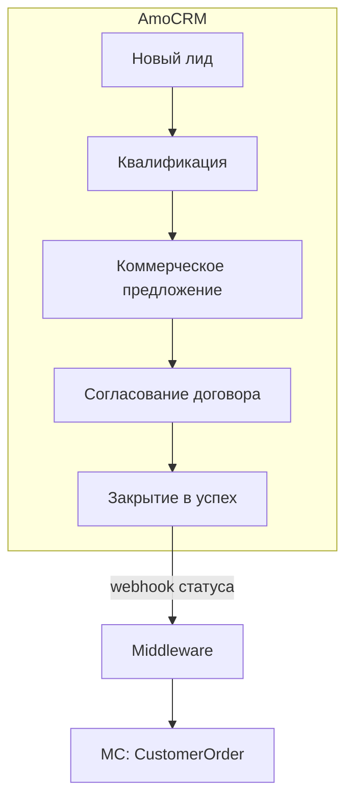
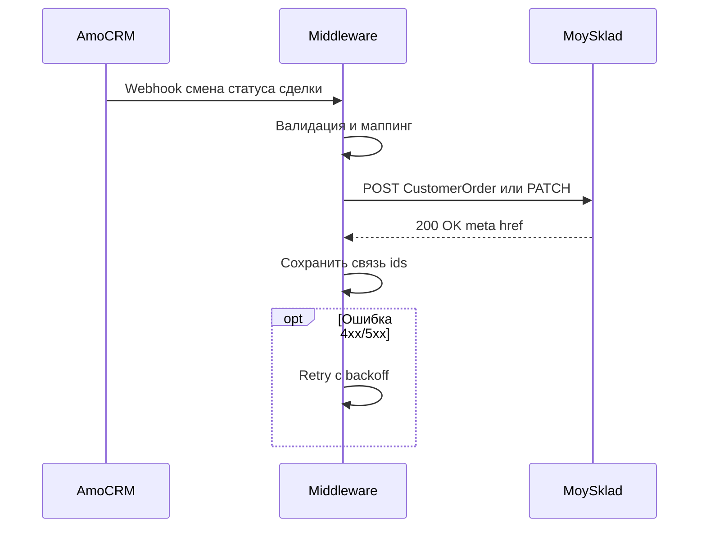

# Шаблоны диаграмм (Mermaid)

Копируй и подставляй названия. В ТЗ и в команде `@архитектор карта` — **одна основная диаграмма** на страницу; детали — в тексте или отдельном файле.

---

## 1. Воронка (flowchart TD)

Используй для этапов amoCRM и условия «что запускает интеграцию».

---

## 2. Интеграция по webhook (sequenceDiagram)

Используй для согласования систем, направлений вызовов и ответственности.

**Замечания:**

- В подписях к стрелкам избегай скобок и спецсимволов без кавычек в mermaid (см. правила рендеринга в Cursor).
- ID узлов — латиница без пробелов.
